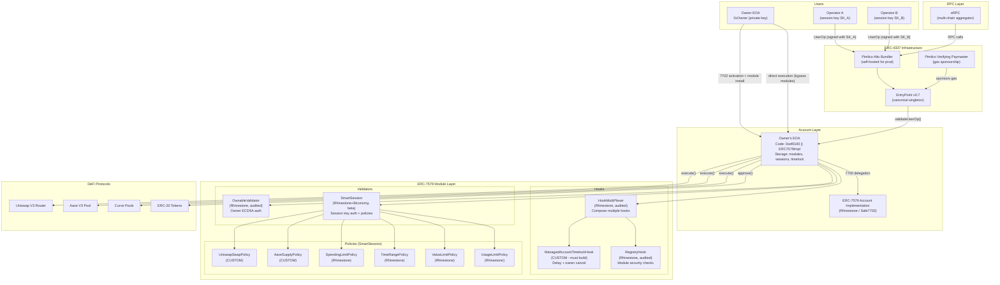
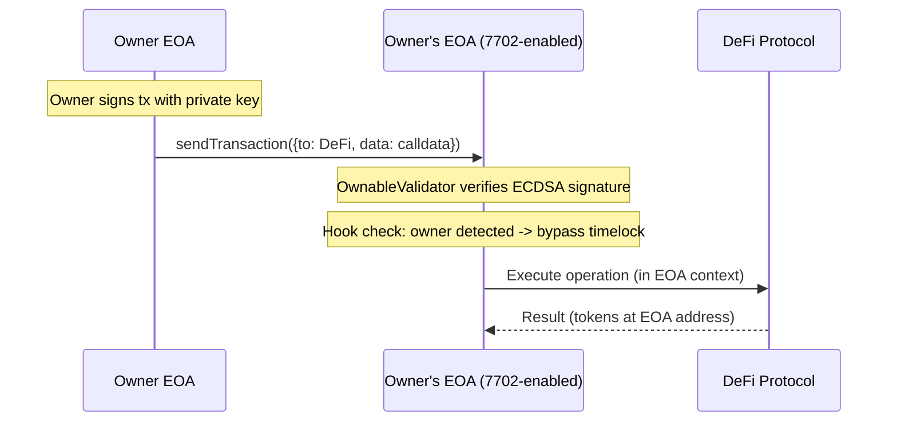
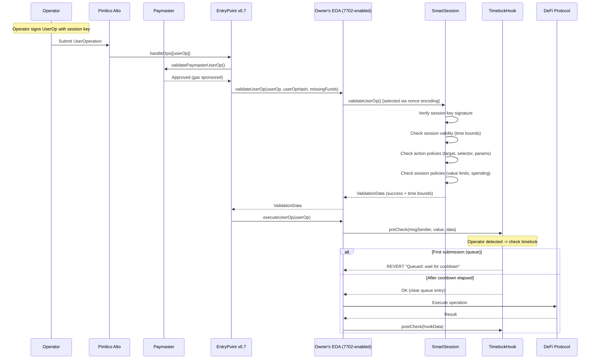
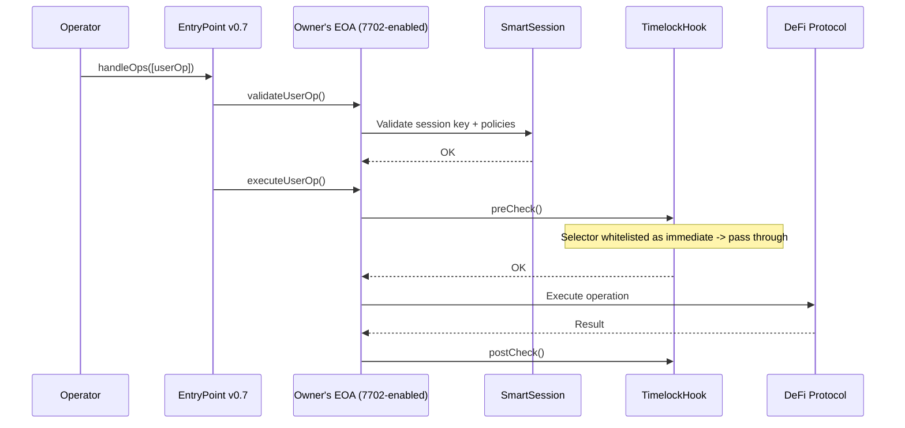

# PRD: Architecture A -- EIP-7702 + ERC-7579 (Lean / Gas-Optimized)

> **Version**: 1.0
> **Date**: February 2026
> **Status**: Draft
> **Authors**: Architecture Team

---

## 1. Executive Summary

### Architecture Name
**ManagedAccount Lean** -- EIP-7702 + ERC-7579 Modular Smart Account

### Philosophy
Turn the owner's existing EOA into a fully modular smart account using EIP-7702 protocol-level delegation. No contract deployment, no fund migration, minimal gas overhead. Leverage the ERC-7579 module ecosystem for permission management, timelock safety, and gasless operator execution.

### Summary
This architecture activates the owner's Ethereum EOA as an ERC-7579 modular smart account via a single EIP-7702 `SET_CODE` transaction (~25K gas). Once activated, the EOA gains full smart account capabilities: operators authenticate via SmartSession session keys, permissions are enforced through policy contracts, and a custom ManagedAccountTimelockHook provides time-delayed execution with owner cancellation rights. All operator transactions flow through ERC-4337 with Pimlico paymaster sponsorship for gasless UX. The same ERC-7579 modules built for this track can be reused on Safe accounts (via Safe7579 adapter) for future multi-sig support.

### Target Users
- **Single-owner EOA holders** managing DeFi portfolios
- **DeFi traders** delegating execution to algorithmic operators
- **Portfolio managers** running strategies on behalf of clients (1:1 custody)
- **DAOs/protocols** delegating treasury operations to operators (single-signer accounts)

### Key Value Proposition
- **80% cheaper activation** than deploying a new smart account (~25K gas vs ~150-400K)
- **No fund migration** -- owner keeps existing EOA address, balances, and approvals
- **Full ERC-7579 module ecosystem** -- 14+ audited Rhinestone modules
- **Gasless operator UX** -- operators never need ETH
- **Lowest vendor lock-in** -- protocol-level (7702) + open standard (7579)
- **Future-proof** -- same modules work on Safe track for multi-sig

---

## 2. Architecture Overview

### 2.1 Component Diagram



### 2.2 Component Inventory

| Component | Source | Audited? | Custom? | License | Status |
|-----------|--------|----------|---------|---------|--------|
| EIP-7702 (Pectra) | Ethereum protocol | Protocol-level | No | N/A | Production (May 2025) |
| ERC-7579 Account Implementation | Rhinestone / Safe | Yes (Ackee) | No | MIT | Production |
| OwnableValidator | Rhinestone core-modules | Yes (Ackee) | No | MIT | Production |
| SmartSession | Rhinestone + Biconomy | In progress | No | MIT | **Beta** |
| HookMultiPlexer | Rhinestone core-modules | Yes (Ackee) | No | MIT | Production |
| RegistryHook | Rhinestone core-modules | Yes (Ackee) | No | MIT | Production |
| ManagedAccountTimelockHook | **Our team** | **Needs audit** | **Yes** | Proprietary | **To build** |
| UniswapSwapPolicy | **Our team** | **Needs audit** | **Yes** | Proprietary | **To build** |
| AaveSupplyPolicy | **Our team** | **Needs audit** | **Yes** | Proprietary | **To build** |
| ManagedAccountFactory | **Our team** | **Needs audit** | **Yes** | Proprietary | **To build** |
| EntryPoint v0.7 | eth-infinitism | Yes (multiple) | No | GPL-3.0 | Production |
| Pimlico Alto Bundler | Pimlico | N/A (infra) | No | GPL-3.0 | Production |
| Pimlico Verifying Paymaster | Pimlico | Yes | No | MIT | Production |
| eRPC | erpc.cloud | N/A (infra) | No | Apache-2.0 | Production |
| permissionless.js | Pimlico | N/A (SDK) | No | MIT | Production |
| @rhinestone/module-sdk | Rhinestone | N/A (SDK) | No | MIT | Production |
| viem | wevm | N/A (SDK) | No | MIT | Production |

### 2.3 Flow: Owner Direct Execution



Owner transactions execute immediately with no timelock delay. The OwnableValidator confirms the owner's ECDSA signature, and the ManagedAccountTimelockHook recognizes the owner and allows instant execution.

### 2.4 Flow: Operator Delegated Execution



### 2.5 Flow: Operator Immediate Execution (Whitelisted Operations)

For operations marked as "immediate" in the timelock configuration (e.g., standard swaps within limits), the timelock is bypassed:



---

## 3. Core Requirements Implementation

### 3.1 Requirement: Custody Preservation

**How it's implemented:**

The owner's EOA private key is the sole root of trust. EIP-7702 delegation designator (`0xef0100 || implAddress`) stored in the EOA's code slot points to the ERC-7579 implementation, but the owner can:
1. Revoke delegation instantly by sending a 7702 tx pointing to `address(0)`
2. Execute any transaction directly via OwnableValidator (bypasses all operator restrictions)
3. Uninstall any module at any time
4. Cancel any queued timelock operation

**Key contracts/modules:**
- OwnableValidator (Rhinestone): Validates owner ECDSA signature
- EIP-7702 delegation designator: Revocable at any time
- ManagedAccountTimelockHook: Owner bypass built-in

**Code snippet -- Owner revokes delegation (emergency):**

```typescript
import { createWalletClient, http } from 'viem'
import { mainnet } from 'viem/chains'

const ownerClient = createWalletClient({
  account: ownerAccount,
  chain: mainnet,
  transport: http()
})

// Revoke 7702 delegation -- EOA returns to normal
const authorization = await ownerClient.signAuthorization({
  contractAddress: '0x0000000000000000000000000000000000000000'
})

await ownerClient.sendTransaction({
  authorizationList: [authorization],
  to: ownerAccount.address,
  data: '0x'
})
// EOA is now a plain EOA again -- all modules disabled
```

**Gas cost:** ~25K gas for revocation transaction.

**Limitations:**
- Single-owner only (no native multi-sig). For multi-sig, use the Safe track.
- If the owner's private key is compromised, all custody is lost (same as any EOA).
- Delegation revocation clears ALL smart account functionality, not selective.

### 3.2 Requirement: Delegated Execution

**How it's implemented:**

Operators hold ephemeral session keys created by SmartSession. Each session key is an ECDSA keypair that can sign UserOperations on behalf of the account, but only within the permissions defined by the session's policies.

**Key contracts/modules:**
- SmartSession (Rhinestone/Biconomy): Session key validator module
- EntryPoint v0.7: Processes operator UserOps
- Pimlico Paymaster: Sponsors operator gas

**Code snippet -- Owner creates operator session:**

```typescript
import { getSmartSessionsValidator, getEnableSessionDetails } from '@rhinestone/module-sdk'
import { encodeAbiParameters, parseAbiParameters, encodeFunctionData } from 'viem'

// Define operator session
const operatorSession = {
  sessionValidator: ECDSA_SESSION_VALIDATOR_ADDRESS,
  sessionValidatorInitData: encodeAbiParameters(
    parseAbiParameters('address'),
    [operatorPublicKey]
  ),
  salt: toHex(toBytes('operator-a-session-1', { size: 32 })),
  userOpPolicies: [
    {
      policy: TIME_RANGE_POLICY_ADDRESS,
      initData: encodeAbiParameters(
        parseAbiParameters('uint128 validAfter, uint128 validUntil'),
        [BigInt(Math.floor(Date.now() / 1000)), BigInt(Math.floor(Date.now() / 1000) + 30 * 86400)]
      )
    },
    {
      policy: VALUE_LIMIT_POLICY_ADDRESS,
      initData: encodeAbiParameters(
        parseAbiParameters('uint256 maxValue'),
        [0n] // No native ETH transfers
      )
    }
  ],
  actions: [
    {
      actionTarget: UNISWAP_V3_ROUTER,
      actionTargetSelector: toFunctionSelector('exactInputSingle((address,address,uint24,address,uint256,uint256,uint160))'),
      actionPolicies: [
        {
          policy: UNISWAP_SWAP_POLICY_ADDRESS,
          initData: encodeAbiParameters(
            parseAbiParameters('address[] allowedTokensIn, address[] allowedTokensOut, address requiredRecipient'),
            [[USDC_ADDRESS, WETH_ADDRESS], [USDC_ADDRESS, WETH_ADDRESS], ownerEOAAddress]
          )
        },
        {
          policy: SPENDING_LIMIT_POLICY_ADDRESS,
          initData: encodeAbiParameters(
            parseAbiParameters('address token, uint256 limit'),
            [USDC_ADDRESS, parseUnits('10000', 6)] // 10,000 USDC daily limit
          )
        }
      ]
    },
    {
      actionTarget: AAVE_V3_POOL,
      actionTargetSelector: toFunctionSelector('supply(address,uint256,address,uint16)'),
      actionPolicies: [
        {
          policy: AAVE_SUPPLY_POLICY_ADDRESS,
          initData: encodeAbiParameters(
            parseAbiParameters('address[] allowedAssets, address requiredOnBehalfOf'),
            [[USDC_ADDRESS, WETH_ADDRESS], ownerEOAAddress]
          )
        }
      ]
    }
  ],
  erc7739Policies: { allowedERC7739Content: [], erc1271Policies: [] }
}

// Enable session on account
const enableSessionAction = getEnableSessionDetails({
  sessions: [operatorSession]
})

await ownerSmartAccountClient.sendTransaction(enableSessionAction)
```

**Gas cost estimates:**
- Session creation (enable): ~80,000-120,000 gas (one-time)
- Operator UserOp validation: ~55,000-80,000 gas per operation
- Operator execution: ~40,000 gas + DeFi call gas
- Total operator swap (via 4337): ~195,000-220,000 gas

**Limitations:**
- SmartSession is in BETA -- API may change before v1.0
- Enable-in-first-tx mode available but adds ~30-50K gas to first UserOp
- Session key compromise requires on-chain revocation

### 3.3 Requirement: Granular Permissions

**How it's implemented:**

Permissions are enforced at two levels:
1. **SmartSession action matching**: Only (target, selector) pairs listed in the session's `actions[]` array are allowed. Unlisted contracts/functions are rejected.
2. **Policy contracts**: Per-action and per-session policy contracts validate parameters, amounts, recipients, and spending limits.

**Key contracts/modules:**
- SmartSession: Action matching + policy orchestration
- Custom policy contracts: Per-protocol parameter validation
- Rhinestone policies: SpendingLimit, TimeRange, ValueLimit, UsageLimit

**Permission hierarchy:**

```
Account (Owner's EOA)
 └── SmartSession Validator
      └── Session (per operator)
           ├── Session Policies (global constraints)
           │    ├── TimeRangePolicy: validAfter/validUntil
           │    ├── ValueLimitPolicy: max 0 ETH per tx
           │    └── UsageLimitPolicy: max 100 txs per session
           └── Actions (per target+selector)
                ├── Action: Uniswap.exactInputSingle()
                │    ├── UniswapSwapPolicy: token whitelist + recipient check
                │    └── SpendingLimitPolicy: 10,000 USDC/day
                ├── Action: Aave.supply()
                │    └── AaveSupplyPolicy: asset whitelist + onBehalfOf check
                └── Action: ERC20.approve()
                     └── ApprovalPolicy: only approved protocol addresses
```

**Parameter condition types available:**

| Condition | SmartSession Support | Implementation |
|-----------|---------------------|----------------|
| Equal to value | Yes (UniversalActionPolicy) | `EQUAL` operator |
| Greater than | Yes | `GREATER_THAN` operator |
| Less than | Yes | `LESS_THAN` operator |
| Greater than or equal | Yes | `GREATER_THAN_OR_EQUAL` operator |
| Less than or equal | Yes | `LESS_THAN_OR_EQUAL` operator |
| Not equal | Yes | `NOT_EQUAL` operator |
| Value in set (one-of) | Custom policy | Implement IActionPolicy |
| Recipient = account | Custom policy | Check param == msg.sender |
| Nested AND/OR | No (AND only via multiple policies) | Each policy = AND; OR not supported |
| Array conditions | No | Custom policy needed |
| Auto-replenishing limits | No | Custom policy needed |

**Code snippet -- UniversalActionPolicy parameter rules:**

```solidity
// Parameter rule for Uniswap exactInputSingle:
// Ensure tokenIn is USDC (param index 0 in the struct)
ParamRule memory tokenInRule = ParamRule({
    condition: ParamCondition.EQUAL,
    offset: 0,  // first param in ExactInputSingleParams struct
    isLimited: false,
    ref: bytes32(uint256(uint160(USDC_ADDRESS))),
    usage: LimitUsage({ limit: 0, used: 0 })
});

// Ensure recipient (param index 3) is the account itself
ParamRule memory recipientRule = ParamRule({
    condition: ParamCondition.EQUAL,
    offset: 96,  // 3rd param (3 * 32 bytes)
    isLimited: false,
    ref: bytes32(uint256(uint160(accountAddress))),
    usage: LimitUsage({ limit: 0, used: 0 })
});
```

**Gas cost:** ~5-15K gas per policy check, ~10-20K for custom policy contracts.

**Limitations:**
- No nested AND/OR logic (multiple policies = AND only)
- No array conditions (Some/Every/Subset) -- requires custom policy
- No auto-replenishing allowances -- requires custom policy
- No built-in `EqualToAvatar` -- must use parameter condition or custom policy
- Each new DeFi protocol requires a custom policy contract

### 3.4 Requirement: Time-Locked Safety (Delay + Owner Cancel)

**How it's implemented:**

A custom **ManagedAccountTimelockHook** (ERC-7579 Hook module) provides:
- Configurable cooldown period per account
- Optional expiration period for queued transactions
- Owner bypass (instant execution for owner)
- Owner cancellation of any queued transaction
- Selective timelock (configurable per function selector)
- Hash-based queue (non-FIFO, allows any-order execution)

This hook is installed via the HookMultiPlexer alongside the RegistryHook.

**Key contracts/modules:**
- ManagedAccountTimelockHook (custom): Core timelock logic
- HookMultiPlexer (Rhinestone): Composes timelock + registry hooks

**How the timelock flow works:**

```
1. Operator submits UserOp for swap (non-immediate operation)
2. SmartSession validates session key + policies -> OK
3. ManagedAccountTimelockHook.preCheck():
   a. Detect caller is operator (not owner)
   b. Check if selector is marked "immediate" -> if yes, pass through
   c. Compute execHash = keccak256(target, value, calldata, operator)
   d. If not queued: store execHash with timestamp, REVERT "Queued"
   e. If queued: check cooldown elapsed, check not expired
   f. If ready: clear queue, allow execution
4. DeFi operation executes
5. ManagedAccountTimelockHook.postCheck(): verify execution context

Owner cancel flow:
1. Owner calls cancelExecution(execHash) on the timelock hook
2. Queue entry deleted -- operator cannot execute
```

**Gas cost estimates:**
- Queue operation (first submission): ~45,000 gas (storage write)
- Execute after cooldown: ~25,000 gas (storage read + delete)
- Owner cancel: ~20,000 gas (storage delete)
- Owner bypass: ~5,000 gas (owner check only)

**Limitations:**
- Custom module -- requires development and audit
- Hash-based queue means exact calldata must match (no partial matching)
- Operator must submit the UserOp twice (once to queue, once to execute)
- No FIFO ordering -- any queued transaction can execute once its cooldown elapses
- If owner loses access, queued transactions execute after cooldown with no cancel

### 3.5 Requirement: Gasless UX

**How it's implemented:**

The 7702-enabled EOA is fully ERC-4337 compatible. Operator UserOps are submitted to a Pimlico Alto bundler with Pimlico Verifying Paymaster sponsorship. The owner (or the platform operating the system) deposits ETH/USDC into the paymaster to cover gas.

**Key components:**
- EntryPoint v0.7: Canonical UserOp processing
- Pimlico Alto Bundler: Processes and submits UserOps
- Pimlico Verifying Paymaster: Signs gas sponsorship vouchers

**Sponsorship model options:**

| Model | How It Works | Pros | Cons |
|-------|-------------|------|------|
| **Platform-sponsored** | Platform pre-funds paymaster | Simplest UX; operators pay nothing | Platform bears gas costs |
| **Account-funded** | Deduct gas from account ERC-20 balance | Self-sustaining | Requires ERC-20 paymaster integration |
| **Hybrid** | Platform sponsors up to limit, then account pays | Balanced | More complex logic |

**Code snippet -- Operator gasless execution:**

```typescript
import { createSmartAccountClient } from 'permissionless'
import { createPimlicoClient } from 'permissionless/clients/pimlico'

const pimlicoClient = createPimlicoClient({
  transport: http(`https://api.pimlico.io/v2/${chainId}/rpc?apikey=${PIMLICO_API_KEY}`),
  entryPoint: { address: ENTRYPOINT_V07, version: '0.7' }
})

// Operator creates client with session key
const operatorClient = createSmartAccountClient({
  account: smartEOAAccount, // 7702-enabled account
  chain: mainnet,
  bundlerTransport: http(BUNDLER_URL),
  paymaster: pimlicoClient,
  userOperation: {
    estimateFeesPerGas: async () => (await pimlicoClient.getUserOperationGasPrice()).fast,
  }
})

// Execute gasless swap
const txHash = await operatorClient.sendTransaction({
  to: UNISWAP_V3_ROUTER,
  value: 0n,
  data: encodeFunctionData({
    abi: uniswapRouterAbi,
    functionName: 'exactInputSingle',
    args: [{ tokenIn: USDC, tokenOut: WETH, fee: 3000, recipient: ownerEOA, amountIn: parseUnits('1000', 6), amountOutMinimum: 0n, sqrtPriceLimitX96: 0n }]
  })
})
// Operator paid 0 gas. Paymaster covered everything.
```

**Gas cost:** Paymaster validation adds ~15,000-30,000 gas overhead per UserOp. Platform pays the equivalent ETH.

**Limitations:**
- Paymaster must be pre-funded with ETH
- Pimlico API has rate limits on free tier (use self-hosted Alto for production)
- ERC-20 gas payment requires additional paymaster configuration

---

## 4. Smart Contract Specifications

### 4.1 ManagedAccountTimelockHook

This is the core custom contract -- our competitive differentiator. No existing ERC-7579 module provides this functionality.

```solidity
// SPDX-License-Identifier: BUSL-1.1
pragma solidity ^0.8.26;

import { IERC7579Hook } from "erc7579/interfaces/IERC7579Module.sol";
import { IERC7579Account } from "erc7579/interfaces/IERC7579Account.sol";

/// @title ManagedAccountTimelockHook
/// @notice ERC-7579 Hook that enforces time-delayed execution for non-owner callers.
///         Owner transactions execute immediately. Operator transactions are queued
///         and can only execute after a configurable cooldown period.
///         Owner can cancel any queued transaction at any time.
/// @dev Installed via HookMultiPlexer for composition with RegistryHook.
///      This module is stateful -- it stores queue entries per account.

interface IManagedAccountTimelockHook is IERC7579Hook {
    // ──────────────────────────────────────────────
    // Events
    // ──────────────────────────────────────────────

    /// @notice Emitted when an operator transaction is queued
    /// @param account The smart account address
    /// @param execHash Hash of the queued execution
    /// @param operator The operator who submitted the transaction
    /// @param target The target contract
    /// @param selector The function selector
    /// @param queuedAt Block timestamp when queued
    /// @param executeAfter Earliest execution timestamp
    event ExecutionQueued(
        address indexed account,
        bytes32 indexed execHash,
        address operator,
        address target,
        bytes4 selector,
        uint256 queuedAt,
        uint256 executeAfter
    );

    /// @notice Emitted when a queued transaction is executed
    /// @param account The smart account address
    /// @param execHash Hash of the executed transaction
    event ExecutionExecuted(address indexed account, bytes32 indexed execHash);

    /// @notice Emitted when the owner cancels a queued transaction
    /// @param account The smart account address
    /// @param execHash Hash of the cancelled transaction
    event ExecutionCancelled(address indexed account, bytes32 indexed execHash);

    /// @notice Emitted when the timelock configuration is updated
    /// @param account The smart account address
    /// @param cooldown New cooldown period in seconds
    /// @param expiration New expiration period in seconds (0 = no expiration)
    event ConfigUpdated(address indexed account, uint128 cooldown, uint128 expiration);

    /// @notice Emitted when a selector's immediate status is changed
    /// @param account The smart account address
    /// @param selector The function selector
    /// @param immediate Whether the selector is now immediate
    event SelectorImmediateUpdated(address indexed account, bytes4 selector, bool immediate);

    // ──────────────────────────────────────────────
    // Errors
    // ──────────────────────────────────────────────

    /// @notice Transaction has been queued; wait for cooldown
    /// @param execHash The hash of the queued execution
    /// @param executeAfter The earliest timestamp the transaction can execute
    error ExecutionQueued_WaitForCooldown(bytes32 execHash, uint256 executeAfter);

    /// @notice Cooldown period has not elapsed yet
    /// @param execHash The hash of the queued execution
    /// @param executeAfter The earliest timestamp the transaction can execute
    /// @param currentTime The current block timestamp
    error CooldownNotElapsed(bytes32 execHash, uint256 executeAfter, uint256 currentTime);

    /// @notice Queued transaction has expired
    /// @param execHash The hash of the expired execution
    /// @param expiredAt The timestamp when it expired
    error ExecutionExpired(bytes32 execHash, uint256 expiredAt);

    /// @notice Caller is not the account owner
    error NotOwner();

    /// @notice No queued execution found for this hash
    error ExecutionNotQueued(bytes32 execHash);

    /// @notice Invalid configuration parameters
    error InvalidConfig();

    // ──────────────────────────────────────────────
    // Structs
    // ──────────────────────────────────────────────

    /// @notice Per-account timelock configuration
    struct TimelockConfig {
        /// @dev Seconds before a queued transaction can execute
        uint128 cooldown;
        /// @dev Seconds after cooldown during which execution is valid (0 = no expiration)
        uint128 expiration;
        /// @dev Address recognized as the account owner (can bypass + cancel)
        address owner;
    }

    /// @notice Queued execution entry
    struct QueueEntry {
        /// @dev Block timestamp when the execution was queued
        uint128 queuedAt;
        /// @dev The operator who queued it
        address operator;
    }

    // ──────────────────────────────────────────────
    // Configuration (called by account owner)
    // ──────────────────────────────────────────────

    /// @notice Set the timelock configuration for the calling account
    /// @param cooldown Seconds before queued tx can execute (min 60, max 30 days)
    /// @param expiration Seconds after cooldown during which execution is valid (0 = no expiry)
    /// @param owner Address recognized as the owner (for bypass and cancel)
    function configure(uint128 cooldown, uint128 expiration, address owner) external;

    /// @notice Mark a function selector as immediate (no timelock) or delayed
    /// @param selector The 4-byte function selector
    /// @param immediate True = no timelock for this selector, false = standard timelock
    function setOperationImmediate(bytes4 selector, bool immediate) external;

    // ──────────────────────────────────────────────
    // Queue Management
    // ──────────────────────────────────────────────

    /// @notice Cancel a queued execution (owner only)
    /// @param execHash The hash of the execution to cancel
    function cancelExecution(bytes32 execHash) external;

    /// @notice Get the queue entry for an execution hash
    /// @param account The smart account address
    /// @param execHash The execution hash
    /// @return entry The queue entry (queuedAt = 0 if not queued)
    function getQueueEntry(address account, bytes32 execHash)
        external view returns (QueueEntry memory entry);

    /// @notice Check if a selector is marked as immediate for an account
    /// @param account The smart account address
    /// @param selector The function selector
    /// @return True if the selector executes immediately (no timelock)
    function isImmediate(address account, bytes4 selector) external view returns (bool);

    /// @notice Get the timelock config for an account
    /// @param account The smart account address
    /// @return config The timelock configuration
    function getConfig(address account) external view returns (TimelockConfig memory config);

    /// @notice Compute the execution hash for a given call
    /// @param target Target contract address
    /// @param value ETH value
    /// @param callData The full calldata
    /// @param operator The operator address
    /// @return The keccak256 hash
    function computeExecHash(
        address target,
        uint256 value,
        bytes calldata callData,
        address operator
    ) external pure returns (bytes32);

    // ──────────────────────────────────────────────
    // ERC-7579 Hook Interface
    // ──────────────────────────────────────────────

    /// @notice Called before execution. Queues or validates operator transactions.
    /// @dev For owner: returns immediately (bypass).
    ///      For operator + immediate selector: returns immediately.
    ///      For operator + first submission: queues and reverts.
    ///      For operator + after cooldown: validates and clears queue.
    function preCheck(
        address msgSender,
        uint256 msgValue,
        bytes calldata msgData
    ) external returns (bytes memory hookData);

    /// @notice Called after execution. Validates execution context.
    function postCheck(bytes calldata hookData) external;

    // ──────────────────────────────────────────────
    // ERC-7579 Module Interface
    // ──────────────────────────────────────────────

    /// @notice Initialize the hook for an account
    /// @param data ABI-encoded (uint128 cooldown, uint128 expiration, address owner)
    function onInstall(bytes calldata data) external;

    /// @notice Uninitialize the hook for an account
    function onUninstall(bytes calldata data) external;

    /// @notice Check if the hook is initialized for an account
    function isInitialized(address smartAccount) external view returns (bool);
}
```

**Storage layout:**

```solidity
// Per-account configuration
mapping(address account => TimelockConfig) internal _configs;

// Per-account queue: execHash => QueueEntry
mapping(address account => mapping(bytes32 execHash => QueueEntry)) internal _queue;

// Per-account immediate selectors: selector => bool
mapping(address account => mapping(bytes4 selector => bool)) internal _immediateSelectors;
```

**Security considerations:**
- `preCheck` is called in the context of the smart account via the HookMultiPlexer. The `msg.sender` in the hook is the account itself; the `msgSender` parameter carries the original caller identity.
- The `operator` in the execHash prevents one operator from executing another operator's queued transaction.
- Expiration prevents stale queued transactions from executing months later.
- Owner address is stored per-account; if the OwnableValidator owner changes, the timelock owner must also be updated.
- All state-changing functions emit events for off-chain monitoring.

**Estimated development:** ~400-600 lines Solidity + ~500 lines tests.

### 4.2 ManagedAccountFactory

Factory contract that handles EIP-7702 account activation and initial module configuration in a single flow.

```solidity
// SPDX-License-Identifier: BUSL-1.1
pragma solidity ^0.8.26;

/// @title ManagedAccountFactory
/// @notice Configures 7702-activated EOAs with the standard ManagedAccount module set.
///         The EOA must have already signed a 7702 authorization pointing to the ERC-7579
///         implementation. This factory then installs all necessary modules.
/// @dev This is NOT a traditional CREATE2 factory. It does not deploy contracts.
///      Instead, it provides a setup function that the EOA calls after 7702 activation.

interface IManagedAccountFactory {
    /// @notice Full initial module configuration
    struct ManagedAccountConfig {
        /// @dev Owner address for OwnableValidator
        address owner;
        /// @dev Timelock cooldown in seconds
        uint128 timelockCooldown;
        /// @dev Timelock expiration in seconds (0 = no expiry)
        uint128 timelockExpiration;
        /// @dev Initial operator sessions to enable (can be empty)
        bytes[] initialSessions;
        /// @dev IERC7484 registry address for RegistryHook
        address registry;
        /// @dev Trusted attesters for the registry
        address[] attesters;
        /// @dev Attestation threshold
        uint8 attesterThreshold;
    }

    /// @notice Emitted when a ManagedAccount is configured
    event ManagedAccountConfigured(
        address indexed account,
        address indexed owner,
        uint128 timelockCooldown
    );

    /// @notice Configure a 7702-activated EOA as a ManagedAccount
    /// @dev Must be called by the EOA itself (via 7702 delegated execution).
    ///      Installs: OwnableValidator, SmartSession, HookMultiPlexer,
    ///                ManagedAccountTimelockHook, RegistryHook.
    /// @param config The full configuration parameters
    function setupManagedAccount(ManagedAccountConfig calldata config) external;

    /// @notice Compute the expected module installation calldata for verification
    /// @param config The configuration parameters
    /// @return The encoded calldata for module installation
    function getSetupCalldata(ManagedAccountConfig calldata config)
        external view returns (bytes memory);
}
```

**Key functions detail:**

`setupManagedAccount()` performs these steps atomically:
1. Install OwnableValidator with `config.owner` as sole owner
2. Install SmartSession as validator
3. Install RegistryHook with registry config
4. Install ManagedAccountTimelockHook with cooldown/expiration/owner
5. Install HookMultiPlexer composing TimelockHook + RegistryHook
6. Optionally enable initial operator sessions

**Security considerations:**
- Must be called by the EOA itself to prevent front-running setup
- All module addresses should be verified against the IERC7484 registry
- Initial sessions should be validated before enabling

**Estimated development:** ~200-300 lines Solidity + ~300 lines tests.

### 4.3 UniswapSwapPolicy (Example Custom Policy)

```solidity
// SPDX-License-Identifier: BUSL-1.1
pragma solidity ^0.8.26;

import { IActionPolicy } from "smartsessions/interfaces/IPolicy.sol";

/// @title UniswapSwapPolicy
/// @notice SmartSession action policy that validates Uniswap V3 swap parameters.
///         Enforces: allowed token pairs, recipient must be account, max slippage bounds.
/// @dev Stateful: tracks per-account configuration.

contract UniswapSwapPolicy is IActionPolicy {
    struct SwapConfig {
        /// @dev Mapping of allowed input tokens
        mapping(address => bool) allowedTokensIn;
        /// @dev Mapping of allowed output tokens
        mapping(address => bool) allowedTokensOut;
        /// @dev Required recipient for swap output (should be the account itself)
        address requiredRecipient;
        /// @dev Maximum allowed slippage in basis points (e.g., 100 = 1%)
        uint16 maxSlippageBps;
        /// @dev Whether this config is initialized
        bool initialized;
    }

    /// @dev account => configId => SwapConfig
    mapping(address => mapping(bytes32 => SwapConfig)) internal _configs;

    error InvalidTokenIn(address token);
    error InvalidTokenOut(address token);
    error InvalidRecipient(address recipient, address required);
    error SlippageTooHigh(uint256 amountOutMin, uint256 expected);
    error NotInitialized();

    event PolicyConfigured(
        address indexed account,
        bytes32 indexed configId,
        address requiredRecipient
    );

    /// @notice Initialize policy for an account+session
    /// @param data ABI-encoded (address[] allowedIn, address[] allowedOut, address recipient, uint16 maxSlippageBps)
    function initializePolicy(address account, bytes32 configId, bytes calldata data) external {
        (
            address[] memory allowedIn,
            address[] memory allowedOut,
            address recipient,
            uint16 maxSlippage
        ) = abi.decode(data, (address[], address[], address, uint16));

        SwapConfig storage config = _configs[account][configId];
        for (uint256 i = 0; i < allowedIn.length; i++) {
            config.allowedTokensIn[allowedIn[i]] = true;
        }
        for (uint256 i = 0; i < allowedOut.length; i++) {
            config.allowedTokensOut[allowedOut[i]] = true;
        }
        config.requiredRecipient = recipient;
        config.maxSlippageBps = maxSlippage;
        config.initialized = true;

        emit PolicyConfigured(account, configId, recipient);
    }

    /// @notice Check a Uniswap V3 exactInputSingle call
    /// @dev Called by SmartSession during UserOp validation
    function checkAction(
        address account,
        bytes32 configId,
        address, /* target (already verified by SmartSession) */
        uint256, /* value */
        bytes calldata data
    ) external view returns (bool) {
        SwapConfig storage config = _configs[account][configId];
        if (!config.initialized) revert NotInitialized();

        // Decode ExactInputSingleParams from calldata (skip 4-byte selector)
        (
            address tokenIn,
            address tokenOut,
            uint24, /* fee */
            address recipient,
            uint256, /* amountIn */
            uint256, /* amountOutMinimum */
            uint160  /* sqrtPriceLimitX96 */
        ) = abi.decode(data[4:], (address, address, uint24, address, uint256, uint256, uint160));

        // Check token whitelist
        if (!config.allowedTokensIn[tokenIn]) revert InvalidTokenIn(tokenIn);
        if (!config.allowedTokensOut[tokenOut]) revert InvalidTokenOut(tokenOut);

        // Check recipient is the account itself
        if (recipient != config.requiredRecipient) {
            revert InvalidRecipient(recipient, config.requiredRecipient);
        }

        return true;
    }

    /// @notice Teardown policy for an account
    function teardownPolicy(address account, bytes32 configId) external {
        delete _configs[account][configId];
    }
}
```

**Estimated development:** ~150-200 lines per protocol policy. Plan for 5 initial policies:
1. UniswapSwapPolicy (~150 lines)
2. AaveSupplyPolicy (~120 lines)
3. CurveExchangePolicy (~130 lines)
4. ERC20ApprovalPolicy (~80 lines)
5. GenericRecipientPolicy (~60 lines)

---

## 5. Permission Model Design

### 5.1 Permission Hierarchy

```
ManagedAccount (Owner's EOA)
│
├── Owner Role (OwnableValidator)
│   ├── Full control over account
│   ├── Install/uninstall modules
│   ├── Create/revoke operator sessions
│   ├── Cancel queued timelock operations
│   ├── Configure timelock parameters
│   ├── Withdraw funds to any address
│   └── Revoke 7702 delegation (emergency)
│
├── Admin Role (OwnableValidator + restricted session)
│   ├── Create operator sessions (limited)
│   ├── View account state
│   ├── Monitor operations
│   └── Cannot withdraw or change owner
│
└── Operator Role (SmartSession)
    ├── Execute whitelisted DeFi operations
    ├── Only to whitelisted targets + selectors
    ├── Within parameter constraints
    ├── Within spending limits
    ├── Within time bounds
    ├── Subject to timelock (unless immediate)
    └── Cannot install/uninstall modules
```

### 5.2 Role-to-Session Mapping

| Role | Authentication | Module | Session Policies | Timelock |
|------|---------------|--------|-----------------|----------|
| **Owner** | EOA private key | OwnableValidator | None (full access) | Bypassed |
| **Admin** | Session key (high-privilege) | SmartSession | Time-limited, can call `enableSession()` | Bypassed (optional) |
| **Operator** | Session key (scoped) | SmartSession | Target/selector/param/spend limits | Enforced (configurable) |

### 5.3 Permission Templates

#### Template 1: Uniswap V3 Swap (exactInputSingle)

```typescript
const uniswapSwapPermission = {
  actionTarget: '0xE592427A0AEce92De3Edee1F18E0157C05861564', // Uniswap V3 Router
  actionTargetSelector: '0x414bf389', // exactInputSingle(ExactInputSingleParams)
  actionPolicies: [
    {
      policy: UNISWAP_SWAP_POLICY,
      initData: encodeAbiParameters(
        ['address[]', 'address[]', 'address', 'uint16'],
        [
          [USDC, WETH, DAI, WBTC],  // allowed tokens in
          [USDC, WETH, DAI, WBTC],  // allowed tokens out
          ACCOUNT_ADDRESS,            // recipient must be account
          100                         // max 1% slippage
        ]
      )
    },
    {
      policy: SPENDING_LIMIT_POLICY,
      initData: encodeAbiParameters(
        ['address', 'uint256'],
        [USDC, parseUnits('50000', 6)]  // 50K USDC daily limit
      )
    }
  ]
}
```

#### Template 2: Uniswap V3 Swap (exactInput -- multi-hop)

```typescript
const uniswapMultihopPermission = {
  actionTarget: '0xE592427A0AEce92De3Edee1F18E0157C05861564',
  actionTargetSelector: '0xc04b8d59', // exactInput(ExactInputParams)
  actionPolicies: [
    {
      policy: UNISWAP_MULTIHOP_POLICY,
      initData: encodeAbiParameters(
        ['bytes[]', 'address', 'uint16'],
        [
          allowedPaths,         // pre-approved routing paths
          ACCOUNT_ADDRESS,      // recipient must be account
          200                   // max 2% slippage for multi-hop
        ]
      )
    },
    {
      policy: SPENDING_LIMIT_POLICY,
      initData: encodeAbiParameters(
        ['address', 'uint256'],
        [USDC, parseUnits('50000', 6)]
      )
    }
  ]
}
```

#### Template 3: Aave V3 Supply

```typescript
const aaveSupplyPermission = {
  actionTarget: '0x87870Bca3F3fD6335C3F4ce8392D69350B4fA4E2', // Aave V3 Pool (mainnet)
  actionTargetSelector: '0x617ba037', // supply(address,uint256,address,uint16)
  actionPolicies: [
    {
      policy: AAVE_SUPPLY_POLICY,
      initData: encodeAbiParameters(
        ['address[]', 'address'],
        [
          [USDC, WETH, DAI],   // allowed assets to supply
          ACCOUNT_ADDRESS       // onBehalfOf must be account
        ]
      )
    },
    {
      policy: SPENDING_LIMIT_POLICY,
      initData: encodeAbiParameters(
        ['address', 'uint256'],
        [USDC, parseUnits('100000', 6)]  // 100K USDC supply limit
      )
    }
  ]
}
```

#### Template 4: Aave V3 Withdraw

```typescript
const aaveWithdrawPermission = {
  actionTarget: '0x87870Bca3F3fD6335C3F4ce8392D69350B4fA4E2',
  actionTargetSelector: '0x69328dec', // withdraw(address,uint256,address)
  actionPolicies: [
    {
      policy: AAVE_WITHDRAW_POLICY,
      initData: encodeAbiParameters(
        ['address[]', 'address'],
        [
          [USDC, WETH, DAI],   // allowed assets to withdraw
          ACCOUNT_ADDRESS       // recipient must be account (no external withdrawals)
        ]
      )
    }
  ]
}
```

#### Template 5: Curve Exchange

```typescript
const curveExchangePermission = {
  actionTarget: CURVE_POOL_ADDRESS,
  actionTargetSelector: '0x3df02124', // exchange(int128,int128,uint256,uint256)
  actionPolicies: [
    {
      policy: CURVE_EXCHANGE_POLICY,
      initData: encodeAbiParameters(
        ['int128[]', 'int128[]', 'uint16'],
        [
          [0, 1],    // allowed "from" coin indices
          [0, 1],    // allowed "to" coin indices
          100         // max 1% slippage
        ]
      )
    },
    {
      policy: SPENDING_LIMIT_POLICY,
      initData: encodeAbiParameters(
        ['address', 'uint256'],
        [CURVE_POOL_TOKEN, parseUnits('50000', 18)]
      )
    }
  ]
}
```

#### Template 6: ERC-20 Approve (Scoped to Approved Protocols)

```typescript
const erc20ApprovePermission = {
  actionTarget: USDC_ADDRESS, // repeat for each token
  actionTargetSelector: '0x095ea7b3', // approve(address,uint256)
  actionPolicies: [
    {
      policy: ERC20_APPROVAL_POLICY,
      initData: encodeAbiParameters(
        ['address[]', 'uint256'],
        [
          [UNISWAP_ROUTER, AAVE_POOL, CURVE_POOL], // only approve to known protocols
          parseUnits('100000', 6)                     // max approval amount
        ]
      )
    }
  ]
}
```

### 5.4 Spending Limits Configuration

```typescript
// Daily spending limits per token
const spendingLimits = [
  { token: USDC, dailyLimit: parseUnits('50000', 6) },    // 50K USDC/day
  { token: WETH, dailyLimit: parseEther('25') },            // 25 ETH/day
  { token: DAI,  dailyLimit: parseUnits('50000', 18) },    // 50K DAI/day
  { token: WBTC, dailyLimit: parseUnits('2', 8) },          // 2 WBTC/day
]

// Per-transaction value limit
const perTxValueLimit = {
  maxNativeValue: 0n,  // No ETH transfers allowed for operators
}
```

### 5.5 Time Bounds Configuration

```typescript
// Session validity
const sessionTimeBounds = {
  validAfter: Math.floor(Date.now() / 1000),           // starts now
  validUntil: Math.floor(Date.now() / 1000) + 30 * 86400, // expires in 30 days
}

// Timelock configuration
const timelockConfig = {
  cooldown: 3600,       // 1 hour delay for operator transactions
  expiration: 86400,    // 24 hours to execute after cooldown (then expires)
  immediateSelectors: [
    '0x414bf389', // exactInputSingle (standard swaps are immediate)
    '0x617ba037', // Aave supply
  ],
  delayedSelectors: [
    '0x69328dec', // Aave withdraw (delayed -- owner can review)
    '0x095ea7b3', // ERC20 approve (delayed -- owner can review)
  ]
}
```

---

## 6. Account Lifecycle

### 6.1 Account Creation Flow

```
Step 1: Owner signs 7702 authorization
  - Owner EOA signs authorization tuple: (chainId, implAddress, nonce)
  - Gas: 0 (off-chain signature)

Step 2: Submit 7702 activation transaction
  - Relayer/owner submits SetCodeTransaction (type 0x04)
  - Includes authorization_list + setup calldata
  - Gas: ~25,000 (delegation designator write)

Step 3: Module installation (in same tx or separate)
  - Call ManagedAccountFactory.setupManagedAccount(config)
  - Installs: OwnableValidator, SmartSession, HookMultiPlexer,
              ManagedAccountTimelockHook, RegistryHook
  - Gas: ~200,000-250,000 (5 module installations)

TOTAL ACTIVATION: ~225,000-275,000 gas (one-time)
  Compare: Safe deployment = ~400,000-450,000 gas
  Compare: Kernel deployment = ~200,000 gas
  Savings vs Safe: ~40-50%
  Note: 7702 delegation itself is ~25K, but module setup adds ~200K
```

### 6.2 Operator Onboarding Flow

```
Step 1: Generate operator session key (off-chain)
  - Operator generates ECDSA keypair
  - Public key shared with owner
  - Gas: 0

Step 2: Owner defines permissions
  - Select target contracts, function selectors
  - Configure parameter policies
  - Set spending limits and time bounds
  - Gas: 0 (off-chain configuration)

Step 3: Owner enables session on-chain
  - Call SmartSession.enableSession(sessionData)
  - Registers session key, policies, actions
  - Gas: ~80,000-120,000 per session

Step 4: Operator begins executing
  - Operator signs UserOps with session key
  - Bundler processes via EntryPoint
  - Paymaster sponsors gas
  - Gas: per-operation (see Section 11)

Alternative: Enable-in-first-tx mode
  - Steps 2+3 combined in first UserOp
  - Owner co-signs the first UserOp
  - Gas: ~120,000-150,000 (one-time, then normal per-op cost)
```

### 6.3 Permission Update Flow

```
Step 1: Owner prepares new permission configuration
  - Add new action policies, modify spending limits, etc.
  - Gas: 0 (off-chain)

Step 2: Owner submits update transaction
  - Call SmartSession to add/modify action policies
  - Or create a new session with updated permissions
  - Gas: ~50,000-80,000 per policy update

Note: SmartSession supports granular updates:
  - enableActionPolicies() -- add new action permissions
  - disableActionPolicies() -- remove specific action permissions
  - disableActionId() -- disable a specific target+selector
  No need to recreate the entire session for minor changes.
```

### 6.4 Operator Revocation Flow

```
Option A: Revoke specific session
  - Owner calls SmartSession.removeSession(permissionId)
  - Immediate effect; operator can no longer validate UserOps
  - Gas: ~30,000-50,000

Option B: Revoke specific action
  - Owner calls SmartSession.disableActionId(permissionId, actionId)
  - Removes one (target, selector) from the session
  - Gas: ~25,000-40,000

Option C: Nuclear revocation (all operators)
  - Owner uninstalls SmartSession module entirely
  - All sessions immediately invalid
  - Gas: ~50,000-80,000

All options take effect immediately on the next block.
```

### 6.5 Emergency Shutdown Procedure

```
SEVERITY LEVEL 1: Pause specific operator
  1. Owner calls SmartSession.removeSession(permissionId)
  2. Operator immediately cannot execute
  3. Any queued timelock operations from this operator remain -- cancel separately
  Gas: ~30,000-50,000

SEVERITY LEVEL 2: Pause all operators
  1. Owner uninstalls SmartSession module
  2. ALL operator sessions immediately invalid
  3. Cancel all queued timelock operations
  Gas: ~100,000-150,000

SEVERITY LEVEL 3: Full shutdown
  1. Owner revokes 7702 delegation to address(0)
  2. EOA returns to plain EOA state
  3. All modules disabled, all sessions invalid
  4. Funds remain in EOA (no migration needed)
  Gas: ~25,000

SEVERITY LEVEL 4: Fund evacuation
  1. Owner transfers all tokens to a fresh EOA
  2. Then revokes 7702 delegation
  Gas: ~50,000 per token transfer + ~25,000 revocation
```

### 6.6 Account Deactivation (7702 Revocation)

```
Step 1: (Optional) Revoke all operator sessions
  - Ensure no pending timelock operations
  - Gas: ~50,000-100,000

Step 2: (Optional) Uninstall all modules
  - Clean state for potential future re-activation
  - Gas: ~100,000-200,000

Step 3: Revoke 7702 delegation
  - Owner sends 7702 tx with delegation to address(0)
  - Delegation designator cleared from EOA code slot
  - EOA returns to standard EOA behavior
  - Gas: ~25,000

Post-deactivation:
  - EOA retains all token balances and ETH
  - Previous approvals still active
  - Can re-activate with 7702 at any time
  - Module storage is orphaned (no gas refund)
```

---

## 7. Infrastructure Architecture

### 7.1 Bundler Configuration

**Development/Staging: Pimlico API**

```typescript
const bundlerUrl = `https://api.pimlico.io/v2/${chainId}/rpc?apikey=${PIMLICO_API_KEY}`
```

- Free tier: 100 UserOps/day (sufficient for development)
- Growth tier: $200/month for 10,000 UserOps/month
- No infrastructure management needed

**Production: Self-hosted Pimlico Alto**

```yaml
# docker-compose.yml for Alto bundler
services:
  alto-bundler:
    image: ghcr.io/pimlicolabs/alto:latest
    ports:
      - "4337:4337"
    environment:
      - ENTRY_POINT_ADDRESS=0x0000000071727De22E5E9d8BAf0edAc6f37da032
      - CHAIN_ID=1
      - RPC_URL=http://erpc:8080
      - SIGNER_PRIVATE_KEY=${BUNDLER_SIGNER_KEY}
      - MIN_BALANCE=0.5  # ETH
      - MAX_BUNDLE_SIZE=10
      - AUTO_BUNDLE_INTERVAL=12  # seconds
      - MEMPOOL_MAX_SIZE=100
    restart: unless-stopped

  erpc:
    image: ghcr.io/erpc/erpc:latest
    ports:
      - "8080:8080"
    volumes:
      - ./erpc-config.yaml:/etc/erpc/config.yaml
    restart: unless-stopped
```

**Self-hosting rationale (from Glider.fi validation):**
- No per-UserOp fees at scale
- Custom modifications for specific execution patterns
- No dependency on third-party uptime
- Full control over bundling strategy and MEV protection

**Cost comparison:**

| Volume | Pimlico API | Self-hosted Alto |
|--------|------------|-----------------|
| 100 UserOps/day | Free | ~$50/mo (server) |
| 1,000 UserOps/day | ~$500/mo | ~$100/mo (server) |
| 10,000 UserOps/day | ~$2,000/mo | ~$200/mo (server) |

### 7.2 Paymaster Strategy

**Model: Platform-Sponsored with Account Fallback**

```
Priority 1: Platform sponsors gas (up to daily limit per account)
Priority 2: Account pays gas from ERC-20 balance (USDC)
Priority 3: Reject UserOp (no gas available)
```

**Configuration:**

```typescript
// Pimlico Verifying Paymaster
const paymasterConfig = {
  type: 'verifying',
  sponsorshipPolicy: {
    // Per-account daily gas limit
    maxGasPerAccountPerDay: parseEther('0.1'), // ~$300 at $3000/ETH
    // Total daily platform budget
    maxDailyPlatformSpend: parseEther('10'),   // ~$30,000/day
    // Whitelist of sponsored accounts
    sponsoredAccounts: 'all_managed_accounts',
    // ERC-20 fallback
    erc20Fallback: {
      token: USDC_ADDRESS,
      oracle: CHAINLINK_ETH_USD,
      markup: 500, // 5% markup for ERC-20 gas payment
    }
  }
}
```

**Paymaster fund management:**
- Monitoring: Alert when paymaster balance < 2 ETH
- Auto-topup: Script that tops up paymaster from treasury when low
- Monthly reconciliation: Track gas spent per account for billing

### 7.3 RPC Strategy

**eRPC Multi-Chain Aggregation:**

```yaml
# erpc-config.yaml
version: "1.0"
chains:
  - id: 1  # Ethereum mainnet
    providers:
      - url: "https://eth-mainnet.g.alchemy.com/v2/${ALCHEMY_KEY}"
        priority: 1
        weight: 50
      - url: "https://mainnet.infura.io/v3/${INFURA_KEY}"
        priority: 1
        weight: 30
      - url: "https://rpc.ankr.com/eth/${ANKR_KEY}"
        priority: 2
        weight: 20
    failover:
      enabled: true
      maxRetries: 3
      retryDelay: 100ms
    caching:
      enabled: true
      ttl: 12s  # one block

  - id: 42161  # Arbitrum
    providers:
      - url: "https://arb-mainnet.g.alchemy.com/v2/${ALCHEMY_KEY}"
        priority: 1
      - url: "https://arbitrum.llamarpc.com"
        priority: 2

  - id: 8453  # Base
    providers:
      - url: "https://base-mainnet.g.alchemy.com/v2/${ALCHEMY_KEY}"
        priority: 1
      - url: "https://base.llamarpc.com"
        priority: 2
```

### 7.4 Monitoring and Alerting

**Events to track:**

| Event | Source | Alert Level | Action |
|-------|--------|-------------|--------|
| `ExecutionQueued` | TimelockHook | Info | Notify owner (optional review) |
| `ExecutionExecuted` | TimelockHook | Info | Log for audit trail |
| `ExecutionCancelled` | TimelockHook | Warning | Log cancellation reason |
| `SessionEnabled` | SmartSession | Info | Log new operator |
| `SessionRemoved` | SmartSession | Warning | Log operator removal |
| `ModuleInstalled` | Account | Warning | Verify module is expected |
| `ModuleUninstalled` | Account | Critical | Investigate immediately |
| `UserOperationEvent` | EntryPoint | Info | Track gas costs |
| `UserOperationRevertReason` | EntryPoint | Warning | Investigate failed ops |
| Paymaster balance low | Paymaster | Critical | Auto-topup or alert ops team |
| Bundler signer balance low | Alto | Critical | Top up bundler signer |

**Monitoring stack:**
- Indexer: Custom event listener (ethers.js/viem) or The Graph subgraph
- Storage: PostgreSQL for event history
- Alerting: PagerDuty / Slack webhooks for critical events
- Dashboard: Grafana for operational metrics (UserOps/day, gas spent, active sessions)

### 7.5 Indexing Strategy

**Events to index:**

```graphql
type ManagedAccount @entity {
  id: ID! # account address
  owner: Bytes!
  timelockCooldown: BigInt!
  activeSessions: [Session!]!
  queuedOperations: [QueuedOperation!]!
  totalGasSponsored: BigInt!
  createdAt: BigInt!
}

type Session @entity {
  id: ID! # permissionId
  account: ManagedAccount!
  operator: Bytes!
  actions: [Action!]!
  validAfter: BigInt!
  validUntil: BigInt!
  isActive: Boolean!
  executionCount: BigInt!
  totalGasUsed: BigInt!
}

type QueuedOperation @entity {
  id: ID! # execHash
  account: ManagedAccount!
  operator: Bytes!
  target: Bytes!
  selector: Bytes!
  queuedAt: BigInt!
  executeAfter: BigInt!
  expiresAt: BigInt
  status: OperationStatus! # QUEUED, EXECUTED, CANCELLED, EXPIRED
}
```

---

## 8. TypeScript SDK Design

### 8.1 API Surface

```typescript
// ───────────────────────────────────────────────
// ManagedAccount SDK - Key Functions
// ───────────────────────────────────────────────

import { Address, Hash, Hex } from 'viem'

interface ManagedAccountSDK {
  // ── Account Setup ──
  activateAccount(params: {
    owner: Address
    timelockCooldown: number       // seconds
    timelockExpiration: number     // seconds (0 = no expiry)
    immediateSelectors: Hex[]      // selectors that bypass timelock
  }): Promise<Hash>

  // ── Session Management ──
  createOperatorSession(params: {
    operatorPublicKey: Address
    permissions: OperatorPermission[]
    validAfter: number             // unix timestamp
    validUntil: number             // unix timestamp
    spendingLimits: SpendingLimit[]
    maxUsageCount?: number
  }): Promise<{ permissionId: Hex; txHash: Hash }>

  revokeOperatorSession(params: {
    permissionId: Hex
  }): Promise<Hash>

  revokeAllOperators(): Promise<Hash>

  // ── Operator Execution ──
  executeAsOperator(params: {
    sessionKey: Hex                // operator's private key
    permissionId: Hex
    calls: Call[]                  // target, value, data
  }): Promise<Hash>

  // ── Timelock Management ──
  cancelQueuedOperation(params: {
    execHash: Hex
  }): Promise<Hash>

  getQueuedOperations(params: {
    account: Address
  }): Promise<QueuedOperation[]>

  // ── Account Management ──
  getAccountInfo(params: {
    account: Address
  }): Promise<AccountInfo>

  deactivateAccount(): Promise<Hash>

  // ── Emergency ──
  emergencyShutdown(params: {
    level: 1 | 2 | 3 | 4          // see emergency levels in Section 6.5
  }): Promise<Hash>
}

interface OperatorPermission {
  target: Address
  selector: Hex
  policies: PolicyConfig[]
}

interface SpendingLimit {
  token: Address
  dailyLimit: bigint
}

interface Call {
  target: Address
  value: bigint
  data: Hex
}
```

### 8.2 Example: Complete Operator Onboarding

```typescript
import { createManagedAccountSDK } from '@managed-account/sdk'
import { privateKeyToAccount } from 'viem/accounts'
import { mainnet } from 'viem/chains'

// Initialize SDK
const sdk = createManagedAccountSDK({
  chain: mainnet,
  owner: privateKeyToAccount(OWNER_PRIVATE_KEY),
  bundlerUrl: PIMLICO_BUNDLER_URL,
  paymasterUrl: PIMLICO_PAYMASTER_URL,
  rpcUrl: ERPC_URL,
})

// Step 1: Create operator session
const operatorPubKey = '0xOperatorPublicKey...'

const { permissionId, txHash } = await sdk.createOperatorSession({
  operatorPublicKey: operatorPubKey,
  permissions: [
    {
      target: UNISWAP_V3_ROUTER,
      selector: '0x414bf389', // exactInputSingle
      policies: [
        {
          type: 'uniswap-swap',
          params: {
            allowedTokensIn: [USDC, WETH],
            allowedTokensOut: [USDC, WETH],
            requiredRecipient: sdk.accountAddress,
            maxSlippageBps: 100,
          }
        },
        {
          type: 'spending-limit',
          params: { token: USDC, limit: parseUnits('50000', 6) }
        }
      ]
    },
    {
      target: AAVE_V3_POOL,
      selector: '0x617ba037', // supply
      policies: [
        {
          type: 'aave-supply',
          params: {
            allowedAssets: [USDC, WETH],
            requiredOnBehalfOf: sdk.accountAddress,
          }
        }
      ]
    }
  ],
  validAfter: Math.floor(Date.now() / 1000),
  validUntil: Math.floor(Date.now() / 1000) + 30 * 86400,
  spendingLimits: [
    { token: USDC, dailyLimit: parseUnits('50000', 6) },
    { token: WETH, dailyLimit: parseEther('25') },
  ],
  maxUsageCount: 1000,
})

console.log(`Session created: ${permissionId}`)
console.log(`Transaction: ${txHash}`)

// Step 2: Share permissionId with operator (off-chain)
// Operator uses permissionId + their session key to execute
```

### 8.3 Example: Operator Executing a Swap

```typescript
import { createOperatorClient } from '@managed-account/sdk'
import { encodeFunctionData, parseUnits } from 'viem'

// Operator initializes their client
const operatorClient = createOperatorClient({
  chain: mainnet,
  accountAddress: MANAGED_ACCOUNT_ADDRESS,
  sessionKey: privateKeyToAccount(OPERATOR_SESSION_KEY),
  permissionId: PERMISSION_ID,
  bundlerUrl: PIMLICO_BUNDLER_URL,
  paymasterUrl: PIMLICO_PAYMASTER_URL,
})

// Execute a swap (gasless -- paymaster covers gas)
const swapCalldata = encodeFunctionData({
  abi: uniswapV3RouterAbi,
  functionName: 'exactInputSingle',
  args: [{
    tokenIn: USDC,
    tokenOut: WETH,
    fee: 3000,
    recipient: MANAGED_ACCOUNT_ADDRESS, // must be the account
    amountIn: parseUnits('1000', 6),
    amountOutMinimum: 0n,              // set proper slippage in production
    sqrtPriceLimitX96: 0n,
  }]
})

const txHash = await operatorClient.executeAsOperator({
  calls: [{
    target: UNISWAP_V3_ROUTER,
    value: 0n,
    data: swapCalldata,
  }]
})

console.log(`Swap submitted: ${txHash}`)
// If timelock is active for this selector, the UserOp will revert
// with "Queued: wait for cooldown". Operator resubmits after cooldown.
```

### 8.4 Example: Owner Cancelling a Timelocked Operation

```typescript
// Owner monitors queued operations
const queued = await sdk.getQueuedOperations({
  account: MANAGED_ACCOUNT_ADDRESS,
})

console.log('Queued operations:')
for (const op of queued) {
  console.log(`  ${op.execHash} | ${op.target}:${op.selector} | ` +
    `queued: ${new Date(op.queuedAt * 1000)} | ` +
    `ready: ${new Date(op.executeAfter * 1000)}`)
}

// Owner decides to cancel a suspicious operation
const cancelTxHash = await sdk.cancelQueuedOperation({
  execHash: queued[0].execHash,
})

console.log(`Cancelled: ${cancelTxHash}`)
// Operator can no longer execute this specific transaction
```

### 8.5 Example: Emergency Shutdown

```typescript
// LEVEL 1: Revoke one operator
await sdk.revokeOperatorSession({ permissionId: COMPROMISED_OPERATOR_PERMISSION_ID })

// LEVEL 2: Revoke all operators
await sdk.revokeAllOperators()

// LEVEL 3: Full shutdown (revoke 7702 delegation)
await sdk.emergencyShutdown({ level: 3 })
// Account returns to plain EOA state

// LEVEL 4: Evacuate funds then shutdown
await sdk.emergencyShutdown({ level: 4 })
// Transfers all tokens to a fresh address, then revokes delegation
```

---

## 9. Security Model

### 9.1 Threat Model

| Attack Vector | Description | Impact | Probability | Mitigation |
|---------------|-------------|--------|-------------|------------|
| **Session key compromise** | Operator's session key is stolen | HIGH -- attacker can execute within session permissions | Medium | Short expiry (30 days), spending limits, timelock for high-value ops, instant revocation |
| **Phishing 7702 delegation** | Owner tricked into signing malicious 7702 authorization | CRITICAL -- full account takeover | Low | Wallet UI must display delegation target; use well-known implementations only |
| **Timelock bypass** | Bug in custom timelock hook allows skipping delay | CRITICAL -- no safety window | Low | Formal verification, extensive testing, third-party audit |
| **Policy contract bug** | Custom policy fails to enforce parameter constraints | HIGH -- unauthorized operations | Medium | Per-protocol testing with fork tests, audit all custom policies |
| **Front-running setup** | Attacker front-runs module installation after 7702 auth | HIGH -- attacker controls modules | Low | Use implementations that derive config from EOA (Safe7702 pattern); atomic setup |
| **Cross-chain replay** | 7702 authorization replayed on another chain | HIGH -- unauthorized delegation | Low | Always use specific chain_id (never 0); per-chain module configs |
| **Storage collision** | Switching 7702 delegation target causes storage layout conflict | MEDIUM -- corrupted state | Low | Never switch implementation targets; use standardized storage layouts |
| **Module interaction bug** | Unexpected behavior when multiple modules interact | HIGH -- permission bypass | Medium | Integration testing via ModuleKit; staged rollout |
| **Paymaster drain** | Attacker creates many accounts to drain paymaster | MEDIUM -- gas budget exhaustion | Medium | Per-account daily limits; KYC/approval for new accounts |
| **Bundler MEV** | Bundler front-runs or censors operator UserOps | MEDIUM -- delayed or manipulated execution | Low | Self-hosted bundler; private mempool |

### 9.2 Trust Assumptions

| Entity | Trust Level | What We Trust Them For |
|--------|-------------|----------------------|
| **Owner EOA** | Full trust | Private key custody; module configuration decisions |
| **ERC-7579 Implementation** | High trust | Account execution logic; module routing |
| **SmartSession** | Medium trust | Session key validation; policy enforcement (BETA) |
| **Rhinestone Core Modules** | High trust | Audited modules (OwnableValidator, HookMultiPlexer, RegistryHook) |
| **ManagedAccountTimelockHook** | Medium trust (until audited) | Timelock enforcement; owner bypass logic |
| **Custom Policy Contracts** | Medium trust (until audited) | Per-protocol parameter validation |
| **Pimlico Bundler** | Low trust | Only trusted for liveness, not correctness (EntryPoint validates) |
| **Pimlico Paymaster** | Medium trust | Gas sponsorship decisions; cannot affect execution correctness |
| **IERC7484 Registry** | Medium trust | Module attestation; can be bypassed if unavailable |
| **EntryPoint v0.7** | High trust | Canonical ERC-4337 contract; extensively audited |

### 9.3 Audit Requirements

| Component | Priority | Estimated Cost | Audit Firm Suggestions |
|-----------|----------|---------------|----------------------|
| **ManagedAccountTimelockHook** | P0 (critical) | $20,000-40,000 | Spearbit, Trail of Bits, ChainLight |
| **Custom Policy Contracts (5)** | P0 (critical) | $15,000-25,000 | Ackee Blockchain, Cyfrin |
| **ManagedAccountFactory** | P1 (high) | $5,000-10,000 | Bundled with hook audit |
| **SDK + Integration** | P1 (high) | $10,000-15,000 | Internal security review + external pen test |
| **Infrastructure (bundler/paymaster config)** | P2 (medium) | $5,000-10,000 | Internal security review |
| **TOTAL** | | **$55,000-100,000** | |

### 9.4 Bug Bounty Strategy

**Phase 1 (testnet):** Informal bug bounty via Immunefi or custom program.
- Critical: $10,000-25,000
- High: $5,000-10,000
- Medium: $1,000-5,000

**Phase 2 (mainnet):** Formal Immunefi program.
- Critical: $50,000-100,000
- High: $10,000-25,000
- Medium: $2,000-10,000

### 9.5 Incident Response Procedures

```
STEP 1: DETECTION
  - Monitoring alerts (abnormal gas spending, unexpected module changes)
  - User reports
  - Community/security researcher reports

STEP 2: TRIAGE (< 15 minutes)
  - Assess severity (1-4)
  - Identify affected accounts
  - Determine attack vector

STEP 3: CONTAINMENT (< 30 minutes)
  - Level 1-2: Revoke affected operator sessions
  - Level 3: Revoke 7702 delegations for affected accounts
  - Level 4: Fund evacuation if needed
  - Pause paymaster sponsorship for affected accounts

STEP 4: INVESTIGATION (< 24 hours)
  - Root cause analysis
  - Identify all affected accounts
  - Determine if vulnerability is in custom or third-party code

STEP 5: REMEDIATION
  - Deploy patched contracts (if custom code)
  - Coordinate with Rhinestone/Pimlico (if third-party)
  - Re-activate affected accounts with fixed configuration

STEP 6: POST-MORTEM
  - Public disclosure (after fix deployed)
  - Lessons learned
  - Process improvements
```

---

## 10. Multi-Chain Strategy

### 10.1 Deployment Plan

| Chain | Priority | 7702 Support | Target Timeline | Notes |
|-------|----------|-------------|-----------------|-------|
| **Ethereum Mainnet** | P0 | Yes (Pectra) | Phase 1 | Primary deployment; highest DeFi TVL |
| **Base** | P1 | Yes (OP Stack) | Phase 1 | Growing DeFi ecosystem; low gas |
| **Arbitrum** | P1 | Yes | Phase 1 | Largest L2 by DeFi TVL |
| **Optimism** | P2 | Yes (OP Stack) | Phase 2 | Ecosystem growing |
| **Polygon PoS** | P3 | Yes | Phase 3 | Large user base |
| **Polygon zkEVM** | P3 | Pending | Phase 3 | Monitor 7702 support timeline |
| **zkSync Era** | P4 | N/A (native AA) | Phase 4 | Different AA model; may need adapter |

### 10.2 Cross-Chain Session Key Management

SmartSession natively supports multi-chain sessions via ChainDigest:

```typescript
// Create session valid on Ethereum + Arbitrum + Base
const multiChainSession = {
  sessionKey: operatorPublicKey,
  chainDigests: [
    { chainId: 1,     sessionDigest: computeDigest(session, 1) },
    { chainId: 42161, sessionDigest: computeDigest(session, 42161) },
    { chainId: 8453,  sessionDigest: computeDigest(session, 8453) },
  ],
  // Owner signs once; session is valid on all specified chains
}
```

**Key considerations:**
- Each chain has independent module storage (spending limits, timelock queues)
- Session validity period is shared across chains
- Revocation must be done on each chain separately (or use nonce-based bulk revocation)

### 10.3 Per-Chain Configuration Differences

| Config | Ethereum | Arbitrum | Base |
|--------|----------|----------|------|
| EntryPoint v0.7 | `0x0000000071727De22E5E9d8BAf0edAc6f37da032` | Same | Same |
| Uniswap V3 Router | `0xE592427A0AEce92De3Edee1F18E0157C05861564` | `0xE592427A0AEce92De3Edee1F18E0157C05861564` | `0x2626664c2603336E57B271c5C0b26F421741e481` |
| Aave V3 Pool | `0x87870Bca3F3fD6335C3F4ce8392D69350B4fA4E2` | `0x794a61358D6845594F94dc1DB02A252b5b4814aD` | `0xA238Dd80C259a72e81d7e4664a9801593F98d1c5` |
| Timelock cooldown | 1 hour | 15 minutes (faster finality) | 15 minutes |
| Gas price strategy | EIP-1559 | Arbitrum gas model | OP Stack gas model |

### 10.4 L2-Specific Considerations

**Arbitrum:**
- 7702 supported
- Lower gas costs (~10-100x cheaper than L1)
- Sequencer can front-run; consider private mempool for sensitive ops

**Base (OP Stack):**
- 7702 supported via OP Stack update
- Very low gas; paymaster costs minimal
- Blob-based data availability may affect UserOp calldata cost estimates

**zkSync:**
- Does NOT support EIP-7702 (native AA instead)
- Would require separate account implementation (zkSync has its own smart account standard)
- Not recommended for Phase 1; evaluate for Phase 4

---

## 11. Gas Cost Analysis

### 11.1 Detailed Gas Table

| Operation | EIP-7702+7579 | Notes |
|-----------|:------------:|-------|
| **Account activation (7702 delegation)** | ~25,000 | One-time; SET_CODE tx |
| **Module installation (5 modules)** | ~200,000-250,000 | One-time; setup |
| **Total account creation** | **~225,000-275,000** | One-time total |
| | | |
| **Owner: Simple transfer** | ~45,000 | No 4337 overhead |
| **Owner: ERC-20 approve + swap** | ~110,000 | No 4337 overhead |
| **Owner: Batch 3 calls** | ~140,000 | No 4337 overhead |
| | | |
| **Operator: Simple swap (4337, no timelock)** | ~195,000 | SmartSession + 1 policy |
| **Operator: Simple swap (4337, 3 policies)** | ~220,000 | SmartSession + 3 policies |
| **Operator: Swap + timelock queue** | ~245,000 | + timelock storage write |
| **Operator: Swap + timelock execute** | ~220,000 | + timelock storage read/delete |
| **Operator: Batch 3 ops (4337)** | ~330,000 | Multicall pattern |
| **Operator: Complex (5 policies)** | ~255,000 | SmartSession + 5 policies |
| | | |
| **Session creation** | ~80,000-120,000 | One-time per operator |
| **Session revocation** | ~30,000-50,000 | Instant |
| **Timelock cancel (owner)** | ~20,000 | Storage delete |
| **Module install (additional)** | ~50,000-80,000 | Per module |
| **7702 revocation** | ~25,000 | Emergency shutdown |

### 11.2 Comparison with Other Architectures

| Operation | E: 7702+7579 | B: Safe+7579 | A: Safe+Zodiac | C: Kernel |
|-----------|:---:|:---:|:---:|:---:|
| Account creation | **~275K** | ~400-450K | ~280K | ~200K |
| Simple transfer (4337) | **~165K** | ~260K | ~230K | ~180K |
| Operator swap (4337) | **~195K** | ~290K | ~260K | ~210K |
| Swap + timelock queue | **~245K** | ~335K | ~305K | ~260K |
| Batch 3 ops (4337) | **~330K** | ~420K | N/A* | ~350K |
| Complex (5+ policies) | **~255K** | ~350K | ~290K | ~270K |

*Safe+Zodiac doesn't support native batch for operator operations.*

**Savings vs Safe+7579:** 25-35% per operation
**Savings vs Safe+Zodiac:** 15-25% per operation
**Comparable to Kernel:** Within 5-10% (Kernel slightly cheaper for some ops)

### 11.3 L1 vs L2 Cost Projections

| Operation | L1 (Ethereum) @30 gwei | Arbitrum @0.1 gwei | Base @0.01 gwei |
|-----------|:---:|:---:|:---:|
| Account creation (~275K gas) | ~$25 | ~$0.08 | ~$0.008 |
| Operator swap (~195K gas) | ~$18 | ~$0.06 | ~$0.006 |
| Batch 3 ops (~330K gas) | ~$30 | ~$0.10 | ~$0.01 |
| Session creation (~100K gas) | ~$9 | ~$0.03 | ~$0.003 |

*Assuming ETH = $3,000. L2 costs exclude data availability costs.*

### 11.4 Monthly Cost Estimates

**Scenario: 1 account, 1 operator, 20 swaps/day on Ethereum L1**

| Item | Cost/month |
|------|-----------|
| Account creation (one-time) | ~$25 |
| Operator swaps (20/day * 30 days * $18) | ~$10,800 |
| Session management (1 creation + 1 revocation) | ~$12 |
| **Total monthly (L1)** | **~$10,837** |

**Same scenario on Arbitrum:**

| Item | Cost/month |
|------|-----------|
| Account creation (one-time) | ~$0.08 |
| Operator swaps (20/day * 30 days * $0.06) | ~$36 |
| Session management | ~$0.06 |
| **Total monthly (Arbitrum)** | **~$36** |

**Same scenario on Base:**

| Item | Cost/month |
|------|-----------|
| Account creation (one-time) | ~$0.008 |
| Operator swaps (20/day * 30 days * $0.006) | ~$3.60 |
| Session management | ~$0.006 |
| **Total monthly (Base)** | **~$3.60** |

---

## 12. Development Plan

### 12.1 Phase 1: Core MVP (6-8 weeks)

| Week | Deliverable | Effort | Dependency |
|------|------------|--------|------------|
| 1-2 | ManagedAccountTimelockHook (Solidity) | 2 devs | None |
| 1-2 | UniswapSwapPolicy + AaveSupplyPolicy (Solidity) | 1 dev | None |
| 3 | ManagedAccountFactory + setup flow | 1 dev | TimelockHook |
| 3-4 | Foundry test suite (unit + integration via ModuleKit) | 2 devs | All contracts |
| 4-5 | TypeScript SDK (permissionless.js + module-sdk integration) | 2 devs | Contracts deployed to testnet |
| 5-6 | Pimlico integration (bundler + paymaster on Sepolia) | 1 dev | SDK |
| 6-7 | Fork tests (mainnet Uniswap/Aave integration) | 1 dev | SDK |
| 7-8 | Sepolia testnet deployment + end-to-end testing | 2 devs | All above |

**MVP scope:**
- Single-owner 7702 account on Sepolia
- 1 operator with session key
- Uniswap swap + Aave supply permissions
- Timelock with owner cancel
- Pimlico paymaster for gasless operator UX
- CLI/script-based testing (no frontend)

**Team:** 2-3 Solidity devs + 1 TypeScript dev

### 12.2 Phase 2: Security + Production Readiness (4-6 weeks)

| Week | Deliverable | Effort | Dependency |
|------|------------|--------|------------|
| 1-3 | ManagedAccountTimelockHook audit | Auditor | Phase 1 complete |
| 1-2 | Additional policy contracts (Curve, ERC20Approval, GenericRecipient) | 1 dev | Phase 1 |
| 2-3 | HookMultiPlexer + RegistryHook integration | 1 dev | Phase 1 |
| 3-4 | Emergency procedures implementation + testing | 1 dev | Audit findings |
| 4-5 | Monitoring + alerting infrastructure | 1 dev | Phase 1 |
| 5-6 | Mainnet deployment preparation + staging tests | 2 devs | Audit complete |

**Deliverables:**
- Audited timelock hook
- 5 protocol policy contracts
- Full hook composition (timelock + registry)
- Emergency shutdown procedures
- Monitoring dashboard
- Mainnet deployment scripts

### 12.3 Phase 3: Multi-Chain + Scale (4-8 weeks)

| Week | Deliverable | Effort | Dependency |
|------|------------|--------|------------|
| 1-2 | Multi-chain deployment (Arbitrum, Base) | 1 dev | Phase 2 |
| 2-4 | Self-hosted Alto bundler (Docker, monitoring) | 1 dev | Phase 2 |
| 3-5 | Cross-chain session management | 1 dev | Multi-chain deploy |
| 4-6 | Additional DeFi protocol permissions | 1 dev | Ongoing |
| 5-7 | eRPC configuration + failover testing | 1 dev | Multi-chain deploy |
| 6-8 | Admin dashboard (permission management UI) | 2 devs | SDK stable |

### 12.4 Phase 4: Intent Layer + Optimization (8-12 weeks)

| Week | Deliverable | Effort | Dependency |
|------|------------|--------|------------|
| 1-3 | CoW Protocol integration (programmatic orders) | 2 devs | Phase 3 |
| 3-6 | Intent policy hook (validates intent outcomes) | 2 devs | CoW integration |
| 6-9 | Safe track integration (Safe7579 + same modules) | 2 devs | Phase 2 |
| 9-12 | Chain abstraction (ERC-7683 via Across) | 2 devs | Multi-chain stable |

### 12.5 Dependency Map

```
Phase 1:
  ManagedAccountTimelockHook ──┐
  Custom Policy Contracts ──────┤
                                ├── ManagedAccountFactory ──┐
                                │                            │
                                ├── Foundry Tests ───────────┤
                                │                            │
                                └── Fork Tests ──────────────┤
                                                             │
  permissionless.js integration ─────────────────────────────┤
  Pimlico integration ───────────────────────────────────────┤
                                                             │
                                                             └── Testnet Deployment

Phase 2:
  Testnet Deployment ──── Audit ──── Mainnet Deployment
                     └── Monitoring ──┘
                     └── Additional Policies ──┘

Phase 3:
  Mainnet Deployment ──── Multi-chain ──── Self-hosted Bundler
                                      └── Admin Dashboard

Phase 4:
  Multi-chain Stable ──── CoW Integration ──── Intent Layer
  Mainnet Stable ──── Safe Track ──── Dual-track Production
```

### 12.6 Team Requirements

| Role | Count | Skills Required |
|------|-------|----------------|
| **Senior Solidity Developer** | 1-2 | ERC-7579 modules, Foundry, ModuleKit, gas optimization |
| **Solidity Developer** | 1 | Smart contract development, testing |
| **TypeScript/AA Developer** | 1-2 | permissionless.js, viem, ERC-4337, EIP-7702 |
| **DevOps/Infrastructure** | 0.5 | Docker, monitoring, bundler ops |
| **Security Reviewer** | 0.5 | Smart contract security, audit preparation |

### 12.7 Testing Strategy

| Test Type | Tools | Coverage Target |
|-----------|-------|----------------|
| **Unit tests** | Foundry | 100% of custom contracts |
| **Integration tests** | ModuleKit (Rhinestone) | All module interactions |
| **Fork tests** | Foundry fork mode | Mainnet DeFi protocol integration |
| **Gas benchmarks** | Foundry gas reports | Track regression |
| **E2E tests** | TypeScript + Sepolia | Full flows (account creation, operator execution, timelock, cancel) |
| **Fuzz tests** | Foundry fuzz | Permission boundary testing |
| **Invariant tests** | Foundry invariant | "Owner can always cancel", "Operator cannot exceed limits" |

---

## 13. Risk Assessment

### 13.1 Technical Risks

| Risk | Probability | Impact | Mitigation |
|------|-------------|--------|------------|
| **SmartSession BETA breaks** | Medium | High | Design abstraction layer; monitor v1.0 timeline; have fallback validator ready |
| **Custom timelock hook bugs** | Medium | Critical | Extensive testing + formal audit + bug bounty; start with long cooldown periods |
| **EIP-7702 edge cases on L2s** | Low | Medium | Test on each target L2 before deployment; maintain Safe fallback track |
| **Module interaction bugs** | Medium | High | Integration testing via ModuleKit; staged rollout (1 account, then 10, then 100) |
| **Storage collision on impl change** | Low | High | Never switch 7702 delegation target; standardize storage layout from day 1 |
| **Gas cost increases (EVM changes)** | Low | Medium | Monitor EIP proposals; maintain L2 deployment as cost hedge |

### 13.2 Business Risks

| Risk | Probability | Impact | Mitigation |
|------|-------------|--------|------------|
| **ERC-7579 ecosystem fragmentation** | Low | Medium | Standard already widely adopted; low risk |
| **Pimlico service disruption** | Low | Medium | Self-hosted Alto as fallback; eRPC for RPC redundancy |
| **Rhinestone stops maintaining modules** | Low | Medium | All code open-source; can fork and maintain |
| **New standard replaces ERC-7579** | Very Low | Low | Unlikely given adoption momentum |
| **Regulatory pressure on AA/delegation** | Low | Medium | Clear custody model (owner controls); transparent permissions |

### 13.3 Dependency Risks

| Dependency | Risk | Mitigation |
|-----------|------|------------|
| **SmartSession (beta)** | API changes, bugs, delayed v1.0 | Abstraction layer; pin to specific commit; contribute upstream |
| **Pimlico Alto bundler** | Bugs, performance issues | Self-host with monitoring; fallback to Pimlico API |
| **Pimlico Paymaster** | Fund depletion, service issues | Monitoring + alerts + auto-topup; implement ERC-20 fallback |
| **eRPC** | RPC provider outages | Multiple providers per chain; circuit breaker pattern |
| **Rhinestone Module Registry** | Registry downtime | Graceful degradation (skip registry check if unavailable) |
| **EIP-7702 support on L2s** | Delayed L2 support | Safe track fallback for unsupported chains |

### 13.4 Regulatory Considerations

- **Custody model**: Owner retains sole custody; operators have delegated execution rights only. This aligns with existing regulatory frameworks for managed accounts.
- **Transparency**: All permissions, timelock periods, and operator actions are on-chain and auditable.
- **Emergency controls**: Owner can revoke all delegation instantly -- satisfies "client can always access their funds" requirements.
- **No commingling**: Each managed account is a separate EOA with isolated funds.

---

## 14. Success Metrics

### 14.1 KPIs for Launch

| Metric | Target | Measurement |
|--------|--------|-------------|
| **Testnet E2E success rate** | >99% | Automated test suite |
| **Mainnet accounts activated** | 10+ (beta) | On-chain count |
| **Operator transactions processed** | 100+ (first month) | EntryPoint events |
| **Zero critical bugs in audit** | 0 critical, <3 high | Audit report |
| **Mean time to operator onboarding** | <5 minutes | SDK flow timing |
| **Timelock cancel success rate** | 100% | On-chain verification |

### 14.2 Performance Benchmarks

| Benchmark | Target | Current Estimate |
|-----------|--------|-----------------|
| Account activation gas | <300,000 | ~275,000 |
| Operator swap gas (4337) | <250,000 | ~195,000-220,000 |
| Session creation gas | <150,000 | ~80,000-120,000 |
| UserOp validation time | <2 seconds | ~1-2 seconds |
| Timelock queue gas | <60,000 | ~45,000 |
| Owner cancel gas | <30,000 | ~20,000 |

### 14.3 Security Thresholds

| Threshold | Target |
|-----------|--------|
| Audit findings (critical) | 0 |
| Audit findings (high) | <3 |
| Test coverage (custom contracts) | >95% |
| Fuzz test iterations | >10,000 per function |
| Invariant test iterations | >50,000 |
| Bug bounty response time | <24 hours |
| Emergency shutdown time | <15 minutes |

---

## 15. Appendices

### Appendix A: Full Contract Interface Summary

```
Custom Contracts to Build:
──────────────────────────
1. ManagedAccountTimelockHook.sol    (~400-600 LOC)
   - IManagedAccountTimelockHook interface (Section 4.1)
   - ERC-7579 Hook: preCheck / postCheck
   - Configure, cancelExecution, setOperationImmediate
   - Events: ExecutionQueued, ExecutionExecuted, ExecutionCancelled

2. ManagedAccountFactory.sol         (~200-300 LOC)
   - IManagedAccountFactory interface (Section 4.2)
   - setupManagedAccount: atomic module installation
   - getSetupCalldata: off-chain verification

3. UniswapSwapPolicy.sol             (~150-200 LOC)
   - IActionPolicy: checkAction
   - Token whitelist, recipient check, slippage bounds

4. AaveSupplyPolicy.sol              (~120-150 LOC)
   - IActionPolicy: checkAction
   - Asset whitelist, onBehalfOf check

5. CurveExchangePolicy.sol           (~130-160 LOC)
   - IActionPolicy: checkAction
   - Coin index whitelist, slippage bounds

6. ERC20ApprovalPolicy.sol           (~80-100 LOC)
   - IActionPolicy: checkAction
   - Spender whitelist, max approval amount

7. GenericRecipientPolicy.sol        (~60-80 LOC)
   - IActionPolicy: checkAction
   - Ensures recipient parameter equals account address

TOTAL CUSTOM SOLIDITY: ~1,140-1,590 lines
TOTAL WITH TESTS: ~3,500-5,000 lines
```

### Appendix B: Example Permission Configuration (TypeScript)

```typescript
import { type Address, type Hex, encodeFunctionData, parseUnits, parseEther } from 'viem'

// ───────────────────────────────────────────────
// Full operator permission configuration example
// ───────────────────────────────────────────────

const MANAGED_ACCOUNT_CONFIG = {
  // Account setup
  account: {
    implementation: '0x...ERC7579Impl' as Address,
    timelockCooldown: 3600,       // 1 hour
    timelockExpiration: 86400,    // 24 hours
    immediateSelectors: [
      '0x414bf389',  // Uniswap exactInputSingle (immediate for standard swaps)
      '0x617ba037',  // Aave supply (immediate)
    ],
    delayedSelectors: [
      '0x69328dec',  // Aave withdraw (delayed -- owner review)
      '0x095ea7b3',  // ERC20 approve (delayed -- owner review)
    ],
  },

  // Operator session configuration
  operators: [
    {
      name: 'Trading Bot Alpha',
      publicKey: '0x...operatorA' as Address,
      validFor: 30 * 86400, // 30 days

      sessionPolicies: {
        maxNativeValue: 0n,              // No ETH transfers
        maxUsageCount: 1000,             // Max 1000 operations
      },

      spendingLimits: [
        { token: '0xA0b86991c6218b36c1d19D4a2e9Eb0cE3606eB48' as Address, limit: parseUnits('50000', 6) },  // USDC
        { token: '0xC02aaA39b223FE8D0A0e5C4F27eAD9083C756Cc2' as Address, limit: parseEther('25') },        // WETH
      ],

      permissions: [
        // Uniswap V3 exactInputSingle
        {
          target: '0xE592427A0AEce92De3Edee1F18E0157C05861564' as Address,
          selector: '0x414bf389' as Hex,
          description: 'Uniswap V3 single-hop swap',
          policies: {
            uniswapSwap: {
              allowedTokensIn: ['USDC', 'WETH', 'DAI', 'WBTC'],
              allowedTokensOut: ['USDC', 'WETH', 'DAI', 'WBTC'],
              requiredRecipient: 'SELF',  // must be account address
              maxSlippageBps: 100,         // 1%
            },
            spendingLimit: {
              token: 'USDC',
              dailyLimit: '50000',
            }
          }
        },
        // Aave V3 supply
        {
          target: '0x87870Bca3F3fD6335C3F4ce8392D69350B4fA4E2' as Address,
          selector: '0x617ba037' as Hex,
          description: 'Aave V3 supply (deposit)',
          policies: {
            aaveSupply: {
              allowedAssets: ['USDC', 'WETH'],
              requiredOnBehalfOf: 'SELF',
            }
          }
        },
        // Aave V3 withdraw (timelocked)
        {
          target: '0x87870Bca3F3fD6335C3F4ce8392D69350B4fA4E2' as Address,
          selector: '0x69328dec' as Hex,
          description: 'Aave V3 withdraw (timelocked)',
          policies: {
            aaveWithdraw: {
              allowedAssets: ['USDC', 'WETH'],
              requiredRecipient: 'SELF',
            }
          }
        },
      ]
    }
  ],

  // Infrastructure
  infrastructure: {
    bundler: {
      type: 'pimlico-api',  // or 'self-hosted-alto'
      url: 'https://api.pimlico.io/v2/1/rpc',
    },
    paymaster: {
      type: 'pimlico-verifying',
      sponsorshipModel: 'platform-sponsored',
      dailyLimitPerAccount: parseEther('0.1'),
    },
    rpc: {
      type: 'erpc',
      url: 'http://localhost:8080',
    }
  }
}
```

### Appendix C: Glossary

| Term | Definition |
|------|-----------|
| **EOA** | Externally Owned Account -- a standard Ethereum address controlled by a private key |
| **EIP-7702** | Protocol-level change (Pectra upgrade) allowing EOAs to delegate code execution to a smart contract |
| **ERC-7579** | Standard for modular smart accounts defining Validator, Executor, Hook, and Fallback module types |
| **ERC-4337** | Account Abstraction standard using UserOperations, EntryPoint, Bundlers, and Paymasters |
| **SmartSession** | ERC-7579 Validator module for session key management (Rhinestone + Biconomy) |
| **Session Key** | An ephemeral ECDSA keypair that can sign UserOps on behalf of an account within defined permissions |
| **Policy** | A smart contract that validates whether a specific action is allowed within a session's constraints |
| **Hook** | An ERC-7579 module type that runs pre/post execution logic (used for timelock, registry checks) |
| **HookMultiPlexer** | Rhinestone module that composes multiple hooks into a single hook slot |
| **Delegation Designator** | 23-byte code (`0xef0100 || address`) stored in an EOA's code slot by EIP-7702 |
| **Bundler** | An off-chain service that aggregates UserOperations and submits them to the EntryPoint |
| **Paymaster** | A smart contract that sponsors gas fees for UserOperations |
| **EntryPoint** | Canonical ERC-4337 singleton contract that processes UserOperations |
| **Cooldown** | The time delay between when an operator queues a transaction and when it can be executed |
| **Expiration** | The time window after cooldown during which execution is allowed before the queued tx expires |
| **eRPC** | Multi-chain RPC aggregation proxy with failover and load balancing |
| **ModuleKit** | Rhinestone's testing framework for ERC-7579 modules (Foundry-based) |
| **IERC7484** | Module Registry standard for on-chain module attestation and security checks |
| **Pectra** | Ethereum hard fork (May 2025) that introduced EIP-7702 among other changes |

---

*This PRD was compiled from extensive research across 15+ analysis files, code reviews of 12+ repositories, and analysis of 6+ existing products in the delegated smart account space. All gas numbers are estimates based on research and should be validated with production benchmarks.*
