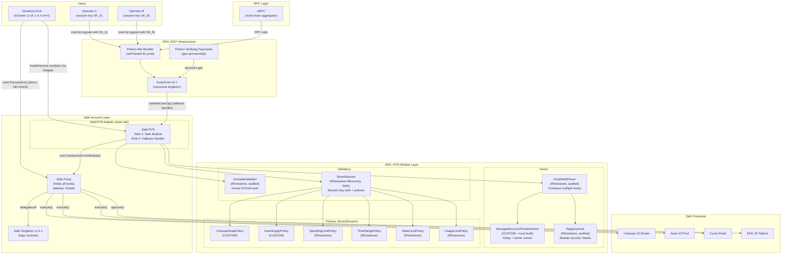
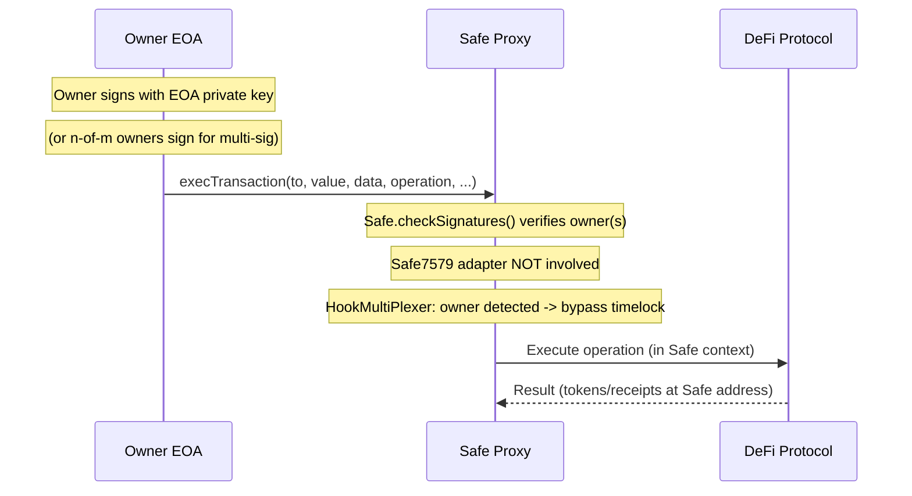
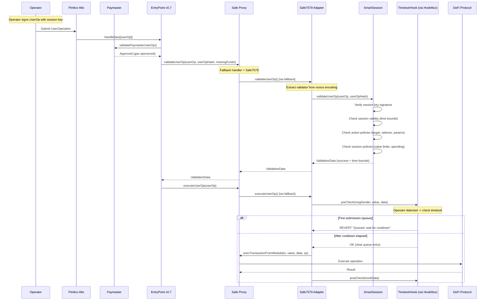
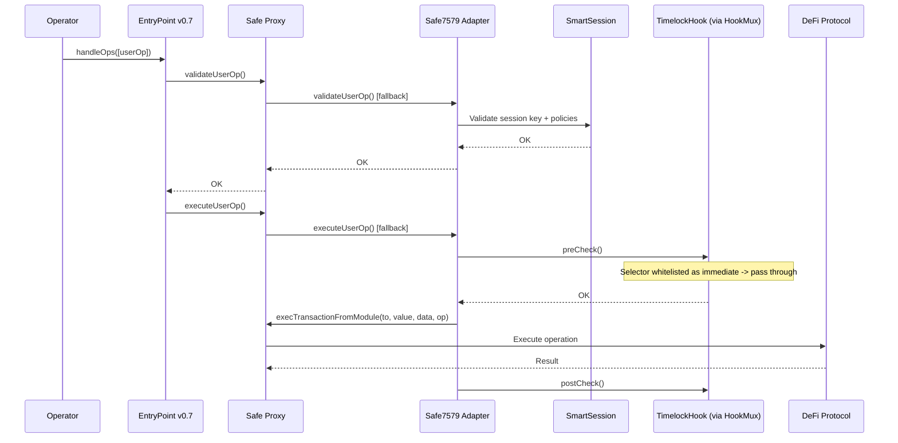
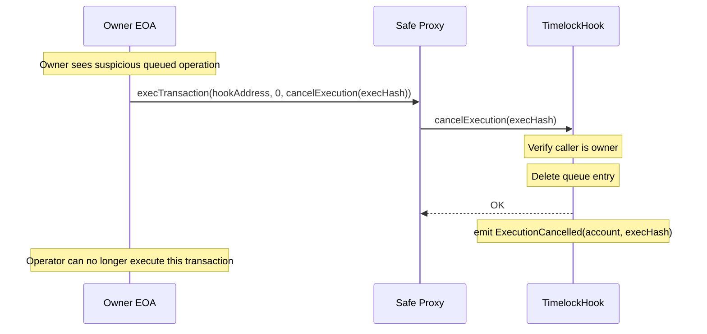
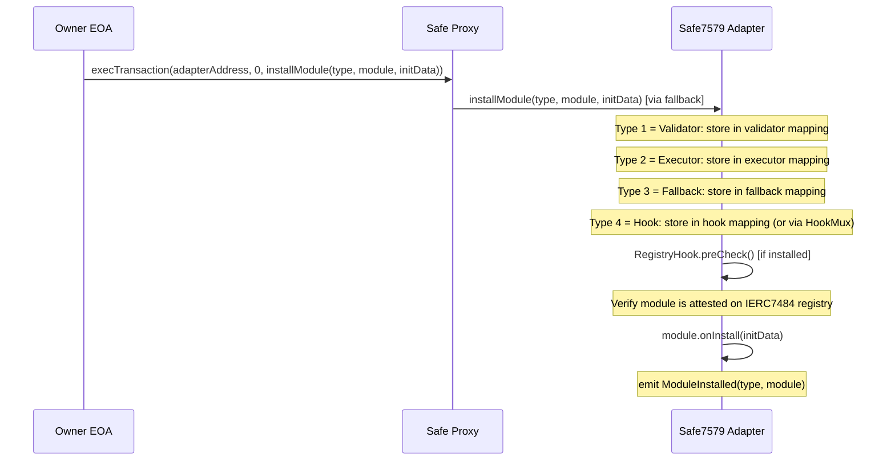

# PRD: Architecture B -- Safe + ERC-7579 + SmartSession (Balanced / Institutional)

> **Version**: 1.0
> **Date**: February 2026
> **Status**: Draft
> **Authors**: Architecture Team

---

## 1. Executive Summary

### Architecture Name
**ManagedAccount Balanced** -- Safe + Safe7579 Adapter + ERC-7579 Modules

### Philosophy
Build on Safe's institutional-grade foundation ($100B+ TVL, 7M+ accounts, 7+ audits, 5+ years in production) while unlocking the modern ERC-7579 modular ecosystem via the Safe7579 Adapter. This architecture trades some gas efficiency (~10-15% more than Architecture A) for the strongest battle-tested security pedigree in the industry and native multi-sig support. The Safe7579 Adapter bridges Safe's native ModuleManager to the ERC-7579 module interface, enabling the same permission modules, timelock hook, and policy contracts built for Architecture A to work without modification.

### Summary
This architecture deploys a Safe Proxy as the managed account, augmented with the Safe7579 Adapter that translates ERC-7579 module calls into Safe's native `execTransactionFromModule()` interface. Operators authenticate via SmartSession session keys embedded in ERC-4337 UserOperations, with permissions enforced through policy contracts. A custom ManagedAccountTimelockHook provides time-delayed execution with owner cancellation rights, composed via HookMultiPlexer alongside the RegistryHook for on-chain module security attestation. The Safe7579 Launchpad enables deploying the Safe and installing all modules in a single UserOperation. All operator transactions flow through EntryPoint v0.7 with Pimlico paymaster sponsorship for gasless UX.

### Target Users
- **Institutional asset managers** requiring multi-sig custody with delegated execution
- **DAOs and treasuries** needing n-of-m approval for owner operations
- **Regulated entities** where Safe's audit trail and ecosystem trust matter
- **DeFi protocols** delegating treasury operations to multiple operators
- **Family offices** managing diversified DeFi portfolios with operator oversight
- **Organizations already using Safe** wanting to add delegated DeFi operations

### Key Value Proposition
- **$100B+ TVL battle-testing** -- Safe is the most deployed, most audited smart account in existence
- **Native multi-sig** -- threshold > 1 for institutional-grade custody (not possible with 7702)
- **Same ERC-7579 modules** -- identical permission modules, timelock hook, and policies as Architecture A
- **Module interoperability** -- ERC-7579 modules portable across Safe, Kernel, Nexus, and future accounts
- **Backward compatible** -- Safe7579 can be added to existing Safe accounts without migration
- **On-chain module registry** -- IERC7484 attestation provides decentralized security layer
- **Safe ecosystem** -- recovery modules, social recovery, Zodiac compatibility, Safe{Wallet} UI
- **Forward-compatible** -- aligned with the industry direction toward ERC-7579 modular accounts

### Key Trade-offs vs Architecture A (7702 Lean)
| Dimension | Architecture A (7702) | Architecture B (Safe7579) |
|-----------|----------------------|--------------------------|
| Account creation gas | ~275K | ~400-450K (+45%) |
| Per-operation overhead | Baseline | +10-15% (adapter layer) |
| Multi-sig support | No (single-owner only) | Yes (native, any threshold) |
| Battle-testing (TVL) | New (post-Pectra) | $100B+ (5+ years) |
| Fund migration needed | No (existing EOA) | Yes (deploy new Safe) |
| Audit pedigree | Protocol-level (Pectra) | 7+ independent audits |
| Ecosystem tooling | Emerging | Mature (Safe{Wallet}, Tenderly, etc.) |
| Recovery options | Limited (EOA key only) | Extensive (social recovery, guardians) |

---

## 2. Architecture Overview

### 2.1 Component Diagram



### 2.2 Component Inventory

| Component | Source | Audited? | Custom? | License | Status |
|-----------|--------|----------|---------|---------|--------|
| Safe Proxy + Singleton v1.4.1 | Safe Global | Yes (7+ audits: OpenZeppelin, Ackee, G0, etc.) | No | LGPL-3.0 | Production (5+ years) |
| Safe7579 Adapter | Rhinestone + Safe | Yes (Ackee Blockchain, Oct 2024) | No | MIT | Production |
| Safe7579 Launchpad | Rhinestone + Safe | Yes (Ackee, with critical finding addressed) | No | MIT | Production |
| SafeProxyFactory | Safe Global | Yes (multiple) | No | LGPL-3.0 | Production |
| OwnableValidator | Rhinestone core-modules | Yes (Ackee) | No | MIT | Production |
| SmartSession | Rhinestone + Biconomy | In progress | No | MIT | **Beta** |
| HookMultiPlexer | Rhinestone core-modules | Yes (Ackee) | No | MIT | Production |
| RegistryHook | Rhinestone core-modules | Yes (Ackee) | No | MIT | Production |
| IERC7484 Module Registry | Rhinestone | Yes | No | MIT | Production |
| ManagedAccountTimelockHook | **Our team** | **Needs audit** | **Yes** | Proprietary | **To build** |
| UniswapSwapPolicy | **Our team** | **Needs audit** | **Yes** | Proprietary | **To build** |
| AaveSupplyPolicy | **Our team** | **Needs audit** | **Yes** | Proprietary | **To build** |
| ManagedAccountFactory | **Our team** | **Needs audit** | **Yes** | Proprietary | **To build** |
| EntryPoint v0.7 | eth-infinitism | Yes (multiple) | No | GPL-3.0 | Production |
| Pimlico Alto Bundler | Pimlico | N/A (infra) | No | GPL-3.0 | Production |
| Pimlico Verifying Paymaster | Pimlico | Yes | No | MIT | Production |
| eRPC | erpc.cloud | N/A (infra) | No | Apache-2.0 | Production |
| permissionless.js | Pimlico | N/A (SDK) | No | MIT | Production |
| @rhinestone/module-sdk | Rhinestone | N/A (SDK) | No | MIT | Production |
| viem | wevm | N/A (SDK) | No | MIT | Production |

### 2.3 Flow: Owner Direct Execution



Owner transactions use Safe's native `execTransaction()` flow. The Safe7579 adapter is not involved -- the owner interacts directly with the Safe. The ManagedAccountTimelockHook recognizes the owner address and allows instant execution. For multi-sig Safes, the required threshold of signatures must be collected before execution.

**Gas cost:** ~40,000-60,000 gas for owner direct execution (Safe base cost, no 4337 overhead).

### 2.4 Flow: Operator Delegated Execution (with Timelock)



### 2.5 Flow: Operator Immediate Execution (Whitelisted Operations)

For operations marked as "immediate" in the timelock configuration (e.g., standard swaps within limits), the timelock is bypassed:



### 2.6 Flow: Owner Cancels Queued Operation



### 2.7 Flow: Module Installation (via Safe7579 Adapter)



---

## 3. Smart Account Layer

### 3.1 Safe Proxy Architecture

The Safe is deployed as a minimal proxy (EIP-1167 pattern) pointing to the Safe Singleton v1.4.1 logic contract. All funds are held at the proxy address; all logic is executed via `delegatecall` to the singleton.

```
+-------------------------------------------+
|           Safe Proxy (0xSafe)             |
|                                           |
|  Storage:                                 |
|  +-- slot 0: singleton address            |
|  +-- slot 1: owners mapping               |
|  +-- slot 2: threshold                    |
|  +-- slot 3: nonce                        |
|  +-- slot 4: modules (linked list)        |
|  +-- slot 5: fallbackHandler              |
|  +-- slot 6: guard                        |
|  +-- slot 7+: module-specific storage     |
|                                           |
|  Code: proxy bytecode (minimal)           |
|  All calls delegated to Singleton         |
|                                           |
|  Key addresses stored:                    |
|  +-- singleton = SafeSingleton v1.4.1     |
|  +-- fallbackHandler = Safe7579 Adapter   |
|  +-- modules[Safe7579] = enabled          |
+-------------------------------------------+
         |
         | delegatecall
         v
+-------------------------------------------+
|       Safe Singleton v1.4.1               |
|                                           |
|  Core functions:                          |
|  +-- execTransaction()     (owner path)   |
|  +-- checkSignatures()     (ECDSA/1271)   |
|  +-- enableModule()        (add module)   |
|  +-- disableModule()       (rm module)    |
|  +-- setFallbackHandler()  (set 7579)     |
|  +-- execTransactionFromModule()          |
|       (module-initiated execution)        |
+-------------------------------------------+
```

**Key properties:**
- **Immutable proxy address**: The Safe address never changes. Funds, approvals, and positions remain at the same address.
- **Upgradeable singleton**: Can upgrade to newer Safe versions by changing the singleton pointer (owner-only, high-risk operation).
- **Module system**: Linked list of enabled modules that can call `execTransactionFromModule()`.
- **Fallback handler**: Receives any call the Safe doesn't natively handle (e.g., `validateUserOp()`).

### 3.2 Safe7579 Adapter Internals

The Safe7579 Adapter serves a dual role:

**Role 1: Safe Module** -- Enabled on the Safe via `enableModule()`, giving it permission to call `execTransactionFromModule()` to execute transactions as the Safe.

**Role 2: Fallback Handler** -- Set as the Safe's `fallbackHandler` via `setFallbackHandler()`, intercepting calls that the Safe does not natively handle (like `validateUserOp()`, `executeUserOp()`, `installModule()`, `uninstallModule()`).

```
Incoming call to Safe Proxy
|
+-- Matches Safe native function? (execTransaction, enableModule, etc.)
|   +-- YES: Execute via Safe Singleton (normal Safe flow)
|
+-- No match (unknown selector)
    +-- Forward to fallbackHandler = Safe7579 Adapter
        |
        +-- validateUserOp(userOp, userOpHash, missingFunds)
        |   +-- Extract validator from nonce encoding
        |       +-- Delegate to installed validator (SmartSession, OwnableValidator)
        |
        +-- executeUserOp(userOp)
        |   +-- Run hooks (preCheck)
        |       +-- Safe.execTransactionFromModule(to, value, data, op)
        |           +-- Run hooks (postCheck)
        |
        +-- installModule(type, module, initData)
        |   +-- Register module in type-specific storage
        |       +-- Call module.onInstall(initData)
        |
        +-- uninstallModule(type, module, deInitData)
        |   +-- Remove module from storage
        |       +-- Call module.onUninstall(deInitData)
        |
        +-- executeFromExecutor(mode, executionCalldata)
        |   +-- Verify caller is installed executor
        |       +-- Safe.execTransactionFromModule(...)
        |
        +-- Unknown selector
            +-- Route to installed fallback module (if any)
```

#### Validator Selection via Nonce Encoding

Safe7579 uses a nonce-encoding scheme to select which validator module processes a UserOperation:

```
userOp.nonce = abi.encodePacked(validatorAddress, uint192(nonce))
```

The adapter extracts the validator address from the nonce key field and delegates `validateUserOp()` to that module. If no validator is specified (or `address(0)`), it falls back to Safe's native `checkSignatures()` -- maintaining backward compatibility.

**For our architecture:**
- Owner UserOps: nonce encodes `OwnableValidator` address (or `address(0)` for Safe native)
- Operator UserOps: nonce encodes `SmartSession` address

#### Execution Routing

For execution, Safe7579 routes all operations through `Safe.execTransactionFromModule()`:

- **Single execution**: Direct call to `Safe.execTransactionFromModule(to, value, data, operation)`
- **Batch execution**: Safe7579 uses a `delegatecall` to a specialized multicall contract. The Safe delegatecalls the multicall, which executes all operations in sequence within the Safe's context. This is gas-efficient and enables atomic batched operations -- something Architecture C (Safe+Zodiac) cannot do natively for operator operations.

#### Hook Integration

Safe7579 supports two types of hooks:
1. **Global hooks**: Execute before and after every operation
2. **Selector-specific hooks**: Execute only for operations targeting specific function selectors

For our architecture, we use a global hook (HookMultiPlexer) that composes the ManagedAccountTimelockHook and RegistryHook.

### 3.3 Safe4337Module vs Safe7579 Adapter

Safe has two paths to ERC-4337 compatibility:

| Feature | Safe4337Module | Safe7579 Adapter |
|---------|---------------|-----------------|
| Purpose | Add 4337 to Safe | Add 4337 + ERC-7579 modules to Safe |
| Authentication | Safe owner signatures only | Any ERC-7579 validator (SmartSession, OwnableValidator, etc.) |
| Module ecosystem | Safe native only | Full ERC-7579 ecosystem (14+ Rhinestone modules) |
| Session keys | Not supported | SmartSession (native) |
| Hook system | Not supported | ERC-7579 hooks (timelock, registry, custom) |
| Batch execution | Via MultiSend | Native atomic batching |
| Operator support | Limited (owners only) | Full (session keys with policy enforcement) |

**Our choice: Safe7579 Adapter** -- The Safe4337Module is insufficient because it only supports Safe owner authentication. We need SmartSession for operator session keys, ERC-7579 hooks for the timelock, and the full module ecosystem.

### 3.4 Safe7579 Launchpad Deployment

Creating a new Safe with Safe7579 pre-configured requires a 3-phase Launchpad process that avoids the chicken-and-egg problem (Safe needs modules configured during creation, but modules can only be installed on an existing Safe).

**Phase 1 -- Factory Creation:**
```
Bundler -> EntryPoint -> SafeProxyFactory.createProxyWithNonce()
    -> Creates SafeProxy with Launchpad as temporary singleton
    -> Stores initHash for validation
```

**Phase 2 -- Validation:**
```
EntryPoint -> Safe (Launchpad as singleton) -> Launchpad.validateUserOp()
    -> Verifies initHash matches expected configuration
    -> Installs initial ValidatorModule (OwnableValidator)
    -> Returns validation data
```

**Phase 3 -- Execution:**
```
EntryPoint -> Safe (Launchpad) -> Launchpad.setupSafe()
    -> Upgrades singleton from Launchpad to SafeSingleton v1.4.1
    -> Initializes Safe7579 adapter (module + fallback handler)
    -> Installs additional validators (SmartSession)
    -> Installs executors, hooks, fallback modules
    -> Configures IERC7484 registry
```

**All three phases happen in a single UserOperation.** The Safe is deployed, configured with all modules, and ready for use atomically.

**Gas cost:** ~400,000-450,000 gas total (Safe proxy deployment + Launchpad flow + 5 module installations).

**Security note:** The Ackee Blockchain audit found a critical front-running vulnerability in the Launchpad where an attacker could front-run deployment and take control. This was addressed post-audit. Deployments should verify the fix is applied and use the latest version.

### 3.5 Storage Layout

```
Safe Proxy Storage (EIP-1967 compatible):
+-- slot 0: SafeSingleton address
+-- slot 1-6: Safe core storage (owners, threshold, nonce, modules, fallback, guard)

Safe7579 Adapter Storage (namespaced to avoid collision):
+-- Module storage (stored in adapter's own slots, keyed by Safe address):
    +-- validators: mapping(address safe => SentinelList)
    +-- executors: mapping(address safe => SentinelList)
    +-- hooks: mapping(address safe => mapping(bytes4 selector => address hook))
    +-- globalHook: mapping(address safe => address)
    +-- fallbacks: mapping(address safe => mapping(bytes4 selector => FallbackConfig))

Module-specific Storage (each module manages its own storage):
+-- SmartSession: sessions, policies, session validators per account
+-- OwnableValidator: owners per account
+-- ManagedAccountTimelockHook: configs, queue, immediateSelectors per account
+-- RegistryHook: registry reference per account
+-- HookMultiPlexer: hook list per account
```

Each ERC-7579 module maintains its own storage, keyed by the smart account address (`msg.sender`). This means module state is isolated per account and per module -- a bug in one module cannot corrupt another module's storage.

---

## 4. Permission System

### 4.1 SmartSession Architecture

SmartSession is an ERC-7579 Validator module that manages session keys with policy-based permission enforcement. It is a collaborative effort between Rhinestone and Biconomy and supports the ERC-7715 (`wallet_grantPermissions`) standard.

**Core data structures:**

```solidity
/// @notice A complete session definition
struct Session {
    ISessionValidator sessionValidator;    // Contract that validates the session key signature
    bytes sessionValidatorInitData;        // Init data for the validator (e.g., session public key)
    bytes32 salt;                          // Uniqueness salt
    PolicyData[] userOpPolicies;           // Policies checked on every UserOp
    ERC7739Data erc7739Policies;           // ERC-1271 signature policies
    ActionData[] actions;                  // Per-action policies
}

/// @notice Per-action permission definition
struct ActionData {
    bytes4 actionTargetSelector;           // Function selector (e.g., exactInputSingle)
    address actionTarget;                  // Target contract (e.g., Uniswap Router)
    PolicyData[] actionPolicies;           // Policies for this specific action
}

/// @notice Policy reference
struct PolicyData {
    address policy;                        // Policy contract address
    bytes initData;                        // Policy initialization data
}
```

**Session lifecycle:**

```
1. CREATION: Owner defines session with actions + policies
   +-- Owner calls SmartSession.enableSession(session) or uses enable-in-first-tx mode
       +-- Gas: ~80,000-120,000

2. VALIDATION: When operator submits UserOp
   +-- SmartSession.validateUserOp(userOp, userOpHash):
       a. Verify session key signed the UserOp (via ISessionValidator)
       b. Check session is within validity period (validAfter/validUntil)
       c. Check all userOp-level policies pass
       d. Match calldata to an allowed action (target + selector)
       e. Check all action-level policies pass
       f. Return ValidationData (success + time bounds)

3. REVOCATION: Owner revokes session
   +-- SmartSession.removeSession(permissionId)
       +-- Gas: ~30,000-50,000
```

### 4.2 Policy Chain Architecture

Policies are external contracts that enforce specific constraints. Multiple policies applied to the same action form an AND chain -- all must pass.

```
UserOp arrives at SmartSession
|
+-- Session-level policies (apply to ALL actions):
|   +-- TimeRangePolicy:     validAfter <= block.timestamp <= validUntil
|   +-- ValueLimitPolicy:    msg.value <= maxValue (per tx)
|   +-- UsageLimitPolicy:    executionCount < maxUsage
|
+-- Action-level policies (apply to specific target+selector):
    +-- UniswapSwapPolicy:   tokenIn in whitelist, tokenOut in whitelist, recipient == account
    +-- SpendingLimitPolicy: cumulative amount <= dailyLimit
    +-- [additional policies]: custom validation logic
```

### 4.3 Available Policy Contracts

**Rhinestone/Biconomy standard policies:**

| Policy | Type | Description | Stateful? |
|--------|------|-------------|-----------|
| **UniversalActionPolicy** | Action | Broad parameter rules with 6 comparison operators | Yes (usage tracking) |
| **SpendingLimitPolicy** | Action | ERC-20 token transfer limits (cumulative) | Yes (balance tracking) |
| **TimeRangePolicy** | Session | validAfter / validUntil timestamps | No |
| **ValueLimitPolicy** | Session | Native token (ETH) value cap per transaction | No |
| **UsageLimitPolicy** | Session | Maximum number of executions | Yes (count tracking) |
| **SudoPolicy** | Session | Unrestricted access (for admin sessions) | No |

**Parameter comparison operators (UniversalActionPolicy):**

| Operator | Description |
|----------|-------------|
| `EQUAL` | Parameter must exactly equal reference value |
| `GREATER_THAN` | Parameter must be strictly greater than reference |
| `LESS_THAN` | Parameter must be strictly less than reference |
| `GREATER_THAN_OR_EQUAL` | Parameter must be >= reference |
| `LESS_THAN_OR_EQUAL` | Parameter must be <= reference |
| `NOT_EQUAL` | Parameter must not equal reference value |

### 4.4 Custom DeFi Policy Contracts (to build)

| Policy | Target Protocol | Validates | Gas Overhead |
|--------|----------------|-----------|-------------|
| **UniswapSwapPolicy** | Uniswap V3 | tokenIn/Out whitelist, recipient == account, slippage bounds | ~10-15K |
| **AaveSupplyPolicy** | Aave V3 | asset whitelist, onBehalfOf == account | ~8-12K |
| **AaveWithdrawPolicy** | Aave V3 | asset whitelist, recipient == account | ~8-12K |
| **CurveExchangePolicy** | Curve | coin index whitelist, slippage bounds | ~10-15K |
| **ERC20ApprovalPolicy** | Any ERC-20 | spender whitelist, max approval amount | ~5-8K |
| **GenericRecipientPolicy** | Any | recipient parameter == account address | ~3-5K |

### 4.5 Permission Configuration Example

```solidity
// Example: Complete operator session configuration for a DeFi trading operator

// Session-level policies
PolicyData[] memory sessionPolicies = new PolicyData[](3);

// Policy 1: Session valid for 30 days
sessionPolicies[0] = PolicyData({
    policy: TIME_RANGE_POLICY,
    initData: abi.encode(
        uint128(block.timestamp),                    // validAfter: now
        uint128(block.timestamp + 30 days)           // validUntil: 30 days from now
    )
});

// Policy 2: No native ETH value transfers
sessionPolicies[1] = PolicyData({
    policy: VALUE_LIMIT_POLICY,
    initData: abi.encode(uint256(0))                 // maxValue: 0 ETH
});

// Policy 3: Max 500 operations per session
sessionPolicies[2] = PolicyData({
    policy: USAGE_LIMIT_POLICY,
    initData: abi.encode(uint256(500))               // maxUsage: 500
});

// Action 1: Uniswap V3 exactInputSingle
ActionData memory uniswapAction = ActionData({
    actionTarget: UNISWAP_V3_ROUTER,
    actionTargetSelector: bytes4(keccak256(
        "exactInputSingle((address,address,uint24,address,uint256,uint256,uint160))"
    )),
    actionPolicies: new PolicyData[](2)
});

uniswapAction.actionPolicies[0] = PolicyData({
    policy: UNISWAP_SWAP_POLICY,
    initData: abi.encode(
        allowedTokensIn,     // [USDC, WETH, DAI, WBTC]
        allowedTokensOut,    // [USDC, WETH, DAI, WBTC]
        safeAddress,         // recipient must be the Safe
        uint16(100)          // max 1% slippage
    )
});

uniswapAction.actionPolicies[1] = PolicyData({
    policy: SPENDING_LIMIT_POLICY,
    initData: abi.encode(
        USDC,                         // token
        50_000 * 10**6                // 50,000 USDC daily limit
    )
});

// Action 2: Aave V3 supply
ActionData memory aaveAction = ActionData({
    actionTarget: AAVE_V3_POOL,
    actionTargetSelector: bytes4(keccak256("supply(address,uint256,address,uint16)")),
    actionPolicies: new PolicyData[](1)
});

aaveAction.actionPolicies[0] = PolicyData({
    policy: AAVE_SUPPLY_POLICY,
    initData: abi.encode(
        allowedAssets,       // [USDC, WETH, DAI]
        safeAddress          // onBehalfOf must be the Safe
    )
});

// Assemble full session
Session memory operatorSession = Session({
    sessionValidator: ECDSA_SESSION_VALIDATOR,
    sessionValidatorInitData: abi.encode(operatorPublicKey),
    salt: keccak256("operator-alpha-session-1"),
    userOpPolicies: sessionPolicies,
    erc7739Policies: ERC7739Data({
        allowedERC7739Content: new bytes[](0),
        erc1271Policies: new PolicyData[](0)
    }),
    actions: new ActionData[](2)
});
operatorSession.actions[0] = uniswapAction;
operatorSession.actions[1] = aaveAction;
```

### 4.6 Permission Hierarchy

```
Safe Account (0xSafe)
|
+-- Owner Role (Safe native + OwnableValidator)
|   +-- Full control over Safe (execTransaction)
|   +-- Install/uninstall ERC-7579 modules
|   +-- Create/revoke operator sessions
|   +-- Cancel queued timelock operations
|   +-- Configure timelock parameters
|   +-- Withdraw funds to any address
|   +-- Change Safe ownership/threshold
|   +-- Remove Safe7579 adapter (nuclear option)
|
+-- Admin Role (SmartSession with elevated permissions)
|   +-- Create operator sessions (limited templates)
|   +-- View account state
|   +-- Monitor operations
|   +-- Cannot withdraw, change owners, or remove modules
|
+-- Operator Role (SmartSession with scoped permissions)
    +-- Execute whitelisted DeFi operations
    +-- Only to whitelisted targets + selectors
    +-- Within parameter constraints (custom policies)
    +-- Within spending limits
    +-- Within time bounds
    +-- Subject to timelock (unless selector is immediate)
    +-- Cannot install/uninstall modules or change Safe config
```

### 4.7 Comparison: SmartSession vs Zodiac Roles v2 (for reference)

| Feature | SmartSession (this PRD) | Zodiac Roles v2 (PRD C) |
|---------|------------------------|------------------------|
| Condition operators | 6 (basic comparison) | 18+ (most expressive) |
| Nested logic (AND/OR) | AND only (multiple policies) | Full AND/OR/NOR trees |
| Array conditions | No | Yes (Some/Every/Subset) |
| EqualToAvatar (recipient = account) | Custom policy needed | Built-in operator |
| Auto-replenishing allowances | No | Yes (period + refill) |
| Time bounds | Built-in (validAfter/validUntil) | No native (use Delay module) |
| ERC-4337 native | Yes (is a Validator module) | No (requires custom bridge) |
| Multi-chain sessions | Yes (ChainDigest) | No |
| Enable in first tx | Yes | No |
| Account portability | Any ERC-7579 account | Safe only |
| Gas overhead | ~15-40K per validation | ~20-50K per validation |

**Bottom line:** SmartSession is less expressive out-of-the-box but more naturally integrated with ERC-4337 and portable across account types. For complex conditions (array checks, nested logic, auto-replenishing limits), custom policy contracts are needed.

---

## 5. Timelock Mechanism

### 5.1 ManagedAccountTimelockHook Design

The ManagedAccountTimelockHook is a custom ERC-7579 Hook module that provides Zodiac Delay-equivalent functionality for operator-initiated transactions. It is the same contract specified in Architecture A (PRD A, Section 4.1) -- identical code works on both 7702-enabled EOAs and Safe+Safe7579 accounts.

**Key capabilities:**
- Configurable cooldown period per account (seconds before execution allowed)
- Optional expiration period (auto-expire queued transactions)
- Owner bypass (owner transactions execute immediately)
- Owner cancellation (cancel any queued transaction at any time)
- Selective timelock (configurable per function selector)
- Hash-based queue (non-FIFO, allows any-order execution)

**Why not ColdStorageHook (Rhinestone)?**

ColdStorageHook was analyzed and rejected for our use case:

| Feature | ColdStorageHook | ManagedAccountTimelockHook (ours) |
|---------|----------------|----------------------------------|
| Recipient restriction | Only to configured `owner` address | Any address (DeFi protocols) |
| Owner cancellation | Not supported (hash-based, no cancel) | Supported (cancelExecution) |
| Direct execution | Blocked (always reverts) | Allowed for owners |
| Batch support | No (reverts on batch) | Yes (queue each op in batch) |
| Selective bypass | No | Yes (per-selector immediate flag) |
| Use case | Cold storage sub-accounts | General-purpose delegation timelock |

ColdStorageHook is designed for "cold storage" sub-accounts where the only allowed operation is transferring funds to the owner. Our use case requires executing arbitrary whitelisted DeFi operations with a delay window.

### 5.2 Interface

```solidity
// SPDX-License-Identifier: BUSL-1.1
pragma solidity ^0.8.26;

import { IERC7579Hook } from "erc7579/interfaces/IERC7579Module.sol";

/// @title ManagedAccountTimelockHook
/// @notice ERC-7579 Hook that enforces time-delayed execution for non-owner callers.
///         Owner transactions execute immediately. Operator transactions are queued
///         and can only execute after a configurable cooldown period.
///         Owner can cancel any queued transaction at any time.
/// @dev Installed via HookMultiPlexer for composition with RegistryHook.
///      Works identically on Safe+Safe7579, 7702+7579, and any ERC-7579 account.

interface IManagedAccountTimelockHook is IERC7579Hook {
    // -------- Events --------

    event ExecutionQueued(
        address indexed account,
        bytes32 indexed execHash,
        address operator,
        address target,
        bytes4 selector,
        uint256 queuedAt,
        uint256 executeAfter
    );

    event ExecutionExecuted(address indexed account, bytes32 indexed execHash);

    event ExecutionCancelled(address indexed account, bytes32 indexed execHash);

    event ConfigUpdated(address indexed account, uint128 cooldown, uint128 expiration);

    event SelectorImmediateUpdated(address indexed account, bytes4 selector, bool immediate);

    // -------- Errors --------

    error ExecutionQueued_WaitForCooldown(bytes32 execHash, uint256 executeAfter);
    error CooldownNotElapsed(bytes32 execHash, uint256 executeAfter, uint256 currentTime);
    error ExecutionExpired(bytes32 execHash, uint256 expiredAt);
    error NotOwner();
    error ExecutionNotQueued(bytes32 execHash);
    error InvalidConfig();

    // -------- Structs --------

    struct TimelockConfig {
        uint128 cooldown;       // Seconds before queued tx can execute (min 60, max 30 days)
        uint128 expiration;     // Seconds after cooldown during which execution is valid (0 = no expiry)
        address owner;          // Can bypass timelock + cancel queued txs
    }

    struct QueueEntry {
        uint128 queuedAt;      // Block timestamp when queued
        address operator;       // The operator who queued it
    }

    // -------- Configuration (called by account owner via Safe.execTransaction) --------

    function configure(uint128 cooldown, uint128 expiration, address owner) external;
    function setOperationImmediate(bytes4 selector, bool immediate) external;

    // -------- Queue Management --------

    function cancelExecution(bytes32 execHash) external;
    function getQueueEntry(address account, bytes32 execHash)
        external view returns (QueueEntry memory entry);
    function isImmediate(address account, bytes4 selector) external view returns (bool);
    function getConfig(address account) external view returns (TimelockConfig memory config);
    function computeExecHash(
        address target,
        uint256 value,
        bytes calldata callData,
        address operator
    ) external pure returns (bytes32);

    // -------- ERC-7579 Hook Interface --------

    function preCheck(
        address msgSender,
        uint256 msgValue,
        bytes calldata msgData
    ) external returns (bytes memory hookData);

    function postCheck(bytes calldata hookData) external;

    // -------- ERC-7579 Module Interface --------

    function onInstall(bytes calldata data) external;
    function onUninstall(bytes calldata data) external;
    function isInitialized(address smartAccount) external view returns (bool);
}
```

### 5.3 Storage Design

```solidity
// Per-account configuration
mapping(address account => TimelockConfig) internal _configs;

// Per-account queue: execHash => QueueEntry
mapping(address account => mapping(bytes32 execHash => QueueEntry)) internal _queue;

// Per-account immediate selectors: selector => bool
mapping(address account => mapping(bytes4 selector => bool)) internal _immediateSelectors;
```

### 5.4 preCheck Logic (Pseudocode)

```solidity
function preCheck(
    address msgSender,
    uint256 msgValue,
    bytes calldata msgData
) external returns (bytes memory hookData) {
    TimelockConfig memory cfg = _configs[msg.sender]; // msg.sender = account

    // 1. Owner bypass: instant execution
    if (msgSender == cfg.owner) return "";

    // 2. Extract target and selector from msgData
    bytes4 selector = bytes4(msgData[:4]);

    // 3. Immediate selector bypass
    if (_immediateSelectors[msg.sender][selector]) return "";

    // 4. Compute execution hash
    bytes32 execHash = keccak256(abi.encodePacked(
        msg.sender,    // account
        msgSender,     // operator
        msgValue,      // ETH value
        msgData        // full calldata
    ));

    QueueEntry memory entry = _queue[msg.sender][execHash];

    // 5. First submission: queue the transaction
    if (entry.queuedAt == 0) {
        _queue[msg.sender][execHash] = QueueEntry({
            queuedAt: uint128(block.timestamp),
            operator: msgSender
        });
        emit ExecutionQueued(
            msg.sender, execHash, msgSender,
            address(bytes20(msgData[:20])), selector,
            block.timestamp, block.timestamp + cfg.cooldown
        );
        revert ExecutionQueued_WaitForCooldown(
            execHash,
            block.timestamp + cfg.cooldown
        );
    }

    // 6. Check cooldown elapsed
    uint256 executeAfter = entry.queuedAt + cfg.cooldown;
    if (block.timestamp < executeAfter) {
        revert CooldownNotElapsed(execHash, executeAfter, block.timestamp);
    }

    // 7. Check not expired (if expiration is set)
    if (cfg.expiration > 0) {
        uint256 expiresAt = executeAfter + cfg.expiration;
        if (block.timestamp > expiresAt) {
            delete _queue[msg.sender][execHash];
            revert ExecutionExpired(execHash, expiresAt);
        }
    }

    // 8. Clear queue entry and allow execution
    delete _queue[msg.sender][execHash];
    emit ExecutionExecuted(msg.sender, execHash);

    return abi.encode(execHash);
}
```

### 5.5 Integration with HookMultiPlexer

The HookMultiPlexer allows combining multiple hooks on a single account. ERC-7579 accounts support only one hook slot, so the multiplexer is essential for composing our timelock with other hooks.

```
HookMultiPlexer (global hook on Safe7579)
+-- ManagedAccountTimelockHook
|   +-- preCheck: queue/validate operator transactions
|   +-- postCheck: verify execution context
+-- RegistryHook
|   +-- preCheck: verify module attestations on IERC7484
|   +-- postCheck: (no-op)
+-- [Optional: custom audit/compliance hook]
```

**Hook execution order:** All hooks in the multiplexer execute their `preCheck()` in order. If any hook reverts, the entire operation is blocked. `postCheck()` runs in reverse order.

### 5.6 Comparison with Zodiac Delay Module

| Feature | Zodiac Delay | ManagedAccountTimelockHook |
|---------|-------------|---------------------------|
| Queue model | FIFO (sequential) | Hash-based (any order) |
| Cancellation | Owner can skip via nonce increment | Owner can cancel specific execHash |
| Module standard | Zodiac Modifier | ERC-7579 Hook |
| Account compatibility | Safe only (Zodiac) | Any ERC-7579 account |
| Batch support | No | Yes (per-op queueing within batch) |
| Selective bypass | No | Yes (per-selector immediate flag) |
| Recipient restriction | None | None (configurable) |
| Audit status | Audited (Zodiac) | **Needs audit** (custom) |
| Production validation | High (used in production) | **None** (new) |

**Key risk:** The Zodiac Delay module is battle-tested in production. Our ManagedAccountTimelockHook is new custom code that requires development, testing, and auditing. This is the single largest technical risk in this architecture.

**Gas cost comparison:**
- Queue operation: ~45,000 gas (both similar -- storage write)
- Execute after cooldown: ~25,000 gas (both similar -- storage read + delete)
- Owner cancel: ~20,000 gas (ours) vs N/A (Zodiac uses nonce skip)

---

## 6. Gasless UX (ERC-4337)

### 6.1 UserOperation Flow Through Safe7579

```
Operator signs UserOp with session key
|
+-- UserOp.sender = Safe Proxy address
+-- UserOp.nonce = abi.encodePacked(SmartSession_address, uint192(nonce))
+-- UserOp.callData = Safe7579.executeUserOp(abi.encode(target, value, calldata))
+-- UserOp.signature = session key ECDSA signature
|
+-- Bundler submits to EntryPoint
    |
    +-- VALIDATION PHASE:
    |   EntryPoint -> Safe Proxy (fallback) -> Safe7579.validateUserOp()
    |   |
    |   +-- Extract validator from nonce key = SmartSession
    |   +-- SmartSession.validateUserOp(userOp, userOpHash):
    |       +-- Decompress session data from signature
    |       +-- Verify session key signature (ECDSA recovery)
    |       +-- Check session validity period
    |       +-- Check all userOp-level policies (TimeRange, ValueLimit, UsageLimit)
    |       +-- Decode calldata to extract target + selector
    |       +-- Match against allowed actions
    |       +-- Check all action-level policies (UniswapSwap, SpendingLimit)
    |   |
    |   +-- Return: ValidationData(0, validAfter, validUntil)
    |
    +-- PAYMASTER VALIDATION:
    |   EntryPoint -> Paymaster.validatePaymasterUserOp()
    |   +-- Verify sponsorship: check account is whitelisted, within daily gas budget
    |
    +-- EXECUTION PHASE:
        EntryPoint -> Safe Proxy (fallback) -> Safe7579.executeUserOp()
        |
        +-- HookMultiPlexer.preCheck():
        |   +-- ManagedAccountTimelockHook.preCheck()
        |   |   +-- Queue (if first) or validate (if cooldown elapsed)
        |   +-- RegistryHook.preCheck()
        |       +-- Verify modules are attested on IERC7484
        |
        +-- Safe7579 -> Safe.execTransactionFromModule(to, value, data, CALL)
        |   +-- DeFi Protocol executes (tokens move)
        |
        +-- HookMultiPlexer.postCheck():
            +-- RegistryHook.postCheck() (no-op)
            +-- ManagedAccountTimelockHook.postCheck()
```

### 6.2 Validation Path Detail

The Safe7579 validation path adds overhead compared to direct Smart Account validation:

```
EntryPoint.validateUserOp(userOp)
|
+-- Call Safe Proxy at userOp.sender
+-- Safe Proxy: selector not recognized -> forward to fallbackHandler
+-- Safe7579 Adapter receives validateUserOp()
+-- Safe7579: decode nonce key -> SmartSession address
+-- Safe7579: call SmartSession.validateUserOp()
|   +-- Session key verification: ~15K gas
|   +-- Session policy checks: ~5-10K per policy
|   +-- Action policy checks: ~5-15K per policy
+-- Safe7579: return ValidationData
|
Total: ~55,000-80,000 gas for validation
  (vs ~40,000-60,000 for direct 7702 account)
  Overhead: ~15,000-20,000 gas (Safe proxy + adapter routing)
```

### 6.3 Execution Path Detail

```
EntryPoint.executeUserOp(userOp)
|
+-- Call Safe Proxy at userOp.sender
+-- Safe Proxy: forward to fallbackHandler = Safe7579
+-- Safe7579: decode execution mode + calldata
|
+-- Single execution:
|   +-- Safe7579 -> HookMultiPlexer.preCheck()
|   +-- Safe7579 -> Safe.execTransactionFromModule(to, value, data, CALL)
|   |   +-- Safe Proxy delegatecalls Singleton
|   |       +-- Singleton: verify caller is enabled module (Safe7579) -> OK
|   |           +-- External call to DeFi protocol
|   +-- Safe7579 -> HookMultiPlexer.postCheck()
|
+-- Batch execution (atomic):
    +-- Safe7579 -> HookMultiPlexer.preCheck()
    +-- Safe7579 -> Safe.execTransactionFromModule(multicallAddr, 0, batchData, DELEGATECALL)
    |   +-- Safe Proxy delegatecalls multicall contract
    |       +-- Multicall executes N calls in sequence (in Safe's context)
    |           +-- Call 1: Uniswap swap
    |           +-- Call 2: Aave supply
    |           +-- Call 3: ERC-20 approve
    +-- Safe7579 -> HookMultiPlexer.postCheck()

    Batch gas savings: ~30-40% vs N separate UserOps
```

### 6.4 Paymaster Integration

**Sponsorship model: Platform-Sponsored with Account Fallback**

```typescript
// Pimlico Verifying Paymaster configuration
const paymasterConfig = {
  type: 'verifying',
  sponsorshipPolicy: {
    // Per-account daily gas limit
    maxGasPerAccountPerDay: parseEther('0.1'), // ~$300 at $3000/ETH
    // Total daily platform budget
    maxDailyPlatformSpend: parseEther('10'),   // ~$30,000/day
    // Whitelist of sponsored accounts
    sponsoredAccounts: 'all_managed_accounts',
    // ERC-20 fallback when platform budget exhausted
    erc20Fallback: {
      token: USDC_ADDRESS,
      oracle: CHAINLINK_ETH_USD,
      markup: 500, // 5% markup for ERC-20 gas payment
    }
  }
}
```

**Sponsorship priority:**
1. Platform sponsors gas (up to daily limit per account)
2. Account pays gas from ERC-20 balance (USDC)
3. Reject UserOp (no gas available)

### 6.5 Gas Estimates Table

| Operation | Gas (Safe+7579) | vs Architecture A (7702) | Notes |
|-----------|:-:|:-:|-------|
| **Account creation (via Launchpad)** | ~400,000-450,000 | +45% | Safe proxy + adapter + 5 modules |
| **Owner: Simple transfer** | ~55,000 | +22% | Safe.execTransaction overhead |
| **Owner: Approve + swap** | ~130,000 | +18% | Safe base cost |
| **Operator: Simple swap (4337, no timelock)** | ~260,000-290,000 | +30% | Safe7579 adapter overhead |
| **Operator: Simple swap (4337, 3 policies)** | ~290,000-320,000 | +32% | +policy overhead |
| **Operator: Swap + timelock queue** | ~305,000-335,000 | +25% | +timelock storage |
| **Operator: Swap + timelock execute** | ~285,000-315,000 | +30% | +timelock read/delete |
| **Operator: Batch 3 ops (4337)** | ~370,000-420,000 | +20% | Multicall pattern saves gas |
| **Operator: Complex (5+ policies)** | ~300,000-350,000 | +25% | SmartSession + 5 policies |
| **Session creation** | ~80,000-120,000 | Same | SmartSession (identical) |
| **Session revocation** | ~30,000-50,000 | Same | SmartSession (identical) |
| **Timelock cancel (owner)** | ~60,000 | +200% | Safe.execTransaction overhead |
| **Module install** | ~100,000-130,000 | +30% | Safe + adapter routing |

**Where the overhead comes from:**
- Safe proxy `delegatecall` to singleton: ~2,000 gas
- Fallback handler routing to Safe7579: ~5,000 gas
- Safe7579 adapter module call routing: ~8,000-12,000 gas
- `execTransactionFromModule` verification: ~5,000 gas
- **Total adapter overhead per operation: ~20,000-25,000 gas (~$1.80-2.25 at 30 gwei, $3000/ETH)**

---

## 7. Multi-Chain Strategy

### 7.1 Safe Deployment Across Chains

Safe uses CREATE2 deterministic deployment, meaning the same Safe address can be deployed on every chain (if the same factory, singleton, and initialization data are used).

| Chain | Safe Factory | Safe Singleton v1.4.1 | EntryPoint v0.7 | Safe7579 Adapter | Priority |
|-------|-------------|----------------------|-----------------|-----------------|----------|
| **Ethereum** | Canonical | Canonical | Canonical | Deployed | P0 |
| **Arbitrum** | Canonical | Canonical | Canonical | Deployed | P1 |
| **Base** | Canonical | Canonical | Canonical | Deployed | P1 |
| **Optimism** | Canonical | Canonical | Canonical | Deployed | P2 |
| **Polygon PoS** | Canonical | Canonical | Canonical | Deployed | P3 |

**Key advantage over Architecture A:** Safe has been deployed on 15+ chains with consistent addresses. The Safe7579 adapter and Rhinestone modules are also deployed on major chains. This gives Architecture B a head start on multi-chain deployment.

### 7.2 Cross-Chain Session Keys

SmartSession natively supports multi-chain sessions via ChainDigest:

```typescript
// Create session valid on Ethereum + Arbitrum + Base
const enableSessionData = {
  sessions: [operatorSession],
  chainDigests: [
    { chainId: 1n,     digest: computeSessionDigest(operatorSession, 1n) },
    { chainId: 42161n, digest: computeSessionDigest(operatorSession, 42161n) },
    { chainId: 8453n,  digest: computeSessionDigest(operatorSession, 8453n) },
  ]
}

// Owner signs once -> session valid on all specified chains
const enableAction = getEnableSessionDetails(enableSessionData)
await ownerClient.sendTransaction(enableAction)
```

**Key considerations:**
- Each chain has independent module storage (spending limits tracked per-chain)
- Session validity period is shared across chains
- Revocation must be done on each chain separately
- Same Safe address on each chain simplifies cross-chain management

### 7.3 Deterministic Safe Addresses via CREATE2

```typescript
import { getCreate2Address, encodePacked, keccak256, encodeAbiParameters } from 'viem'

// Safe address is deterministic based on:
// 1. SafeProxyFactory address (same on all chains)
// 2. Safe Singleton address (same on all chains)
// 3. Initialization data (owners, threshold, etc.)
// 4. Salt (nonce)

const safeAddress = getCreate2Address({
  from: SAFE_PROXY_FACTORY,
  salt: keccak256(encodePacked(
    ['bytes32', 'uint256'],
    [keccak256(safeInitializer), saltNonce]
  )),
  bytecodeHash: keccak256(safeProxyCreationCode + encodedSingleton)
})

// safeAddress is the SAME on every chain if inputs are identical
```

### 7.4 eRPC Multi-Chain Aggregation

```yaml
# erpc-config.yaml
version: "1.0"
chains:
  - id: 1  # Ethereum mainnet
    providers:
      - url: "https://eth-mainnet.g.alchemy.com/v2/${ALCHEMY_KEY}"
        priority: 1
        weight: 50
      - url: "https://mainnet.infura.io/v3/${INFURA_KEY}"
        priority: 1
        weight: 30
      - url: "https://rpc.ankr.com/eth/${ANKR_KEY}"
        priority: 2
        weight: 20
    failover:
      enabled: true
      maxRetries: 3
      retryDelay: 100ms
    caching:
      enabled: true
      ttl: 12s

  - id: 42161  # Arbitrum
    providers:
      - url: "https://arb-mainnet.g.alchemy.com/v2/${ALCHEMY_KEY}"
        priority: 1
      - url: "https://arbitrum.llamarpc.com"
        priority: 2

  - id: 8453  # Base
    providers:
      - url: "https://base-mainnet.g.alchemy.com/v2/${ALCHEMY_KEY}"
        priority: 1
      - url: "https://base.llamarpc.com"
        priority: 2
```

### 7.5 Per-Chain Configuration

| Config | Ethereum | Arbitrum | Base |
|--------|----------|----------|------|
| Timelock cooldown | 1 hour | 15 min | 15 min |
| Timelock expiration | 24 hours | 6 hours | 6 hours |
| Gas price strategy | EIP-1559 | Arbitrum model | OP Stack model |
| Bundler | Self-hosted Alto | Self-hosted Alto | Pimlico API |
| DeFi targets | Mainnet addresses | Arbitrum addresses | Base addresses |

---

## 8. Security Model

### 8.1 Threat Model

| Attack Vector | Description | Impact | Probability | Mitigation |
|---------------|-------------|--------|-------------|------------|
| **Session key compromise** | Operator's session key stolen | HIGH -- attacker executes within session permissions | Medium | Short expiry (30 days), spending limits, timelock for high-value ops, instant revocation |
| **Safe7579 adapter vulnerability** | Bug in the adapter allows unauthorized execution | CRITICAL -- full account takeover | Low | Audited by Ackee; Safe can remove adapter as module |
| **Launchpad front-running** | Attacker front-runs Safe deployment via Launchpad | HIGH -- attacker controls initial config | Low | Post-audit fix applied; verify deployment params |
| **Custom timelock hook bug** | Bug allows skipping delay period | CRITICAL -- no safety window | Medium | Extensive testing, formal verification, third-party audit |
| **Custom policy contract bug** | Policy fails to enforce parameter constraints | HIGH -- unauthorized operations | Medium | Per-protocol fork testing, audit all custom policies |
| **Module interaction bug** | Unexpected behavior when 5+ modules interact | HIGH -- permission bypass | Medium | Integration testing via ModuleKit; staged rollout |
| **Safe ownership compromise** | All Safe owner keys compromised | CRITICAL -- full loss | Low | Multi-sig threshold > 1; hardware wallets; social recovery |
| **Cross-chain replay** | Module config replayed across chains | MEDIUM -- unauthorized config | Low | Per-chain initialization; domain separator checks |
| **IERC7484 registry compromise** | Attacker gets malicious module attested | HIGH -- trojan module installed | Low | Multiple attesters; threshold > 1; internal module whitelist |
| **Paymaster drain** | Attacker creates many accounts to drain gas budget | MEDIUM -- gas budget exhaustion | Medium | Per-account daily limits; KYC/approval for new accounts |
| **Bundler MEV** | Bundler front-runs operator UserOps | MEDIUM -- manipulated execution | Low | Self-hosted bundler; private mempool |

### 8.2 Trust Assumptions

| Entity | Trust Level | What We Trust Them For |
|--------|-------------|----------------------|
| **Owner(s) EOA** | Full trust | Private key custody; module configuration; Safe ownership |
| **Safe Singleton v1.4.1** | Very high trust | 5+ years production, $100B+ TVL, 7+ audits |
| **Safe7579 Adapter** | High trust | Audited (Ackee); joint Rhinestone+Safe development |
| **SmartSession** | Medium trust | Session key validation; policy enforcement (**BETA**) |
| **Rhinestone Core Modules** | High trust | Audited (Ackee); 14 modules, production-deployed |
| **ManagedAccountTimelockHook** | Medium trust (until audited) | Timelock enforcement; owner bypass logic |
| **Custom Policy Contracts** | Medium trust (until audited) | Per-protocol parameter validation |
| **IERC7484 Registry** | Medium trust | Module attestation; can be bypassed if unavailable |
| **Pimlico Bundler** | Low trust | Only trusted for liveness, not correctness |
| **Pimlico Paymaster** | Medium trust | Gas sponsorship decisions; cannot affect execution |
| **EntryPoint v0.7** | Very high trust | Canonical ERC-4337; extensively audited |

### 8.3 Defense-in-Depth Layers

```
Layer 1: Safe Ownership
+-- Owner(s) must sign for module installation/removal
+-- Threshold enforcement (multi-sig)
+-- Can remove Safe7579 adapter entirely (nuclear option)

Layer 2: SmartSession Policies
+-- Session keys scoped to specific (target, selector) pairs
+-- Parameter validation via custom policy contracts
+-- Spending limits (cumulative tracking)
+-- Time bounds (session expiry)
+-- Usage limits (max operations per session)

Layer 3: ManagedAccountTimelockHook
+-- Operator transactions delayed by cooldown period
+-- Owner can cancel any queued transaction
+-- Expiration prevents stale queue items
+-- Selective bypass for low-risk operations

Layer 4: IERC7484 Module Registry
+-- On-chain attestation for installed modules
+-- RegistryHook checks attestation before execution
+-- Compromised modules can be flagged and auto-disabled
+-- Multiple attesters for redundancy

Layer 5: Monitoring & Alerting
+-- On-chain event monitoring (queued ops, session changes, module changes)
+-- Off-chain alerting (PagerDuty, Slack)
+-- Anomaly detection (unusual gas spending, off-hours operations)
+-- Periodic security reviews
```

### 8.4 Emergency Procedures

```
SEVERITY LEVEL 1: Pause specific operator
  1. Owner calls SmartSession.removeSession(permissionId)
  2. Operator immediately cannot validate new UserOps
  3. Cancel any queued timelock operations from this operator
  Gas: ~60,000-80,000 (Safe.execTransaction + removeSession)

SEVERITY LEVEL 2: Pause all operators
  1. Owner uninstalls SmartSession module via Safe7579
  2. ALL operator sessions immediately invalid
  3. Cancel all queued timelock operations
  Gas: ~120,000-180,000 (multi-step)

SEVERITY LEVEL 3: Disable Safe7579 adapter
  1. Owner calls Safe.disableModule(safe7579Address)
  2. Safe7579 can no longer call execTransactionFromModule
  3. All ERC-7579 modules disabled (validators, hooks, executors)
  4. Safe reverts to standard Safe behavior
  Gas: ~50,000-80,000

SEVERITY LEVEL 4: Change Safe ownership
  1. Owner calls Safe.swapOwner() or Safe.removeOwner() to change control
  2. Old owner keys no longer valid
  3. New owner re-configures modules
  Gas: ~50,000-100,000

SEVERITY LEVEL 5: Fund evacuation
  1. Owner transfers all tokens to a fresh Safe or EOA
  2. Then disables all modules
  Gas: ~50,000 per token + ~80,000 module removal
```

### 8.5 Upgrade Strategy

| Component | Upgrade Path | Risk Level |
|-----------|-------------|------------|
| **Safe Singleton** | Change proxy singleton pointer (owner-only) | HIGH -- requires careful testing |
| **Safe7579 Adapter** | Disable old, enable new as module + fallback | MEDIUM -- module state migration |
| **SmartSession** | Uninstall old, install new, re-create sessions | MEDIUM -- operator downtime |
| **ManagedAccountTimelockHook** | Uninstall old (clear queue), install new | MEDIUM -- queue state lost |
| **Policy contracts** | Add new policies to sessions, disable old | LOW -- additive change |
| **HookMultiPlexer** | Update hook list (add/remove sub-hooks) | LOW -- configuration change |

---

## 9. Custom Components Specification

### 9.1 ManagedAccountTimelockHook

**Purpose:** Enforce time-delayed execution for operator-initiated transactions with owner bypass and cancellation. Identical to Architecture A specification (see Section 5 above for full interface and pseudocode).

**Estimated development:** ~400-600 lines Solidity + ~500 lines tests.
**Estimated gas:** Queue: ~45K, Execute: ~25K, Cancel: ~20K, Owner bypass: ~5K.
**Audit priority:** P0 (critical path).

### 9.2 UniswapSwapPolicy

**Purpose:** Validate Uniswap V3 swap parameters -- enforce token whitelists, recipient must be the Safe, slippage bounds.

```solidity
// SPDX-License-Identifier: BUSL-1.1
pragma solidity ^0.8.26;

import { IActionPolicy } from "smartsessions/interfaces/IPolicy.sol";

contract UniswapSwapPolicy is IActionPolicy {
    struct SwapConfig {
        mapping(address => bool) allowedTokensIn;
        mapping(address => bool) allowedTokensOut;
        address requiredRecipient;    // must be the Safe address
        uint16 maxSlippageBps;
        bool initialized;
    }

    mapping(address => mapping(bytes32 => SwapConfig)) internal _configs;

    error InvalidTokenIn(address token);
    error InvalidTokenOut(address token);
    error InvalidRecipient(address recipient, address required);
    error NotInitialized();

    function initializePolicy(address account, bytes32 configId, bytes calldata data) external {
        (
            address[] memory allowedIn,
            address[] memory allowedOut,
            address recipient,
            uint16 maxSlippage
        ) = abi.decode(data, (address[], address[], address, uint16));

        SwapConfig storage config = _configs[account][configId];
        for (uint256 i = 0; i < allowedIn.length; i++) {
            config.allowedTokensIn[allowedIn[i]] = true;
        }
        for (uint256 i = 0; i < allowedOut.length; i++) {
            config.allowedTokensOut[allowedOut[i]] = true;
        }
        config.requiredRecipient = recipient;
        config.maxSlippageBps = maxSlippage;
        config.initialized = true;
    }

    function checkAction(
        address account,
        bytes32 configId,
        address, /* target */
        uint256, /* value */
        bytes calldata data
    ) external view returns (bool) {
        SwapConfig storage config = _configs[account][configId];
        if (!config.initialized) revert NotInitialized();

        // Decode ExactInputSingleParams (skip 4-byte selector)
        (
            address tokenIn,
            address tokenOut,
            uint24, /* fee */
            address recipient,
            uint256, /* amountIn */
            uint256, /* amountOutMinimum */
            uint160  /* sqrtPriceLimitX96 */
        ) = abi.decode(data[4:], (address, address, uint24, address, uint256, uint256, uint160));

        if (!config.allowedTokensIn[tokenIn]) revert InvalidTokenIn(tokenIn);
        if (!config.allowedTokensOut[tokenOut]) revert InvalidTokenOut(tokenOut);
        if (recipient != config.requiredRecipient) {
            revert InvalidRecipient(recipient, config.requiredRecipient);
        }
        return true;
    }

    function teardownPolicy(address account, bytes32 configId) external {
        delete _configs[account][configId];
    }
}
```

**Estimated development:** ~150-200 lines.
**Gas overhead:** ~10-15K per check.

### 9.3 AaveSupplyPolicy

**Purpose:** Validate Aave V3 supply parameters -- enforce asset whitelist, onBehalfOf must be the Safe.

```solidity
// SPDX-License-Identifier: BUSL-1.1
pragma solidity ^0.8.26;

import { IActionPolicy } from "smartsessions/interfaces/IPolicy.sol";

contract AaveSupplyPolicy is IActionPolicy {
    struct SupplyConfig {
        mapping(address => bool) allowedAssets;
        address requiredOnBehalfOf;   // must be the Safe address
        bool initialized;
    }

    mapping(address => mapping(bytes32 => SupplyConfig)) internal _configs;

    error InvalidAsset(address asset);
    error InvalidOnBehalfOf(address onBehalfOf, address required);
    error NotInitialized();

    function initializePolicy(address account, bytes32 configId, bytes calldata data) external {
        (address[] memory assets, address onBehalfOf) = abi.decode(data, (address[], address));

        SupplyConfig storage config = _configs[account][configId];
        for (uint256 i = 0; i < assets.length; i++) {
            config.allowedAssets[assets[i]] = true;
        }
        config.requiredOnBehalfOf = onBehalfOf;
        config.initialized = true;
    }

    function checkAction(
        address account,
        bytes32 configId,
        address, /* target */
        uint256, /* value */
        bytes calldata data
    ) external view returns (bool) {
        SupplyConfig storage config = _configs[account][configId];
        if (!config.initialized) revert NotInitialized();

        // Decode supply(address asset, uint256 amount, address onBehalfOf, uint16 referralCode)
        (
            address asset,
            uint256, /* amount */
            address onBehalfOf,
            uint16   /* referralCode */
        ) = abi.decode(data[4:], (address, uint256, address, uint16));

        if (!config.allowedAssets[asset]) revert InvalidAsset(asset);
        if (onBehalfOf != config.requiredOnBehalfOf) {
            revert InvalidOnBehalfOf(onBehalfOf, config.requiredOnBehalfOf);
        }
        return true;
    }

    function teardownPolicy(address account, bytes32 configId) external {
        delete _configs[account][configId];
    }
}
```

**Estimated development:** ~120-150 lines.
**Gas overhead:** ~8-12K per check.

### 9.4 ManagedAccountFactory

**Purpose:** Deploy Safe + Safe7579 + install all modules in a coordinated flow. Wraps the Safe7579 Launchpad to provide a simplified API.

```solidity
// SPDX-License-Identifier: BUSL-1.1
pragma solidity ^0.8.26;

/// @title ManagedAccountFactory
/// @notice Deploys Safe accounts pre-configured with the ManagedAccount module stack.
///         Uses Safe7579 Launchpad for atomic deployment + module installation.

interface IManagedAccountFactory {
    struct ManagedAccountConfig {
        address[] owners;                  // Safe owner(s) -- supports multi-sig
        uint256 threshold;                 // Signature threshold (1 for single-owner)
        uint128 timelockCooldown;          // Timelock cooldown in seconds
        uint128 timelockExpiration;        // Timelock expiration (0 = no expiry)
        bytes[] initialSessions;           // Initial operator sessions (optional)
        address registry;                  // IERC7484 registry address
        address[] attesters;               // Trusted registry attesters
        uint8 attesterThreshold;           // Attestation threshold
    }

    event ManagedAccountDeployed(
        address indexed safe,
        address indexed primaryOwner,
        uint256 threshold,
        uint128 timelockCooldown
    );

    /// @notice Deploy a new Safe with full ManagedAccount module configuration.
    ///         Uses Safe7579 Launchpad for atomic deployment.
    /// @param config Full configuration parameters
    /// @param saltNonce Unique salt for deterministic address generation
    /// @return safe The deployed Safe address
    function deployManagedAccount(
        ManagedAccountConfig calldata config,
        uint256 saltNonce
    ) external returns (address safe);

    /// @notice Predict the Safe address for a given configuration + salt.
    /// @param config Configuration parameters
    /// @param saltNonce Salt for CREATE2
    /// @return The predicted Safe address
    function predictAddress(
        ManagedAccountConfig calldata config,
        uint256 saltNonce
    ) external view returns (address);

    /// @notice Configure an existing Safe as a ManagedAccount.
    ///         Safe7579 must already be enabled as module + fallback handler.
    /// @param config Configuration parameters (owners/threshold ignored, already set)
    function configureManagedAccount(ManagedAccountConfig calldata config) external;
}
```

**`deployManagedAccount()` performs these steps atomically via Launchpad:**
1. Deploy Safe Proxy via SafeProxyFactory.createProxyWithNonce()
2. Launchpad: Install OwnableValidator with config.owners
3. Launchpad: Setup Safe7579 adapter (module + fallback handler)
4. Launchpad: Install SmartSession as validator
5. Launchpad: Install ManagedAccountTimelockHook with config
6. Launchpad: Install RegistryHook with registry config
7. Launchpad: Install HookMultiPlexer composing TimelockHook + RegistryHook
8. Launchpad: Upgrade singleton from Launchpad to SafeSingleton v1.4.1
9. Optionally enable initial operator sessions

**Estimated development:** ~300-400 lines Solidity + ~400 lines tests.
**Gas cost:** ~400,000-450,000 gas total.

### 9.5 Custom Components Summary

| Component | Est. LOC (Solidity) | Est. LOC (Tests) | Audit Priority | Gas Overhead |
|-----------|:-:|:-:|:-:|:-:|
| ManagedAccountTimelockHook | ~400-600 | ~500 | P0 (critical) | 25-45K per op |
| UniswapSwapPolicy | ~150-200 | ~200 | P0 | 10-15K per check |
| AaveSupplyPolicy | ~120-150 | ~150 | P0 | 8-12K per check |
| AaveWithdrawPolicy | ~120-150 | ~150 | P0 | 8-12K per check |
| CurveExchangePolicy | ~130-160 | ~150 | P1 | 10-15K per check |
| ERC20ApprovalPolicy | ~80-100 | ~100 | P0 | 5-8K per check |
| GenericRecipientPolicy | ~60-80 | ~80 | P1 | 3-5K per check |
| ManagedAccountFactory | ~300-400 | ~400 | P1 | One-time deployment |
| **Total** | **~1,360-1,840** | **~1,730** | | |

**Total custom Solidity including tests: ~3,090-3,570 lines.**

---

## 10. SDK & Integration Layer

### 10.1 Technology Stack

```
TypeScript SDK
+-- permissionless.js       (Smart account client, UserOp construction, bundler/paymaster)
+-- @rhinestone/module-sdk  (ERC-7579 module installation, SmartSession helpers)
+-- viem                    (Low-level Ethereum interaction, ABI encoding, contract calls)
+-- @managed-account/sdk  (Our wrapper -- simplified API)
```

### 10.2 SDK API Surface

```typescript
import { Address, Hash, Hex } from 'viem'

interface ManagedAccountSDK {
  // -- Account Setup --

  /** Deploy a new Safe with full ManagedAccount configuration */
  createManagedAccount(params: {
    owners: Address[]              // Safe owner(s)
    threshold: number              // Signature threshold (1 for single-owner)
    timelockCooldown: number       // Seconds
    timelockExpiration: number     // Seconds (0 = no expiry)
    immediateSelectors: Hex[]      // Selectors that bypass timelock
    saltNonce?: bigint             // For deterministic addresses
  }): Promise<{ safeAddress: Address; txHash: Hash }>

  /** Configure an existing Safe as a ManagedAccount */
  configureManagedAccount(params: {
    safeAddress: Address
    timelockCooldown: number
    timelockExpiration: number
    immediateSelectors: Hex[]
  }): Promise<Hash>

  // -- Session Management --

  /** Create an operator session with scoped permissions */
  grantOperatorSession(params: {
    operatorPublicKey: Address
    permissions: OperatorPermission[]
    validAfter: number             // Unix timestamp
    validUntil: number             // Unix timestamp
    spendingLimits: SpendingLimit[]
    maxUsageCount?: number
  }): Promise<{ permissionId: Hex; txHash: Hash }>

  /** Revoke a specific operator session */
  revokeOperatorSession(params: {
    permissionId: Hex
  }): Promise<Hash>

  /** Revoke all operators (uninstall SmartSession) */
  revokeAllOperators(): Promise<Hash>

  // -- Operator Execution --

  /** Execute an operation as an operator (gasless via paymaster) */
  executeAsOperator(params: {
    sessionKey: Hex                // Operator's private key
    permissionId: Hex
    calls: Call[]                  // Target, value, data
  }): Promise<Hash>

  // -- Timelock Management --

  /** Queue an operation (first submission triggers queue) */
  queueOperation(params: {
    sessionKey: Hex
    permissionId: Hex
    calls: Call[]
  }): Promise<{ execHash: Hex; executeAfter: number }>

  /** Execute a previously queued operation (after cooldown) */
  executeQueuedOperation(params: {
    sessionKey: Hex
    permissionId: Hex
    calls: Call[]                  // Must match exactly what was queued
  }): Promise<Hash>

  /** Cancel a queued operation (owner only) */
  cancelOperation(params: {
    execHash: Hex
  }): Promise<Hash>

  /** Get all queued operations for the account */
  getQueuedOperations(): Promise<QueuedOperation[]>

  // -- Account Info --

  getAccountInfo(): Promise<{
    safeAddress: Address
    owners: Address[]
    threshold: number
    timelockConfig: TimelockConfig
    activeSessions: SessionInfo[]
    installedModules: ModuleInfo[]
  }>

  // -- Emergency --

  emergencyShutdown(params: {
    level: 1 | 2 | 3 | 4 | 5      // See emergency levels (Section 8.4)
  }): Promise<Hash>
}
```

### 10.3 Example: Create Managed Account

```typescript
import { createManagedAccountSDK } from '@managed-account/sdk'
import { privateKeyToAccount } from 'viem/accounts'
import { mainnet } from 'viem/chains'

const sdk = createManagedAccountSDK({
  chain: mainnet,
  owner: privateKeyToAccount(OWNER_PRIVATE_KEY),
  bundlerUrl: PIMLICO_BUNDLER_URL,
  paymasterUrl: PIMLICO_PAYMASTER_URL,
  rpcUrl: ERPC_URL,
})

// Deploy Safe + install all modules atomically
const { safeAddress, txHash } = await sdk.createManagedAccount({
  owners: [ownerAddress],
  threshold: 1,
  timelockCooldown: 3600,       // 1 hour
  timelockExpiration: 86400,    // 24 hours
  immediateSelectors: [
    '0x414bf389', // Uniswap exactInputSingle
    '0x617ba037', // Aave supply
  ],
})

console.log(`Safe deployed at: ${safeAddress}`)
console.log(`Modules: OwnableValidator, SmartSession, HookMultiPlexer, TimelockHook, RegistryHook`)
```

### 10.4 Example: Grant Operator Session

```typescript
const { permissionId, txHash } = await sdk.grantOperatorSession({
  operatorPublicKey: '0xOperatorPubKey...',
  permissions: [
    {
      target: UNISWAP_V3_ROUTER,
      selector: '0x414bf389', // exactInputSingle
      policies: [
        {
          type: 'uniswap-swap',
          params: {
            allowedTokensIn: [USDC, WETH],
            allowedTokensOut: [USDC, WETH],
            requiredRecipient: safeAddress,
            maxSlippageBps: 100,
          }
        },
        {
          type: 'spending-limit',
          params: { token: USDC, limit: parseUnits('50000', 6) }
        }
      ]
    },
    {
      target: AAVE_V3_POOL,
      selector: '0x617ba037', // supply
      policies: [
        {
          type: 'aave-supply',
          params: {
            allowedAssets: [USDC, WETH],
            requiredOnBehalfOf: safeAddress,
          }
        }
      ]
    }
  ],
  validAfter: Math.floor(Date.now() / 1000),
  validUntil: Math.floor(Date.now() / 1000) + 30 * 86400,
  spendingLimits: [
    { token: USDC, dailyLimit: parseUnits('50000', 6) },
    { token: WETH, dailyLimit: parseEther('25') },
  ],
  maxUsageCount: 1000,
})

console.log(`Operator session created: ${permissionId}`)
```

### 10.5 Example: Operator Executing a Swap (Gasless)

```typescript
import { createOperatorClient } from '@managed-account/sdk'

const operatorClient = createOperatorClient({
  chain: mainnet,
  safeAddress: SAFE_ADDRESS,
  sessionKey: privateKeyToAccount(OPERATOR_SESSION_KEY),
  permissionId: PERMISSION_ID,
  bundlerUrl: PIMLICO_BUNDLER_URL,
  paymasterUrl: PIMLICO_PAYMASTER_URL,
})

// Execute gasless swap -- paymaster covers gas
const txHash = await operatorClient.executeAsOperator({
  calls: [{
    target: UNISWAP_V3_ROUTER,
    value: 0n,
    data: encodeFunctionData({
      abi: uniswapV3RouterAbi,
      functionName: 'exactInputSingle',
      args: [{
        tokenIn: USDC,
        tokenOut: WETH,
        fee: 3000,
        recipient: SAFE_ADDRESS,      // must be the Safe
        amountIn: parseUnits('1000', 6),
        amountOutMinimum: 0n,
        sqrtPriceLimitX96: 0n,
      }]
    })
  }]
})

console.log(`Swap submitted: ${txHash}`)
// If timelock active for this selector: UserOp reverts with "Queued"
// If selector is immediate: swap executes directly
```

### 10.6 Example: Owner Cancelling a Queued Operation

```typescript
// Owner monitors queued operations
const queued = await sdk.getQueuedOperations()

for (const op of queued) {
  console.log(`  ${op.execHash} | ${op.target}:${op.selector}`)
  console.log(`  Queued: ${new Date(op.queuedAt * 1000)}`)
  console.log(`  Ready:  ${new Date(op.executeAfter * 1000)}`)
  console.log(`  Operator: ${op.operator}`)
}

// Cancel suspicious operation
const cancelTx = await sdk.cancelOperation({
  execHash: queued[0].execHash,
})

console.log(`Cancelled: ${cancelTx}`)
```

### 10.7 Example: Emergency Shutdown

```typescript
// LEVEL 1: Revoke one operator
await sdk.revokeOperatorSession({ permissionId: COMPROMISED_OPERATOR })

// LEVEL 2: Revoke all operators (uninstall SmartSession)
await sdk.revokeAllOperators()

// LEVEL 3: Disable Safe7579 adapter (all modules off)
await sdk.emergencyShutdown({ level: 3 })

// LEVEL 4: Change Safe ownership
await sdk.emergencyShutdown({ level: 4 })

// LEVEL 5: Evacuate funds to fresh address then disable
await sdk.emergencyShutdown({ level: 5 })
```

---

## 11. Gas Analysis

### 11.1 Detailed Gas Table

| Operation | Gas (Safe+7579) | Breakdown | Notes |
|-----------|:-:|------------|-------|
| **Account creation (Launchpad)** | ~400,000-450,000 | Safe proxy: ~100K, Launchpad flow: ~80K, 5 modules: ~220K | One-time |
| | | | |
| **Owner: Simple ETH transfer** | ~55,000 | Safe.execTransaction base cost | No 4337 |
| **Owner: ERC-20 approve + swap** | ~130,000 | Safe tx + DeFi calls | No 4337 |
| **Owner: Batch 3 calls** | ~160,000 | Safe tx + MultiSend | No 4337 |
| | | | |
| **Operator: Simple swap (4337, no timelock)** | ~260,000-290,000 | 4337: ~60K, Safe7579 validation: ~70K, execution: ~40K, swap: ~120K | Per-op |
| **Operator: Simple swap (4337, 3 policies)** | ~290,000-320,000 | + 3 policies: ~30K | Per-op |
| **Operator: Swap + timelock queue** | ~305,000-335,000 | + timelock queue: ~45K | First submission |
| **Operator: Swap + timelock execute** | ~285,000-315,000 | + timelock execute: ~25K | After cooldown |
| **Operator: Batch 3 ops (4337)** | ~370,000-420,000 | Multicall saves ~60K vs 3 separate | Atomic |
| **Operator: Complex (5+ policies)** | ~300,000-350,000 | 5 policies: ~60K additional | Per-op |
| | | | |
| **Session creation** | ~80,000-120,000 | SmartSession.enableSession | One-time per operator |
| **Session revocation** | ~30,000-50,000 | SmartSession.removeSession | Instant |
| **Timelock cancel (owner)** | ~60,000 | Safe.execTransaction + cancel | Owner tx |
| **Module install (additional)** | ~100,000-130,000 | Safe7579.installModule | Per module |

### 11.2 Comparison with Other Architectures

| Operation | B: Safe+7579 | A: 7702+7579 | C: Safe+Zodiac | Kernel |
|-----------|:-:|:-:|:-:|:-:|
| Account creation | ~400-450K | ~275K | ~280K | ~200K |
| Simple transfer (4337) | ~260K | ~165K | ~230K | ~180K |
| Operator swap (4337) | ~290K | ~195K | ~260K | ~210K |
| Swap + timelock queue | ~335K | ~245K | ~305K | ~260K |
| Batch 3 ops (4337) | ~420K | ~330K | N/A* | ~350K |
| Complex (5+ policies) | ~350K | ~255K | ~290K | ~270K |

*Safe+Zodiac does not support native batch for operator operations.*

**Architecture B overhead sources:**
- Safe proxy + singleton delegation: ~10K
- Safe7579 adapter routing: ~15K
- `execTransactionFromModule` verification: ~5K
- **Total: ~25-30K per operation vs direct 7702 execution**

**Key insight:** Architecture B is 25-35% more expensive than Architecture A per operation, but provides institutional-grade custody (multi-sig), $100B+ TVL battle-testing, and the full Safe ecosystem.

### 11.3 L1 vs L2 Cost Projections

| Operation | L1 @30 gwei | Arbitrum @0.1 gwei | Base @0.01 gwei |
|-----------|:-:|:-:|:-:|
| Account creation (~425K gas) | ~$38 | ~$0.13 | ~$0.013 |
| Operator swap (~290K gas) | ~$26 | ~$0.09 | ~$0.009 |
| Batch 3 ops (~420K gas) | ~$38 | ~$0.13 | ~$0.013 |
| Session creation (~100K gas) | ~$9 | ~$0.03 | ~$0.003 |

*Assuming ETH = $3,000. L2 costs exclude data availability costs.*

### 11.4 Monthly Cost Projections

**Scenario: 1 Safe, 1 operator, 20 swaps/day**

| Chain | Account Setup (one-time) | Monthly Ops (600 swaps) | Total Monthly |
|-------|:-:|:-:|:-:|
| **Ethereum L1** | ~$38 | ~$15,600 | ~$15,638 |
| **Arbitrum** | ~$0.13 | ~$54 | ~$54 |
| **Base** | ~$0.013 | ~$5.40 | ~$5.40 |

### 11.5 Optimization Strategies

1. **Batch operations**: Use multicall for atomic multi-step DeFi operations (e.g., approve + swap). Saves ~30-40% vs separate UserOps.
2. **Immediate selectors**: Mark routine operations (standard swaps within limits) as immediate to avoid timelock overhead.
3. **L2 deployment**: For high-frequency operations, deploy on L2 (Arbitrum/Base) for 99%+ gas savings.
4. **Session key reuse**: Long-lived sessions avoid repeated session creation costs.
5. **Calldata compression**: SmartSession supports FLZ compression for session data in signatures, reducing calldata costs on L1.

---

## 12. Deployment & Operations

### 12.1 Infrastructure Setup

**Development/Staging: Pimlico API**

```typescript
const bundlerUrl = `https://api.pimlico.io/v2/${chainId}/rpc?apikey=${PIMLICO_API_KEY}`
```

- Free tier: 100 UserOps/day (sufficient for development)
- No infrastructure management

**Production: Self-hosted Pimlico Alto**

```yaml
# docker-compose.yml
services:
  alto-bundler:
    image: ghcr.io/pimlicolabs/alto:latest
    ports:
      - "4337:4337"
    environment:
      - ENTRY_POINT_ADDRESS=0x0000000071727De22E5E9d8BAf0edAc6f37da032
      - CHAIN_ID=1
      - RPC_URL=http://erpc:8080
      - SIGNER_PRIVATE_KEY=${BUNDLER_SIGNER_KEY}
      - MIN_BALANCE=0.5
      - MAX_BUNDLE_SIZE=10
      - AUTO_BUNDLE_INTERVAL=12
      - MEMPOOL_MAX_SIZE=100
    restart: unless-stopped

  erpc:
    image: ghcr.io/erpc/erpc:latest
    ports:
      - "8080:8080"
    volumes:
      - ./erpc-config.yaml:/etc/erpc/config.yaml
    restart: unless-stopped
```

### 12.2 Deployment Sequence

```
Step 1: Deploy custom contracts (via Foundry)
  +-- ManagedAccountTimelockHook -> verify on Etherscan
  +-- UniswapSwapPolicy          -> verify on Etherscan
  +-- AaveSupplyPolicy           -> verify on Etherscan
  +-- ERC20ApprovalPolicy        -> verify on Etherscan
  +-- ManagedAccountFactory      -> verify on Etherscan

Step 2: Register modules on IERC7484 Registry
  +-- Request attestation from Rhinestone attesters
  +-- Verify attestation on-chain

Step 3: Configure infrastructure
  +-- Deploy/configure Alto bundler (self-hosted)
  +-- Configure Pimlico Paymaster (fund + set policies)
  +-- Configure eRPC (multi-provider failover)

Step 4: Deploy first ManagedAccount (test)
  +-- Deploy Safe via ManagedAccountFactory
  +-- Verify all modules installed correctly
  +-- Create test operator session
  +-- Execute test swap (gasless, timelocked)

Step 5: Production rollout
  +-- Staged: 1 account -> 10 accounts -> 100 accounts
  +-- Monitor gas costs, success rates, error rates
  +-- Iterate on policies and timelock configuration
```

### 12.3 Monitoring & Alerting

| Event | Source | Alert Level | Action |
|-------|--------|-------------|--------|
| `ExecutionQueued` | TimelockHook | Info | Notify owner (optional review) |
| `ExecutionExecuted` | TimelockHook | Info | Log for audit trail |
| `ExecutionCancelled` | TimelockHook | Warning | Log cancellation reason |
| `SessionEnabled` | SmartSession | Info | Log new operator |
| `SessionRemoved` | SmartSession | Warning | Log operator removal |
| `ModuleInstalled` | Safe7579 | Warning | Verify module is expected |
| `ModuleUninstalled` | Safe7579 | Critical | Investigate immediately |
| `UserOperationEvent` | EntryPoint | Info | Track gas costs |
| `UserOperationRevertReason` | EntryPoint | Warning | Investigate failed ops |
| Paymaster balance low | Paymaster | Critical | Auto-topup |
| Bundler signer balance low | Alto | Critical | Top up bundler |
| Safe ownership change | Safe | Critical | Verify authorized |

**Monitoring stack:**
- Indexer: Custom event listener (viem websocket) or The Graph subgraph
- Storage: PostgreSQL for event history
- Alerting: PagerDuty / Slack webhooks
- Dashboard: Grafana for operational metrics

---

## 13. Audit & Security Requirements

### 13.1 Audit Scope

| Component | Lines (est.) | Risk Level | Priority |
|-----------|:-:|:-:|:-:|
| ManagedAccountTimelockHook | ~400-600 | Critical | P0 |
| UniswapSwapPolicy | ~150-200 | High | P0 |
| AaveSupplyPolicy | ~120-150 | High | P0 |
| AaveWithdrawPolicy | ~120-150 | High | P0 |
| ERC20ApprovalPolicy | ~80-100 | Medium | P0 |
| CurveExchangePolicy | ~130-160 | Medium | P1 |
| GenericRecipientPolicy | ~60-80 | Low | P1 |
| ManagedAccountFactory | ~300-400 | Medium | P1 |
| **Total Audit Scope** | **~1,360-1,840** | | |

### 13.2 Estimated Audit Cost

| Scope | Cost Range | Timeline |
|-------|:-:|:-:|
| ManagedAccountTimelockHook (P0) | $20,000-40,000 | 2-3 weeks |
| Custom Policy Contracts (5 contracts, P0) | $15,000-25,000 | 1-2 weeks |
| ManagedAccountFactory (P1) | $5,000-10,000 | 1 week |
| SDK + Integration Review | $10,000-15,000 | 1-2 weeks |
| Infrastructure Config Review | $5,000-10,000 | 1 week |
| **Total** | **$55,000-100,000** | **5-8 weeks** |

### 13.3 Recommended Auditors

| Firm | Specialty | Relevance |
|------|-----------|-----------|
| **Spearbit** | General smart contract security | Audited Biconomy Nexus |
| **Ackee Blockchain** | ERC-7579 / Safe ecosystem | Audited Safe7579, Rhinestone modules |
| **ChainLight** | ERC-4337, Kernel | Deep AA expertise |
| **Cyfrin** | DeFi security | Audited Biconomy |
| **Trail of Bits** | Formal verification | For timelock critical path |

### 13.4 Bug Bounty Strategy

**Phase 1 (testnet):** Informal bug bounty via Immunefi or custom program.
- Critical: $10,000-25,000
- High: $5,000-10,000
- Medium: $1,000-5,000

**Phase 2 (mainnet):** Formal Immunefi program.
- Critical: $50,000-100,000
- High: $10,000-25,000
- Medium: $2,000-10,000

### 13.5 Pre-Existing Component Audit Status

| Component | Audit Status | Auditor | Key Findings |
|-----------|-------------|---------|-------------|
| Safe Singleton v1.4.1 | Audited (7+ rounds) | OZ, Ackee, G0, others | Mature; no open critical |
| Safe7579 Adapter | Audited (Oct 2024) | Ackee Blockchain | 28 findings; 1 Critical (Launchpad front-running) -- fixed |
| Rhinestone Core Modules (14) | Audited | Ackee Blockchain | Available in audit report |
| SmartSession | **In progress (BETA)** | TBD | **Not yet audited** |
| EntryPoint v0.7 | Audited (multiple) | Multiple firms | Production-validated |

---

## 14. Risks & Mitigations

### 14.1 Technical Risks

| Risk | Probability | Impact | Mitigation |
|------|:-:|:-:|------------|
| **SmartSession BETA instability** | Medium | High | Pin to specific commit; design abstraction layer; have fallback validator ready; monitor v1.0 timeline |
| **Custom timelock hook bugs** | Medium | Critical | Extensive testing + formal audit + bug bounty; start with conservative cooldown periods; staged rollout |
| **Safe7579 adapter vulnerability** | Low | Critical | Already audited (Ackee); Safe can remove adapter as module as emergency fallback |
| **Module interaction bugs** | Medium | High | Integration testing via ModuleKit; staged rollout (1 -> 10 -> 100 accounts) |
| **Launchpad front-running (residual)** | Low | High | Use latest version with post-audit fix; verify deployment params |
| **Gas cost increases (EVM changes)** | Low | Medium | Monitor EIP proposals; L2 deployment as cost hedge |

### 14.2 Ecosystem Risks

| Risk | Probability | Impact | Mitigation |
|------|:-:|:-:|------------|
| **Rhinestone abandons development** | Low | Medium | All code open-source (MIT); can fork and maintain; Safe partnership provides continuity |
| **IERC7484 registry downtime** | Low | Medium | Graceful degradation (skip registry check if unavailable); self-hosted registry fallback |
| **ERC-7579 standard fragmentation** | Very Low | Low | Already widely adopted (Safe, Kernel, Biconomy, OKX, Etherspot, Thirdweb) |
| **Pimlico service disruption** | Low | Medium | Self-hosted Alto as fallback; eRPC for RPC redundancy |

### 14.3 Regulatory Risks

| Risk | Probability | Impact | Mitigation |
|------|:-:|:-:|------------|
| **MiCA/regulatory scrutiny of delegation** | Low | Medium | Clear custody model: owner retains sole custody; operators have restricted execution rights only |
| **Audit/compliance requirements** | Medium | Low | Full on-chain audit trail; all permissions and operations transparent; timelock provides review window |
| **Fund commingling concerns** | Low | Medium | Each Safe is a separate account with isolated funds; no shared pools |

### 14.4 Migration Risks

| Risk | Probability | Impact | Mitigation |
|------|:-:|:-:|------------|
| **SmartSession breaking changes** | Medium | Medium | Abstraction layer in SDK; pin to specific version; contribute upstream to influence API |
| **Safe7579 adapter upgrade** | Low | Medium | Can disable old, enable new; module state may need migration |
| **Module registry changes** | Low | Low | Self-hosted registry as fallback; multiple attesters |

### 14.5 Key Risk: SmartSession Beta Status

**This is the highest-risk element in the architecture.** SmartSession carries an explicit beta disclaimer: *"This software is in beta and should be used at your own risk."*

**Specific SmartSession risks:**
- API may change before v1.0 (breaking SDK integration)
- Undiscovered vulnerabilities (not yet fully audited)
- Policy enforcement edge cases
- Signature validation edge cases

**Mitigation strategy:**
1. Design SDK with abstraction layer around SmartSession -- if the API changes, only the adapter layer changes
2. Pin to a specific SmartSession commit, not `latest`
3. Maintain comprehensive integration tests that catch regressions
4. Contribute to SmartSession development upstream (bug reports, test cases)
5. Have a fallback plan: if SmartSession proves too unstable, fall back to OwnableValidator + custom permission executor (more work, but eliminates SmartSession dependency)

---

## 15. Roadmap & Milestones

### 15.1 Phase 1: Foundation (Weeks 1-4)

| Week | Deliverable | Team | Dependencies |
|------|------------|------|-------------|
| 1-2 | ManagedAccountTimelockHook (Solidity + unit tests) | 2 Solidity devs | None |
| 1-2 | UniswapSwapPolicy + AaveSupplyPolicy (Solidity + tests) | 1 Solidity dev | None |
| 3 | ManagedAccountFactory + Launchpad integration | 1 Solidity dev | TimelockHook, policies |
| 3-4 | Foundry integration tests (ModuleKit) -- full Safe7579 flow | 2 Solidity devs | All contracts |

**Milestone:** All custom Solidity contracts compiled, unit-tested, and integration-tested on local fork.

### 15.2 Phase 2: Core Integration (Weeks 5-8)

| Week | Deliverable | Team | Dependencies |
|------|------------|------|-------------|
| 5-6 | TypeScript SDK (permissionless.js + module-sdk wrapper) | 2 TS devs | Contracts deployed to testnet |
| 5-6 | Pimlico integration (bundler + paymaster on Sepolia) | 1 TS dev | SDK |
| 7 | Fork tests (mainnet Uniswap/Aave integration via Safe7579) | 1 Solidity dev | SDK |
| 7-8 | Sepolia testnet deployment + end-to-end testing | 2 devs | All above |

**Milestone:** Full E2E flow working on Sepolia -- Safe deployment, operator session, gasless swap, timelock queue/execute/cancel.

### 15.3 Phase 3: Security & Policies (Weeks 9-14)

| Week | Deliverable | Team | Dependencies |
|------|------------|------|-------------|
| 9-11 | ManagedAccountTimelockHook audit | Auditor | Phase 2 complete |
| 9-10 | Additional policy contracts (Curve, ERC20Approval, GenericRecipient) | 1 Solidity dev | Phase 2 |
| 10-11 | HookMultiPlexer + RegistryHook full integration | 1 Solidity dev | Phase 2 |
| 11-12 | Emergency procedures implementation + testing | 1 dev | Audit findings |
| 12-13 | Monitoring + alerting infrastructure | 1 dev | Phase 2 |
| 13-14 | Mainnet deployment preparation + staging tests | 2 devs | Audit complete |

**Milestone:** Audited contracts, 7+ policy contracts, monitoring live, mainnet deployment ready.

### 15.4 Phase 4: Production & Scale (Weeks 15-22)

| Week | Deliverable | Team | Dependencies |
|------|------------|------|-------------|
| 15-16 | Mainnet deployment (Ethereum) -- staged rollout | 2 devs | Phase 3 |
| 16-18 | Multi-chain deployment (Arbitrum, Base) | 1 dev | Phase 3 |
| 17-19 | Self-hosted Alto bundler (Docker, monitoring, alerting) | 1 DevOps | Phase 3 |
| 18-20 | Cross-chain session management | 1 TS dev | Multi-chain deploy |
| 19-21 | Admin dashboard (permission management UI) | 2 devs | SDK stable |
| 20-22 | Additional DeFi protocol permissions | 1 Solidity dev | Ongoing |

**Milestone:** Production deployment on Ethereum + 2 L2s, self-hosted infrastructure, admin dashboard.

### 15.5 Team Composition

| Role | Count | Skills Required |
|------|:-----:|----------------|
| **Senior Solidity Developer** | 1-2 | ERC-7579 modules, Foundry, ModuleKit, Safe architecture |
| **Solidity Developer** | 1 | Smart contract development, testing, gas optimization |
| **TypeScript/AA Developer** | 1-2 | permissionless.js, viem, ERC-4337, module-sdk |
| **DevOps/Infrastructure** | 0.5 | Docker, monitoring, bundler/paymaster operations |
| **Security Reviewer** | 0.5 | Smart contract security, audit preparation, threat modeling |

**Total team size:** 4-6 people.

### 15.6 Total Timeline Summary

| Phase | Duration | Key Output |
|-------|:-:|------------|
| Phase 1: Foundation | 4 weeks | Custom contracts + tests |
| Phase 2: Core Integration | 4 weeks | SDK + testnet deployment |
| Phase 3: Security & Policies | 6 weeks | Audit + production readiness |
| Phase 4: Production & Scale | 8 weeks | Mainnet + multi-chain + dashboard |
| **Total** | **22 weeks** | **Full production deployment** |

### 15.7 Testing Strategy

| Test Type | Tools | Coverage Target |
|-----------|-------|:-:|
| Unit tests | Foundry | 100% of custom contracts |
| Integration tests | ModuleKit (Rhinestone) | All module interactions through Safe7579 |
| Fork tests | Foundry fork mode | Mainnet DeFi protocol integration |
| Gas benchmarks | Foundry gas reports | Track regression per release |
| E2E tests | TypeScript + Sepolia | Full flows (deploy, session, execute, timelock, cancel) |
| Fuzz tests | Foundry fuzz | Permission boundary testing (>10K iterations) |
| Invariant tests | Foundry invariant | "Owner can always cancel", "Operator cannot exceed limits" (>50K iterations) |
| Multi-sig tests | TypeScript | n-of-m owner flows (create, execute, cancel) |

---

## Appendices

### Appendix A: Full Contract Interface Summary

```
Custom Contracts to Build:
--------------------------
1. ManagedAccountTimelockHook.sol    (~400-600 LOC)
   - IManagedAccountTimelockHook interface (Section 5.2)
   - ERC-7579 Hook: preCheck / postCheck
   - Configure, cancelExecution, setOperationImmediate
   - Events: ExecutionQueued, ExecutionExecuted, ExecutionCancelled

2. ManagedAccountFactory.sol         (~300-400 LOC)
   - IManagedAccountFactory interface (Section 9.4)
   - deployManagedAccount: Safe + Launchpad + all modules
   - configureManagedAccount: add modules to existing Safe
   - predictAddress: deterministic CREATE2

3. UniswapSwapPolicy.sol             (~150-200 LOC)
   - IActionPolicy: checkAction
   - Token whitelist, recipient check, slippage bounds

4. AaveSupplyPolicy.sol              (~120-150 LOC)
   - IActionPolicy: checkAction
   - Asset whitelist, onBehalfOf check

5. AaveWithdrawPolicy.sol            (~120-150 LOC)
   - IActionPolicy: checkAction
   - Asset whitelist, recipient check

6. CurveExchangePolicy.sol           (~130-160 LOC)
   - IActionPolicy: checkAction
   - Coin index whitelist, slippage bounds

7. ERC20ApprovalPolicy.sol           (~80-100 LOC)
   - IActionPolicy: checkAction
   - Spender whitelist, max approval amount

8. GenericRecipientPolicy.sol        (~60-80 LOC)
   - IActionPolicy: checkAction
   - Ensures recipient parameter equals Safe address

TOTAL CUSTOM SOLIDITY: ~1,360-1,840 lines
TOTAL WITH TESTS: ~3,090-3,570 lines
```

### Appendix B: Example Permission Configuration (Full)

```typescript
const MANAGED_ACCOUNT_CONFIG = {
  // Safe configuration
  safe: {
    owners: ['0xOwnerA', '0xOwnerB'],
    threshold: 2, // 2-of-2 multi-sig
  },

  // Timelock configuration
  timelock: {
    cooldown: 3600,       // 1 hour
    expiration: 86400,    // 24 hours
    immediateSelectors: [
      '0x414bf389',  // Uniswap exactInputSingle
      '0x617ba037',  // Aave supply
    ],
    delayedSelectors: [
      '0x69328dec',  // Aave withdraw
      '0x095ea7b3',  // ERC20 approve
    ],
  },

  // Operator sessions
  operators: [
    {
      name: 'Trading Bot Alpha',
      publicKey: '0x...operatorA',
      validFor: 30 * 86400, // 30 days
      sessionPolicies: {
        maxNativeValue: 0n,
        maxUsageCount: 1000,
      },
      spendingLimits: [
        { token: USDC, limit: parseUnits('50000', 6) },
        { token: WETH, limit: parseEther('25') },
      ],
      permissions: [
        {
          target: UNISWAP_V3_ROUTER,
          selector: '0x414bf389',
          description: 'Uniswap V3 single-hop swap',
          policies: {
            uniswapSwap: {
              allowedTokensIn: ['USDC', 'WETH', 'DAI'],
              allowedTokensOut: ['USDC', 'WETH', 'DAI'],
              requiredRecipient: 'SELF',
              maxSlippageBps: 100,
            },
            spendingLimit: { token: 'USDC', dailyLimit: '50000' }
          }
        },
        {
          target: AAVE_V3_POOL,
          selector: '0x617ba037',
          description: 'Aave V3 supply',
          policies: {
            aaveSupply: {
              allowedAssets: ['USDC', 'WETH'],
              requiredOnBehalfOf: 'SELF',
            }
          }
        },
      ]
    }
  ],

  // Infrastructure
  infrastructure: {
    bundler: { type: 'self-hosted-alto', url: 'http://localhost:4337' },
    paymaster: { type: 'pimlico-verifying', dailyLimitPerAccount: parseEther('0.1') },
    rpc: { type: 'erpc', url: 'http://localhost:8080' },
  }
}
```

### Appendix C: Architecture B vs A vs C Decision Matrix

| Criterion | Weight | A: 7702 Lean | B: Safe7579 (this PRD) | C: Safe+Zodiac |
|-----------|:------:|:---:|:---:|:---:|
| Gas efficiency | 15% | 9/10 | 6/10 | 7/10 |
| Multi-sig support | 20% | 0/10 | 10/10 | 10/10 |
| Battle-testing | 20% | 3/10 | 8/10 | 10/10 |
| Permission expressiveness | 15% | 6/10 | 6/10 | 9/10 |
| 4337 operator integration | 15% | 9/10 | 9/10 | 4/10 |
| Module portability | 5% | 10/10 | 10/10 | 3/10 |
| Future-proofing | 5% | 10/10 | 9/10 | 5/10 |
| Recovery options | 5% | 3/10 | 9/10 | 9/10 |
| **Weighted Total** | **100%** | **5.95** | **7.65** | **7.35** |

**Architecture B is the recommended choice for institutional / multi-sig deployments** where Safe's trust, recovery options, and native multi-sig are required.

**Architecture A is the recommended choice for single-owner accounts** where gas efficiency and zero fund migration are priorities.

**Architecture C is recommended when permission expressiveness (Zodiac Roles v2) outweighs the cost of 4337 integration complexity.**

### Appendix D: Glossary

| Term | Definition |
|------|-----------|
| **Safe** | Multi-sig smart contract wallet (formerly Gnosis Safe); $100B+ TVL, 7M+ accounts |
| **Safe7579 Adapter** | Contract bridging Safe's ModuleManager to ERC-7579 module interface (Rhinestone + Safe) |
| **Safe7579 Launchpad** | Factory pattern enabling atomic Safe + module deployment in a single UserOp |
| **ERC-7579** | Standard for modular smart accounts: Validator, Executor, Hook, Fallback module types |
| **ERC-4337** | Account Abstraction standard: UserOperations, EntryPoint, Bundlers, Paymasters |
| **SmartSession** | ERC-7579 Validator module for session key management (Rhinestone + Biconomy, BETA) |
| **Session Key** | Ephemeral ECDSA keypair that signs UserOps within defined permission scope |
| **Policy** | Smart contract validating whether a specific action is allowed within session constraints |
| **Hook** | ERC-7579 module type running pre/post execution logic (timelock, registry checks) |
| **HookMultiPlexer** | Rhinestone module composing multiple hooks into a single hook slot |
| **IERC7484** | Module Registry standard for on-chain module attestation and security checks |
| **Bundler** | Off-chain service aggregating UserOperations and submitting to EntryPoint |
| **Paymaster** | Smart contract sponsoring gas fees for UserOperations |
| **EntryPoint** | Canonical ERC-4337 singleton processing UserOperations |
| **Cooldown** | Time delay between operator queues a transaction and when it can execute |
| **Expiration** | Time window after cooldown during which execution is valid before it expires |
| **eRPC** | Multi-chain RPC aggregation proxy with failover and load balancing |
| **ModuleKit** | Rhinestone's testing framework for ERC-7579 modules (Foundry-based) |
| **Pectra** | Ethereum hard fork (May 2025) introducing EIP-7702 |
| **ChainDigest** | SmartSession mechanism for creating cross-chain session keys with a single signature |
| **execTransactionFromModule** | Safe function allowing enabled modules to execute transactions as the Safe |

---

*This PRD was compiled from deep-dive research into the Safe7579 Adapter, Rhinestone core modules, SmartSession, and the ERC-7579 ecosystem. Gas estimates are derived from code analysis and should be validated with production benchmarks. SmartSession's beta status is the single largest risk factor and should be closely monitored.*
