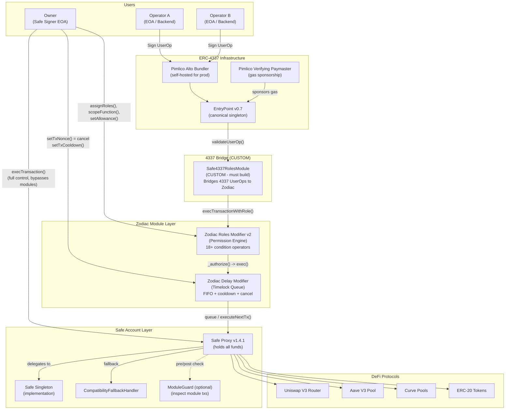
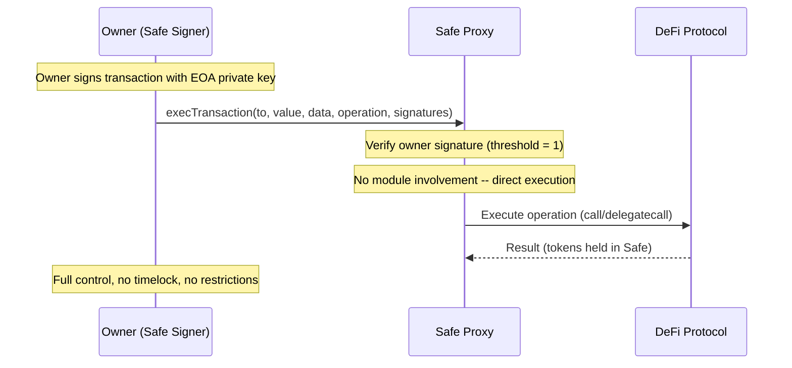
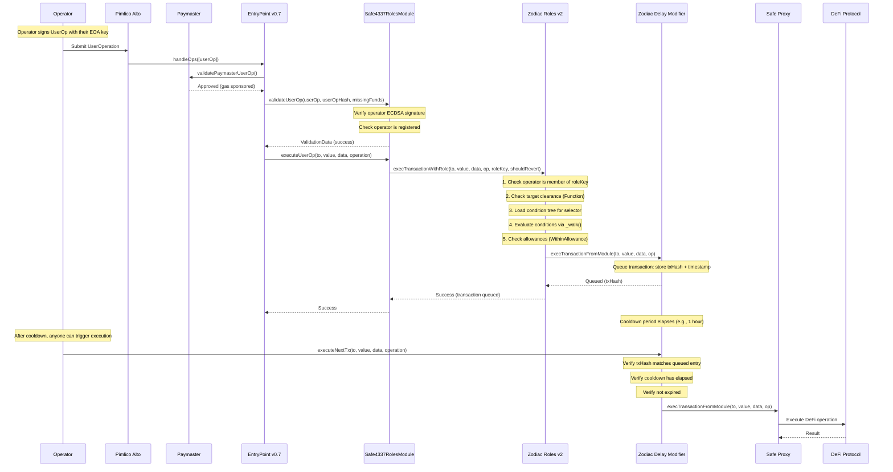
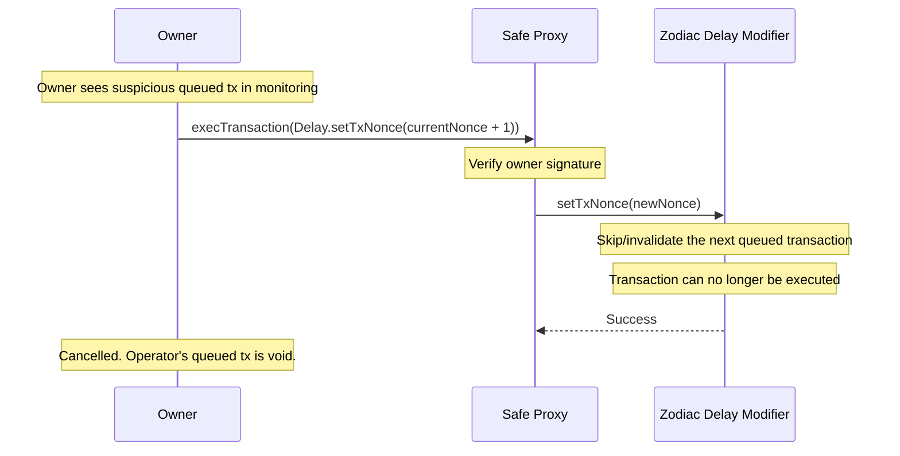
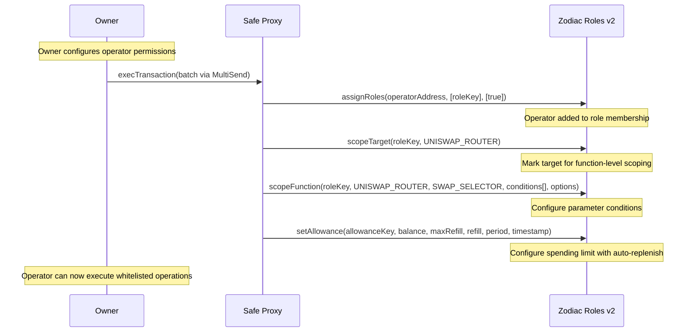
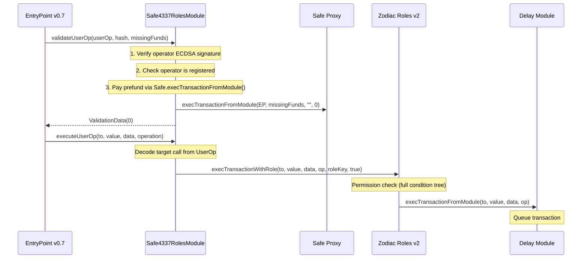

# PRD: Architecture C -- Safe + Zodiac Roles v2 + Delay Module (Conservative / Battle-Tested)

> **Version**: 1.0
> **Date**: February 2026
> **Status**: Draft
> **Authors**: Architecture Team

---

## 1. Executive Summary

### Architecture Name
**ManagedAccount Conservative** -- Safe + Zodiac Roles v2 + Zodiac Delay Module

### Philosophy
Use ONLY battle-tested, production-proven components with real-world track records measured in billions of dollars and years of operation. Safe as the custodial account ($100B+ TVL, 7M+ accounts, 5+ years), Zodiac Roles v2 as the permission engine (proven by ENS, GnosisDAO, Balancer with real treasuries), and Zodiac Delay Module as the timelock mechanism (the ONLY off-the-shelf timelock designed for exactly this use case). No session keys, no beta modules, no bleeding-edge standards. Maximum security pedigree at the cost of gas efficiency and developer experience.

### Summary
This architecture deploys a Safe Proxy (1-of-1 for single-owner, n-of-m for multi-sig) as the custodial smart account that holds all user funds. The owner retains full control via `execTransaction()`. Operators are assigned roles in the Zodiac Roles v2 Modifier, which provides the most expressive on-chain permission engine available: 18+ condition operators, nested AND/OR boolean logic, array conditions (Some/Every/Subset), auto-replenishing allowances, and the built-in `EqualToAvatar` operator that enforces "recipient must be this Safe." Operator transactions flow through Roles (permission check) to the Delay Module (FIFO queue with configurable cooldown), then to the Safe for execution after the cooldown elapses. The owner can cancel any queued transaction by calling `setTxNonce()` on the Delay Module. ERC-4337 gasless UX requires a custom bridge module (Safe4337RolesModule) because Zodiac modules are not natively 4337-compatible -- this is the main engineering challenge and the primary custom component requiring audit.

### Target Users
- **Institutional asset managers** requiring maximum security pedigree and regulatory compliance
- **DAO treasury committees** delegating operations to trusted operators (ENS, GnosisDAO, Balancer already use this exact stack)
- **Conservative DeFi protocols** where security and battle-testing outweigh gas optimization
- **Compliance-focused entities** where every operator action must pass through an on-chain timelock with owner veto rights
- **Organizations migrating from existing Safe multi-sig** setups to delegated execution

### Key Value Proposition
- **Most battle-tested stack**: Safe ($100B+ TVL) + Zodiac Roles v2 (ENS, GnosisDAO, Balancer) + Zodiac Delay (audited by G0 Group)
- **Most expressive permissions**: 18+ condition operators, nested AND/OR, array conditions, auto-replenishing allowances -- no other system matches this
- **Only off-the-shelf timelock**: Zodiac Delay Module provides exactly the FIFO queue + cooldown + owner cancellation we need, with zero custom code
- **Minimal custom code surface**: Only the 4337-to-Zodiac bridge module needs building and auditing; everything else is production-proven
- **Production-validated for this exact use case**: ENS uses Roles v2 to delegate treasury management to operators -- this IS the ManagedAccount use case

---

## 2. Architecture Overview

### 2.1 Component Diagram



### 2.2 Component Inventory

| Component | Source | Audited? | Custom? | License | Status |
|-----------|--------|----------|---------|---------|--------|
| Safe Proxy v1.4.1 | Safe Global | Yes (7+ audits, OpenZeppelin, Ackee, Certora) | No | LGPL-3.0 | Production ($100B+ TVL) |
| Safe Singleton v1.4.1 | Safe Global | Yes | No | LGPL-3.0 | Production |
| SafeProxyFactory | Safe Global | Yes | No | LGPL-3.0 | Production |
| CompatibilityFallbackHandler | Safe Global | Yes | No | LGPL-3.0 | Production |
| Zodiac Roles Modifier v2 | Gnosis Guild | Yes (multiple audits) | No | LGPL-3.0 | Production (ENS, GnosisDAO, Balancer) |
| Zodiac Delay Modifier | Gnosis Guild | Yes (G0 Group) | No | LGPL-3.0 | Production |
| Safe4337Module v0.3 | Safe Global | Yes (OpenZeppelin, Ackee Blockchain) | No | LGPL-3.0 | Production |
| **Safe4337RolesModule** | **Our team** | **Needs audit** | **Yes** | Proprietary | **To build** |
| EntryPoint v0.7 | eth-infinitism | Yes (multiple) | No | GPL-3.0 | Production |
| Pimlico Alto Bundler | Pimlico | N/A (infra) | No | GPL-3.0 | Production |
| Pimlico Verifying Paymaster | Pimlico | Yes | No | MIT | Production |
| zodiac-roles-sdk | Gnosis Guild | N/A (SDK) | No | MIT | Production |
| permissionless.js | Pimlico | N/A (SDK) | No | MIT | Production |
| @safe-global/protocol-kit | Safe Global | N/A (SDK) | No | MIT | Production |

### 2.3 Flow: Owner Direct Execution



Owner transactions bypass ALL modules. The owner calls `execTransaction()` directly on the Safe with a valid signature. No Roles check, no Delay queue, no cooldown. This is the standard Safe multisig flow.

### 2.4 Flow: Operator Delegated Execution (via Roles + Delay)



### 2.5 Flow: Owner Cancels Queued Transaction



### 2.6 Flow: Role Configuration



---

## 3. Smart Account Layer

### 3.1 Safe Proxy Architecture

The Safe is the custodial smart account that holds all user funds. It uses a proxy pattern for gas-efficient deployment.

```
SafeProxy (user's address)
    |
    +-- delegatecall --> SafeSingleton v1.4.1 (shared implementation)
                            |
                            +-- OwnerManager: linked list of owners + threshold
                            +-- ModuleManager: linked list of enabled modules
                            +-- GuardManager: transaction guard + module guard
                            +-- FallbackManager: fallback handler
                            +-- Core: execTransaction, checkSignatures, etc.
```

**Key properties:**

| Property | Value |
|----------|-------|
| Deployment | CREATE2 via SafeProxyFactory (deterministic addresses) |
| Storage | Proxy-local (each Safe has its own storage) |
| Upgradeable | Via `changeMasterCopy()` (owner-controlled) |
| Multi-sig | Configurable threshold (1-of-1 for single-owner, n-of-m for multi-sig) |
| Gas (deployment) | ~280,000 gas (proxy creation + setup) |

**Deployment code:**

```solidity
// SafeProxyFactory deploys a new SafeProxy pointing to the singleton
address safeProxy = safeProxyFactory.createProxyWithNonce(
    safeSingleton,    // singleton address
    initializer,       // Safe.setup() calldata
    saltNonce          // for deterministic address
);

// initializer encodes Safe.setup():
bytes memory initializer = abi.encodeWithSelector(
    Safe.setup.selector,
    owners,            // [ownerAddress] for 1-of-1
    threshold,         // 1 for single-owner
    to,                // address(0) or module setup contract
    data,              // module setup calldata
    fallbackHandler,   // CompatibilityFallbackHandler address
    paymentToken,      // address(0) for no payment
    payment,           // 0 for no payment
    paymentReceiver    // address(0)
);
```

### 3.2 ModuleManager: Enabling Zodiac Modules

The Safe's ModuleManager maintains a singly-linked list of enabled modules. Modules can call `execTransactionFromModule()` to execute transactions as the Safe.

```solidity
// ModuleManager.sol -- key data structure
mapping(address => address) internal modules;
// Sentinel-based linked list: SENTINEL -> Module1 -> Module2 -> SENTINEL

// Enabling a module (owner-only via execTransaction)
function enableModule(address module) public authorized {
    require(module != address(0) && module != SENTINEL_MODULES);
    require(modules[module] == address(0)); // not already enabled
    modules[module] = modules[SENTINEL_MODULES];
    modules[SENTINEL_MODULES] = module;
    emit EnabledModule(module);
}
```

**For ManagedAccount, we enable these modules on the Safe:**

```
Safe.modules linked list:
  SENTINEL -> Safe4337RolesModule -> Delay Modifier -> SENTINEL

Delay Modifier:
  - Enabled as a module on the Safe (can call Safe.execTransactionFromModule())
  - Avatar = Safe address
  - Target = Safe address

Roles Modifier:
  - Enabled as a module on the Delay Modifier (NOT directly on the Safe)
  - Avatar = Safe address (for EqualToAvatar resolution)
  - Target = Delay address (calls go through Delay)

Safe4337RolesModule:
  - Enabled as a module on the Safe (for gas prefund)
  - Registered as a member on Roles (so it can call execTransactionWithRole)
  - Calls Roles.execTransactionWithRole() for operator operations
```

**Module chain:**
```
Safe4337RolesModule -> Roles Modifier -> Delay Modifier -> Safe -> DeFi
```

### 3.3 Guard System

The Safe supports two types of guards:

**Transaction Guard** (checked on `execTransaction`):
```solidity
// Safe.sol -- guard check on direct owner transactions
function execTransaction(...) public payable returns (bool success) {
    // Pre-check
    if (guard != address(0)) {
        Guard(guard).checkTransaction(to, value, data, operation, ...);
    }

    success = execute(to, value, data, operation, gasleft());

    // Post-check
    if (guard != address(0)) {
        Guard(guard).checkAfterExecution(txHash, success);
    }
}
```

**Module Guard** (checked on `execTransactionFromModule`):
```solidity
// ModuleManager.sol v1.4.1 -- module guard support
function preModuleExecution(
    address to, uint256 value, bytes memory data, Enum.Operation operation
) internal returns (address guard, bytes32 guardHash) {
    guard = getModuleGuard();
    if (guard != address(0)) {
        guardHash = IModuleGuard(guard).checkModuleTransaction(
            to, value, data, operation, msg.sender
        );
    }
}
```

For ManagedAccount, we can optionally deploy a ModuleGuard that:
- Logs all module transactions for audit trail
- Enforces additional safety checks (e.g., no `delegatecall` from modules)
- Provides an emergency kill-switch (owner can set guard that blocks all module calls)

### 3.4 MultiSend for Batching

Since Zodiac modules don't natively support batched operations, we use the Safe `MultiSend` contract for batching. The Roles Modifier has built-in MultiSend unwrapping support -- it can decode a MultiSend call and check permissions for each sub-transaction individually.

```solidity
// MultiSend.sol -- batch multiple transactions
function multiSend(bytes memory transactions) public payable {
    assembly {
        let length := mload(transactions)
        let i := 0x20
        for { } lt(i, length) { } {
            let operation := shr(0xf8, mload(add(transactions, i)))
            let to := shr(0x60, mload(add(transactions, add(i, 0x01))))
            let value := mload(add(transactions, add(i, 0x15)))
            let dataLength := mload(add(transactions, add(i, 0x35)))
            let data := add(transactions, add(i, 0x55))
            let success := 0
            switch operation
            case 0 { success := call(gas(), to, value, data, dataLength, 0, 0) }
            case 1 { success := delegatecall(gas(), to, data, dataLength, 0, 0) }
            if eq(success, 0) { revert(0, 0) }
            i := add(i, add(0x55, dataLength))
        }
    }
}
```

**Roles v2 MultiSend unwrapping** (`PermissionChecker.sol`):

When an operator submits a MultiSend call through Roles, the `_authorize()` function detects the MultiSend target and unwraps the encoded transactions. Each sub-transaction is then individually checked against the role's permission tree. This means:

- An operator CAN batch multiple allowed operations in a single transaction
- Each sub-transaction is independently permission-checked
- If ANY sub-transaction fails permission checks, the entire batch is rejected
- This is NOT native batching -- it requires wrapping calls in MultiSend encoding

**Gas overhead for MultiSend batching:** ~15,000-25,000 additional gas for MultiSend encoding + per-sub-transaction Roles checking.

---

## 4. Permission System: Zodiac Roles v2 Deep Dive

### 4.1 Architecture

Zodiac Roles v2 is the most expressive on-chain permission engine available in the Ethereum ecosystem. It is a Zodiac Modifier that sits between callers (operators) and the target (Delay Modifier or Safe), enforcing granular access control on every transaction.

**Inheritance chain:**
```
Roles
  +-- Modifier (Zodiac base: module interface + own module linked list)
  +-- AllowanceTracker (rate/threshold limits)
  +-- PermissionBuilder (configure permissions)
  +-- PermissionChecker (enforce permissions at runtime)
  +-- PermissionLoader (load stored permission trees from storage)
```

### 4.2 Data Model

#### Role Structure

```solidity
// Types.sol:142-146
struct Role {
    mapping(address => bool) members;            // who has this role
    mapping(address => TargetAddress) targets;   // target clearance levels
    mapping(bytes32 => bytes32) scopeConfig;     // function-level scoping
}
```

#### Target Clearance Levels

```solidity
// Types.sol:114-118
enum Clearance {
    None,      // target not allowed -- transaction REJECTED
    Target,    // any function on target allowed (wildcarded)
    Function   // only specific scoped functions allowed
}
```

#### Execution Options

```solidity
// Types.sol:107-112
enum ExecutionOptions {
    None,          // no value transfer, no delegatecall
    Send,          // value transfer allowed
    DelegateCall,  // delegatecall allowed
    Both           // both allowed
}
```

#### Target Address Metadata

```solidity
// Types.sol:120-125
struct TargetAddress {
    Clearance clearance;       // None, Target, or Function
    ExecutionOptions options;  // What execution types are allowed
}
```

### 4.3 Condition System -- 18+ Operators

The condition system is a tree-based expression evaluator. Conditions are stored as flattened trees and reconstructed at runtime for evaluation.

```solidity
// Types.sol:48-105
enum Operator {
    // --- Default ---
    Pass,                    // Always passes (no check on this parameter)

    // --- Logical Combinators ---
    And,                     // ALL children must pass
    Or,                      // At least ONE child must pass
    Nor,                     // NO child must pass (negated OR)

    // --- Structural Matching ---
    Matches,                 // Structural match for tuple/array fields

    // --- Array Conditions ---
    ArraySome,               // At least one array element passes child conditions
    ArrayEvery,              // ALL array elements pass child conditions
    ArraySubset,             // Matched elements form a subset of allowed values

    // --- Special Comparison ---
    EqualToAvatar,           // Value must equal the avatar (Safe) address

    // --- Value Comparisons ---
    EqualTo,                 // Exact match (keccak256 for dynamic types)
    GreaterThan,             // Unsigned integer greater than
    LessThan,                // Unsigned integer less than
    SignedIntGreaterThan,    // Signed integer greater than
    SignedIntLessThan,       // Signed integer less than

    // --- Bitwise ---
    Bitmask,                 // Bitwise mask check: (value & mask) == expected

    // --- External Validation ---
    Custom,                  // Delegate to external ICustomCondition contract

    // --- Spending Limits (Allowance-Based) ---
    WithinAllowance,         // Parameter value within allowance budget
    EtherWithinAllowance,    // ETH msg.value within allowance
    CallWithinAllowance      // Call count within allowance
}
```

#### Condition Flat Structure (Storage)

```solidity
// Types.sol:123-128
struct ConditionFlat {
    uint8 parent;           // Parent node index in the tree
    AbiType paramType;      // Static, Dynamic, Tuple, Array, etc.
    Operator operator;      // Comparison operator
    bytes compValue;        // Comparison value (operator-specific)
}
```

At runtime, flattened conditions are reconstructed into recursive `Condition` structs and evaluated by the `_walk()` function in `PermissionChecker.sol`.

#### ABI Type System

```solidity
enum AbiType {
    Static,     // Fixed-size types (uint256, address, bool, bytes32)
    Dynamic,    // Variable-length types (bytes, string)
    Tuple,      // Struct types (decoded recursively)
    Array,      // Dynamic arrays
    AbiEncoded  // abi.encode() wrapped data
}
```

### 4.4 Detailed Operator Descriptions

| Operator | Input Type | Description | Use Case |
|----------|-----------|-------------|----------|
| `Pass` | Any | No check -- always passes | Skip validation for a parameter |
| `And` | Children | All child conditions must evaluate to true | Combine multiple checks: `tokenIn == USDC AND amount < 10000` |
| `Or` | Children | At least one child must evaluate to true | Allow multiple valid values: `token == USDC OR token == DAI` |
| `Nor` | Children | No child may evaluate to true | Blacklist: `NOT (token == UNSAFE_TOKEN)` |
| `Matches` | Tuple/Array | Structural match for nested types | Map conditions onto struct fields |
| `ArraySome` | Array | At least one element satisfies the condition | "At least one token in the path is USDC" |
| `ArrayEvery` | Array | Every element satisfies the condition | "All tokens in the batch are whitelisted" |
| `ArraySubset` | Array | Elements form a subset of allowed set | "Tokens used are a subset of {USDC, WETH, DAI}" |
| `EqualToAvatar` | Static | Value must equal the Safe (avatar) address | **"Recipient must be this Safe"** -- purpose-built |
| `EqualTo` | Any | Exact equality (keccak256 for dynamic types) | Token address, recipient address |
| `GreaterThan` | Static | `value > compValue` (uint) | Minimum amount checks |
| `LessThan` | Static | `value < compValue` (uint) | Maximum amount checks |
| `SignedIntGreaterThan` | Static | `int(value) > int(compValue)` | Signed integer min bounds |
| `SignedIntLessThan` | Static | `int(value) < int(compValue)` | Signed integer max bounds |
| `Bitmask` | Static | `(value & mask) == expected` | Flag/bitfield validation |
| `Custom` | Any | Delegate to `ICustomCondition` contract | Oracle price checks, dynamic validation |
| `WithinAllowance` | Static | Parameter value within allowance budget | Daily spending limits (auto-replenishing) |
| `EtherWithinAllowance` | N/A | ETH msg.value within allowance | ETH transfer limits |
| `CallWithinAllowance` | N/A | Call count within allowance | Rate limiting (max N calls per day) |

### 4.5 Nested Boolean Logic

Unlike SmartSession (AND-only via multiple policies) or Kernel (flat policy array), Zodiac Roles v2 supports arbitrary nesting of AND/OR/NOR conditions:

```
Example: Allow swap if:
  (tokenIn == USDC OR tokenIn == DAI)
  AND
  (amountIn <= 50000e6)
  AND
  (recipient == Safe address)

Condition Tree:
  AND [root]
   +-- OR
   |    +-- EqualTo(tokenIn, USDC)
   |    +-- EqualTo(tokenIn, DAI)
   +-- LessThan(amountIn, 50000e6)
   +-- EqualToAvatar(recipient)
```

**Encoded as ConditionFlat array:**

```solidity
ConditionFlat[] memory conditions = new ConditionFlat[](7);

// [0] Root: AND (matches function params as tuple)
conditions[0] = ConditionFlat({
    parent: 0, paramType: AbiType.Tuple, operator: Operator.Matches, compValue: ""
});

// [1] First param group: OR (tokenIn options)
conditions[1] = ConditionFlat({
    parent: 0, paramType: AbiType.Static, operator: Operator.Or, compValue: ""
});

// [2] tokenIn == USDC
conditions[2] = ConditionFlat({
    parent: 1, paramType: AbiType.Static, operator: Operator.EqualTo,
    compValue: abi.encode(USDC_ADDRESS)
});

// [3] tokenIn == DAI
conditions[3] = ConditionFlat({
    parent: 1, paramType: AbiType.Static, operator: Operator.EqualTo,
    compValue: abi.encode(DAI_ADDRESS)
});

// [4] amountIn < 50000e6
conditions[4] = ConditionFlat({
    parent: 0, paramType: AbiType.Static, operator: Operator.LessThan,
    compValue: abi.encode(50000e6)
});

// [5] fee: Pass (no check)
conditions[5] = ConditionFlat({
    parent: 0, paramType: AbiType.Static, operator: Operator.Pass, compValue: ""
});

// [6] recipient == Safe (EqualToAvatar)
conditions[6] = ConditionFlat({
    parent: 0, paramType: AbiType.Static, operator: Operator.EqualToAvatar, compValue: ""
});
```

### 4.6 Array Conditions

Zodiac Roles v2 is the ONLY permission system that supports array-level conditions:

**ArraySome** -- "At least one element in the array matches":
```
Use case: In a multi-hop swap path, at least one token must be USDC
ArraySome(path) -> EqualTo(element, USDC)
```

**ArrayEvery** -- "All elements in the array match":
```
Use case: In a batch operation, all target addresses must be whitelisted
ArrayEvery(targets) -> Or(EqualTo(UNISWAP), EqualTo(AAVE), EqualTo(CURVE))
```

**ArraySubset** -- "Array elements form a subset of allowed values":
```
Use case: All tokens in the operation must be from the approved token list
ArraySubset(tokens) -> allowed set {USDC, WETH, DAI, WBTC}
```

No other permission system (SmartSession, Kernel Policies, ERC-7710 Caveats) supports these array-level conditions natively.

### 4.7 Allowance System (Auto-Replenishing)

The allowance system is a key differentiator. It provides spending limits that automatically replenish over time.

```solidity
// Types.sol:148-160
struct Allowance {
    uint128 refill;      // Amount added each period
    uint128 maxRefill;   // Cap for balance after refill
    uint64 period;       // Seconds between refills (0 = one-time budget)
    uint128 balance;     // Current available balance
    uint64 timestamp;    // Last refill time
}
```

**Allowance types:**

| Type | Operator | Description |
|------|----------|-------------|
| Token spending | `WithinAllowance` | Track parameter value against budget (e.g., amountIn) |
| ETH spending | `EtherWithinAllowance` | Track msg.value against budget |
| Call counting | `CallWithinAllowance` | Track call count against budget |

**Configuration example -- 10,000 USDC per day:**

```solidity
// Set daily allowance: 10000 USDC, replenishes every 86400 seconds
bytes32 DAILY_SWAP_ALLOWANCE = keccak256("daily-swap-usdc");

roles.setAllowance(
    DAILY_SWAP_ALLOWANCE,
    10000e6,    // balance: initial balance
    10000e6,    // maxRefill: maximum balance after refill
    10000e6,    // refill: amount added each period
    86400,      // period: 1 day in seconds
    0           // timestamp: start immediately
);
```

**How auto-replenishment works:**
1. Operator submits a swap for 3000 USDC
2. Roles checks: current balance = 10000, consumption = 3000, new balance = 7000. Passes.
3. 6 hours later, operator submits another swap for 5000 USDC
4. Roles checks: balance = 7000, consumption = 5000, new balance = 2000. Passes.
5. 2 hours later, operator tries to swap 5000 USDC
6. Roles checks: balance = 2000, consumption = 5000. **REJECTED** (insufficient allowance).
7. Next day, balance refills to 10000 USDC automatically.

**Transactional allowance consumption:**
If the inner DeFi transaction reverts, consumed allowances are automatically restored. This is handled by `_flushCommit()` in the AllowanceTracker:

```solidity
// AllowanceTracker.sol -- simplified
function _flushCommit(bool success) internal {
    if (!success) {
        // Restore all consumed allowances
        for (uint i = 0; i < pendingConsumptions.length; i++) {
            allowances[pendingConsumptions[i].key].balance += pendingConsumptions[i].amount;
        }
    }
    delete pendingConsumptions;
}
```

### 4.8 Custom Conditions (External Validators)

The `Custom` operator delegates validation to an external contract implementing `ICustomCondition`:

```solidity
// ICustomCondition.sol
interface ICustomCondition {
    function check(
        address to,
        uint256 value,
        bytes calldata data,
        Enum.Operation operation,
        uint256 location,   // parameter offset in calldata
        uint256 size,       // parameter size
        bytes calldata extra // additional context
    ) external view returns (bool success, bytes32 info);
}
```

**Use cases for custom conditions:**
- **Oracle price checks**: Verify that a swap price is within acceptable bounds
- **Token balance requirements**: Ensure the Safe has sufficient collateral before lending
- **Time-weighted checks**: Enforce TWAP-based price validation
- **Cross-protocol checks**: Verify Aave health factor before withdrawal
- **KYC/compliance checks**: Verify on-chain attestations

**Example -- Oracle price check:**

```solidity
contract OraclePriceCondition is ICustomCondition {
    AggregatorV3Interface public immutable priceFeed;
    uint256 public immutable maxSlippageBps;

    function check(
        address, uint256, bytes calldata data, Enum.Operation,
        uint256 location, uint256 size, bytes calldata
    ) external view returns (bool, bytes32) {
        // Decode amountOutMinimum from calldata
        uint256 amountOutMin = abi.decode(data[location:location+size], (uint256));

        // Get oracle price
        (, int256 price,,,) = priceFeed.latestRoundData();

        // Calculate expected minimum output
        uint256 expectedMin = calculateExpectedMin(price, maxSlippageBps);

        if (amountOutMin >= expectedMin) {
            return (true, bytes32(0));
        }
        return (false, bytes32("slippage too high"));
    }
}
```

### 4.9 Permission Configuration Examples

#### Example 1: Uniswap V3 exactInputSingle

```solidity
bytes32 OPERATOR_ROLE = bytes32(uint256(1));

// Step 1: Assign operator to role
roles.assignRoles(operatorAddress, _asUint16Array(OPERATOR_ROLE), _asBoolArray(true));

// Step 2: Scope the target
roles.scopeTarget(OPERATOR_ROLE, UNISWAP_V3_ROUTER);

// Step 3: Build condition tree for exactInputSingle
// Function: exactInputSingle(ExactInputSingleParams)
// ExactInputSingleParams = (address tokenIn, address tokenOut, uint24 fee,
//                           address recipient, uint256 amountIn,
//                           uint256 amountOutMinimum, uint160 sqrtPriceLimitX96)

ConditionFlat[] memory conditions = new ConditionFlat[](12);

// [0] Root: Matches (maps to function params as tuple)
conditions[0] = ConditionFlat({
    parent: 0, paramType: AbiType.Tuple, operator: Operator.Matches, compValue: ""
});

// [1] tokenIn: OR (USDC or WETH)
conditions[1] = ConditionFlat({
    parent: 0, paramType: AbiType.Static, operator: Operator.Or, compValue: ""
});
conditions[2] = ConditionFlat({
    parent: 1, paramType: AbiType.Static, operator: Operator.EqualTo,
    compValue: abi.encode(USDC)
});
conditions[3] = ConditionFlat({
    parent: 1, paramType: AbiType.Static, operator: Operator.EqualTo,
    compValue: abi.encode(WETH)
});

// [4] tokenOut: OR (USDC or WETH)
conditions[4] = ConditionFlat({
    parent: 0, paramType: AbiType.Static, operator: Operator.Or, compValue: ""
});
conditions[5] = ConditionFlat({
    parent: 4, paramType: AbiType.Static, operator: Operator.EqualTo,
    compValue: abi.encode(USDC)
});
conditions[6] = ConditionFlat({
    parent: 4, paramType: AbiType.Static, operator: Operator.EqualTo,
    compValue: abi.encode(WETH)
});

// [7] fee: Pass (any fee tier)
conditions[7] = ConditionFlat({
    parent: 0, paramType: AbiType.Static, operator: Operator.Pass, compValue: ""
});

// [8] recipient: EqualToAvatar (must be the Safe)
conditions[8] = ConditionFlat({
    parent: 0, paramType: AbiType.Static, operator: Operator.EqualToAvatar, compValue: ""
});

// [9] amountIn: WithinAllowance (daily spending limit)
conditions[9] = ConditionFlat({
    parent: 0, paramType: AbiType.Static, operator: Operator.WithinAllowance,
    compValue: abi.encode(DAILY_SWAP_ALLOWANCE)
});

// [10] amountOutMinimum: Pass (no check -- slippage managed off-chain)
conditions[10] = ConditionFlat({
    parent: 0, paramType: AbiType.Static, operator: Operator.Pass, compValue: ""
});

// [11] sqrtPriceLimitX96: Pass
conditions[11] = ConditionFlat({
    parent: 0, paramType: AbiType.Static, operator: Operator.Pass, compValue: ""
});

// Step 4: Apply conditions to function
roles.scopeFunction(
    OPERATOR_ROLE,
    UNISWAP_V3_ROUTER,
    bytes4(keccak256("exactInputSingle((address,address,uint24,address,uint256,uint256,uint160))")),
    conditions,
    ExecutionOptions.None  // no ETH value, no delegatecall
);

// Step 5: Set daily allowance
roles.setAllowance(DAILY_SWAP_ALLOWANCE, 50000e6, 50000e6, 50000e6, 86400, 0);
```

#### Example 2: Aave V3 Supply

```solidity
// supply(address asset, uint256 amount, address onBehalfOf, uint16 referralCode)

ConditionFlat[] memory conditions = new ConditionFlat[](7);

conditions[0] = ConditionFlat({
    parent: 0, paramType: AbiType.Tuple, operator: Operator.Matches, compValue: ""
});

// asset: OR (USDC or WETH)
conditions[1] = ConditionFlat({
    parent: 0, paramType: AbiType.Static, operator: Operator.Or, compValue: ""
});
conditions[2] = ConditionFlat({
    parent: 1, paramType: AbiType.Static, operator: Operator.EqualTo,
    compValue: abi.encode(USDC)
});
conditions[3] = ConditionFlat({
    parent: 1, paramType: AbiType.Static, operator: Operator.EqualTo,
    compValue: abi.encode(WETH)
});

// amount: WithinAllowance
conditions[4] = ConditionFlat({
    parent: 0, paramType: AbiType.Static, operator: Operator.WithinAllowance,
    compValue: abi.encode(DAILY_SUPPLY_ALLOWANCE)
});

// onBehalfOf: EqualToAvatar (must supply to this Safe)
conditions[5] = ConditionFlat({
    parent: 0, paramType: AbiType.Static, operator: Operator.EqualToAvatar, compValue: ""
});

// referralCode: Pass
conditions[6] = ConditionFlat({
    parent: 0, paramType: AbiType.Static, operator: Operator.Pass, compValue: ""
});

roles.scopeFunction(
    OPERATOR_ROLE,
    AAVE_V3_POOL,
    bytes4(keccak256("supply(address,uint256,address,uint16)")),
    conditions,
    ExecutionOptions.None
);
```

#### Example 3: ERC-20 Approve (Restricted Spenders)

```solidity
// approve(address spender, uint256 amount)

ConditionFlat[] memory conditions = new ConditionFlat[](5);

conditions[0] = ConditionFlat({
    parent: 0, paramType: AbiType.Tuple, operator: Operator.Matches, compValue: ""
});

// spender: OR (only approved protocol contracts)
conditions[1] = ConditionFlat({
    parent: 0, paramType: AbiType.Static, operator: Operator.Or, compValue: ""
});
conditions[2] = ConditionFlat({
    parent: 1, paramType: AbiType.Static, operator: Operator.EqualTo,
    compValue: abi.encode(UNISWAP_V3_ROUTER)
});
conditions[3] = ConditionFlat({
    parent: 1, paramType: AbiType.Static, operator: Operator.EqualTo,
    compValue: abi.encode(AAVE_V3_POOL)
});

// amount: LessThan (max approval)
conditions[4] = ConditionFlat({
    parent: 0, paramType: AbiType.Static, operator: Operator.LessThan,
    compValue: abi.encode(type(uint128).max)  // max approval cap
});

// Apply to each token contract
for (uint i = 0; i < allowedTokens.length; i++) {
    roles.scopeTarget(OPERATOR_ROLE, allowedTokens[i]);
    roles.scopeFunction(
        OPERATOR_ROLE,
        allowedTokens[i],
        IERC20.approve.selector,
        conditions,
        ExecutionOptions.None
    );
}
```

### 4.10 Authorization Flow (Runtime)

`PermissionChecker._authorize()` is called for every operator transaction:

```
1. Verify roleKey is non-zero
2. Verify msg.sender (operator / bridge module) is a member of the role
3. Check for MultiSend unwrapper (batch handling)
4. For each (unwrapped) transaction:
   a. Load TargetAddress for the target contract
   b. If Clearance.None -> REJECT
   c. If Clearance.Target -> check ExecutionOptions only (wildcarded)
   d. If Clearance.Function -> load scopeConfig for selector
      i.   Check ExecutionOptions (value, delegatecall)
      ii.  Load condition tree from storage
      iii. Reconstruct ConditionFlat[] -> recursive Condition struct
      iv.  Call _walk(condition, calldata, context) recursively
      v.   For each leaf condition: evaluate operator (EqualTo, LessThan, etc.)
      vi.  For allowance conditions: consume from allowance tracker
      vii. If all conditions pass -> ALLOW, otherwise -> REJECT
5. If all (unwrapped) transactions pass -> execute on target
6. If any condition consumed allowances and execution fails -> restore allowances
```

**Gas cost of authorization:**

| Scenario | Gas Overhead |
|----------|-------------|
| Role membership check | ~2,500 |
| Target clearance (wildcarded) | ~3,000 |
| Function scope (no conditions) | ~5,000 |
| 1 EqualTo condition | ~8,000-12,000 |
| Complex tree (5+ conditions) | ~20,000-40,000 |
| Allowance check + update | ~8,000-15,000 |
| Custom condition (external call) | ~10,000+ |

---

## 5. Timelock Mechanism: Zodiac Delay Module

### 5.1 Architecture

The Zodiac Delay Modifier is the ONLY off-the-shelf timelock that provides exactly the FIFO queue + configurable cooldown + owner cancellation pattern required for ManagedAccount.

```
Delay Modifier State:
+---------------------------------------------+
| txCooldown: uint256 (e.g., 86400 = 24h)    |
| txExpiration: uint256 (e.g., 604800 = 7d)   |
| txNonce: uint256 (current queue position)    |
| queueNonce: uint256 (next queue slot)        |
|                                              |
| txHash[nonce] => bytes32 (queued tx hash)    |
| txCreatedAt[nonce] => uint256 (timestamp)    |
+---------------------------------------------+
```

### 5.2 FIFO Transaction Queue

The Delay Module maintains a FIFO (First-In, First-Out) queue of pending transactions. Transactions must be executed in the order they were queued.

```
Queue Example:
  nonce 0: swap USDC->WETH (queued at t=0, ready at t=86400)
  nonce 1: supply WETH to Aave (queued at t=3600, ready at t=90000)
  nonce 2: approve USDC for Curve (queued at t=7200, ready at t=93600)

  txNonce = 0 (next to execute)
  queueNonce = 3 (next to queue)
```

### 5.3 Key Parameters

| Parameter | Type | Description | Recommended Value |
|-----------|------|-------------|-------------------|
| `txCooldown` | uint256 | Seconds between queue and earliest execution | 3600 (1 hour) to 86400 (24 hours) |
| `txExpiration` | uint256 | Seconds after cooldown during which execution is valid. 0 = no expiration | 604800 (7 days) or 0 |
| `txNonce` | uint256 | Current execution position in FIFO queue | Auto-incremented |
| `queueNonce` | uint256 | Next queue position for incoming transactions | Auto-incremented |

### 5.4 Queue Operations

**Queuing (automatic when module calls `execTransactionFromModule`):**

```solidity
// Delay.sol -- simplified
function execTransactionFromModule(
    address to, uint256 value, bytes memory data, Enum.Operation operation
) public override moduleOnly returns (bool success) {
    bytes32 hash = getTransactionHash(to, value, data, operation);
    txHash[queueNonce] = hash;
    txCreatedAt[queueNonce] = block.timestamp;
    queueNonce++;
    emit TransactionAdded(queueNonce - 1, hash, to, value, data, operation);
    success = true;
}
```

**Execution (called by anyone after cooldown):**

```solidity
function executeNextTx(
    address to, uint256 value, bytes memory data, Enum.Operation operation
) public {
    require(txNonce < queueNonce, "Queue empty");

    bytes32 hash = getTransactionHash(to, value, data, operation);
    require(txHash[txNonce] == hash, "Hash mismatch");

    uint256 createdAt = txCreatedAt[txNonce];
    require(block.timestamp >= createdAt + txCooldown, "Cooldown not elapsed");

    if (txExpiration > 0) {
        require(
            block.timestamp <= createdAt + txCooldown + txExpiration,
            "Transaction expired"
        );
    }

    txNonce++;

    // Execute on the target (Safe)
    require(exec(to, value, data, operation), "Execution failed");
}
```

**Cancellation (owner only, via Safe):**

```solidity
function setTxNonce(uint256 _nonce) public onlyOwner {
    require(_nonce > txNonce, "Nonce must increase");
    require(_nonce <= queueNonce, "Cannot skip past queue");
    txNonce = _nonce;
}
```

Calling `setTxNonce(txNonce + 1)` skips/cancels the next queued transaction. To cancel multiple transactions, set `_nonce` to a higher value.

### 5.5 Owner Cancellation Flow

```
1. Owner monitors queued transactions (off-chain monitoring)
2. Owner detects suspicious transaction at nonce N
3. Owner submits Safe transaction:
   Safe.execTransaction(
     to: DelayModifier,
     data: setTxNonce.encode(N + 1)
   )
4. Delay.txNonce is now N+1, so nonce N is skipped
5. Transaction at nonce N can never be executed
6. Transactions at nonce N+1 onwards are unaffected
```

**Key behavior:**
- Cancellation is INSTANT (single owner transaction)
- Only the NEXT transaction in the queue can be cancelled by incrementing nonce by 1
- To cancel ALL queued transactions, set `txNonce = queueNonce`
- Cancellation does NOT affect transactions already past their cooldown but not yet executed (they are just skipped by nonce advancement)

### 5.6 Comparison with Custom TimelockHook (Architecture A/B)

| Feature | Zodiac Delay Module | Custom ManagedAccountTimelockHook |
|---------|--------------------|------------------------------------|
| Queue model | FIFO (sequential) | Hash-based (any-order) |
| Cancel mechanism | `setTxNonce()` (skip by nonce) | `cancelExecution(execHash)` (by hash) |
| Owner bypass | Not built-in (owner uses `execTransaction` directly on Safe) | Built-in (hook detects owner) |
| Selective timelock | Not built-in (all module txs go through Delay) | Per-selector configuration |
| Off-the-shelf | Yes -- zero custom code | No -- must build and audit |
| Audited | Yes (G0 Group) | No -- needs audit |
| Expiration | Yes (configurable) | Yes (configurable) |
| Gas (queue) | ~45,000 | ~45,000 |
| Gas (execute) | ~35,000 | ~25,000 |

**Key tradeoff:** The Zodiac Delay Module requires NO custom code but has a rigid FIFO queue (no selective timelock, no owner bypass via hook). The custom TimelockHook is more flexible but requires development and audit.

### 5.7 Selective Timelock Strategy

Since the Delay Module applies to ALL transactions from its upstream modules, and there is no per-selector bypass, we implement selectivity at the architecture level:

**Option 1: Dual-path routing**
```
Operator (immediate operations):
  Safe4337RolesModule -> Roles (permission check) -> Safe (direct, no delay)

Operator (timelocked operations):
  Safe4337RolesModule -> Roles (permission check) -> Delay -> Safe (after cooldown)
```

This requires two Roles instances or two role keys -- one routing through Delay, one routing directly to the Safe.

**Option 2: Single path with short cooldown**
```
All operator operations go through Delay with short cooldown:
  txCooldown = 300 (5 minutes) for routine operations
```

Unfortunately, the Delay Module has a single `txCooldown` value per instance. To support different cooldowns, deploy multiple Delay Module instances.

**Option 3 (Recommended): Accept uniform timelock**
```
Accept a single cooldown period (e.g., 1 hour) for ALL operator operations.
Trade off: no immediate execution for operators.
Benefit: simpler architecture, no dual-path complexity.
```

For time-sensitive operations (e.g., swaps), the operator queues the transaction and anyone executes it after the cooldown. The 1-hour delay means price-sensitive operations need wider slippage tolerances.

---

## 6. Gasless UX (ERC-4337 Integration)

### 6.1 The Core Challenge

Zodiac modules use `execTransactionFromModule()` as their native execution interface. ERC-4337 uses `validateUserOp()` + `executeUserOp()`. These two models are fundamentally incompatible:

- **Safe4337Module** (standard): Validates owner signatures and calls `Safe.execTransactionFromModule()` directly. Does NOT route through Roles.
- **Zodiac Roles**: Expects callers to call `Roles.execTransactionWithRole()` or `Roles.execTransactionFromModule()`. Does NOT understand UserOps.

**The gap:** No existing module bridges 4337 UserOps to Zodiac Roles execution.

### 6.2 Solution: Custom Safe4337RolesModule

We build a custom module that combines the 4337 validation interface with Zodiac Roles routing:



### 6.3 Safe4337RolesModule Specification

```solidity
// SPDX-License-Identifier: BUSL-1.1
pragma solidity ^0.8.26;

import { IAccount } from "account-abstraction/interfaces/IAccount.sol";
import { PackedUserOperation } from "account-abstraction/interfaces/PackedUserOperation.sol";
import { ISafe } from "safe-contracts/interfaces/ISafe.sol";
import { IRoles } from "zodiac-modifier-roles/contracts/interfaces/IRoles.sol";

/// @title Safe4337RolesModule
/// @notice Bridges ERC-4337 UserOperations to Zodiac Roles execution pipeline.
///         Installed as a Safe module (for gas prefund) and as a module on the
///         Roles Modifier (for permission-checked execution).
/// @dev This is the ONLY custom Solidity contract required for Architecture C.
///      All other components (Safe, Roles, Delay) are off-the-shelf.

contract Safe4337RolesModule is IAccount {

    // ──────────────────────────────────────────────
    // Constants
    // ──────────────────────────────────────────────

    /// @notice The ERC-4337 EntryPoint address (immutable)
    address public immutable ENTRY_POINT;

    /// @notice The Safe proxy address this module serves
    address public immutable SAFE;

    /// @notice The Zodiac Roles Modifier address
    address public immutable ROLES;

    // ──────────────────────────────────────────────
    // Storage
    // ──────────────────────────────────────────────

    /// @notice Registered operators: address => roleKey
    mapping(address => bytes32) public operatorRoles;

    /// @notice Registered operators: address => registered
    mapping(address => bool) public isOperator;

    /// @notice Owner of this module (should be the Safe)
    address public owner;

    // ──────────────────────────────────────────────
    // Events
    // ──────────────────────────────────────────────

    event OperatorRegistered(address indexed operator, bytes32 roleKey);
    event OperatorRemoved(address indexed operator);
    event OperatorExecutionRouted(
        address indexed operator,
        address indexed target,
        bytes4 selector,
        uint256 value
    );

    // ──────────────────────────────────────────────
    // Errors
    // ──────────────────────────────────────────────

    error InvalidEntryPoint();
    error OperatorNotRegistered(address operator);
    error InvalidSignature();
    error NotOwner();
    error ExecutionFailed();

    // ──────────────────────────────────────────────
    // Modifiers
    // ──────────────────────────────────────────────

    modifier onlyEntryPoint() {
        if (msg.sender != ENTRY_POINT) revert InvalidEntryPoint();
        _;
    }

    modifier onlyOwner() {
        if (msg.sender != owner) revert NotOwner();
        _;
    }

    // ──────────────────────────────────────────────
    // Constructor
    // ──────────────────────────────────────────────

    constructor(address entryPoint, address safe, address roles) {
        ENTRY_POINT = entryPoint;
        SAFE = safe;
        ROLES = roles;
        owner = safe; // Safe is the owner (controls operator registration)
    }

    // ──────────────────────────────────────────────
    // Operator Management (called by Safe via execTransaction)
    // ──────────────────────────────────────────────

    /// @notice Register an operator with a role key
    /// @param operator The operator EOA address
    /// @param roleKey The Zodiac Roles role key assigned to this operator
    function registerOperator(address operator, bytes32 roleKey) external onlyOwner {
        operatorRoles[operator] = roleKey;
        isOperator[operator] = true;
        emit OperatorRegistered(operator, roleKey);
    }

    /// @notice Remove an operator
    /// @param operator The operator address to remove
    function removeOperator(address operator) external onlyOwner {
        delete operatorRoles[operator];
        isOperator[operator] = false;
        emit OperatorRemoved(operator);
    }

    // ──────────────────────────────────────────────
    // ERC-4337 IAccount Interface
    // ──────────────────────────────────────────────

    /// @notice Validate a UserOperation from an operator
    /// @dev Called by the EntryPoint during validation phase
    function validateUserOp(
        PackedUserOperation calldata userOp,
        bytes32 userOpHash,
        uint256 missingAccountFunds
    ) external onlyEntryPoint returns (uint256 validationData) {
        // 1. Extract operator address from signature
        // Signature format: abi.encodePacked(uint48 validAfter, uint48 validUntil, bytes sig)
        (uint48 validAfter, uint48 validUntil, bytes memory signature) =
            _decodeSignature(userOp.signature);

        // 2. Recover signer from ECDSA signature
        address operator = _recoverSigner(userOpHash, signature);

        // 3. Verify operator is registered
        if (!isOperator[operator]) revert OperatorNotRegistered(operator);

        // 4. Store operator identity for execution phase
        _storeOperatorContext(operator);

        // 5. Pay prefund to EntryPoint (using Safe's funds)
        if (missingAccountFunds > 0) {
            ISafe(SAFE).execTransactionFromModule(
                ENTRY_POINT,
                missingAccountFunds,
                "",
                Enum.Operation.Call
            );
        }

        // 6. Pack validation data (ERC-4337 format)
        validationData = _packValidationData(false, validUntil, validAfter);
    }

    /// @notice Execute an operator's UserOp through the Roles pipeline
    /// @dev Called by the EntryPoint during execution phase.
    ///      The calldata encodes: (address to, uint256 value, bytes data, uint8 operation)
    function executeUserOp(
        address to,
        uint256 value,
        bytes calldata data,
        uint8 operation
    ) external onlyEntryPoint {
        // 1. Recover operator from stored context
        address operator = _getOperatorFromContext();
        bytes32 roleKey = operatorRoles[operator];

        // 2. Route through Zodiac Roles (which routes through Delay)
        // The Roles modifier checks permissions, then passes to Delay for queuing
        bool success = IRoles(ROLES).execTransactionWithRole(
            to,
            value,
            data,
            Enum.Operation(operation),
            roleKey,
            true // shouldRevert = true
        );

        if (!success) revert ExecutionFailed();

        emit OperatorExecutionRouted(operator, to, bytes4(data[:4]), value);
    }

    // ──────────────────────────────────────────────
    // Internal Helpers
    // ──────────────────────────────────────────────

    function _decodeSignature(bytes calldata sig)
        internal pure returns (uint48 validAfter, uint48 validUntil, bytes memory signature)
    {
        validAfter = uint48(bytes6(sig[0:6]));
        validUntil = uint48(bytes6(sig[6:12]));
        signature = sig[12:];
    }

    function _recoverSigner(bytes32 hash, bytes memory signature)
        internal pure returns (address)
    {
        require(signature.length == 65, "Invalid signature length");
        bytes32 r;
        bytes32 s;
        uint8 v;
        assembly {
            r := mload(add(signature, 32))
            s := mload(add(signature, 64))
            v := byte(0, mload(add(signature, 96)))
        }
        return ecrecover(hash, v, r, s);
    }

    function _packValidationData(bool sigFailed, uint48 validUntil, uint48 validAfter)
        internal pure returns (uint256)
    {
        return (sigFailed ? 1 : 0) |
            (uint256(validUntil) << 160) |
            (uint256(validAfter) << 208);
    }

    /// @dev Transient storage for operator context between validation and execution
    bytes32 private constant _OPERATOR_SLOT = keccak256("safe4337roles.operator");

    function _storeOperatorContext(address operator) internal {
        bytes32 slot = _OPERATOR_SLOT;
        assembly { tstore(slot, operator) }
    }

    function _getOperatorFromContext() internal view returns (address operator) {
        bytes32 slot = _OPERATOR_SLOT;
        assembly { operator := tload(slot) }
    }
}
```

**Estimated development:** ~300-500 lines Solidity + ~400 lines tests.

### 6.4 Alternative: Meta-Transaction Relay

If the 4337 bridge proves too complex, an alternative approach is an off-chain meta-transaction relay:

```
Operator signs message: sign(target, value, data, nonce, deadline)
    |
    v
Relay Service (our backend)
    |
    v
Relay calls Roles.execTransactionWithRole() as a module member
    |
    v
Roles -> Delay -> Safe
```

**Pros:**
- No custom Solidity for 4337 bridge
- Simpler architecture
- Relay service can add business logic (rate limiting, monitoring)

**Cons:**
- Centralized relay service (trust assumption)
- No paymaster support (relay pays gas directly)
- Not ERC-4337 compatible (custom protocol)
- Single point of failure

**Recommendation:** Build the 4337 bridge (Safe4337RolesModule) for production. The relay approach can serve as a development/testing shortcut.

### 6.5 Gas Estimates for 4337 Operations

| Operation | Gas (direct, no 4337) | Gas (via 4337) | Notes |
|-----------|:----:|:----:|-------|
| Safe deployment + module setup | ~280,000 | N/A | Owner pays directly |
| Simple ETH transfer | ~65,000 | ~175,000 | +4337 overhead |
| ERC-20 transfer (Roles check) | ~120,000 | ~230,000 | +Roles + 4337 overhead |
| Uniswap swap (Roles check, no delay) | ~150,000 | ~260,000 | +Roles + 4337 |
| Uniswap swap (Roles + Delay queue) | ~195,000 | ~305,000 | +Roles + Delay + 4337 |
| Uniswap swap (Delay execute) | ~185,000 | N/A | Anyone calls Delay.executeNextTx() |
| Complex conditions (5+) | ~180,000 | ~290,000 | Deep condition tree |
| Batch 3 ops via MultiSend | ~350,000 | ~460,000 | MultiSend wrapping overhead |

**4337 overhead breakdown:**
- EntryPoint overhead: ~25,000
- `validateUserOp` (signature verification): ~30,000
- Paymaster validation: ~15,000-30,000
- `preVerificationGas`: ~21,000
- **Total 4337 overhead: ~91,000-106,000 per UserOp**

---

## 7. Multi-Chain Strategy

### 7.1 Per-Chain Deployment

Each chain requires independent deployment and configuration. There is no built-in cross-chain mechanism in Zodiac modules.

**Deployment approach:**

```
For each target chain:
1. Deploy Safe via SafeProxyFactory (CREATE2 for deterministic address)
2. Deploy Zodiac Roles Modifier v2
3. Deploy Zodiac Delay Modifier
4. Deploy Safe4337RolesModule (our custom bridge)
5. Enable modules on Safe: Safe4337RolesModule + Delay
6. Enable Roles as module on Delay
7. Configure roles (identical or chain-specific)
8. Register operators on Safe4337RolesModule
```

### 7.2 Deterministic Addresses via CREATE2

Safe uses CREATE2 for deterministic addresses across chains. With the same:
- SafeProxyFactory address
- Singleton address
- Initializer data
- Salt nonce

...the Safe will deploy to the same address on every chain.

```typescript
// Same address on every chain
const safeAddress = await safeProxyFactory.createProxyWithNonce(
    SAFE_SINGLETON,    // same on all chains
    initializerData,    // same owner, threshold, etc.
    SALT_NONCE          // same salt
);
// safeAddress is deterministic and identical across chains
```

### 7.3 Role Configuration Replication

Roles must be configured independently per chain because:
- DeFi protocol addresses differ per chain (e.g., Uniswap Router is different on Base)
- Allowances are stateful per chain (spending limits are per-deployment)
- Delay Module cooldowns may differ per chain (shorter on L2s)

**Configuration replication strategy:**

```typescript
// Chain-specific configuration
const chainConfigs = {
    1: { // Ethereum mainnet
        uniswapRouter: '0xE592427A0AEce92De3Edee1F18E0157C05861564',
        aavePool: '0x87870Bca3F3fD6335C3F4ce8392D69350B4fA4E2',
        delayCooldown: 3600,   // 1 hour (L1 finality is slower)
        dailySwapLimit: 50000e6,
    },
    42161: { // Arbitrum
        uniswapRouter: '0xE592427A0AEce92De3Edee1F18E0157C05861564',
        aavePool: '0x794a61358D6845594F94dc1DB02A252b5b4814aD',
        delayCooldown: 900,    // 15 minutes (fast L2 finality)
        dailySwapLimit: 50000e6,
    },
    8453: { // Base
        uniswapRouter: '0x2626664c2603336E57B271c5C0b26F421741e481',
        aavePool: '0xA238Dd80C259a72e81d7e4664a9801593F98d1c5',
        delayCooldown: 900,    // 15 minutes
        dailySwapLimit: 50000e6,
    },
};

// Replicate role configuration across chains
async function configureRolesOnChain(chainId, rolesContract, config) {
    await rolesContract.scopeTarget(OPERATOR_ROLE, config.uniswapRouter);
    await rolesContract.scopeFunction(
        OPERATOR_ROLE,
        config.uniswapRouter,
        SWAP_SELECTOR,
        buildSwapConditions(config),
        ExecutionOptions.None
    );
    await rolesContract.setAllowance(DAILY_SWAP_KEY, config.dailySwapLimit, ...);
}
```

### 7.4 Multi-Chain Challenges

| Challenge | Impact | Mitigation |
|-----------|--------|------------|
| No cross-chain sessions | High | Per-chain operator registration required |
| No ChainDigest equivalent | Medium | Replicate configs via deployment scripts |
| Per-chain allowance tracking | Low | Each chain has independent spending limits |
| Per-chain Delay queues | Low | Each chain has independent timelock |
| Different DeFi protocol addresses | Medium | Chain-specific configuration maps |
| Operator key management across chains | Medium | Same EOA key works on all chains |

### 7.5 Deployment Plan

| Chain | Priority | Target Timeline | Notes |
|-------|----------|-----------------|-------|
| Ethereum Mainnet | P0 | Phase 1 | Primary deployment, highest DeFi TVL |
| Arbitrum | P1 | Phase 1 | Largest L2 by DeFi TVL |
| Base | P1 | Phase 1 | Growing ecosystem, low gas |
| Optimism | P2 | Phase 2 | OP Stack, growing DeFi |
| Polygon PoS | P3 | Phase 3 | Large user base |

---

## 8. Security Model

### 8.1 Threat Model

| Attack Vector | Description | Impact | Probability | Mitigation |
|---------------|-------------|--------|-------------|------------|
| **Operator key compromise** | Operator's EOA private key is stolen | HIGH -- attacker can execute within role permissions | Medium | Spending limits (auto-replenishing), Delay module cooldown provides cancellation window, instant role revocation |
| **Roles misconfiguration** | Incorrect condition tree grants too-broad permissions | CRITICAL -- unauthorized operations | Medium | Policy audit (ThirdGuard), extensive testing, progressive permission granting |
| **Safe4337RolesModule bug** | Custom bridge module has vulnerability | CRITICAL -- 4337 bypass or fund drain | Medium | Formal audit, minimal attack surface (~400 LOC), extensive testing |
| **Delay Module bypass** | Attacker skips cooldown period | CRITICAL -- no safety window | Very Low | Delay module is audited by G0 Group; well-tested code |
| **Module reentrancy** | Module-to-module reentrancy attack | HIGH -- state corruption | Low | Zodiac modules use reentrancy guards; Safe has built-in reentrancy protection |
| **Front-running operator transactions** | MEV bots front-run operator's DeFi calls | MEDIUM -- price manipulation | Medium | Slippage bounds in conditions; private mempool via self-hosted bundler |
| **Paymaster drain** | Attacker creates many accounts to drain paymaster | MEDIUM -- gas budget exhaustion | Medium | Per-account daily limits; KYC for new accounts |
| **Module removal attack** | If operator somehow removes Delay module | CRITICAL -- bypasses timelock | Very Low | ModuleGuard prevents unauthorized module changes; only owner can manage modules |
| **Nonce manipulation on Delay** | Attacker manipulates Delay.txNonce | HIGH -- skip or reorder queue | Very Low | Only Safe owner (via `execTransaction`) can call `setTxNonce` |
| **Bundler MEV** | Bundler front-runs or censors operator UserOps | MEDIUM -- delayed or manipulated execution | Low | Self-hosted bundler; private mempool |

### 8.2 Trust Assumptions

| Entity | Trust Level | Justification |
|--------|-------------|---------------|
| **Safe Proxy** | Maximum | $100B+ TVL, 7+ audits, 5+ years production, bug bounty |
| **Zodiac Roles v2** | High | Multiple audits, used by ENS/GnosisDAO/Balancer for real treasuries |
| **Zodiac Delay Module** | High | Audited by G0 Group, simple and well-understood code (~500 LOC) |
| **Safe4337RolesModule** | Medium (until audited) | Custom code -- ~400 LOC, needs formal audit |
| **Owner EOA** | Full trust | Private key custody; module configuration decisions |
| **Operator EOA** | Low trust | Only trusted within role boundaries; monitored via events |
| **EntryPoint v0.7** | High | Canonical ERC-4337 singleton; extensively audited |
| **Pimlico Bundler** | Low trust | Only trusted for liveness (EntryPoint validates correctness) |
| **Pimlico Paymaster** | Medium | Gas sponsorship decisions; cannot affect execution correctness |

### 8.3 Emergency Procedures

**SEVERITY LEVEL 1: Revoke specific operator**
```
1. Owner calls Safe.execTransaction():
   - Roles.assignRoles(operatorAddress, [roleKey], [false])
   - Safe4337RolesModule.removeOperator(operatorAddress)
2. Operator immediately cannot execute any operations
3. Cancel queued Delay transactions if needed:
   - Delay.setTxNonce(currentNonce + N) to skip N queued txs
Gas: ~60,000-100,000
```

**SEVERITY LEVEL 2: Revoke all operators**
```
1. Owner calls Safe.execTransaction(batch via MultiSend):
   - For each operator: Roles.assignRoles(operator, [roleKey], [false])
   - For each operator: Safe4337RolesModule.removeOperator(operator)
   - Delay.setTxNonce(queueNonce) to cancel ALL queued txs
2. All operators immediately disabled
Gas: ~100,000 + ~30,000 per operator
```

**SEVERITY LEVEL 3: Disable all modules**
```
1. Owner calls Safe.execTransaction(batch):
   - Safe.disableModule(Safe4337RolesModule)
   - Safe.disableModule(Delay)
2. All module execution paths are severed
3. Only owner can execute via direct Safe.execTransaction()
Gas: ~80,000-120,000
```

**SEVERITY LEVEL 4: Fund evacuation**
```
1. Disable all modules (Level 3)
2. Transfer all tokens to a fresh Safe or EOA
3. Per-token transfer: ~50,000 gas each
Gas: Level 3 + ~50,000 per token
```

### 8.4 Upgrade Strategy

**Safe upgrade:**
- Safe Singleton can be upgraded via `changeMasterCopy()` (only owner)
- Storage layout must be compatible
- Recommend NOT upgrading unless critical fix needed

**Roles upgrade:**
- Deploy new Roles instance
- Reconfigure all permissions on new instance
- Enable new Roles on Delay, disable old Roles
- One-time migration operation

**Delay upgrade:**
- Deploy new Delay instance
- Wait for all queued transactions to execute or expire
- Swap Delay on Safe: disable old, enable new
- Reconfigure Roles to target new Delay

All upgrades are reversible by the owner.

---

## 9. Custom Components Specification

### 9.1 Custom Code Inventory

Architecture C requires significantly LESS custom code than Architectures A and B because Roles and Delay are off-the-shelf:

| Component | LOC (Estimate) | Requires Audit? | Complexity |
|-----------|---------------|-----------------|------------|
| **Safe4337RolesModule.sol** | ~300-500 | Yes (critical) | Medium-High |
| **Deployment scripts** | ~400-600 | No | Medium |
| **Role configuration scripts** | ~500-800 | No (but configs need policy audit) | Medium |
| **TypeScript SDK wrapper** | ~1,500-2,000 | No | Medium |
| **Monitoring + indexing** | ~500-800 | No | Low-Medium |
| **TOTAL** | **~3,200-4,700** | **Only 1 contract** | |

Compare to Architecture A (EIP-7702): ~5,000+ LOC custom Solidity (TimelockHook + 5 policy contracts + Factory)
Compare to Architecture B (Safe+7579): ~5,500+ LOC custom Solidity (TimelockHook + policies + adapters)

**Architecture C has the smallest custom code surface and the smallest audit scope.**

### 9.2 Safe4337RolesModule -- Detailed Specification

See Section 6.3 for the full contract specification. Key properties:

**Storage:**
```solidity
mapping(address => bytes32) public operatorRoles;   // operator -> roleKey
mapping(address => bool) public isOperator;           // operator -> registered
address public owner;                                  // the Safe address
```

**Key functions:**

| Function | Access | Description |
|----------|--------|-------------|
| `validateUserOp()` | EntryPoint only | Validate operator ECDSA signature, pay prefund |
| `executeUserOp()` | EntryPoint only | Route execution through Roles pipeline |
| `registerOperator()` | Owner (Safe) only | Register operator with role key |
| `removeOperator()` | Owner (Safe) only | Remove operator registration |

**Security considerations:**
- The module is enabled on the Safe for gas prefund payments only
- All operator execution goes through Roles (full permission checking)
- The module is registered as a member of the relevant role in Roles (so it can call `execTransactionWithRole`)
- Operator identity is validated via ECDSA signature recovery
- Transient storage (EIP-1153) is used to pass operator context between validation and execution phases
- The module does NOT have direct execution access to the Safe (only via Roles -> Delay chain)

### 9.3 Deployment Setup Contract

A one-time setup contract that configures the full module chain:

```solidity
/// @title ManagedAccountSetup
/// @notice Deploys and configures the full Zodiac module chain for a Safe
contract ManagedAccountSetup {
    function setup(
        address safe,
        address rolesAddress,
        address delayAddress,
        address bridgeAddress,
        uint256 txCooldown,
        uint256 txExpiration
    ) external {
        // 1. Configure Delay Module
        IDelay(delayAddress).setUp(abi.encode(
            safe,           // owner (Safe)
            safe,           // avatar (Safe)
            safe,           // target (Safe)
            txCooldown,     // cooldown period
            txExpiration    // expiration period
        ));

        // 2. Configure Roles Modifier
        IRoles(rolesAddress).setUp(abi.encode(
            safe,           // owner (Safe)
            safe,           // avatar (Safe, for EqualToAvatar)
            delayAddress    // target (Delay, transactions go through Delay)
        ));

        // 3. Enable Roles as module on Delay
        IDelay(delayAddress).enableModule(rolesAddress);

        // 4. Enable Delay as module on Safe
        ISafe(safe).enableModule(delayAddress);

        // 5. Enable Bridge as module on Safe (for gas prefund)
        ISafe(safe).enableModule(bridgeAddress);

        // 6. Register Bridge as a member on Roles
        // (so it can call execTransactionWithRole)
    }
}
```

**Estimated development:** ~150-200 lines Solidity.

---

## 10. SDK & Integration Layer

### 10.1 Technology Stack

```
TypeScript SDK
+-- @safe-global/protocol-kit        (Safe deployment + management)
+-- @safe-global/api-kit             (Safe Transaction Service)
+-- zodiac-roles-sdk                 (Role configuration + condition building)
+-- permissionless.js                (ERC-4337 UserOp creation + submission)
+-- viem                             (Ethereum interaction)
+-- Custom ManagedAccountSDK wrapper (our code)
```

### 10.2 SDK API Surface

```typescript
interface ManagedAccountConservativeSDK {
    // -- Safe Deployment --
    deploySafe(params: {
        owner: Address;
        threshold?: number;             // default: 1
        saltNonce?: bigint;             // for deterministic address
    }): Promise<{ safeAddress: Address; txHash: Hash }>;

    // -- Module Setup --
    setupModules(params: {
        safeAddress: Address;
        txCooldown: number;             // seconds (Delay cooldown)
        txExpiration: number;           // seconds (0 = no expiration)
    }): Promise<Hash>;

    // -- Role Configuration --
    configureRole(params: {
        roleKey: Hex;
        target: Address;
        functions: FunctionPermission[];
    }): Promise<Hash>;

    grantOperatorRole(params: {
        operatorAddress: Address;
        roleKey: Hex;
    }): Promise<Hash>;

    revokeOperatorRole(params: {
        operatorAddress: Address;
        roleKey: Hex;
    }): Promise<Hash>;

    setAllowance(params: {
        key: Hex;
        balance: bigint;
        maxRefill: bigint;
        refill: bigint;
        period: number;                // seconds (0 = one-time)
    }): Promise<Hash>;

    // -- Operator Execution (via 4337) --
    operatorExecute(params: {
        operatorKey: Hex;              // operator's private key
        target: Address;
        data: Hex;
        value?: bigint;
    }): Promise<Hash>;

    // -- Timelock Management --
    getQueuedTransactions(): Promise<QueuedTransaction[]>;

    cancelQueuedTransaction(params: {
        nonce: number;                 // nonce to skip
    }): Promise<Hash>;

    cancelAllQueuedTransactions(): Promise<Hash>;

    executeQueuedTransaction(params: {
        to: Address;
        value: bigint;
        data: Hex;
        operation: number;
    }): Promise<Hash>;

    // -- Account Info --
    getAccountInfo(): Promise<AccountInfo>;
    getRolePermissions(roleKey: Hex): Promise<RolePermission[]>;
    getAllowanceStatus(key: Hex): Promise<AllowanceStatus>;

    // -- Emergency --
    emergencyRevokeAllOperators(): Promise<Hash>;
    emergencyDisableModules(): Promise<Hash>;
}

interface FunctionPermission {
    selector: Hex;
    conditions: ConditionFlat[];
    options: ExecutionOptions;
}

interface QueuedTransaction {
    nonce: number;
    txHash: Hex;
    queuedAt: number;
    executeAfter: number;
    expiresAt: number | null;
    target: Address;
    value: bigint;
    data: Hex;
}

interface AllowanceStatus {
    key: Hex;
    balance: bigint;
    maxRefill: bigint;
    refill: bigint;
    period: number;
    lastRefill: number;
    nextRefill: number;
}
```

### 10.3 Example: Complete Account Setup

```typescript
import { createManagedAccountConservativeSDK } from '@managed-account/sdk'
import { privateKeyToAccount } from 'viem/accounts'
import { mainnet } from 'viem/chains'

// Initialize SDK
const sdk = createManagedAccountConservativeSDK({
    chain: mainnet,
    owner: privateKeyToAccount(OWNER_PRIVATE_KEY),
    rpcUrl: RPC_URL,
    bundlerUrl: PIMLICO_BUNDLER_URL,
    paymasterUrl: PIMLICO_PAYMASTER_URL,
})

// Step 1: Deploy Safe
const { safeAddress } = await sdk.deploySafe({
    owner: OWNER_ADDRESS,
    threshold: 1,
    saltNonce: 42n,
})
console.log(`Safe deployed at: ${safeAddress}`)

// Step 2: Setup modules (Roles + Delay + Bridge)
await sdk.setupModules({
    safeAddress,
    txCooldown: 3600,      // 1 hour cooldown
    txExpiration: 604800,  // 7 day expiration
})

// Step 3: Configure operator role -- Uniswap swaps
const OPERATOR_ROLE = '0x01'

await sdk.configureRole({
    roleKey: OPERATOR_ROLE,
    target: UNISWAP_V3_ROUTER,
    functions: [
        {
            selector: '0x414bf389', // exactInputSingle
            conditions: buildUniswapSwapConditions({
                allowedTokensIn: [USDC, WETH],
                allowedTokensOut: [USDC, WETH],
                dailyAllowanceKey: DAILY_SWAP_KEY,
            }),
            options: ExecutionOptions.None,
        },
    ],
})

// Step 4: Set daily spending allowance
await sdk.setAllowance({
    key: DAILY_SWAP_KEY,
    balance: parseUnits('50000', 6),     // 50K USDC
    maxRefill: parseUnits('50000', 6),
    refill: parseUnits('50000', 6),
    period: 86400,                        // daily
})

// Step 5: Grant operator role
await sdk.grantOperatorRole({
    operatorAddress: OPERATOR_EOA,
    roleKey: OPERATOR_ROLE,
})

console.log('ManagedAccount fully configured!')
```

### 10.4 Example: Operator Executing a Swap (Gasless)

```typescript
// Operator creates their client
const operatorSDK = createOperatorClient({
    chain: mainnet,
    safeAddress: MANAGED_ACCOUNT_ADDRESS,
    operatorKey: OPERATOR_PRIVATE_KEY,
    roleKey: OPERATOR_ROLE,
    bundlerUrl: PIMLICO_BUNDLER_URL,
    paymasterUrl: PIMLICO_PAYMASTER_URL,
})

// Execute swap (goes through 4337 -> Bridge -> Roles -> Delay -> queue)
const txHash = await operatorSDK.operatorExecute({
    target: UNISWAP_V3_ROUTER,
    data: encodeFunctionData({
        abi: uniswapV3RouterAbi,
        functionName: 'exactInputSingle',
        args: [{
            tokenIn: USDC,
            tokenOut: WETH,
            fee: 3000,
            recipient: MANAGED_ACCOUNT_ADDRESS,  // must be Safe (EqualToAvatar)
            amountIn: parseUnits('1000', 6),
            amountOutMinimum: 0n,
            sqrtPriceLimitX96: 0n,
        }],
    }),
})

console.log(`Swap queued in Delay Module: ${txHash}`)
console.log(`Will be executable after ${new Date(Date.now() + 3600 * 1000)}`)

// After cooldown, execute the queued transaction
// (anyone can call this -- typically a keeper or the operator resubmits)
await operatorSDK.executeQueuedTransaction({
    to: UNISWAP_V3_ROUTER,
    value: 0n,
    data: swapCalldata,  // must match exactly what was queued
    operation: 0,
})
```

### 10.5 Example: Owner Cancelling a Queued Transaction

```typescript
// Owner monitors queued transactions
const queued = await sdk.getQueuedTransactions()

console.log('Queued transactions:')
for (const tx of queued) {
    console.log(`  Nonce ${tx.nonce}: ${tx.target}:${tx.data.slice(0, 10)} | ` +
        `queued: ${new Date(tx.queuedAt * 1000)} | ` +
        `ready: ${new Date(tx.executeAfter * 1000)}`)
}

// Cancel a suspicious transaction at the front of the queue
await sdk.cancelQueuedTransaction({ nonce: queued[0].nonce })
console.log(`Transaction at nonce ${queued[0].nonce} cancelled`)

// Or cancel ALL queued transactions
await sdk.cancelAllQueuedTransactions()
console.log('All queued transactions cancelled')
```

### 10.6 Role Configuration with zodiac-roles-sdk

```typescript
import { processPermissions, applyTargets } from 'zodiac-roles-sdk'

// Define permissions using the zodiac-roles-sdk
const permissions = [
    {
        targetAddress: UNISWAP_V3_ROUTER,
        selector: '0x414bf389',
        condition: {
            paramType: 'Tuple',
            operator: 'Matches',
            children: [
                { paramType: 'Static', operator: 'Or', children: [
                    { paramType: 'Static', operator: 'EqualTo', compValue: USDC },
                    { paramType: 'Static', operator: 'EqualTo', compValue: WETH },
                ]},
                { paramType: 'Static', operator: 'Or', children: [
                    { paramType: 'Static', operator: 'EqualTo', compValue: USDC },
                    { paramType: 'Static', operator: 'EqualTo', compValue: WETH },
                ]},
                { paramType: 'Static', operator: 'Pass' },
                { paramType: 'Static', operator: 'EqualToAvatar' },
                { paramType: 'Static', operator: 'WithinAllowance',
                  compValue: DAILY_SWAP_KEY },
                { paramType: 'Static', operator: 'Pass' },
                { paramType: 'Static', operator: 'Pass' },
            ],
        },
        executionOptions: 'None',
    }
]

// Process into on-chain transactions
const calls = processPermissions(permissions, OPERATOR_ROLE)
// Execute via Safe.execTransaction(MultiSend)
```

---

## 11. Gas Analysis

### 11.1 Detailed Gas Table

| Operation | Gas (Direct) | Gas (via 4337) | Notes |
|-----------|:---:|:---:|-------|
| **Account Creation** | | | |
| Safe proxy deployment | ~280,000 | N/A | Via SafeProxyFactory |
| Module setup (Roles + Delay + Bridge) | ~350,000 | N/A | Enable 3 modules + configure |
| **Total account creation** | **~630,000** | N/A | One-time |
| | | | |
| **Owner Operations** | | | |
| Simple ETH transfer | ~65,000 | N/A | Direct execTransaction |
| ERC-20 transfer | ~85,000 | N/A | Direct execTransaction |
| Approve + swap | ~110,000 | N/A | Direct execTransaction via MultiSend |
| Batch 3 calls | ~140,000 | N/A | Via MultiSend |
| | | | |
| **Operator Operations** | | | |
| ERC-20 transfer (restricted) | ~120,000 | ~230,000 | Roles check + transfer |
| Uniswap swap (no Delay) | ~150,000 | ~260,000 | Roles check + swap |
| Uniswap swap (Delay queue) | ~195,000 | ~305,000 | Roles + Delay queue |
| Uniswap swap (Delay execute) | ~185,000 | N/A | Anyone calls executeNextTx |
| Complex conditions (5+) | ~180,000 | ~290,000 | Deep condition tree |
| Batch 3 ops via MultiSend | ~350,000 | ~460,000 | MultiSend + Roles per sub-tx |
| | | | |
| **Configuration** | | | |
| Role assignment | ~45,000 | N/A | Owner via execTransaction |
| scopeTarget | ~25,000 | N/A | |
| scopeFunction (simple) | ~50,000 | N/A | 1-3 conditions |
| scopeFunction (complex) | ~80,000-120,000 | N/A | 5+ conditions |
| setAllowance | ~30,000 | N/A | |
| | | | |
| **Timelock** | | | |
| Delay queue (automatic) | ~45,000 | Included above | Hash storage + event |
| Delay execute | ~35,000 | N/A | Hash verify + execution |
| Delay cancel | ~5,000 | N/A | Nonce increment |

### 11.2 Comparison with Other Architectures

| Operation | C: Safe+Zodiac | A: 7702+7579 | B: Safe+7579 | Kernel |
|-----------|:---:|:---:|:---:|:---:|
| **Account creation** | ~630K | ~275K | ~400-450K | ~200K |
| **Simple transfer (4337)** | ~230K | ~165K | ~260K | ~180K |
| **Operator swap (4337)** | ~260K | ~195K | ~290K | ~210K |
| **Swap + timelock queue** | ~305K | ~245K | ~335K | ~260K |
| **Batch 3 ops** | ~460K* | ~330K | ~420K | ~350K |
| **Complex (5+ conditions)** | ~290K | ~255K | ~350K | ~270K |

*Requires MultiSend wrapping, adding overhead.

**Key observations:**
- Architecture C is **15-40% more expensive** than Architecture A (7702) per operation
- Account creation is significantly more expensive (~630K vs ~275K) because Safe + 3 modules must be deployed and configured
- The Delay Module adds ~45K gas per queued operation
- MultiSend batching adds ~15-25K overhead per batch
- Complex conditions (5+) are competitive because Zodiac Roles v2 has a gas-optimized condition evaluator

### 11.3 L1 vs L2 Cost Projections

| Operation | L1 @30 gwei | Arbitrum @0.1 gwei | Base @0.01 gwei |
|-----------|:---:|:---:|:---:|
| Account creation (~630K) | ~$57 | ~$0.19 | ~$0.019 |
| Operator swap (~260K) | ~$23 | ~$0.08 | ~$0.008 |
| Swap + Delay queue (~305K) | ~$27 | ~$0.09 | ~$0.009 |
| Batch 3 ops (~460K) | ~$41 | ~$0.14 | ~$0.014 |

*Assuming ETH = $3,000. L2 costs exclude data availability.*

### 11.4 Monthly Cost Estimates

**Scenario: 1 account, 1 operator, 20 operations/day on Ethereum L1**

| Item | Cost/month |
|------|-----------|
| Account creation (one-time) | ~$57 |
| Operator swaps via 4337 (20/day x 30 x $23) | ~$13,800 |
| Delay executions (20/day x 30 x $3.15) | ~$1,890 |
| Configuration updates (2/month) | ~$10 |
| **Total monthly (L1)** | **~$15,757** |

**Same scenario on Arbitrum:**

| Item | Cost/month |
|------|-----------|
| Account creation (one-time) | ~$0.19 |
| Operator swaps (20/day x 30 x $0.08) | ~$48 |
| Delay executions | ~$6.30 |
| **Total monthly (Arbitrum)** | **~$54** |

**Same scenario on Base:**

| Item | Cost/month |
|------|-----------|
| Account creation | ~$0.019 |
| Operator swaps (20/day x 30 x $0.008) | ~$4.80 |
| Delay executions | ~$0.63 |
| **Total monthly (Base)** | **~$5.45** |

---

## 12. Deployment & Operations

### 12.1 Deployment Sequence

```
Phase 0: Prerequisites
  1. Verify Safe singleton + factory addresses on target chain
  2. Verify Zodiac Roles v2 deployed (or deploy from source)
  3. Verify Zodiac Delay deployed (or deploy from source)
  4. Deploy Safe4337RolesModule (our custom bridge)
  5. Verify EntryPoint v0.7 at canonical address

Phase 1: Safe Account
  1. Deploy Safe Proxy via SafeProxyFactory.createProxyWithNonce()
     - owners: [ownerAddress]
     - threshold: 1
     - fallbackHandler: CompatibilityFallbackHandler
  2. Verify Safe is operational (owner can execTransaction)

Phase 2: Module Deployment
  1. Deploy Delay Modifier instance
     - owner: Safe address
     - avatar: Safe address
     - target: Safe address
     - txCooldown: 3600 (1 hour)
     - txExpiration: 604800 (7 days)
  2. Deploy Roles Modifier instance
     - owner: Safe address
     - avatar: Safe address
     - target: Delay address (NOT Safe -- routes through Delay)
  3. Deploy Safe4337RolesModule instance
     - entryPoint: 0x0000000071727De22E5E9d8BAf0edAc6f37da032
     - safe: Safe address
     - roles: Roles address

Phase 3: Module Enabling (batch via MultiSend)
  1. Safe.enableModule(Delay address)       // Delay can exec on Safe
  2. Delay.enableModule(Roles address)       // Roles can exec through Delay
  3. Safe.enableModule(Bridge address)       // Bridge can pay prefund
  4. Roles.assignRoles(Bridge, [ROLE_KEY], [true])  // Bridge can call Roles

Phase 4: Permission Configuration
  1. roles.scopeTarget(OPERATOR_ROLE, UNISWAP_ROUTER)
  2. roles.scopeFunction(...conditions...) for each function
  3. roles.setAllowance(...) for spending limits
  4. Repeat for each DeFi protocol

Phase 5: Operator Registration
  1. Safe4337RolesModule.registerOperator(operatorEOA, OPERATOR_ROLE)
  2. Roles.assignRoles(operatorEOA, [OPERATOR_ROLE], [true])
  3. Verify operator can submit UserOps through bundler
```

### 12.2 Infrastructure Setup

**Bundler configuration:**

```yaml
# docker-compose.yml
services:
  alto-bundler:
    image: ghcr.io/pimlicolabs/alto:latest
    ports:
      - "4337:4337"
    environment:
      - ENTRY_POINT_ADDRESS=0x0000000071727De22E5E9d8BAf0edAc6f37da032
      - CHAIN_ID=1
      - RPC_URL=http://erpc:8080
      - SIGNER_PRIVATE_KEY=${BUNDLER_SIGNER_KEY}
      - MIN_BALANCE=0.5
      - MAX_BUNDLE_SIZE=10
      - AUTO_BUNDLE_INTERVAL=12
    restart: unless-stopped

  erpc:
    image: ghcr.io/erpc/erpc:latest
    ports:
      - "8080:8080"
    volumes:
      - ./erpc-config.yaml:/etc/erpc/config.yaml
    restart: unless-stopped
```

**Cost comparison:**

| Volume | Pimlico API | Self-hosted Alto |
|--------|------------|-----------------|
| 100 UserOps/day | Free | ~$50/mo (server) |
| 1,000 UserOps/day | ~$500/mo | ~$100/mo (server) |
| 10,000 UserOps/day | ~$2,000/mo | ~$200/mo (server) |

### 12.3 Monitoring

**Events to track:**

| Event | Source | Alert Level | Action |
|-------|--------|-------------|--------|
| `TransactionAdded` | Delay Module | Info | Notify owner of new queued tx |
| `executeNextTx` called | Delay Module | Info | Log execution for audit trail |
| `setTxNonce` called | Delay Module | Warning | Log cancellation |
| `AssignRoles` | Roles Modifier | Warning | Log role changes |
| `ScopeTarget` / `ScopeFunction` | Roles Modifier | Warning | Log permission changes |
| `SetAllowance` | Roles Modifier | Warning | Log allowance changes |
| `EnabledModule` / `DisabledModule` | Safe | Critical | Investigate immediately |
| `UserOperationEvent` | EntryPoint | Info | Track gas costs |
| `UserOperationRevertReason` | EntryPoint | Warning | Investigate failed ops |
| Paymaster balance low | Paymaster | Critical | Auto-topup |

**Monitoring stack:**
- Event listener: viem + WebSocket provider
- Storage: PostgreSQL
- Alerting: PagerDuty / Slack webhooks
- Dashboard: Grafana for operational metrics
- Roles-specific: Zodiac Roles subgraph for permission state querying

---

## 13. Audit & Security Requirements

### 13.1 Audit Scope

Architecture C has the **smallest audit scope** of all three architectures because Roles and Delay are already audited:

| Component | Audit Status | Action Needed | Priority |
|-----------|-------------|---------------|----------|
| Safe v1.4.1 | 7+ audits (OpenZeppelin, Ackee, Certora, Runtime Verification) | None | N/A |
| Zodiac Roles v2 | Audited (Gnosis Guild) | None | N/A |
| Zodiac Delay Module | Audited (G0 Group) | None | N/A |
| Safe4337Module v0.3 | 3 audits (OpenZeppelin, Ackee) | None | N/A |
| **Safe4337RolesModule** | **Not audited** | **Formal audit required** | **P0 (critical)** |
| **Role configurations** | **Not audited** | **Policy audit recommended** | **P1 (high)** |
| **Deployment scripts** | **Not audited** | **Internal review** | **P2 (medium)** |

### 13.2 Estimated Audit Costs

| Audit Target | Scope | Estimated Cost | Timeline | Suggested Firms |
|-------------|-------|---------------|----------|-----------------|
| Safe4337RolesModule | ~300-500 LOC Solidity | $15,000-25,000 | 2-3 weeks | Spearbit, ChainLight, Ackee Blockchain |
| Role configuration audit | Permission trees + allowances | $5,000-10,000 | 1 week | ThirdGuard (specializes in Roles v2 policy audits) |
| Integration audit | Module chain interaction | $5,000-10,000 | 1 week | Bundled with above |
| **TOTAL** | | **$25,000-45,000** | **3-4 weeks** | |

**Compare to Architecture A:** $55,000-100,000 (TimelockHook + 5 policies + Factory)
**Compare to Architecture B:** $50,000-80,000 (TimelockHook + policies + adapter integration)

Architecture C audit cost is **45-65% cheaper** because:
1. Only 1 custom Solidity contract (vs 6-7 in Architecture A)
2. Roles and Delay are already audited by reputable firms
3. ThirdGuard specializes in Roles policy audits (dedicated service)

### 13.3 Bug Bounty Strategy

**Phase 1 (testnet):**
- Safe4337RolesModule: $5,000-15,000 for critical findings
- Role misconfigurations: $2,000-5,000

**Phase 2 (mainnet):**
- Safe4337RolesModule: $25,000-50,000 for critical
- Note: Safe itself has $1M+ bug bounty via Immunefi (separate, not our cost)

---

## 14. Risks & Mitigations

### 14.1 Technical Risks

| Risk | Probability | Impact | Mitigation |
|------|-------------|--------|------------|
| **4337 bridge complexity** | Medium | High | Minimal custom code (~400 LOC); defer to meta-tx relay as fallback |
| **No session keys** | Certain | Medium | Operators use persistent EOA keys; compensate with auto-replenishing allowances and Delay timelock |
| **Higher gas costs** | Certain | Medium | Deploy on L2 (Arbitrum/Base) where gas is negligible |
| **FIFO queue bottleneck** | Medium | Medium | Keep cooldown short (1 hour); or use multiple Delay instances |
| **Delay module blocks all ops** | Low | High | Owner can always bypass via direct `execTransaction()` |
| **Roles condition misconfiguration** | Medium | Critical | ThirdGuard policy audit; extensive testing; progressive permission grants |
| **MultiSend batch failures** | Low | Medium | Test each sub-transaction individually before batching |

### 14.2 Ecosystem Risks

| Risk | Probability | Impact | Mitigation |
|------|-------------|--------|------------|
| **Zodiac ecosystem narrowing** | Medium | Medium | Zodiac is actively maintained by Gnosis Guild; open-source, can fork |
| **No ERC-7579 portability** | Certain | Medium | If future migration needed, permission logic must be rebuilt for 7579 |
| **Gnosis Guild stops maintenance** | Low | Medium | All code is open-source (LGPL-3.0); community can fork |
| **Safe ecosystem changes** | Low | Low | Safe is a public good with massive ecosystem; extremely stable |

### 14.3 Migration Risks

| Scenario | Difficulty | Approach |
|----------|-----------|----------|
| **Zodiac -> ERC-7579** | High | Deploy new modules on same Safe (via Safe7579 adapter); disable Zodiac modules; reconfigure all permissions from scratch |
| **Add session keys later** | Medium | Install SmartSession alongside Roles (dual-path); session keys for some ops, Roles for complex ops |
| **Change Safe to Kernel** | Very High | New account deployment; fund migration required |
| **Upgrade Roles v2 -> v3** | Medium | Deploy new Roles instance; reconfigure; swap modules |

### 14.4 Honest Assessment of Disadvantages

1. **No native ERC-4337 support**: The main engineering challenge. The custom bridge module is the ONLY component requiring audit, but it is also the most critical.

2. **Higher gas costs**: ~15-40% more expensive than Architecture A per operation. Account creation is ~2.3x more expensive than 7702 activation. On L2, this difference is negligible; on L1, it is significant.

3. **No session keys**: Operators authenticate via persistent EOA keys, not ephemeral session keys. This means:
   - Operator key compromise requires on-chain revocation (same as session key, but no automatic expiry)
   - No "enable in first tx" pattern (operator must be registered upfront)
   - No time-bounded sessions (roles are permanent until revoked)

4. **FIFO queue friction**: The Delay Module's FIFO queue means transaction N+1 cannot execute before transaction N. If transaction N is stuck (e.g., awaiting execution), it blocks all subsequent transactions.

5. **Multi-chain is harder**: No ChainDigest equivalent means per-chain configuration, per-chain operator registration, and per-chain allowance tracking.

6. **No ERC-7579 module portability**: Zodiac modules cannot be reused on Kernel, Biconomy Nexus, or 7702-activated EOAs. Locked into the Safe+Zodiac ecosystem.

---

## 15. Roadmap & Milestones

### 15.1 Phase 1: Core MVP (5-6 weeks)

| Week | Deliverable | Effort | Dependency |
|------|------------|--------|------------|
| 1 | Safe4337RolesModule (Solidity) | 2 devs | None |
| 1-2 | Deployment scripts + module setup | 1 dev | None |
| 2-3 | Role configuration scripts (Uniswap, Aave) | 1 dev | Roles deployed |
| 3-4 | TypeScript SDK wrapper | 2 devs | Contracts deployed to testnet |
| 4-5 | Pimlico integration (bundler + paymaster) | 1 dev | SDK |
| 5-6 | Sepolia testnet deployment + E2E testing | 2 devs | All above |

**MVP scope:**
- 1-of-1 Safe on Sepolia
- 1 operator with Uniswap swap + Aave supply permissions
- Zodiac Delay Module with 5-minute cooldown (for testing)
- Pimlico paymaster for gasless operator UX
- Owner can cancel queued transactions
- CLI-based testing (no frontend)

**Team:** 2 Solidity devs + 1 TypeScript dev

### 15.2 Phase 2: Audit + Production Readiness (3-5 weeks)

| Week | Deliverable | Effort | Dependency |
|------|------------|--------|------------|
| 1-3 | Safe4337RolesModule audit | Auditor | Phase 1 complete |
| 1-2 | Role configuration audit (ThirdGuard) | Auditor | Phase 1 |
| 2-3 | Additional DeFi protocol configurations (Curve, Compound) | 1 dev | Phase 1 |
| 3-4 | Monitoring + alerting infrastructure | 1 dev | Phase 1 |
| 4-5 | Mainnet deployment preparation | 2 devs | Audits complete |

### 15.3 Phase 3: Multi-Chain + Scale (4-6 weeks)

| Week | Deliverable | Effort | Dependency |
|------|------------|--------|------------|
| 1-2 | Multi-chain deployment (Arbitrum, Base) | 1 dev | Phase 2 |
| 2-3 | Self-hosted Alto bundler (Docker, monitoring) | 1 dev | Phase 2 |
| 3-4 | Cross-chain configuration replication tooling | 1 dev | Multi-chain |
| 4-5 | Additional DeFi protocol permissions | 1 dev | Ongoing |
| 5-6 | Admin dashboard (permission management UI) | 2 devs | SDK stable |

### 15.4 Phase 4: Enhancements (4-8 weeks)

| Week | Deliverable | Effort | Dependency |
|------|------------|--------|------------|
| 1-3 | Optional: SmartSession integration (hybrid Roles + sessions) | 2 devs | Phase 2 |
| 3-5 | Optional: Custom ICustomCondition contracts (oracle, health factor) | 1 dev | Phase 2 |
| 5-8 | Optional: Intent layer integration (CoW Protocol) | 2 devs | Phase 3 |

### 15.5 Total Timeline

| Phase | Duration | Cumulative |
|-------|----------|-----------|
| Phase 1: MVP | 5-6 weeks | 5-6 weeks |
| Phase 2: Audit + Production | 3-5 weeks | 8-11 weeks |
| Phase 3: Multi-Chain | 4-6 weeks | 12-17 weeks |
| Phase 4: Enhancements | 4-8 weeks | 16-25 weeks |

**MVP to Mainnet: 8-11 weeks** (shortest of all three architectures because least custom code)

### 15.6 Team Composition

| Role | Count | Skills Required |
|------|-------|----------------|
| **Senior Solidity Developer** | 1 | Safe modules, Zodiac, ERC-4337, gas optimization |
| **Solidity Developer** | 1 | Smart contract development, Foundry |
| **TypeScript Developer** | 1 | Safe SDK, zodiac-roles-sdk, permissionless.js, viem |
| **DevOps** | 0.5 | Docker, monitoring, bundler ops |
| **Security Reviewer** | 0.5 | Audit preparation, Zodiac Roles policy review |

### 15.7 Cost Estimate

| Phase | Duration | Team | Estimated Cost |
|-------|----------|------|---------------|
| Phase 1 (MVP) | 5-6 weeks | 2-3 devs | EUR 30,000-45,000 |
| Phase 2 (Audit + Prod) | 3-5 weeks | 2 devs + auditor | EUR 35,000-55,000 (incl. audit) |
| Phase 3 (Multi-Chain) | 4-6 weeks | 2-3 devs | EUR 25,000-40,000 |
| Phase 4 (Enhancements) | 4-8 weeks | 2-3 devs | EUR 30,000-60,000 |
| **Total** | **16-25 weeks** | | **EUR 120,000-200,000** |

**Compare to Architecture A:** EUR 170,000-280,000
**Compare to Architecture B:** EUR 160,000-260,000

Architecture C is the **cheapest to implement** because:
1. Least custom Solidity code (1 contract vs 6-7)
2. Smallest audit scope ($25-45K vs $55-100K)
3. Shortest time to MVP (5-6 weeks vs 6-8 weeks)
4. Off-the-shelf components reduce development risk

### 15.8 Testing Strategy

| Test Type | Tools | Coverage Target |
|-----------|-------|----------------|
| **Unit tests** | Foundry | 100% of Safe4337RolesModule |
| **Integration tests** | Foundry | Full module chain (Bridge -> Roles -> Delay -> Safe) |
| **Fork tests** | Foundry fork mode | Mainnet DeFi protocol integration |
| **Gas benchmarks** | Foundry gas reports | Track regression |
| **E2E tests** | TypeScript + Sepolia | Full flows (deploy, configure roles, operator execute, delay, cancel) |
| **Fuzz tests** | Foundry fuzz | Signature validation, role boundary testing |
| **Invariant tests** | Foundry invariant | "Owner can always cancel", "Operator cannot exceed allowance" |
| **Policy audit** | ThirdGuard | Verify condition trees match intended permissions |

---

*This PRD was compiled from extensive research including code analysis of 12+ repositories (safe-smart-account, safe-modules, zodiac-modifier-roles, zodiac-module-delay, core-modules, kernel, permissionless.js), review of production deployments (ENS, GnosisDAO, Balancer role configurations), and analysis of 6+ existing products in the delegated smart account space. All gas numbers are estimates based on research data and code analysis and should be validated with production benchmarks.*
