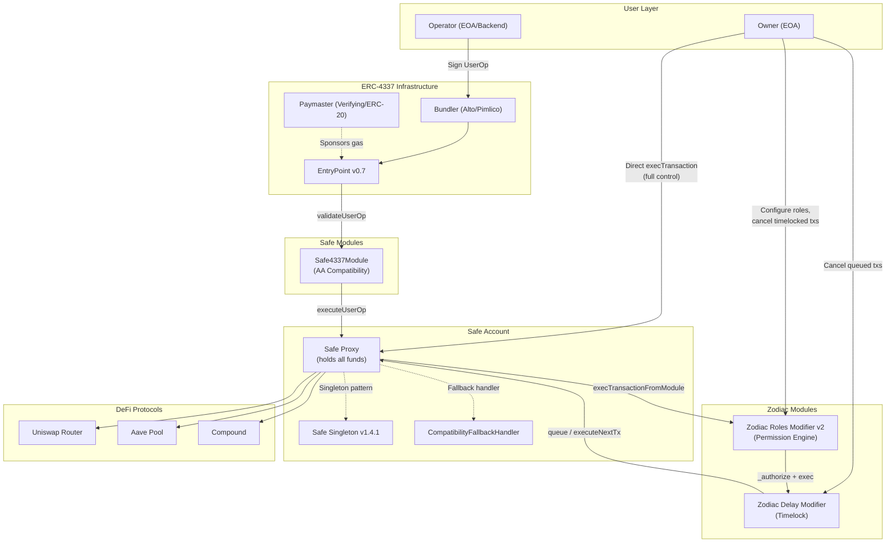

# Architecture A: Safe + Zodiac Modules -- Deep Dive

## Table of Contents

1. [Architecture Overview](#1-architecture-overview)
2. [Core Components Deep Dive](#2-core-components-deep-dive)
3. [Implementing the 5 Core Requirements](#3-implementing-the-5-core-requirements)
4. [Gas Cost Estimates](#4-gas-cost-estimates)
5. [Maturity Assessment](#5-maturity-assessment)
6. [Pros and Cons](#6-pros-and-cons)
7. [Vendor Lock-in Risks](#7-vendor-lock-in-risks)
8. [Complexity Assessment](#8-complexity-assessment)

---

## 1. Architecture Overview

This architecture uses the original specification: Safe Smart Account as the custodial vault, with Zodiac modules (Roles Modifier and Delay Modifier) providing permission management and time-lock safety. The Safe4337Module provides ERC-4337 compatibility for gasless UX.

### Architecture Diagram



### Transaction Flow

**Owner direct execution:**
```
Owner -> Safe.execTransaction() -> DeFi Protocol
```
No modules involved. Full access, standard Safe multisig flow.

**Operator delegated execution (without Delay):**
```
Operator -> Bundler -> EntryPoint -> Safe4337Module.validateUserOp()
                                          |
                                          v
                                  Safe4337Module.executeUserOp()
                                          |
                                          v
                                  Safe.execTransactionFromModule()
                                          |
                                          v
                                  Roles._authorize(roleKey, to, value, data, op)
                                          |
                                          v (if authorized)
                                  Roles.exec(to, value, data, op)
                                          |
                                          v
                                  Safe.execTransactionFromModule() [Roles as module]
                                          |
                                          v
                                  DeFi Protocol
```

**Operator delegated execution (with Delay):**
```
Step 1: Operator -> Roles._authorize() -> Delay.execTransactionFromModule() [queues tx]
Step 2: [wait cooldown period]
Step 3: Anyone -> Delay.executeNextTx() -> Safe.execTransactionFromModule() -> DeFi Protocol
```
During cooldown, Owner can call `Delay.setTxNonce(nonce + 1)` to skip/cancel the queued transaction.

---

## 2. Core Components Deep Dive

### 2.1 Safe Smart Account (v1.4.1)

**Source**: `repos/safe-smart-account/contracts/Safe.sol`, `contracts/base/ModuleManager.sol`

The Safe is a multisig smart contract wallet using a proxy pattern (SafeProxy -> SafeSingleton). Key characteristics:

- **Proxy pattern**: Each user gets a SafeProxy pointing to a shared SafeSingleton implementation. Deployment via CREATE2 for deterministic addresses.
- **Module system**: Linked list of enabled modules (`mapping(address => address) internal modules`). Modules can call `execTransactionFromModule()` to execute arbitrary transactions as the Safe.
- **Module Guard**: Optional guard contract that can inspect all module transactions pre/post execution via `IModuleGuard.checkModuleTransaction()`.

**Key function -- `execTransactionFromModule()`** (`ModuleManager.sol:167-176`):
```solidity
function execTransactionFromModule(
    address to, uint256 value, bytes memory data, Enum.Operation operation
) external override returns (bool success) {
    (address guard, bytes32 guardHash) = preModuleExecution(to, value, data, operation);
    success = execute(to, value, data, operation, type(uint256).max);
    postModuleExecution(guard, guardHash, success);
}
```

This is the entry point for all module-initiated transactions. The `preModuleExecution` function checks:
1. The caller is an enabled module (`modules[msg.sender] != address(0)`)
2. Module guard checks pass (if a guard is set)

**Security model**: Modules have **unlimited access** to Safe funds. The Safe docs explicitly warn: "Modules are a security risk since they can execute arbitrary transactions, so only trusted and audited modules should be added to a Safe. A malicious module can completely take over a Safe."

### 2.2 Zodiac Roles Modifier v2

**Source**: `repos/zodiac-modifier-roles/packages/evm/contracts/Roles.sol` and related files

The Roles Modifier is the permission engine. It sits between operators and the Safe, enforcing granular access control.

#### Core Architecture

The Roles contract inherits from:
- `Modifier` (Zodiac base -- implements the module interface, maintains its own module linked list)
- `AllowanceTracker` (rate/threshold limits)
- `PermissionBuilder` (configure permissions)
- `PermissionChecker` (enforce permissions)
- `PermissionLoader` (load stored permission trees)

#### Data Model

**Roles** (`Types.sol:142-146`):
```solidity
struct Role {
    mapping(address => bool) members;            // who has this role
    mapping(address => TargetAddress) targets;   // target clearance levels
    mapping(bytes32 => bytes32) scopeConfig;     // function-level scoping
}
```

**Target clearance levels** (`Types.sol:114-118`):
```solidity
enum Clearance {
    None,      // target not allowed
    Target,    // any function on target allowed (wildcarded)
    Function   // only specific scoped functions allowed
}
```

**Execution options** (`Types.sol:107-112`):
```solidity
enum ExecutionOptions {
    None,          // no value transfer, no delegatecall
    Send,          // value transfer allowed
    DelegateCall,  // delegatecall allowed
    Both           // both allowed
}
```

#### Permission Configuration

The owner configures permissions through `PermissionBuilder.sol`:

1. **`scopeTarget(roleKey, targetAddress)`** -- Mark a target as requiring function-level scoping
2. **`allowFunction(roleKey, targetAddress, selector, options)`** -- Allow a specific function (wildcarded params)
3. **`scopeFunction(roleKey, targetAddress, selector, conditions[], options)`** -- Allow a specific function with parameter conditions
4. **`allowTarget(roleKey, targetAddress, options)`** -- Allow all functions on a target (dangerous)

#### Condition System (Operators)

The condition system is a tree-based expression evaluator (`Types.sol:48-105`):

```solidity
enum Operator {
    Pass,                    // always passes (no check)
    And, Or, Nor,           // logical combinators
    Matches,                 // structural match (tuple/array fields)
    ArraySome,               // at least one element passes
    ArrayEvery,              // all elements pass
    ArraySubset,             // elements are subset of allowed
    EqualToAvatar,           // value must equal avatar address
    EqualTo,                 // exact match (keccak256 for dynamic)
    GreaterThan,             // uint comparison
    LessThan,                // uint comparison
    SignedIntGreaterThan,    // int comparison
    SignedIntLessThan,       // int comparison
    Bitmask,                 // bitwise mask check
    Custom,                  // external checker contract
    WithinAllowance,         // param value within allowance budget
    EtherWithinAllowance,    // ETH value within allowance
    CallWithinAllowance      // call count within allowance
}
```

**Conditions are stored as flattened trees** (`Types.sol:123-128`):
```solidity
struct ConditionFlat {
    uint8 parent;           // parent node index
    AbiType paramType;      // Static, Dynamic, Tuple, Array, etc.
    Operator operator;      // comparison operator
    bytes compValue;        // comparison value
}
```

At runtime, these are reconstructed into recursive `Condition` structs and evaluated by `_walk()` in `PermissionChecker.sol`.

#### Allowance System

The allowance system (`AllowanceTracker.sol`, `Types.sol:148-160`) provides rate/threshold limiting:

```solidity
struct Allowance {
    uint128 refill;      // amount added each period
    uint128 maxRefill;   // cap for refill
    uint64 period;       // seconds between refills (0 = one-time)
    uint128 balance;     // current available balance
    uint64 timestamp;    // last refill time
}
```

Allowances support:
- **One-time budgets**: Set `period = 0`, balance decrements with usage
- **Periodic refill**: e.g., 1000 USDC per day with `period = 86400`
- **Three types**: `WithinAllowance` (parameter value), `EtherWithinAllowance` (msg.value), `CallWithinAllowance` (call count)

The allowance consumption is transactional -- if the inner transaction fails, consumed allowances are restored (`_flushCommit` with `success = false` resets `allowances[key].balance`).

#### Authorization Flow

`PermissionChecker._authorize()` (`PermissionChecker.sol:20-69`):

1. Verify role key is non-zero
2. Verify caller is a member of the role
3. Check for transaction unwrapper (MultiSend handling)
4. For each unwrapped transaction, call `_transaction()`

`_transaction()` (`PermissionChecker.sol:113-181`):
1. If `Clearance.Function`: load scope config, check execution options, evaluate condition tree via `_walk()`
2. If `Clearance.Target`: only check execution options (wildcarded)
3. If `Clearance.None`: reject

#### Custom Conditions

The `Custom` operator (`PermissionChecker.sol:624-650`) delegates validation to an external contract:
```solidity
ICustomCondition adapter = ICustomCondition(address(bytes20(condition.compValue)));
(bool success, bytes32 info) = adapter.check(
    context.to, context.value, data, context.operation,
    payload.location, payload.size, extra
);
```

This allows arbitrary validation logic (e.g., oracle price checks, token balance requirements).

### 2.3 Zodiac Delay Modifier

**Source**: Not cloned locally. Analysis based on [GitHub repo](https://github.com/gnosisguild/zodiac-modifier-delay) and documentation.

The Delay Modifier enforces a time delay between transaction proposal and execution.

#### Mechanism

1. **Queue**: Authorized modules call `execTransactionFromModule()` on the Delay modifier, which stores the transaction hash and records `block.timestamp`.
2. **Cooldown**: A configurable period (e.g., 24h) must elapse before execution.
3. **Execute**: Anyone calls `executeNextTx(to, value, data, operation)` after cooldown. The modifier verifies the hash matches the queued transaction and that cooldown has passed.
4. **Cancel**: The Safe owner can call `setTxNonce(nonce + 1)` to skip/invalidate the next queued transaction.
5. **Expiration**: Optional expiration period after which queued transactions become invalid.

#### Key Parameters
- `txCooldown`: Minimum time (seconds) between queue and execution
- `txExpiration`: Maximum time (seconds) after cooldown for execution (0 = forever)
- `txNonce`: Sequential nonce for FIFO queue ordering

#### Chaining with Roles

In the standard architecture, the flow is:
```
Operator -> Roles Modifier (permission check) -> Delay Modifier (queue) -> Safe (execute)
```

The Roles Modifier is enabled as a module on the Delay Modifier, and the Delay Modifier is enabled as a module on the Safe.

#### Security Audit
- Audited by G0 Group
- All identified issues addressed in commit 95c75547

### 2.4 Safe4337Module

**Source**: `repos/safe-modules/modules/4337/contracts/Safe4337Module.sol`

The Safe4337Module makes Safe accounts compatible with ERC-4337 by implementing the `IAccount` interface.

#### Dual Role
- **Safe Module**: Enabled on the Safe to call `execTransactionFromModule()`
- **Fallback Handler**: Set as the Safe's fallback handler so the EntryPoint can call `validateUserOp()` on the Safe address

#### Validation Flow (`Safe4337Module.sol:133-163`)

```solidity
function validateUserOp(
    PackedUserOperation calldata userOp,
    bytes32,
    uint256 missingAccountFunds
) external onlySupportedEntryPoint returns (uint256 validationData) {
    // 1. Verify sender matches Safe address
    if (safeAddress != msg.sender) revert InvalidCaller();

    // 2. Only allow executeUserOp or executeUserOpWithErrorString
    bytes4 selector = bytes4(userOp.callData);

    // 3. Validate signatures (EIP-712 SafeOp)
    validationData = _validateSignatures(userOp);

    // 4. Pay prefund to EntryPoint
    if (missingAccountFunds != 0) {
        ISafe(safeAddress).execTransactionFromModule(
            SUPPORTED_ENTRYPOINT, missingAccountFunds, "", 0
        );
    }
}
```

#### Signature Format

The UserOp signature encodes: `abi.encodePacked(validAfter, validUntil, signatures)`
- `validAfter` (6 bytes): Timestamp from which the operation is valid
- `validUntil` (6 bytes): Timestamp until which the operation is valid
- `signatures`: Standard Safe owner signatures (ECDSA or contract signatures)

#### EIP-712 SafeOp Type

The module defines a `SafeOp` type that includes all UserOperation fields plus `validAfter`, `validUntil`, and `entryPoint`. This ensures owners sign over the complete operation context.

#### Execution (`Safe4337Module.sol:172-193`)

```solidity
function executeUserOp(
    address to, uint256 value, bytes memory data, uint8 operation
) external onlySupportedEntryPoint {
    if (!ISafe(msg.sender).execTransactionFromModule(to, value, data, operation)) {
        revert ExecutionFailed();
    }
}
```

The EntryPoint calls `executeUserOp()` on the Safe (which delegates to the Safe4337Module via fallback handler), which then calls `execTransactionFromModule()` on the Safe itself.

#### Security Measures
- Signature length verification (`_checkSignaturesLength`) to prevent malicious bundler gas griefing
- EntryPoint address is immutable (set at deployment)
- Only `executeUserOp` and `executeUserOpWithErrorString` selectors are allowed

#### Audit History
- v0.1.0: OpenZeppelin audit
- v0.2.0: Ackee Blockchain audit
- v0.3.0: Ackee Blockchain audit

---

## 3. Implementing the 5 Core Requirements

### Requirement 1: Custody Preservation (Only owners deposit/withdraw)

**Implementation**: Native to Safe architecture.

- The Safe is the custodial account. Only the owner (Safe signer) can call `execTransaction()` with threshold signatures.
- Modules can only act through `execTransactionFromModule()`, which the owner controls by enabling/disabling modules.
- **Deposit**: Anyone can send tokens/ETH to the Safe address (no permission needed).
- **Withdraw**: Only the Safe owner can initiate a direct `execTransaction()` to transfer funds out. Operators have no path to withdraw unless the Roles module explicitly grants it.

**Configuration**:
```
1. Deploy Safe with owner as sole signer (threshold = 1)
2. Enable Roles Modifier as module on Safe
3. DO NOT grant operators any withdrawal permissions in Roles
4. Owner retains full execTransaction() access
```

### Requirement 2: Delegated Execution (Operators execute whitelisted DeFi ops)

**Implementation**: Zodiac Roles Modifier.

Operators are assigned roles with scoped permissions:

```
Owner actions:
1. roles.assignRoles(operatorAddress, [roleKey], [true])
2. roles.scopeTarget(roleKey, UNISWAP_ROUTER)
3. roles.scopeFunction(roleKey, UNISWAP_ROUTER, SWAP_SELECTOR, conditions, ExecutionOptions.None)
```

The operator then calls:
```
roles.execTransactionWithRole(UNISWAP_ROUTER, 0, swapCalldata, 0, roleKey, true)
```

Or, if a default role is set:
```
roles.execTransactionFromModule(UNISWAP_ROUTER, 0, swapCalldata, 0)
```

The Roles modifier checks membership, clearance level, function selector, and parameter conditions before executing on the Safe.

### Requirement 3: Granular Permissions (Target + selector + parameter conditions)

**Implementation**: Zodiac Roles v2 condition tree.

**Example -- Allow operator to swap on Uniswap, but only with specific tokens and max amount:**

```solidity
// Target: Uniswap Router
roles.scopeTarget(OPERATOR_ROLE, UNISWAP_ROUTER);

// Function: exactInputSingle
// Conditions: tokenIn must be USDC, tokenOut must be WETH, amountIn <= 10000e6
ConditionFlat[] memory conditions = new ConditionFlat[](4);

// Root: Matches (maps to function params as tuple)
conditions[0] = ConditionFlat({
    parent: 0,
    paramType: AbiType.Tuple,
    operator: Operator.Matches,
    compValue: ""
});

// Param 0 (tokenIn): Must equal USDC
conditions[1] = ConditionFlat({
    parent: 0,
    paramType: AbiType.Static,
    operator: Operator.EqualTo,
    compValue: abi.encode(USDC_ADDRESS)
});

// Param 1 (tokenOut): Must equal WETH
conditions[2] = ConditionFlat({
    parent: 0,
    paramType: AbiType.Static,
    operator: Operator.EqualTo,
    compValue: abi.encode(WETH_ADDRESS)
});

// Param 2 (amountIn): Within daily allowance
conditions[3] = ConditionFlat({
    parent: 0,
    paramType: AbiType.Static,
    operator: Operator.WithinAllowance,
    compValue: abi.encode(DAILY_SWAP_ALLOWANCE_KEY)
});

roles.scopeFunction(OPERATOR_ROLE, UNISWAP_ROUTER, SWAP_SELECTOR, conditions, ExecutionOptions.None);

// Set daily allowance: 10000 USDC per day
roles.setAllowance(DAILY_SWAP_ALLOWANCE_KEY, 10000e6, 10000e6, 10000e6, 86400, 0);
```

**Available condition types for our use case:**
| Condition | Use Case |
|-----------|----------|
| `EqualTo` | Token addresses, recipient addresses |
| `EqualToAvatar` | Force recipient = Safe address |
| `GreaterThan` / `LessThan` | Min/max amounts |
| `WithinAllowance` | Daily/weekly spending limits |
| `EtherWithinAllowance` | ETH value limits |
| `CallWithinAllowance` | Rate limiting (max N calls per period) |
| `Bitmask` | Bitfield flags in parameters |
| `Custom` | Arbitrary external validation (oracle checks, etc.) |
| `ArraySubset` | Token must be in allowed list |
| `And` / `Or` / `Nor` | Combine conditions |

### Requirement 4: Time-locked Safety (Delay + Owner Cancel)

**Implementation**: Zodiac Delay Modifier.

**Setup:**
```
Chain: Operator -> Roles Modifier -> Delay Modifier -> Safe
```

1. Deploy Delay Modifier with:
   - `txCooldown`: e.g., 86400 (24 hours)
   - `txExpiration`: e.g., 604800 (7 days) or 0 (no expiration)
   - `avatar`: Safe address
   - `target`: Safe address

2. Enable Roles Modifier as a module on the Delay Modifier
3. Enable Delay Modifier as a module on the Safe

**Flow:**
1. Operator submits a transaction through Roles (permission check passes)
2. Roles calls `Delay.execTransactionFromModule()` which **queues** the transaction
3. 24-hour cooldown begins
4. During cooldown: Owner can call `Delay.setTxNonce(currentNonce + 1)` to cancel
5. After cooldown: Anyone calls `Delay.executeNextTx()` to execute

**Limitation**: The Delay modifier uses a FIFO queue -- transactions must be executed in order. This means:
- If tx #3 is cancelled, tx #4 and #5 are not affected
- But tx #5 cannot execute before tx #4

### Requirement 5: Gasless UX (Account Abstraction + Paymaster)

**Implementation**: Safe4337Module + Pimlico infrastructure.

**Setup:**
1. Deploy Safe4337Module with the EntryPoint v0.7 address
2. Enable Safe4337Module as a module on the Safe
3. Set Safe4337Module as the fallback handler on the Safe

**For operators (gasless execution):**
```typescript
// Using permissionless.js
import { createSmartAccountClient } from "permissionless"
import { toSafeSmartAccount } from "permissionless/accounts"

const safeAccount = await toSafeSmartAccount({
    client: publicClient,
    entryPoint: { address: entryPointAddress, version: "0.7" },
    owners: [operatorSigner],
    safe4337ModuleAddress: safe4337ModuleAddress,
})

const smartAccountClient = createSmartAccountClient({
    account: safeAccount,
    chain: mainnet,
    bundlerTransport: http("https://api.pimlico.io/v2/..."),
    paymaster: pimlicoPaymaster, // sponsors gas
})

// Operator sends a UserOp (gasless)
const hash = await smartAccountClient.sendTransaction({
    to: UNISWAP_ROUTER,
    data: swapCalldata,
})
```

**Note**: In this architecture, the operator's UserOp goes through the Safe4337Module validation (owner signature check), then through the Roles/Delay chain. This means the operator needs to be a Safe signer OR the Safe4337Module needs to be adapted to work with Roles.

**Challenge**: The standard Safe4337Module validates using Safe owner signatures. For operators to use ERC-4337, one approach is:
- Make the operator a Safe signer (threshold = 1 for operators)
- The Roles module restricts what they can actually execute
- But this creates complexity if the Safe has a multisig for the owner

**Alternative**: A custom 4337 module that routes through Roles directly.

---

## 4. Gas Cost Estimates

### Baseline: Safe Operations

| Operation | Gas Cost (approx) | Notes |
|-----------|-------------------|-------|
| Safe deployment (CREATE2) | ~280,000 | Via SafeProxyFactory |
| `execTransaction` (1-of-1 sig, ETH transfer) | ~65,000 | Direct owner execution |
| `execTransaction` (1-of-1 sig, ERC-20 transfer) | ~85,000 | Direct owner execution |
| `execTransactionFromModule` (simple call) | ~35,000 | Module overhead only |

### ERC-4337 Overhead

| Component | Additional Gas | Notes |
|-----------|---------------|-------|
| EntryPoint overhead | ~25,000 | Per UserOperation |
| `validateUserOp` (Safe4337Module) | ~40,000 | EIP-712 signature verification |
| Paymaster validation | ~15,000-30,000 | Depends on paymaster type |
| preVerificationGas | ~21,000 | Base calldata cost |

### Zodiac Roles Overhead

| Operation | Additional Gas | Notes |
|-----------|---------------|-------|
| Role membership check | ~2,500 | Mapping lookup |
| Target clearance check (wildcarded) | ~3,000 | No condition evaluation |
| Function scope (no conditions) | ~5,000 | Header load + options check |
| Function scope (1 EqualTo condition) | ~8,000-12,000 | Condition tree + comparison |
| Function scope (complex tree, 5+ conditions) | ~20,000-40,000 | Depends on tree depth |
| Allowance check + update | ~8,000-15,000 | Storage read + accrual calc |
| Custom condition (external call) | ~10,000+ | Depends on adapter complexity |

### Zodiac Delay Overhead

| Operation | Additional Gas | Notes |
|-----------|---------------|-------|
| Queue transaction (`execTransactionFromModule`) | ~45,000 | Hash storage + event emission |
| Execute queued transaction (`executeNextTx`) | ~35,000 | Hash verification + execution |
| Cancel transaction (`setTxNonce`) | ~5,000 | Nonce increment |

### Total Cost Estimates for Common Operations

| Scenario | Gas (Direct) | Gas (via 4337) | Notes |
|----------|-------------|----------------|-------|
| Simple swap (no delay) | ~150,000 | ~260,000 | Safe + Roles + swap |
| Simple swap (with delay, queue) | ~195,000 | ~305,000 | Safe + Roles + Delay queue |
| Simple swap (with delay, execute) | ~185,000 | N/A | Delay execute + swap |
| Complex multi-param check | ~180,000 | ~290,000 | 5+ conditions, allowance |
| ERC-20 transfer (restricted) | ~120,000 | ~230,000 | Roles check + transfer |

**Key observation**: The 4337 overhead adds roughly 100,000-110,000 gas per operation. The Delay module adds another ~45,000 for queuing. For a simple swap that costs ~150,000 gas directly, the full 4337 + Roles + Delay path costs ~350,000 gas.

---

## 5. Maturity Assessment

### Safe Smart Account

| Metric | Value | Source |
|--------|-------|--------|
| Total Value Secured | >$100 billion | safe.global (2025) |
| Active Accounts | >7 million | safe.global (2024) |
| Total Transactions | >30 million | safe.global (2024) |
| Mainnet Age | ~5 years (since 2019) | First deployment |
| Audit Count | 7+ major audits | OpenZeppelin, Ackee, Certora, Runtime Verification |
| Bug Bounties | $1M+ via Immunefi | Active program |
| Chain Deployments | 15+ chains | Ethereum, Arbitrum, Optimism, Base, Polygon, etc. |

Safe is the most battle-tested smart account infrastructure in crypto. It is used by:
- Major DAOs: ENS, GnosisDAO, Balancer, Aave
- Institutions: Bitfinex, GSR
- Enterprises: Shopify, AB Group
- ~13% of all CryptoPunks are secured in Safes

### Zodiac Roles Modifier v2

| Metric | Value | Source |
|--------|-------|--------|
| Audit Status | Audited (details via Gnosis Guild) | gnosisguild.org |
| Production Users | ENS DAO, GnosisDAO, Balancer | Public knowledge |
| Policy Audits | ThirdGuard audits ENS policies | GitHub: ThirdGuard/roles-policy-audits |
| Open Source | Yes (LGPL-3.0) | GitHub |
| SDK | TypeScript SDK available | npm: zodiac-roles-sdk |
| Web App | Zodiac Roles app available | roles.gnosisguild.org |

The Roles Modifier v2 is a complete rewrite of v1 with significant improvements:
- Gas-optimized storage layout
- Expressive condition tree system
- Allowance system with periodic refills
- Custom condition adapters
- MultiSend unwrapping support

It is used in production for trust-minimized treasury management by major DAOs.

### Zodiac Delay Modifier

| Metric | Value | Source |
|--------|-------|--------|
| Audit Status | Audited by G0 Group | GitHub |
| Maturity | Stable, simpler contract | ~500 lines Solidity |
| Dependencies | Zodiac base contracts only | Minimal |

### Safe4337Module

| Metric | Value | Source |
|--------|-------|--------|
| Audit Status | 3 audits (v0.1, v0.2, v0.3) | OpenZeppelin, Ackee Blockchain |
| EntryPoint Versions | v0.6 and v0.7 supported | safe-modules repo |
| Production Usage | Live on mainnet | safe.global |
| Passkey Support | Available (separate module) | safe-modules/modules/passkey |

---

## 6. Pros and Cons

### Pros

1. **Maximum security pedigree**: Safe secures >$100B. No other smart account comes close in battle-tested TVL.

2. **Zodiac Roles v2 is the most expressive on-chain permission engine available**: The condition tree supports logical combinators (And/Or/Nor), array operations (Some/Every/Subset), custom external validators, and rate-limited allowances. No session key system matches this expressiveness.

3. **Established tooling and ecosystem**: Zodiac Pilot for transaction crafting, Roles SDK for programmatic configuration, subgraph for querying, web app for management.

4. **True timelock with owner veto**: The Delay module provides a genuine timelock with FIFO ordering and owner cancellation. This is architecturally cleaner than hook-based timelocks.

5. **No adapter layer**: Direct module integration with Safe means fewer abstraction layers and potential failure points.

6. **Production-proven for the exact use case**: ENS, GnosisDAO, and Balancer use Roles for delegated treasury management -- this is exactly the ManagedAccount use case.

7. **Policy auditing ecosystem**: ThirdGuard provides dedicated Roles policy audits, meaning the permission configurations themselves can be formally verified.

### Cons

1. **No native session keys**: Operators must be enabled as modules or use the 4337 flow with Safe owner signatures. There is no built-in ephemeral key mechanism.

2. **Delay module creates UX friction**: Every operator transaction goes through a cooldown period. This makes real-time DeFi operations (time-sensitive swaps) impractical with the Delay module. Either skip Delay for certain roles (losing the safety net) or accept the latency.

3. **Zodiac modules are not interoperable**: Roles and Delay are Zodiac-specific, not ERC-7579 modules. They cannot be reused on Kernel, Biconomy, or other smart accounts.

4. **Complex 4337 integration for operators**: The Safe4337Module validates owner signatures. Making operators use 4337 requires either making them Safe signers (complicates the ownership model) or building a custom 4337 module that routes through Roles.

5. **No chain abstraction**: Each chain requires independent deployment and configuration. There is no built-in cross-chain message passing.

6. **Module chaining is rigid**: The Roles -> Delay -> Safe chain is sequential. Adding new security layers requires reconfiguring the chain. Hot-swapping modules is disruptive.

7. **Gas overhead compounds**: Safe base cost + Roles permission checking + Delay queuing + 4337 overhead = significant gas per operation. A simple swap can cost 350k+ gas through the full path.

8. **Condition configuration complexity**: While the condition system is powerful, configuring complex condition trees is error-prone. A misconfigured condition could over-grant or under-grant permissions.

---

## 7. Vendor Lock-in Risks

### Low Risk

- **Safe Core**: Open source (LGPL-3.0), multiple independent implementations, canonical deployments on 15+ chains. Safe is as close to a public good as smart accounts get. Migration path exists via module-based account migration.

- **ERC-4337 EntryPoint**: Canonical singleton deployed by Ethereum Foundation. No vendor dependency.

### Medium Risk

- **Zodiac Roles/Delay**: Open source but maintained by Gnosis Guild. If Gnosis Guild stops maintaining, the community would need to fork and maintain. The Roles v2 codebase is complex (~15 Solidity files) and would require deep expertise to modify.

- **Bundler/Paymaster (Pimlico)**: API dependency for 4337 operations. Mitigated by self-hosting Alto (open-source bundler). Pimlico's API is not the only option -- Alchemy, Biconomy, and others provide bundler/paymaster services.

### Specific Lock-in Concerns

1. **Zodiac-specific permission model**: Roles v2 conditions cannot be ported to ERC-7579 modules without a rewrite. If you later want to migrate to Safe+7579, the entire permission configuration must be rebuilt.

2. **Delay module is Zodiac-specific**: No ERC-7579 equivalent exists out of the box (though ColdStorageHook provides similar functionality).

3. **Safe module linked list ordering**: The chaining order (Roles -> Delay -> Safe) is implicit in the module enable/disable process. Reconfiguring requires careful transaction ordering.

---

## 8. Complexity Assessment

### Development Complexity: Medium-High

| Aspect | Complexity | Justification |
|--------|-----------|---------------|
| Safe deployment + configuration | Low | Well-documented, SafeProxyFactory handles it |
| Roles configuration (simple) | Medium | SDK available, but condition trees need care |
| Roles configuration (complex) | High | Nested conditions, allowances, custom adapters |
| Delay module integration | Low-Medium | Simple concept, but chaining with Roles adds complexity |
| Safe4337Module setup | Medium | Standard, but operator key management is tricky |
| Operator 4337 flow | High | Custom work needed if operators are not Safe signers |
| Permission migration/updates | Medium | Requires careful batched transactions |
| Monitoring + alerting | Medium | Subgraph available, but custom indexing may be needed |

### Operational Complexity: Medium

| Aspect | Complexity | Justification |
|--------|-----------|---------------|
| Adding new operator | Low | `assignRoles()` + module enable |
| Updating permissions | Medium | Must be done carefully by owner |
| Adding new DeFi protocol | Medium | New scope/conditions per function |
| Cancelling timelocked tx | Low | `setTxNonce(nonce + 1)` |
| Emergency shutdown | Low | Owner disables modules |
| Multi-chain management | High | Independent per-chain configuration |

### Key Technical Challenges

1. **Operator 4337 Authentication**: How does an operator submit a UserOp if they are not a Safe signer? Options:
   - a) Make operator a Safe signer (pollutes ownership model)
   - b) Build custom 4337 module that delegates to Roles
   - c) Use a relay service (operator signs message, relay submits Safe tx)

2. **Delay Module + Time-Sensitive Operations**: DeFi operations like swaps are price-sensitive. A 24h delay makes limit orders and time-sensitive rebalancing impractical. Must choose between safety (delay) and UX (no delay) per operation type.

3. **Permission Configuration Testing**: Complex condition trees need thorough testing. A condition that checks `tokenIn == USDC AND amountIn < 10000e6 AND recipient == safeAddress` across nested tuple parameters requires careful encoding.

### Lines of Code Estimate (Custom Development)

| Component | Estimated LOC | Notes |
|-----------|---------------|-------|
| Deployment scripts | ~500 | Safe + modules + configuration |
| Custom 4337 operator module | ~300-500 | If needed for operator auth |
| Permission configuration scripts | ~300-800 | Per DeFi protocol |
| Backend relay service | ~1000 | If not using pure 4337 |
| Monitoring/alerting | ~500-1000 | Event indexing, alerts |
| Frontend integration | ~2000 | permissionless.js + Roles SDK |
| **Total custom code** | **~4,600-5,800** | Excluding Safe/Zodiac contracts |

---

## Summary

Architecture A (Safe + Zodiac) is the most battle-tested option, leveraging the $100B+ TVL security track record of Safe and the production-proven permission system of Zodiac Roles v2. Its main strengths are security pedigree, expressive permissions, and real-world validation by major DAOs. Its main weaknesses are the lack of native session keys, Zodiac vendor lock-in, UX friction from the Delay module, and complex 4337 integration for operators. This architecture is best suited for use cases where security is paramount and real-time execution speed is not critical.
