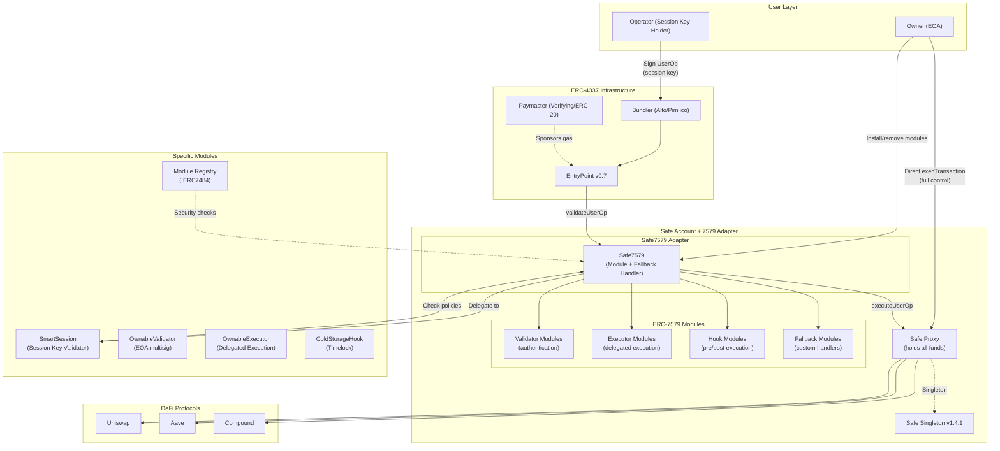

# Architecture B: Safe + ERC-7579 (Safe7579 Adapter) -- Deep Dive

## Table of Contents

1. [Architecture Overview](#1-architecture-overview)
2. [Safe7579 Adapter Deep Dive](#2-safe7579-adapter-deep-dive)
3. [Module Ecosystem Analysis](#3-module-ecosystem-analysis)
4. [Implementing the 5 Core Requirements](#4-implementing-the-5-core-requirements)
5. [Gas Cost Estimates](#5-gas-cost-estimates)
6. [Maturity Assessment](#6-maturity-assessment)
7. [Pros and Cons](#7-pros-and-cons)
8. [Vendor Lock-in Risks](#8-vendor-lock-in-risks)
9. [Complexity Assessment](#9-complexity-assessment)
10. [Comparison with Architecture A](#10-comparison-with-architecture-a)

---

## 1. Architecture Overview

This architecture extends the Safe Smart Account with the Safe7579 Adapter (developed jointly by Safe and Rhinestone), making Safe compatible with the ERC-7579 modular account standard. This unlocks access to the ERC-7579 module ecosystem (14 audited Rhinestone modules, SmartSession for session keys, Module Registry for on-chain security checks) while retaining Safe's security model and $100B+ TVL track record.

### Architecture Diagram



### High-Level Transaction Flow

**Owner direct execution:**
```
Owner -> Safe.execTransaction() -> DeFi Protocol
```
Standard Safe flow. The 7579 adapter does not interfere.

**Operator via session key (ERC-4337):**
```
Operator signs UserOp with session key
    -> Bundler -> EntryPoint
        -> Safe (fallback handler = Safe7579)
            -> Safe7579.validateUserOp()
                -> SmartSession.validateUserOp(userOp, userOpHash)
                    -> Check session validity
                    -> Check action policies (target, selector, params)
                    -> Check session policies (value limits, time bounds)
                    -> Return validation result
            -> Safe7579.executeUserOp()
                -> ColdStorageHook.preCheck() [if installed]
                -> Safe.execTransactionFromModule(to, value, data, op)
                    -> DeFi Protocol
                -> ColdStorageHook.postCheck() [if installed]
```

---

## 2. Safe7579 Adapter Deep Dive

### 2.1 What It Is

The Safe7579 adapter is a smart contract developed collaboratively by Rhinestone and Safe. It serves a dual role:

1. **Safe Module**: Enabled on the Safe, giving it the ability to call `execTransactionFromModule()` and execute transactions as the Safe.
2. **Fallback Handler**: Set as the Safe's fallback handler, intercepting calls that the Safe does not natively handle (like `validateUserOp()`).

This dual role allows the adapter to bridge between Safe's native interface and the ERC-7579 modular account interface.

**Source**: The Safe7579 adapter is at [github.com/rhinestonewtf/safe7579](https://github.com/rhinestonewtf/safe7579). It is not part of the `safe-modules` repo cloned locally.

### 2.2 How It Bridges Safe to ERC-7579

ERC-7579 defines four module types with specific interfaces:

| Module Type | ERC-7579 Function | How Safe7579 Handles It |
|-------------|-------------------|------------------------|
| **Validator** | `validateUserOp()`, `isValidSignatureWithSender()` | Intercepts via fallback handler; routes to installed validator based on `userOp.nonce` encoding |
| **Executor** | `executeFromExecutor()` | Exposes `executeFromExecutor()` via fallback handler; routes through `Safe.execTransactionFromModule()` |
| **Hook** | `preCheck()` / `postCheck()` | Wraps all execution calls with hook pre/post logic; supports global hooks and per-selector hooks |
| **Fallback** | Custom function selectors | Routes unrecognized calls to installed fallback modules |

### 2.3 Validator Selection via Nonce

Safe7579 uses a clever nonce-encoding scheme to select which validator module processes a UserOperation:

```
userOp.nonce = abi.encodePacked(validatorAddress, nonce)
```

The adapter extracts the validator address from the nonce key field and delegates `validateUserOp()` to that module. If no validator is specified (or `address(0)`), it falls back to Safe's native `checkSignatures()` -- maintaining backward compatibility with existing Safe owners.

### 2.4 Execution Routing

For execution, Safe7579 routes all operations through `Safe.execTransactionFromModule()`:

- **Single execution**: Direct call to `Safe.execTransactionFromModule(to, value, data, op)`
- **Batch execution**: Instead of N separate module calls, Safe7579 uses a delegatecall to a specialized multicall contract. The Safe delegatecalls the multicall, which executes all operations in sequence within the Safe's context. This is gas-efficient and enables atomic batched operations.

### 2.5 Hook System

Safe7579 supports two types of hooks:

1. **Global hooks**: Execute before and after every operation
2. **Selector-specific hooks**: Execute only for operations targeting specific function selectors

Hooks implement the `IERC7579Hooks` interface:
```solidity
interface IERC7579Hooks {
    function preCheck(address msgSender, uint256 msgValue, bytes calldata msgData)
        external returns (bytes memory hookData);
    function postCheck(bytes calldata hookData) external;
}
```

The `preCheck` returns `hookData` that is passed to `postCheck`, enabling stateful verification (e.g., checking balance changes).

### 2.6 Launchpad -- New Account Creation

Creating a new Safe with Safe7579 pre-configured requires a 3-phase launchpad process:

**Phase 1 -- Factory Creation:**
```
Bundler -> EntryPoint -> SafeProxyFactory.createProxyWithNonce()
    -> Creates SafeProxy with Launchpad as temporary singleton
    -> Stores initHash for validation
```

**Phase 2 -- Validation:**
```
EntryPoint -> Safe (Launchpad as singleton) -> Launchpad.validateUserOp()
    -> Verifies initHash
    -> Installs initial ValidatorModule
    -> Returns validation data
```

**Phase 3 -- Execution:**
```
EntryPoint -> Safe (Launchpad) -> Launchpad.setupSafe()
    -> Upgrades singleton from Launchpad to SafeSingleton
    -> Initializes Safe7579 adapter
    -> Installs executors, hooks, fallbacks
    -> Configures IERC7484 registry
```

This technique (credited to Nicholas Lordello of Safe) avoids the chicken-and-egg problem: the Safe needs modules to be configured during creation, but modules can only be installed on an existing Safe.

### 2.7 Module Registry (IERC7484)

Safe7579 integrates with the Rhinestone Module Registry, an on-chain security mechanism:

- Modules are registered and attested on the registry
- The `RegistryHook` module (from core-modules) performs per-transaction checks against the registry
- If a module is flagged as compromised, it is automatically disabled for accounts using the registry hook

This provides a decentralized security layer beyond just audit reports.

---

## 3. Module Ecosystem Analysis

### 3.1 Rhinestone Core Modules (14 Audited)

**Source**: `repos/core-modules/src/`

| Module | Type | Relevance to ManagedAccount | Analysis |
|--------|------|---------------------------|----------|
| **OwnableValidator** | Validator | HIGH -- Owner authentication | Multi-owner with threshold. Validates UserOps via ECDSA signatures. Max 32 owners. Supports `validateSignatureWithData` for stateless validation. |
| **OwnableExecutor** | Executor | HIGH -- Operator execution | Allows designated "owners" (operators) to execute transactions on the account. Uses linked list for owner management. Supports single + batch execution. |
| **ColdStorageHook** | Hook + Executor + Fallback | HIGH -- Timelock mechanism | Implements wait-period timelock. Only allows transfers to the configured `owner` address. Supports flashloan for owner to temporarily access funds. |
| **ScheduledOrders** | Executor | MEDIUM -- DCA/rebalancing | Scheduled Uniswap swaps with configurable frequency. Could be used for automated DeFi operations. |
| **ScheduledTransfers** | Executor | MEDIUM -- Recurring payments | Scheduled token transfers to predefined recipients. |
| **MultiFactor** | Validator | MEDIUM -- Enhanced security | Multi-factor authentication for critical operations. |
| **SocialRecovery** | Validator | LOW -- Account recovery | Social recovery mechanism (not core to ManagedAccount) |
| **DeadmanSwitch** | Validator | LOW -- Estate planning | Inactivity-triggered action (not core to ManagedAccount) |
| **WebAuthnValidator** | Validator | LOW -- Passkey auth | WebAuthn/Passkey authentication |
| **RegistryHook** | Hook | MEDIUM -- Security layer | Per-transaction module security checks via registry |
| **HookMultiPlexer** | Hook | HIGH -- Hook composition | Allows combining multiple hooks (e.g., ColdStorage + Registry + custom) |
| **AutoSavings** | Executor | LOW -- DeFi automation | Auto-save percentage of incoming transfers |
| **FlashloanCallback** | Fallback | LOW -- Advanced DeFi | Flash loan receiver |
| **FlashloanLender** | Fallback | LOW -- Used by ColdStorage | Enables owner flashloan access to locked funds |

### 3.2 SmartSession Module (Session Keys)

**Source**: [github.com/erc7579/smartsessions](https://github.com/erc7579/smartsessions)

SmartSession is the critical module for the ManagedAccount use case. It is a collaborative effort between Rhinestone and Biconomy.

#### Architecture

SmartSession consists of four contracts:
- **SmartSession**: Main implementation
- **SmartSessionBase**: Core functionality
- **SmartSessionERC7739**: ERC-1271 compatibility via nested EIP-712
- **ISmartSession**: Interface definition

#### How It Works

1. **Session Creation**: Owner creates a session by defining:
   - **Session key**: An EOA or smart contract that can sign UserOps
   - **Actions**: List of allowed (target, selector) pairs
   - **Session policies**: Global constraints on the session (time bounds, value limits)
   - **Action policies**: Per-action constraints (parameter checks, rate limits)

2. **Session Validation**: When a UserOp arrives:
   - SmartSession verifies the session key signed the UserOp
   - Checks session is within validity period
   - Checks all session-level policies pass
   - Matches the calldata to an allowed action
   - Checks all action-level policies pass

3. **Policy System**: Policies are external contracts implementing:
   ```solidity
   interface IPolicy {
       function checkUserOp(PackedUserOperation calldata userOp) external returns (bool);
       function checkAction(address target, uint256 value, bytes calldata data) external returns (bool);
   }
   ```

#### Key Features

- **Enable Flow**: Create session keys within the first UserOperation (no separate setup transaction)
- **ERC-7715 Support**: Compatible with the permission request standard (`wallet_grantPermissions`)
- **Batch Support**: Native support for ERC-7579 batched executions
- **External Policies**: Integration with external policy contracts for flexible permission management
- **Revocation**: Sessions can be revoked by the owner at any time

#### Comparison with Zodiac Roles v2

| Feature | SmartSession | Zodiac Roles v2 |
|---------|-------------|-----------------|
| **Permission model** | Session key + policies | Role-based + conditions |
| **Key management** | Ephemeral session keys | Persistent module addresses |
| **Parameter conditions** | Via policy contracts | Built-in condition tree |
| **Rate limiting** | Via policy contracts | Built-in allowance system |
| **Custom validation** | Policy contracts | Custom condition adapters |
| **Time bounds** | Built-in validAfter/validUntil | Not built-in (via signature) |
| **Revocation** | Per-session revocation | Per-role revocation |
| **Batch support** | Native | Via MultiSend unwrapper |
| **Array conditions** | Via policy contracts | Built-in ArraySome/Every/Subset |
| **ERC-4337 integration** | Native (is a Validator) | Requires separate 4337 module |

**Assessment**: SmartSession is more naturally integrated with ERC-4337 but less expressive out-of-the-box than Zodiac Roles v2. The policy system requires custom policy contracts for advanced conditions, whereas Roles v2 has them built-in.

### 3.3 ColdStorageHook -- Timelock Equivalent

**Source**: `repos/core-modules/src/ColdStorageHook/ColdStorageHook.sol`

The ColdStorageHook provides timelock functionality similar to the Zodiac Delay module, but implemented as an ERC-7579 Hook.

#### How It Works

1. **Configuration**: Set `waitPeriod` (seconds) and `owner` (address that receives transfers)
2. **Request**: Call `requestTimelockedExecution(Execution calldata _exec, uint256 additionalWait)`
3. **Wait**: Wait for `waitPeriod + additionalWait` to elapse
4. **Execute**: The executor calls the timelocked transaction, ColdStorageHook verifies the hash and timestamp in `onExecuteFromExecutor()`

#### Key Restrictions (from code analysis)

The ColdStorageHook enforces strict rules:
- **Direct execution blocked**: `onExecute()` and `onExecuteBatch()` always revert. Only executor-originated transactions are allowed.
- **Transfer recipients limited**: Token transfers must go to the configured `owner` address (except for self-operations like `setWaitPeriod`)
- **Module changes timelocked**: `onInstallModule()` and `onUninstallModule()` require pre-scheduled timelocks
- **Flashloan support**: Owner can flashloan funds from the cold storage (via `FlashloanLender`)

#### Differences from Zodiac Delay

| Feature | ColdStorageHook | Zodiac Delay |
|---------|----------------|--------------|
| Queue model | Hash-based (any order) | FIFO (sequential) |
| Recipient restriction | Only to owner | Any address |
| Cancellation | Owner can't cancel (hash-based) | Owner can skip via nonce |
| Module changes | Timelocked | Not handled |
| Flashloan | Supported (owner-only) | Not supported |
| Batch support | No (reverts) | No |
| Integration | ERC-7579 Hook | Zodiac Modifier |

**Important**: ColdStorageHook is designed for "cold storage" sub-accounts, not general-purpose delegation. For the ManagedAccount use case, a custom timelock hook would likely be needed that:
- Allows configurable recipients (not just owner)
- Supports cancellation by owner
- Handles batch operations

### 3.4 OwnableExecutor -- Delegated Execution

**Source**: `repos/core-modules/src/OwnableExecutor/OwnableExecutor.sol`

The OwnableExecutor is a simple executor module that allows designated addresses to execute transactions on the account.

#### How It Works

```solidity
function executeOnOwnedAccount(address ownedAccount, bytes calldata callData) external payable {
    if (!accountOwners[ownedAccount].contains(msg.sender)) revert UnauthorizedAccess();
    IERC7579Account(ownedAccount).executeFromExecutor(ModeLib.encodeSimpleSingle(), callData);
}
```

- **Owner management**: Linked list of owners per account
- **Execution**: Owners can call `executeOnOwnedAccount()` to execute arbitrary transactions
- **Batch support**: `executeBatchOnOwnedAccount()` for atomic multi-call

**Relevance**: This could serve as the base for operator execution, but it lacks permission granularity. Every owner can execute anything. Must be combined with SmartSession or a custom permission hook.

### 3.5 HookMultiPlexer -- Composing Hooks

**Source**: `repos/core-modules/src/HookMultiPlexer/HookMultiPlexer.sol`

The HookMultiPlexer allows combining multiple hooks on a single account. This is critical because ERC-7579 accounts typically support only one hook at a time.

Relevant combinations for ManagedAccount:
- ColdStorageHook (timelock) + RegistryHook (module security) + Custom permission hook

---

## 4. Implementing the 5 Core Requirements

### Requirement 1: Custody Preservation (Only owners deposit/withdraw)

**Implementation**: Same as Architecture A at the base layer. Safe is the custodial account.

**Additional layers:**
- The Safe7579 adapter is enabled as a module on the Safe
- The adapter itself only executes transactions validated by installed modules
- OwnableValidator with the owner as sole signer ensures only the owner can perform unrestricted operations
- SmartSession restricts operators to specific actions (no unrestricted withdrawal)

**Configuration:**
```
1. Deploy Safe with owner as sole signer (threshold = 1)
2. Install Safe7579 as module + fallback handler
3. Install OwnableValidator (owner EOA)
4. Install SmartSession (for operator session keys)
5. Configure SmartSession: operators can ONLY call whitelisted DeFi functions
6. Owner retains full Safe.execTransaction() access (bypasses all modules)
```

**Key security property**: Even if all ERC-7579 modules are compromised, the Safe owner can:
1. Call `Safe.execTransaction()` directly (not through modules)
2. Disable the Safe7579 adapter as a module
3. Remove the Safe7579 fallback handler
4. The Safe itself is never compromised by module-level vulnerabilities

### Requirement 2: Delegated Execution (Operators execute whitelisted DeFi ops)

**Implementation**: SmartSession + OwnableExecutor (or direct execution via Safe7579).

**Option A -- SmartSession as Validator:**

The operator holds a session key. When they want to execute a DeFi operation:

```typescript
// Using permissionless.js + rhinestone module-sdk
import { getSmartSessionsValidator } from "@rhinestone/module-sdk"
import { createSmartAccountClient } from "permissionless"

// Owner creates a session for the operator
const session = {
    sessionKey: operatorPublicKey,
    actions: [
        {
            target: UNISWAP_ROUTER,
            selector: "0x..." // exactInputSingle
        },
        {
            target: AAVE_POOL,
            selector: "0x..." // supply
        }
    ],
    sessionPolicies: [
        timeRangePolicy({ validAfter: now, validUntil: now + 30 * 86400 }),
        valueLimitPolicy({ maxValue: parseEther("10") }),
    ],
    actionPolicies: {
        [UNISWAP_ROUTER]: [
            paramCheckPolicy({ ... }) // custom policy contract
        ]
    }
}

// Operator submits UserOp with session key
const userOp = {
    sender: safeAddress,
    nonce: encodePacked(smartSessionAddress, operatorNonce), // select SmartSession as validator
    callData: encodeFunctionData({
        abi: [...],
        functionName: "exactInputSingle",
        args: [swapParams]
    }),
    signature: sessionKeySignature,
}
```

**Option B -- OwnableExecutor (for backend operators):**

If the operator is a backend service rather than an end-user:

```
1. Install OwnableExecutor with operator address as owner
2. Operator calls OwnableExecutor.executeOnOwnedAccount(safe, callData) directly
3. ColdStorageHook or custom Hook enforces restrictions
```

This is simpler but less flexible than SmartSession.

### Requirement 3: Granular Permissions (Target + selector + parameter conditions)

**Implementation**: SmartSession policies + custom policy contracts.

SmartSession's permission model works in two layers:

**Layer 1 -- Actions (built-in):**
```
Action = {
    target: address,    // contract to call
    selector: bytes4    // function to call
}
```
Only actions that match an allowed (target, selector) pair are permitted.

**Layer 2 -- Policies (extensible via contracts):**

Session-level policies apply to all actions:
- `TimeRangePolicy`: validAfter/validUntil timestamps
- `ValueLimitPolicy`: max ETH value per operation
- `CallCountPolicy`: max number of calls per session
- `SpendingLimitPolicy`: max token spending across operations

Action-level policies apply to specific actions:
- `ParamConditionPolicy`: check parameter values (EqualTo, GreaterThan, LessThan, OneOf)
- `AllowedRecipientsPolicy`: restrict recipient parameter to whitelist
- `MaxAmountPolicy`: limit amount parameter value

**Example -- Operator can swap USDC->WETH on Uniswap, max 10,000 USDC per day:**

```solidity
// Custom policy contract for Uniswap swap parameter checking
contract UniswapSwapPolicy is IActionPolicy {
    function checkAction(
        address target,
        uint256 value,
        bytes calldata data
    ) external returns (bool) {
        // Decode exactInputSingle params
        ISwapRouter.ExactInputSingleParams memory params = abi.decode(
            data[4:], (ISwapRouter.ExactInputSingleParams)
        );

        // Check tokenIn is USDC
        require(params.tokenIn == USDC, "wrong tokenIn");
        // Check tokenOut is WETH
        require(params.tokenOut == WETH, "wrong tokenOut");
        // Check recipient is the Safe
        require(params.recipient == msg.sender, "wrong recipient");
        // Amount check via separate spending limit policy
        return true;
    }
}
```

**Comparison with Zodiac Roles v2 conditions:**

| Zodiac Roles v2 Condition | SmartSession Equivalent |
|--------------------------|------------------------|
| `EqualTo` | `ParamConditionPolicy(EqualTo)` |
| `GreaterThan` / `LessThan` | `ParamConditionPolicy(GreaterThan/LessThan)` |
| `WithinAllowance` | `SpendingLimitPolicy` |
| `EtherWithinAllowance` | `ValueLimitPolicy` |
| `CallWithinAllowance` | `CallCountPolicy` |
| `EqualToAvatar` | `AllowedRecipientsPolicy([safeAddress])` |
| `Bitmask` | Custom policy contract |
| `ArraySome/Every/Subset` | Custom policy contract |
| `Custom` | Custom policy contract |
| `And/Or/Nor` | Policy composition (multiple policies = AND) |

**Key difference**: Zodiac Roles v2 has more built-in condition types (especially array operations and bitmask), but SmartSession's policy system is extensible and can replicate any condition via custom contracts. The tradeoff is that custom policy contracts require additional development and auditing.

### Requirement 4: Time-locked Safety (Delay + Owner Cancel)

**Implementation**: ColdStorageHook (or custom Timelock Hook) + HookMultiPlexer.

**Option A -- Adapt ColdStorageHook:**

ColdStorageHook provides the core timelock pattern but with restrictions:
- Only allows transfers to the owner address
- No cancellation mechanism (hash-based, not queue-based)
- Blocks direct execution (only executor-originated)

For ManagedAccount, we would need to either:
1. Accept the ColdStorageHook's constraints (transfers only to owner = Safe owner)
2. Fork/modify ColdStorageHook for our needs

**Option B -- Custom TimelockHook (recommended):**

Build a custom ERC-7579 Hook that combines the best of ColdStorageHook and Zodiac Delay:

```solidity
contract ManagedAccountTimelockHook is ERC7579HookBase {
    struct TimelockConfig {
        uint128 cooldownPeriod;  // seconds before execution allowed
        uint128 expirationPeriod; // seconds after which tx expires (0 = never)
        address owner;            // can cancel queued txs
    }

    mapping(address account => TimelockConfig) public config;
    mapping(address account => mapping(bytes32 => uint256)) public queuedAt;

    // Called before execution
    function preCheck(address msgSender, uint256 msgValue, bytes calldata msgData)
        external returns (bytes memory hookData)
    {
        TimelockConfig memory cfg = config[msg.sender];

        // Owner bypasses timelock
        if (msgSender == cfg.owner) return "";

        // Hash the execution
        bytes32 execHash = keccak256(abi.encodePacked(msgSender, msgValue, msgData));

        uint256 queued = queuedAt[msg.sender][execHash];
        if (queued == 0) {
            // First time: queue the transaction
            queuedAt[msg.sender][execHash] = block.timestamp;
            revert("Queued: wait for cooldown");
        }

        // Check cooldown
        require(block.timestamp >= queued + cfg.cooldownPeriod, "Cooldown not elapsed");

        // Check expiration
        if (cfg.expirationPeriod > 0) {
            require(
                block.timestamp <= queued + cfg.cooldownPeriod + cfg.expirationPeriod,
                "Execution expired"
            );
        }

        // Clear the queue entry
        delete queuedAt[msg.sender][execHash];

        return "";
    }

    // Owner cancels a queued transaction
    function cancelExecution(bytes32 execHash) external {
        require(msg.sender == config[msg.sender].owner, "Not owner");
        delete queuedAt[msg.sender][execHash];
    }
}
```

**Hook composition with HookMultiPlexer:**
```
HookMultiPlexer
    ├── ManagedAccountTimelockHook (timelock for operator txs)
    ├── RegistryHook (module security checks)
    └── [Optional: custom audit/compliance hook]
```

### Requirement 5: Gasless UX (Account Abstraction + Paymaster)

**Implementation**: Native -- Safe7579 is fully ERC-4337 compatible.

Because Safe7579 implements `validateUserOp()` via the fallback handler, the full ERC-4337 flow works natively:

```typescript
import { createSmartAccountClient, toSafe7579SmartAccount } from "permissionless"
import { createPimlicoClient } from "permissionless/clients/pimlico"

// Create Safe7579 account
const safeAccount = await toSafe7579SmartAccount({
    client: publicClient,
    entryPoint: { address: entryPointAddress, version: "0.7" },
    owners: [ownerSigner],
    safe7579Address: safe7579Address,
    validators: [
        { address: ownableValidatorAddress, context: ownerInitData },
        { address: smartSessionAddress, context: sessionInitData },
    ],
    executors: [
        { address: ownableExecutorAddress, context: operatorInitData },
    ],
    hooks: [
        { address: hookMultiplexerAddress, context: hookInitData },
    ],
})

// Create Pimlico paymaster
const pimlicoClient = createPimlicoClient({
    transport: http("https://api.pimlico.io/v2/..."),
    entryPoint: { address: entryPointAddress, version: "0.7" },
})

// Create smart account client with paymaster
const smartAccountClient = createSmartAccountClient({
    account: safeAccount,
    chain: targetChain,
    bundlerTransport: http("https://api.pimlico.io/v2/.../rpc"),
    paymaster: pimlicoClient,
    userOperation: {
        estimateFeesPerGas: async () => (await pimlicoClient.getUserOperationGasPrice()).fast,
    },
})

// Operator sends gasless transaction
const hash = await smartAccountClient.sendTransaction({
    to: UNISWAP_ROUTER,
    data: swapCalldata,
    // paymaster covers gas automatically
})
```

**Key advantage over Architecture A**: In Architecture A, making operators use 4337 is complex because the Safe4337Module validates Safe owner signatures. With Safe7579, the SmartSession validator handles operator authentication natively -- the operator's session key IS the validator, so 4337 integration is seamless.

---

## 5. Gas Cost Estimates

### Baseline: Safe7579 Operations

| Operation | Gas Cost (approx) | Notes |
|-----------|-------------------|-------|
| Safe + Safe7579 deployment | ~400,000-450,000 | Via Launchpad (includes module setup) |
| Safe7579 `validateUserOp` (native sig) | ~45,000 | Falls back to Safe checkSignatures |
| Safe7579 `validateUserOp` (SmartSession) | ~55,000-80,000 | Depends on number of policies |
| Safe7579 single execution | ~40,000 | Via execTransactionFromModule |
| Safe7579 batch execution (3 calls) | ~70,000 | Delegatecall multicall pattern |

### Module-Specific Overhead

| Module | Operation | Gas Cost (approx) | Notes |
|--------|-----------|-------------------|-------|
| OwnableValidator | validateUserOp | ~25,000 | ECDSA recover + threshold check |
| SmartSession | validateUserOp (1 policy) | ~40,000 | Session key verify + 1 policy |
| SmartSession | validateUserOp (3 policies) | ~60,000-80,000 | Per-policy overhead ~10-15k |
| OwnableExecutor | executeOnOwnedAccount | ~30,000 | Ownership check + exec |
| ColdStorageHook | preCheck (queue) | ~45,000 | Hash storage |
| ColdStorageHook | preCheck (execute after timelock) | ~25,000 | Hash lookup + delete |
| RegistryHook | preCheck | ~15,000-25,000 | Registry attestation check |
| HookMultiPlexer | preCheck (2 hooks) | ~10,000 + hooks | Routing overhead |

### ERC-4337 Overhead (same as Architecture A)

| Component | Additional Gas | Notes |
|-----------|---------------|-------|
| EntryPoint overhead | ~25,000 | Per UserOperation |
| Paymaster validation | ~15,000-30,000 | Depends on type |
| preVerificationGas | ~21,000 | Base calldata cost |

### Total Cost Estimates for Common Operations

| Scenario | Gas (Direct Owner) | Gas (Operator via 4337) | Notes |
|----------|-------------------|------------------------|-------|
| Simple swap (no timelock) | ~130,000 | ~260,000-290,000 | Safe7579 + SmartSession + swap |
| Simple swap (with timelock, queue) | ~175,000 | ~305,000-335,000 | + ColdStorageHook queue |
| Simple swap (with timelock, execute) | ~155,000 | ~285,000-315,000 | + ColdStorageHook execute |
| Complex multi-policy session | ~160,000 | ~300,000-350,000 | 3+ policies on SmartSession |
| Batch 3 operations | ~250,000 | ~370,000-420,000 | Multicall pattern saves gas |
| Install new module | ~100,000 | ~210,000-240,000 | Module install + onInstall |

**Comparison with Architecture A (Safe + Zodiac):**

| Scenario | Architecture A | Architecture B | Difference |
|----------|---------------|---------------|-----------|
| Simple swap (operator, 4337, no delay) | ~260,000 | ~260,000-290,000 | B is ~0-10% more |
| Simple swap (operator, 4337, with delay) | ~305,000 | ~305,000-335,000 | B is ~0-10% more |
| Complex conditions (5+ checks) | ~290,000 | ~300,000-350,000 | B is ~5-20% more |
| Batch 3 operations | N/A (no native batch) | ~370,000-420,000 | B enables batching |

The Safe7579 adapter adds a small overhead (~5-15%) compared to direct Zodiac module calls, due to the additional abstraction layer. However, the batch execution capability can save gas when multiple operations are needed.

---

## 6. Maturity Assessment

### Safe7579 Adapter

| Metric | Value | Source |
|--------|-------|--------|
| Audit Status | Audited by Ackee Blockchain (Oct 2024) | [ackee.xyz](https://ackee.xyz/blog/rhinestone-erc-7579-safe-adapter-audit-summary/) |
| Audit Findings | 28 findings (including 1 Critical -- Launchpad front-running) | Audit report |
| Production Status | Live on mainnet | safe.global |
| Developers | Rhinestone + Safe (joint effort) | Official partnership |
| Open Source | Yes | [github.com/rhinestonewtf/safe7579](https://github.com/rhinestonewtf/safe7579) |
| Backward Compatibility | Addable to existing Safe accounts | No migration needed |

**Critical Finding Detail**: The most severe audit finding allows an attacker to front-run Safe deployment via the Launchpad and take control. This was addressed post-audit. Users deploying new Safes via the Launchpad should verify the fix is applied.

### Rhinestone Core Modules

| Metric | Value | Source |
|--------|-------|--------|
| Audit Status | Audited by Ackee Blockchain | [ackee.xyz](https://ackee.xyz/blog/rhinestone-core-modules-audit-summary/) |
| Module Count | 14 audited modules | core-modules repo |
| Production Status | Available for use | Rhinestone docs |
| Module Registry | On-chain attestation system | IERC7484 standard |

### SmartSession

| Metric | Value | Source |
|--------|-------|--------|
| Status | Beta | [github.com/erc7579/smartsessions](https://github.com/erc7579/smartsessions) README |
| Developers | Rhinestone + Biconomy (collaboration) | GitHub |
| Standard Alignment | ERC-7715 compatible | Documentation |
| Audit Status | Undergoing audits (beta disclaimer applies) | README disclaimer |

**Warning**: SmartSession carries an explicit beta disclaimer: "This software is in beta and should be used at your own risk." This is a significant consideration for production deployment of the ManagedAccount.

### ERC-7579 Standard

| Metric | Value | Source |
|--------|-------|--------|
| Status | Final ERC | erc7579.com |
| Implementations | Safe7579, Kernel, Biconomy Nexus, Coinbase Smart Wallet | erc7579.com/accounts |
| Module Ecosystem | 14+ audited modules (Rhinestone) | core-modules |
| Tooling | ModuleKit, Module SDK, permissionless.js | Multiple repos |

### Overall Ecosystem Maturity

The Safe + ERC-7579 stack has multiple maturity levels:
- **Safe core**: Extremely mature (5+ years, $100B+ TVL)
- **Safe7579 adapter**: Recently audited, production-ready with caveats
- **Core modules**: Audited, available
- **SmartSession**: Beta -- the most critical component for ManagedAccount is the least mature

---

## 7. Pros and Cons

### Pros

1. **Module interoperability**: ERC-7579 modules work across Safe, Kernel, Biconomy, and any future compliant account. This prevents module-level vendor lock-in.

2. **Native session keys via SmartSession**: Operators get ephemeral, scoped session keys with built-in ERC-4337 integration. No custom 4337 module needed for operator authentication.

3. **Module Registry (IERC7484)**: On-chain security attestation system that can automatically disable compromised modules. This is a unique security feature not available in Architecture A.

4. **Batch execution support**: Native atomic batching via delegatecall multicall. Architecture A cannot batch operator operations natively.

5. **Rich module ecosystem**: 14 audited modules available immediately. The ModuleKit framework enables custom module development with testing utilities.

6. **Safe's security pedigree preserved**: The underlying Safe remains the same. The 7579 adapter is an additive layer that can be removed if needed.

7. **Future-proof**: ERC-7579 is the emerging standard for modular accounts. Investing in this architecture aligns with the ecosystem direction.

8. **Backward compatible**: Safe7579 can be added to existing Safe accounts without migration. This enables gradual adoption.

9. **Active multi-party development**: Safe, Rhinestone, Pimlico, and Biconomy actively develop and maintain the ecosystem.

10. **ERC-7715 compatibility**: SmartSession supports the `wallet_grantPermissions` standard, enabling standardized permission request UX.

### Cons

1. **SmartSession is in beta**: The core component for operator session keys is not production-ready. This is the most significant risk.

2. **Additional abstraction layer**: Safe7579 adds ~5-15% gas overhead compared to direct module calls. Every operation goes through the adapter.

3. **Launchpad security concern**: The Ackee audit found a critical front-running vulnerability in the Launchpad. While addressed, it highlights the complexity of the creation flow.

4. **Less expressive built-in conditions**: SmartSession relies on external policy contracts for advanced conditions (array operations, bitmask, etc.), whereas Zodiac Roles v2 has them built-in.

5. **ColdStorageHook is not a perfect Delay replacement**: The existing timelock module is designed for cold storage, not general-purpose delegation timelock. A custom module is likely needed.

6. **Complexity of module composition**: Installing and configuring multiple modules (SmartSession + OwnableExecutor + ColdStorageHook + HookMultiPlexer + RegistryHook) requires careful ordering and initialization.

7. **Rhinestone dependency**: While ERC-7579 is a standard, the practical ecosystem is heavily Rhinestone-dependent (core-modules, ModuleKit, Module SDK, SmartSession collaboration).

8. **Less production validation for delegation use case**: Unlike Zodiac Roles v2 (used by ENS, GnosisDAO, Balancer for exactly this purpose), SmartSession has not been battle-tested for delegated treasury management.

9. **Module upgrade coordination**: When upgrading modules, all dependencies (hook multiplexer config, session policies, executor permissions) must be coordinated.

---

## 8. Vendor Lock-in Risks

### Low Risk

- **Safe Core**: Same as Architecture A -- open source, canonical deployments, 15+ chains.
- **ERC-4337 EntryPoint**: Canonical singleton.
- **ERC-7579 Standard**: Open standard with multiple implementations (Safe7579, Kernel, Biconomy Nexus).

### Medium Risk

- **Safe7579 Adapter**: Developed by Rhinestone, hosted at rhinestonewtf/safe7579. If Rhinestone abandons development, Safe team could maintain (joint development partnership). The adapter is open-source.

- **Rhinestone Core Modules**: 14 modules maintained by Rhinestone. Open source, but Rhinestone-specific tooling (ModuleKit, Module SDK) creates ecosystem dependency.

- **SmartSession**: Co-developed with Biconomy under the ERC-7579 org. Less vendor-specific than Rhinestone-only modules.

### Higher Risk

- **Module Registry (IERC7484)**: The module security system depends on attesters/registrars that are currently Rhinestone-operated. If the registry goes offline, `RegistryHook` checks could fail or become stale.

### Lock-in Mitigation Strategies

1. **ERC-7579 portability**: If you build on ERC-7579, modules can be reused with other account implementations (Kernel, Biconomy) without rewriting.

2. **Custom modules**: Building custom ERC-7579 modules (e.g., custom timelock hook) gives you full control without dependency on Rhinestone.

3. **Fallback to Safe native**: If Safe7579 is removed, the Safe reverts to standard Safe behavior. No funds are at risk.

4. **Self-hosted registry**: The IERC7484 interface allows running a custom registry if the Rhinestone registry becomes unavailable.

---

## 9. Complexity Assessment

### Development Complexity: High

| Aspect | Complexity | Justification |
|--------|-----------|---------------|
| Safe + Safe7579 deployment | Medium | Launchpad flow is complex but documented |
| Module installation/configuration | Medium | Multiple modules to install in correct order |
| SmartSession configuration | High | Beta software, evolving API, policy contracts |
| Custom policy contracts | High | Need development + auditing for advanced conditions |
| Custom timelock hook | High | ColdStorageHook not suitable as-is; custom build needed |
| Hook composition | Medium | HookMultiPlexer configuration |
| permissionless.js integration | Medium | Good docs, active development |
| ERC-4337 operator flow | Low-Medium | Native integration via SmartSession validator |
| Module upgrades | High | Multi-module coordination required |

### Operational Complexity: Medium-High

| Aspect | Complexity | Justification |
|--------|-----------|---------------|
| Adding new operator | Medium | Create session via SmartSession + configure policies |
| Revoking operator | Low | Revoke session |
| Adding new DeFi protocol | Medium-High | New actions + policies per protocol |
| Emergency shutdown | Low-Medium | Disable Safe7579 module or specific sub-modules |
| Module updates | High | Coordinated install/uninstall |
| Monitoring | Medium | Module events + UserOp tracking |

### Key Technical Challenges

1. **SmartSession Beta Risk**: The most critical component is in beta. Must evaluate:
   - Is the beta stable enough for production?
   - What is the timeline to v1.0?
   - What is the migration path if breaking changes occur?

2. **Custom Timelock Hook Development**: ColdStorageHook doesn't match requirements. Options:
   - Fork ColdStorageHook and modify (faster but inherits design constraints)
   - Build from scratch using ERC7579HookDestruct base (more flexible but more work)
   - Accept ColdStorageHook limitations (only transfers to owner)

3. **Policy Contract Development**: For advanced parameter conditions (array checks, bitmask, complex boolean logic), custom policy contracts are needed. Each requires:
   - Solidity development
   - Security auditing
   - Deployment + registration on Module Registry

4. **Module Interaction Testing**: With 5+ modules interacting (SmartSession, OwnableExecutor, TimelockHook, RegistryHook, HookMultiPlexer), integration testing is complex. Rhinestone's ModuleKit provides testing utilities but this is still a significant effort.

### Lines of Code Estimate (Custom Development)

| Component | Estimated LOC | Notes |
|-----------|---------------|-------|
| Custom TimelockHook | ~400-600 | Based on ColdStorageHook patterns |
| Custom policy contracts (3-5) | ~500-1000 | Per-protocol parameter checks |
| Deployment + configuration scripts | ~600-1000 | Complex multi-module setup |
| TypeScript SDK integration | ~1500-2000 | permissionless.js + module-sdk |
| Session management backend | ~800-1200 | Session creation, policy management |
| Monitoring + alerting | ~500-800 | Module events, session tracking |
| **Total custom code** | **~4,300-6,600** | Excluding Safe/module contracts |

---

## 10. Comparison with Architecture A

### Feature Comparison

| Feature | Architecture A (Safe + Zodiac) | Architecture B (Safe + ERC-7579) |
|---------|-------------------------------|--------------------------------|
| **Base security** | Same (Safe) | Same (Safe) |
| **Permission model** | Zodiac Roles v2 (built-in conditions) | SmartSession policies (extensible) |
| **Session keys** | Not native | Native (SmartSession) |
| **Timelock** | Zodiac Delay (mature, FIFO) | ColdStorageHook (limited) or custom |
| **4337 operator flow** | Complex (custom work needed) | Native (SmartSession = validator) |
| **Module interoperability** | Zodiac-only | ERC-7579 cross-ecosystem |
| **Batch operations** | Via MultiSend only | Native atomic batching |
| **Module security** | Audit-based | Audit + on-chain Registry |
| **Ecosystem size** | Smaller (Zodiac only) | Larger (ERC-7579 ecosystem) |
| **Production validation** | Strong (ENS, GnosisDAO, Balancer) | Growing (newer ecosystem) |

### Maturity Comparison

| Component | Architecture A Maturity | Architecture B Maturity |
|-----------|------------------------|------------------------|
| Safe core | Extremely high | Extremely high (same) |
| Permission system | High (Zodiac Roles v2) | Medium (SmartSession beta) |
| Timelock | High (Delay modifier) | Low-Medium (ColdStorage or custom) |
| 4337 integration | Medium (needs custom work) | High (native via Safe7579) |
| Tooling | Medium (Roles SDK, Pilot) | High (ModuleKit, Module SDK, permissionless.js) |

### When to Choose Architecture A

- **Security is paramount and cannot accept beta components**: The Zodiac stack is production-proven for exactly this use case.
- **Advanced built-in conditions needed**: Zodiac Roles v2 has more expressive built-in conditions without needing custom contracts.
- **Simpler architecture preferred**: Fewer moving parts (no adapter layer, no module composition).
- **Time-to-market for MVP**: Roles + Delay is faster to deploy than custom 7579 modules.

### When to Choose Architecture B

- **Session keys are essential**: SmartSession provides native, ERC-4337-integrated session keys.
- **Module portability matters**: Want to eventually support multiple smart account types.
- **4337 integration for operators is non-negotiable**: Safe7579 makes operator 4337 flow seamless.
- **Future-proofing is important**: ERC-7579 is the industry direction; investing now avoids migration later.
- **Batch operations are needed**: Native atomic batching is only available in Architecture B.

### Recommended Path

For the ManagedAccount use case, the choice depends on timeline and risk tolerance:

**Conservative (short-term production):** Architecture A. Zodiac Roles v2 + Delay is proven for this exact use case. Accept the 4337 operator integration complexity as a solvable engineering problem.

**Forward-looking (medium-term production):** Architecture B. The SmartSession beta status is the main risk. Mitigate by:
1. Starting development now, targeting production when SmartSession reaches v1.0
2. Building custom timelock hook early (can be audited independently)
3. Developing custom policy contracts for each DeFi protocol
4. Running a parallel Architecture A implementation as fallback

**Hybrid approach:** Deploy with Architecture A for immediate production, then migrate operator-facing components to Architecture B (Safe7579 + SmartSession) when the ecosystem matures. Since Safe7579 can be added to existing Safes, the migration path is incremental.

---

## References

### Audits
- [Rhinestone ERC-7579 Safe Adapter Audit -- Ackee Blockchain](https://ackee.xyz/blog/rhinestone-erc-7579-safe-adapter-audit-summary/)
- [Rhinestone Core Modules Audit -- Ackee Blockchain](https://ackee.xyz/blog/rhinestone-core-modules-audit-summary/)
- [Safe Smart Account Audit -- Ackee Blockchain](https://ackee.xyz/blog/safe-smart-account-audit-summary/)
- Safe4337Module audits: v0.1 (OpenZeppelin), v0.2 (Ackee), v0.3 (Ackee)

### Documentation
- [Safe ERC-7579 Docs](https://docs.safe.global/advanced/erc-7579/7579-safe)
- [ERC-7579 Overview](https://docs.safe.global/advanced/erc-7579/overview)
- [Rhinestone Module SDK Docs](https://docs.rhinestone.wtf/module-sdk)
- [Pimlico Integration Guide](https://docs.pimlico.io/guides/how-to/accounts/use-erc7579-account)
- [ERC-7579 Standard](https://erc7579.com/)

### Source Code (analyzed)
- `repos/safe-smart-account/contracts/base/ModuleManager.sol` -- Safe core module system
- `repos/safe-modules/modules/4337/contracts/Safe4337Module.sol` -- Safe 4337 integration
- `repos/core-modules/src/ColdStorageHook/ColdStorageHook.sol` -- Timelock hook
- `repos/core-modules/src/OwnableExecutor/OwnableExecutor.sol` -- Delegated execution
- `repos/core-modules/src/OwnableValidator/OwnableValidator.sol` -- EOA validation
- `repos/core-modules/src/ScheduledOrders/ScheduledOrders.sol` -- Automated DeFi
- `repos/core-modules/src/HookMultiPlexer/HookMultiPlexer.sol` -- Hook composition
- `repos/core-modules/src/RegistryHook/RegistryHook.sol` -- Module security
- [github.com/rhinestonewtf/safe7579](https://github.com/rhinestonewtf/safe7579) -- Safe7579 adapter
- [github.com/erc7579/smartsessions](https://github.com/erc7579/smartsessions) -- SmartSession module

### Articles
- [Safe + Rhinestone + Pimlico Partnership](https://safe.global/blog/launching-erc-7579-adapter-for-safe)
- [ERC-7579 Security Perks](https://erc7579.com/security-perks)
- [Evolving Smart Accounts with Onchain Permissions -- Gnosis Guild](https://gnosisguild.mirror.xyz/oQcy_c62huwNkFS0cMIxXwQzrfG0ESQax8EBc_tWwwk)
