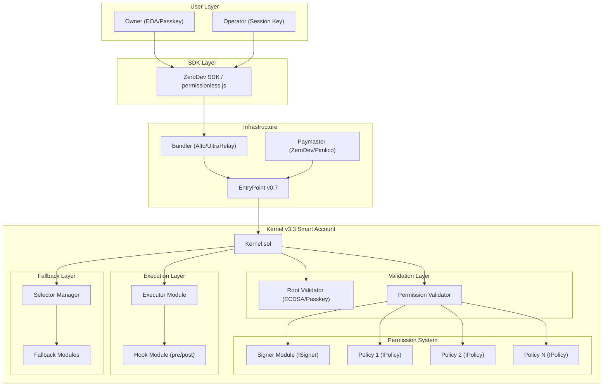

# Architecture C: Kernel / ZeroDev Deep Dive

## 1. Architecture Overview



## 2. Kernel Core Contract Deep Dive

### 2.1 Contract Identity

- **Version**: `kernel.advanced.v0.3.3`
- **Standard**: ERC-4337 + ERC-7579
- **EntryPoint**: v0.7 (immutable)
- **Source**: `repos/kernel/src/Kernel.sol`

### 2.2 Inheritance Chain

```
Kernel
  -> IAccount (ERC-4337)
  -> IAccountExecute (ERC-4337)
  -> IERC7579Account (ERC-7579)
  -> ValidationManager
       -> EIP712
       -> SelectorManager
       -> HookManager
       -> ExecutorManager
```

### 2.3 Storage Architecture

Kernel uses explicit storage slots (ERC-7201 pattern) to avoid collisions:

| Storage | Slot | Purpose |
|---------|------|---------|
| `ValidationStorage` | `0x7bcaa2...` | Root validator, nonces, validation configs, permissions |
| `SelectorStorage` | `0x7c3413...` | Function selector routing (fallback modules) |
| `ExecutorStorage` | `0x1bbee3...` | Executor module configurations |
| `HookStorage` | `0x4605d5...` | Hook module configurations |

**Source**: `repos/kernel/src/types/Constants.sol:54-61`

### 2.4 Proxy Architecture

Kernel uses ERC-1967 minimal proxy pattern:
- `KernelFactory` deploys deterministic ERC-1967 clones via `LibClone.createDeterministicERC1967`
- Upgradeable via `upgradeTo()` (root validator only)
- Address is deterministic based on `keccak256(data, salt)`

**Source**: `repos/kernel/src/factory/KernelFactory.sol`

### 2.5 Initialization

```solidity
function initialize(
    ValidationId _rootValidator,  // Owner validator
    IHook hook,                    // Optional hook for root validator
    bytes calldata validatorData,  // Data for validator.onInstall()
    bytes calldata hookData,       // Data for hook.onInstall()
    bytes[] calldata initConfig    // Additional setup calls (install more modules)
) external
```

The `initConfig` array allows atomic setup of multiple modules in a single transaction. Each entry is a self-call, enabling installation of validators, executors, fallbacks, and permissions all at initialization time.

**Source**: `repos/kernel/src/Kernel.sol:105-133`

## 3. Validation System

### 3.1 Validation Types

Kernel has three validation types encoded in the UserOperation nonce:

| Type | Value | Description |
|------|-------|-------------|
| `ROOT` | `0x00` | Root validator (sudo/owner), unrestricted access |
| `VALIDATOR` | `0x01` | Installed validator module (20-byte address in nonce) |
| `PERMISSION` | `0x02` | Permission-based validation (4-byte permissionId in nonce) |

**Source**: `repos/kernel/src/types/Constants.sol:40-43`

### 3.2 Validation Modes

| Mode | Value | Description |
|------|-------|-------------|
| `DEFAULT` | `0x00` | Validate with already-installed validator |
| `ENABLE` | `0x01` | Install + validate in single UserOp (owner signature required) |
| `INSTALL` | `0x02` | Full install mode |

**Source**: `repos/kernel/src/types/Constants.sol:35-37`

### 3.3 Nonce Encoding

The 256-bit nonce is structured:
```
| 1 byte mode | 1 byte type | 20 bytes validationId | 2 bytes parallelNonceKey | 8 bytes nonce |
```

This allows the EntryPoint to know which validation path to take without any signature parsing.

**Source**: `repos/kernel/src/utils/ValidationTypeLib.sol:61-78`

### 3.4 Root Validator (Sudo Mode)

The root validator has unrestricted access:
- Can call any function selector
- Can install/uninstall modules
- Can change the root validator
- Can upgrade the implementation
- Not subject to nonce invalidation

When `msg.sender` is not EntryPoint or self, the root validator can optionally act as a Hook (if it supports module type 4), providing a direct call path for the owner.

**Source**: `repos/kernel/src/Kernel.sol:88-103`

### 3.5 Permission Validation (Session Keys)

The permission system is the core mechanism for delegated access:

```
PermissionConfig {
    PassFlag permissionFlag;   // Skip flags (skip userOp / skip signature)
    ISigner signer;            // The signing key (e.g., session key ECDSA signer)
    PolicyData[] policyData;   // Array of policies to enforce
}
```

**Validation flow for a Permission-type UserOp**:

1. Decode `PermissionId` from nonce
2. Check `permissionFlag` -- if `SKIP_USEROP` is set, reject
3. For each policy in `policyData[]`:
   - Call `policy.checkUserOpPolicy(permissionId, userOp)`
   - Policy returns `ValidationData` (aggregated via intersection)
   - If any policy returns non-zero address -> `PolicyFailed`
4. Call `signer.checkUserOpSignature(permissionId, userOp, userOpHash)`
5. Intersect all validation results (most restrictive wins)

**Source**: `repos/kernel/src/core/ValidationManager.sol:542-579`

### 3.6 Permission Installation

Permissions are installed as an array of data entries:
- Entries 0..N-2: Each encodes `2 bytes PassFlag + 20 bytes PolicyAddress + remaining initData`
- Last entry (N-1): Encodes the **signer** with same format

Up to 254 policies per permission (0xFF reserved for signer prefix).

```solidity
function _installPermission(PermissionId permission, bytes calldata permissionData) internal {
    // parse PermissionEnableDataFormat
    // for each entry except last: install as Policy
    // last entry: install as Signer
}
```

**Source**: `repos/kernel/src/core/ValidationManager.sol:259-290`

### 3.7 Selector Access Control

Non-root validators are restricted to allowed function selectors:
```solidity
mapping(ValidationId => mapping(bytes4 => bool)) allowedSelectors;
```

When a hook is configured, the UserOp must use `executeUserOp` as the outer selector, with the actual call wrapped inside. The selector check then validates `callData[4:8]` instead of `callData[0:4]`.

**Source**: `repos/kernel/src/Kernel.sol:259-272`

## 4. Module Types (ERC-7579 Extended)

Kernel supports 6 module types (standard ERC-7579 + Kernel extensions):

| Type ID | Name | Interface | Purpose |
|---------|------|-----------|---------|
| 1 | Validator | `IValidator` | Validate UserOps and ERC-1271 signatures |
| 2 | Executor | `IExecutor` | Execute calls on behalf of the account |
| 3 | Fallback | `IFallback` | Handle unrecognized function selectors |
| 4 | Hook | `IHook` | Pre/post execution checks |
| 5 | Policy | `IPolicy` | Permission enforcement rules |
| 6 | Signer | `ISigner` | Session key signature verification |

### 4.1 Validators (Type 1)

```solidity
interface IValidator {
    function validateUserOp(PackedUserOperation calldata userOp, bytes32 userOpHash)
        external payable returns (uint256);
    function isValidSignatureWithSender(address sender, bytes32 hash, bytes calldata data)
        external view returns (bytes4);
}
```

Built-in validators in the repo:
- **ECDSAValidator**: Single owner ECDSA (also implements IHook for direct calls)
- **WeightedECDSAValidator**: Multi-sig with weighted guardians + delay + veto
- **MultiChainValidator**: Cross-chain signature validation
- **EmitIdentifierValidator**: For testing/identification

**Source**: `repos/kernel/src/interfaces/IERC7579Modules.sol:42-67`

### 4.2 Executors (Type 2)

Executors can trigger calls from the account via `executeFromExecutor()`:

```solidity
function executeFromExecutor(ExecMode execMode, bytes calldata executionCalldata)
    external payable returns (bytes[] memory returnData)
```

Each executor has an associated hook. If the caller is not a registered executor, the call reverts.

**Source**: `repos/kernel/src/Kernel.sol:309-328`

### 4.3 Hooks (Type 4)

```solidity
interface IHook {
    function preCheck(address msgSender, uint256 msgValue, bytes calldata msgData)
        external payable returns (bytes memory hookData);
    function postCheck(bytes calldata hookData) external payable;
}
```

Hooks are activated in three scenarios:
1. **UserOp flow**: When validator has a hook and UserOp uses `executeUserOp`
2. **Executor flow**: When executor has an associated hook
3. **Fallback flow**: When fallback handler has a hook

Special hook addresses:
- `address(0)`: Not installed
- `address(1)`: Installed but no hook needed
- `address(0xFF...FF)`: Only EntryPoint can call

**Source**: `repos/kernel/src/core/HookManager.sol`

### 4.4 Policies (Type 5)

```solidity
interface IPolicy {
    function checkUserOpPolicy(bytes32 id, PackedUserOperation calldata userOp)
        external payable returns (uint256);
    function checkSignaturePolicy(bytes32 id, address sender, bytes32 hash, bytes calldata sig)
        external view returns (uint256);
}
```

Policies are the permission enforcement layer. Each policy receives the full UserOp and can:
- Inspect calldata (target, function selector, parameters)
- Enforce value limits
- Check time bounds (via ValidationData)
- Track usage counts (stateful)
- Apply any custom logic

The `PolicyBase` abstract contract provides a standard `onInstall`/`onUninstall` that prepends the `permissionId` to the init data.

**Source**: `repos/kernel/src/sdk/moduleBase/PolicyBase.sol`

### 4.5 Signers (Type 6)

```solidity
interface ISigner {
    function checkUserOpSignature(bytes32 id, PackedUserOperation calldata userOp, bytes32 userOpHash)
        external payable returns (uint256);
    function checkSignature(bytes32 id, address sender, bytes32 hash, bytes calldata sig)
        external view returns (bytes4);
}
```

Signers verify the cryptographic signature of session key holders. They are separate from validators to allow composition: a single signer can be used across multiple permission sets with different policies.

**Source**: `repos/kernel/src/sdk/moduleBase/SignerBase.sol`

## 5. How to Implement the 5 Core Requirements

### 5.1 Custody Preservation (Only Owner Deposits/Withdraws)

**Implementation**: The root validator (ECDSAValidator with owner's key) is the only validation path that can call `execute()` unrestricted. Operator permissions are scoped via `allowedSelectors` mapping -- the operator's permission would NOT include transfer/withdrawal selectors.

```
Root Validator (Owner): Can call any selector -> full custody
Permission (Operator): allowedSelectors = {execute.selector}
                       + policies restrict targets/functions
```

The owner can also call the account directly (not through EntryPoint) when the root validator implements `IHook`, providing a gas-efficient direct call path.

### 5.2 Delegated Execution (Operators Execute Whitelisted Operations)

**Implementation**: Install a Permission with:
- **Signer**: ECDSASigner configured with operator's session key
- **Call Policy**: Restricts which contract addresses and function selectors can be called
- **Parameter policies**: Enforce specific calldata conditions

The operator signs UserOps with the session key, and the Permission system validates:
1. Signature matches the signer
2. All policies pass
3. The target selector is in `allowedSelectors`

### 5.3 Granular Permissions (Target + Selector + Params)

**Implementation**: Kernel's policy system supports arbitrary depth:

1. **Target restriction**: Call policy checks `target address` in execution calldata
2. **Selector restriction**: `allowedSelectors` mapping + policy checks `bytes4 selector`
3. **Parameter conditions**: Custom policies can decode calldata and enforce conditions

Available ZeroDev policy types (from kernel-7579-plugins):
- **Call Policy**: Target address + function selector + parameter conditions
- **Gas Policy**: Gas spending limits
- **Rate Limit Policy**: N calls per time period
- **Timestamp Policy**: validAfter / validUntil
- **Signature Policy**: ERC-1271 signing constraints
- **Sudo Policy**: Unrestricted (for trusted delegates)
- **Custom Policy**: Build-your-own via IPolicy interface

Parameter condition types available in Call Policy:
- Equal to
- Greater than / Less than
- Not equal
- One of (set membership)
- Custom (arbitrary calldata check)

### 5.4 Time-Locked Safety (Delay + Owner Cancel)

**Two approaches**:

**A) WeightedECDSAValidator** (built into Kernel repo):
- Implements weighted multi-sig with configurable delay
- Proposals must be approved by threshold weight before execution
- Owner can **veto** (cancel) any proposal before execution
- Delay is enforced via `ValidAfter` in the validation result
- Source: `repos/kernel/src/validator/WeightedECDSAValidator.sol`

**B) Timestamp Policy + Hook**:
- Timestamp policy sets `validAfter` / `validUntil` on permissions
- A custom hook can implement delay logic (pre-check stores request, post-check verifies elapsed time)
- Owner cancellation via nonce invalidation (`invalidateNonce()`)

**C) Nonce Revocation** (immediate kill switch):
- `invalidateNonce(nonce)` invalidates all validators installed with nonce < specified value
- Effectively revokes all operator permissions in a single transaction
- Source: `repos/kernel/src/core/ValidationManager.sol:146-158`

### 5.5 Gasless UX (Paymaster Integration)

**Implementation**: Kernel is fully ERC-4337 compatible:

1. UserOp includes `paymasterAndData` field
2. EntryPoint calls paymaster to verify sponsorship
3. Paymaster pays gas, account pays nothing

ZeroDev provides integrated paymaster infrastructure with:
- Gas sponsorship policies (per-app, per-user, per-operation)
- ERC-20 token payment (user pays in USDC/DAI instead of ETH)
- UltraRelay for optimized gas sponsorship

## 6. ZeroDev Infrastructure Stack

### 6.1 Bundler: Alto / UltraRelay

- **Alto**: Open-source ERC-4337 bundler by Pimlico (TypeScript)
- **UltraRelay**: ZeroDev's modified version that integrates ERC-7683 relayer functionality
  - Up to 40% faster than standard bundlers
  - 30% cheaper gas costs
  - Native cross-chain support via Across Protocol integration
  - No paymaster required for relayer-based operations

### 6.2 Paymaster

ZeroDev provides managed paymaster with:
- Per-project gas policies
- Allowlisted/blocklisted contracts
- Per-user spending limits
- ERC-20 gas payment
- Dashboard for monitoring

### 6.3 SDK

ZeroDev SDK (built on viem + permissionless.js):
- TypeScript-first
- Session key serialization/deserialization for off-chain storage
- Passkey integration
- Multi-chain account management
- Also compatible with raw permissionless.js

### 6.4 Infrastructure Modes

| Mode | Bundler | Paymaster | Notes |
|------|---------|-----------|-------|
| ZeroDev Managed | UltraRelay | ZeroDev | Easiest, SaaS model |
| Pimlico + ZeroDev | Alto/Pimlico | ZeroDev/Pimlico | Mix & match |
| Self-hosted | Alto (open source) | Custom | Full control, more operational burden |

## 7. Chain Abstraction (CAB)

ZeroDev's chain abstraction leverages:

- **ERC-7683**: Cross-chain intent standard (Across Protocol)
- **UltraRelay**: Executes cross-chain transactions natively
- **Unified Balance**: Users can spend tokens on any chain without manual bridging
- **Multi-chain Session Keys**: `MultiChainSigner` and `MultiChainValidator` support replayable signatures across chains

The `MultiChainValidator` and `MultiChainSigner` in the repo use a chain-agnostic domain separator (chainId=0) to enable signatures that are valid across all chains.

**Source**: `repos/kernel/src/signer/MultiChainSigner.sol`, `repos/kernel/src/validator/MultiChainValidator.sol`

## 8. Gas Cost Estimates

### 8.1 Account Creation

| Account | Creation Gas |
|---------|-------------|
| Kernel v3 (ERC-1967 clone) | ~200K |
| Safe (proxy) | ~290K |
| SimpleAccount | ~280K |

### 8.2 Operation Costs (from benchmarks)

| Operation | Kernel v2.1 | Kernel v2.1-lite | Safe 4337 | SimpleAccount |
|-----------|------------|-----------------|-----------|---------------|
| Total (benchmark suite) | 467,713 | 422,291 | 622,406 | 575,444 |
| Native transfer | ~114K | - | ~150K | ~96K |
| ERC20 transfer | ~117K | - | ~155K | ~105K |

**Key insight**: Kernel is approximately 25-33% more gas-efficient than Safe for common operations, primarily because Kernel uses ERC-1967 proxy (minimal overhead) vs Safe's more complex proxy + module delegation pattern.

### 8.3 Permission Validation Overhead

Permission validation adds gas per policy checked:
- Each policy `checkUserOpPolicy` call: ~5-15K gas depending on complexity
- Signer verification: ~3-8K gas (ECDSA)
- Signature parsing (prefix + length encoding): ~2-3K gas
- Total permission overhead for 3 policies: ~20-50K additional gas

## 9. Maturity Assessment

### 9.1 Audit History

| Audit | Scope | Auditor |
|-------|-------|---------|
| Kernel v3.0 | Core contracts | ChainLight |
| Kernel v3.0 plugins | Validators, policies | Kalos |
| Kernel v3.1 incremental | v3.1 changes | Kalos |
| Kernel v3.2 incremental | v3.2 changes | Kalos |
| Kernel v3.3 incremental | v3.3 changes | Kalos |
| Recovery module | v1 + v2 | Kalos |
| WebAuthn | v1 | Kalos |

All audit reports are available in `repos/kernel/audits/`.

### 9.2 Adoption Metrics (as of 2024-2025)

- **3+ million Kernel accounts** deployed (most of any AA account type)
- 133K accounts in 6-month window (Kernel v3)
- 771K accounts in 6-month window (Kernel v2) -- still in active use
- Winner of inaugural Ethereum AA grant
- Most widely used modular smart account per BundleBear

### 9.3 Ecosystem Support

Kernel is supported by:
- ZeroDev SDK (primary)
- Viem (native support: `toEcdsaKernelSmartAccount`)
- Permissionless.js (Pimlico)
- Privy (embedded wallet provider)
- Multiple other AA SDKs

### 9.4 TVL

No public TVL tracking for Kernel accounts specifically. Unlike Safe which has visible multi-sig holdings, AA wallet TVL is harder to measure since accounts are user-facing rather than treasury-facing.

## 10. Pros and Cons

### Pros

1. **Most gas-efficient modular account**: 25-33% cheaper than Safe for common operations
2. **Native ERC-7579**: Built from scratch for modular architecture, not adapted
3. **Composable permissions**: Signer + N policies model is very flexible
4. **Enable mode**: Install validators in the first UserOp (great UX for session key creation)
5. **Extensive audit coverage**: Multiple incremental audits by ChainLight and Kalos
6. **Largest deployment base**: 3M+ accounts proves production viability
7. **Strong SDK support**: ZeroDev, Viem, Permissionless.js all support Kernel
8. **Multi-chain ready**: Built-in MultiChainValidator and chain-agnostic signatures
9. **Chain abstraction**: ERC-7683 integration for cross-chain operations
10. **EIP-7702 support**: Forward-compatible with EOA-to-smart-account migration

### Cons

1. **Younger codebase than Safe**: Safe has 5+ years of battle-testing vs Kernel's ~2 years
2. **Lower TVL**: Safe secures $100B+ while Kernel has no public TVL figures
3. **Single vendor dependency**: ZeroDev is the primary maintainer
4. **Permission policies not in core repo**: `kernel-7579-plugins` is a separate repository
5. **Complex nonce encoding**: The nonce packing scheme is powerful but non-trivial to understand
6. **No built-in delay module equivalent**: WeightedECDSAValidator provides delay but isn't a generic timelock
7. **Smaller module ecosystem**: Fewer production-tested modules compared to Safe + Zodiac
8. **Documentation gaps**: Some policy types lack detailed documentation

## 11. Vendor Lock-in Risks

### Low Lock-in Areas
- **ERC-7579 compliance**: Standard module interface means modules are portable to other ERC-7579 accounts (Nexus, Safe7579)
- **ERC-4337 compliance**: Any bundler/paymaster works
- **Open source**: MIT licensed, can fork and maintain independently
- **SDK flexibility**: Can use Viem or Permissionless.js instead of ZeroDev SDK

### Medium Lock-in Areas
- **Kernel-specific module types**: Type 5 (Policy) and Type 6 (Signer) are Kernel extensions, not standard ERC-7579
- **ZeroDev infrastructure**: UltraRelay and chain abstraction features are ZeroDev-specific
- **Storage layout**: Migrating from Kernel to another account requires account migration (new address)

### High Lock-in Areas
- **ZeroDev managed services**: If using ZeroDev's bundler/paymaster/dashboard, switching requires infrastructure migration
- **Session key format**: Serialized session keys are ZeroDev SDK-specific

### Mitigation Strategies
1. Use permissionless.js for the SDK layer (vendor-neutral)
2. Use Pimlico or self-hosted Alto for bundler
3. Build custom policies using standard IPolicy interface
4. Deploy Kernel implementation yourself (it's open source)

## 12. Complexity Assessment

### Implementation Complexity: Medium-High

| Component | Complexity | Notes |
|-----------|-----------|-------|
| Account deployment | Low | Factory + initConfig handles everything |
| Owner setup | Low | ECDSAValidator is straightforward |
| Operator permissions | Medium | Requires understanding Permission model (signer + policies) |
| Custom policies | Medium-High | Must implement IPolicy correctly, handle edge cases |
| Hook implementation | Medium | Pre/post check pattern, but context management can be tricky |
| Delay/timelock | High | No built-in equivalent to Zodiac Delay; must compose from WeightedECDSAValidator or custom hook |
| Multi-chain deployment | Medium | MultiChainValidator helps, but orchestrating cross-chain sessions is complex |
| SDK integration | Low | ZeroDev SDK abstracts most complexity |

### Comparison with Other Architectures

| Aspect | Safe + Zodiac | Safe + 7579 | Kernel |
|--------|-------------|-------------|--------|
| Permission granularity | Very High (Zodiac Roles) | High (SmartSessions) | High (Policy system) |
| Gas efficiency | Low | Medium | High |
| Ecosystem maturity | Very High | Medium | Medium-High |
| Module portability | Zodiac-only | ERC-7579 | ERC-7579 (extended) |
| Timelock | Built-in (Zodiac Delay) | Must compose | Must compose |
| SDK options | Limited | Rhinestone/permissionless.js | ZeroDev/Viem/permissionless.js |
| Learning curve | Medium | Medium-High | Medium-High |

### Key Code References

| File | Key Content |
|------|-------------|
| `repos/kernel/src/Kernel.sol` | Main contract, execution, module installation |
| `repos/kernel/src/core/ValidationManager.sol` | Permission system, policy checking, signature verification |
| `repos/kernel/src/core/ExecutorManager.sol` | Executor module management |
| `repos/kernel/src/core/HookManager.sol` | Hook lifecycle (preCheck/postCheck) |
| `repos/kernel/src/core/SelectorManager.sol` | Function selector routing |
| `repos/kernel/src/types/Types.sol` | Custom types (ValidationId, PermissionId, etc.) |
| `repos/kernel/src/types/Constants.sol` | Module type IDs, validation modes/types |
| `repos/kernel/src/utils/ValidationTypeLib.sol` | Nonce encoding/decoding, validator identity |
| `repos/kernel/src/validator/ECDSAValidator.sol` | Reference validator + hook |
| `repos/kernel/src/validator/WeightedECDSAValidator.sol` | Multi-sig with delay + veto |
| `repos/kernel/src/sdk/moduleBase/PolicyBase.sol` | Base class for building policies |
| `repos/kernel/src/sdk/moduleBase/SignerBase.sol` | Base class for building signers |
| `repos/kernel/src/factory/KernelFactory.sol` | Deterministic deployment |
