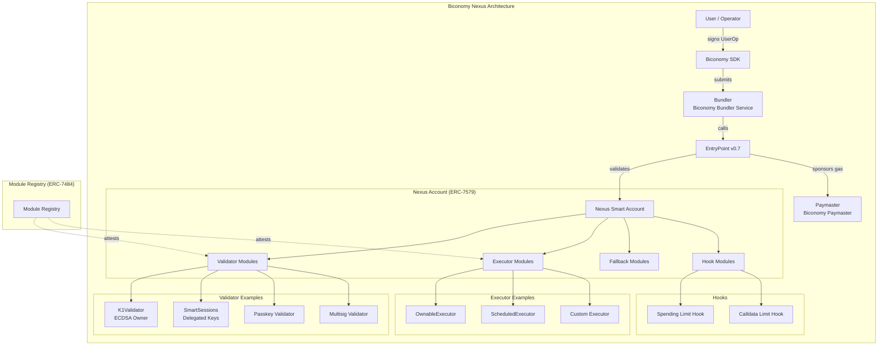
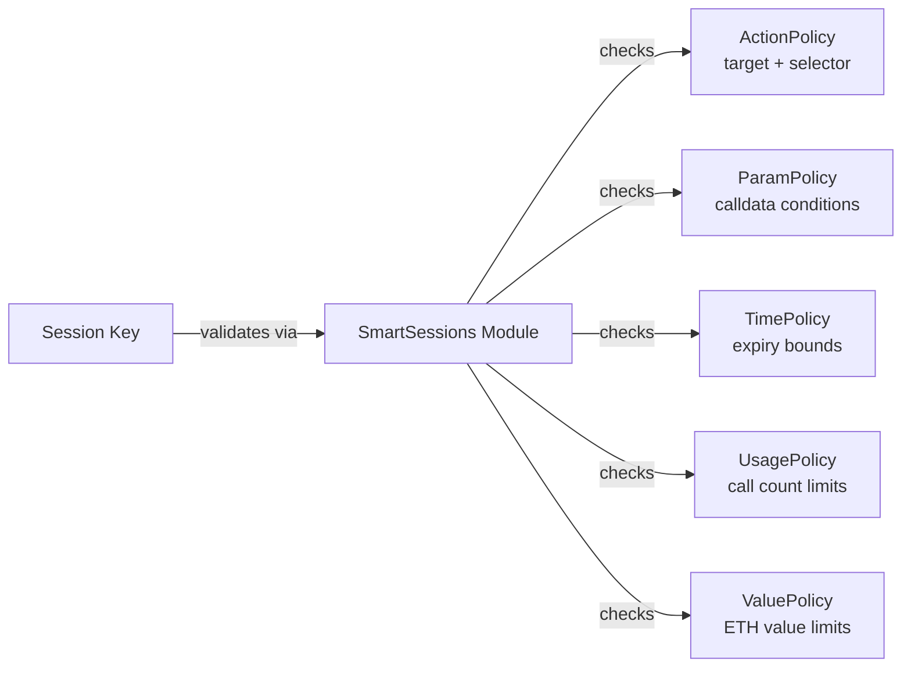

# Biconomy Nexus (Smart Account v3) - Deep Dive

## 1. Architecture Overview



## 2. Core Components Analysis

### 2.1 Nexus Smart Account Contract

Nexus is Biconomy's third-generation smart account, a complete rewrite from their v2 (the `scw-contracts` repo). It is built natively on **ERC-7579** and is compliant with:

| Standard | Purpose |
|----------|---------|
| **ERC-4337** | Account abstraction (EntryPoint v0.7) |
| **ERC-7579** | Modular smart account interface |
| **ERC-7484** | Module registry for security attestation |
| **ERC-7739** | Nested typed data for safe EIP-712 signing |
| **ERC-7562** | Validation rules compliance |

**Key design:** Nexus is a thin execution kernel. Almost all logic (ownership, validation, permissions) lives in installable/removable modules. The account itself only manages:
- Module installation/uninstallation
- Execution routing (single, batch, delegatecall)
- Fallback routing
- Hook execution (pre/post)

### 2.2 Module System

Nexus uses the standard ERC-7579 module types:

| Type | ID | Purpose | Example |
|------|----|---------|---------|
| **Validator** | 1 | Validates UserOps and ERC-1271 signatures | K1Validator, SmartSessions, PasskeyValidator |
| **Executor** | 2 | Executes transactions on behalf of account | OwnableExecutor, ScheduledOrders |
| **Fallback** | 3 | Handles calls to unrecognized selectors | Token receivers, compatibility layers |
| **Hook** | 4 | Pre/post execution checks | SpendingLimitHook, rate limiters |

**Module Type ID 0:** Nexus supports multi-type module installations in a single operation. A module can register as both a Validator and a Hook simultaneously.

**Enable Mode:** Modules can be installed during the validation phase of a UserOp, eliminating the need for a separate installation transaction. This is critical for onboarding flows where the first transaction also sets up permissions.

### 2.3 SmartSessions Module (Delegated Execution)

This is the key module for our use case. SmartSessions is a **shared ERC-7579 module** (from the `erc7579/smartsessions` repo) that enables:

- **Session creation:** Owner grants a session key with specific permissions
- **Policy enforcement:** Each session can have multiple policies:
  - **Target contract whitelist** (ActionPolicy)
  - **Function selector whitelist**
  - **Parameter conditions** (e.g., "amount <= X", "recipient == Y")
  - **Time bounds** (validAfter, validUntil)
  - **Usage limits** (max calls, max value)
- **Session revocation:** Owner can revoke at any time



**This is essentially equivalent to Zodiac Roles v2 but in the ERC-7579 paradigm.** Each policy is a separate smart contract that implements a standard interface, making the system highly composable.

### 2.4 Biconomy v2 vs Nexus (v3) Comparison

The local `scw-contracts` repo contains **v2** which is the legacy architecture:

| Aspect | v2 (scw-contracts) | Nexus (v3) |
|--------|-------------------|------------|
| Standard | Custom modular | ERC-7579 native |
| Session Keys | Merkle tree of session data | SmartSessions with policy contracts |
| Validation | IAuthorizationModule | ERC-7579 Validator type |
| Modules | Biconomy-specific interface | Universal ERC-7579 modules |
| Registry | None | ERC-7484 Module Registry |
| EntryPoint | v0.6 | v0.7 |

**v2 Session Keys (from local code):** The `SessionKeyManagerModule.sol` uses a Merkle tree where each leaf contains `(validUntil, validAfter, sessionValidationModule, sessionKeyData, merkleProof)`. The session validation is delegated to specialized `ISessionValidationModule` contracts (e.g., `ERC20SessionValidationModule`). This is functional but less flexible than the SmartSessions approach.

## 3. Implementing the 5 Core Requirements

### 3.1 Custody Preservation (Owner Controls Deposits/Withdrawals)

**Implementation:** Install a `K1Validator` as the primary owner validator. Only UserOps signed by the owner's ECDSA key can:
- Transfer ETH/tokens out
- Install/uninstall modules
- Upgrade the account

**Mechanism:** The account's `execute()` function checks that `msg.sender == entryPoint`, and the EntryPoint only calls it after successful validation. Only the installed validator(s) can pass validation.

**Rating: Strong.** The ERC-7579 architecture cleanly separates ownership (validator) from delegated actions (executor/session keys).

### 3.2 Delegated Execution (Operators Execute Whitelisted DeFi Ops)

**Implementation:** Use `SmartSessions` module:

1. Owner creates a session granting operator's key permissions:
   ```
   Session {
     sessionValidator: SmartSessionsValidator,
     sessionKeyData: operatorPublicKey,
     actionPolicies: [
       { target: uniswapRouter, selector: exactInputSingle, paramRules: [...] },
       { target: aavePool, selector: supply, paramRules: [...] }
     ],
     enableAfter: timestamp,
     enableUntil: timestamp
   }
   ```
2. Operator signs UserOps with their session key
3. SmartSessions validates the signature AND checks all policies

**Rating: Excellent.** The policy system is granular and extensible. Custom policy contracts can encode any condition.

### 3.3 Granular Permissions (Target, Selector, Parameter Conditions)

**Available permission granularity:**

| Level | Support | Details |
|-------|---------|---------|
| Target contract | Yes | ActionPolicy whitelists specific addresses |
| Function selector | Yes | ActionPolicy specifies allowed selectors |
| Parameter conditions | Yes | ParamPolicy can check individual calldata parameters |
| Value limits | Yes | ValuePolicy limits ETH sent with calls |
| Gas limits | Yes | Can be enforced via policies |
| Time bounds | Yes | Built into session configuration |
| Call count | Yes | UsagePolicy tracks invocation count |

**Parameter conditions** support:
- Equality (`param == value`)
- Less/greater than (`param < value`)
- Bitmask checks
- Reference to account address ("recipient must be self")

### 3.4 Safety Mechanism (Timelock / Cancel)

**No native Delay/Timelock module exists in the Rhinestone/ERC-7579 ecosystem** that mirrors Zodiac's Delay Module. However, several approaches work:

1. **Session expiry + revocation:** Sessions have built-in `validUntil` timestamps. Owner can revoke at any time by calling `revokeSession()` on the SmartSessions module.

2. **Hook-based timelock:** A custom Hook module could enforce a delay between executor actions. The hook's `preCheck()` function would verify that sufficient time has elapsed since the last operation.

3. **Scheduled executor:** The ScheduledOrders executor from Rhinestone can enforce time-based execution windows.

4. **Two-step execution:** A custom executor could implement propose-then-execute with a configurable delay period.

**Rating: Moderate.** Requires custom development for a true Delay Module equivalent. Session revocation provides immediate cancellation, but there is no built-in "cooldown period before execution" mechanism.

### 3.5 Gasless UX (Account Abstraction + Paymaster)

**Implementation:** Biconomy operates its own paymaster infrastructure:

- **Sponsorship Paymaster:** Dapp sponsors all gas for users
- **Token Paymaster:** Users pay gas in ERC-20 tokens (USDC, etc.)
- **Hybrid:** Conditional sponsorship based on user type or action

The SDK handles UserOp construction, signing, and paymaster interaction automatically:

```typescript
// Biconomy SDK example
const nexusClient = await createNexusClient({
  signer: ownerSigner,
  chain: base,
  transport: http(),
  bundlerTransport: http(biconomyBundlerUrl),
  paymaster: createBiconomyPaymaster({ paymasterUrl })
});

// Gasless transaction
await nexusClient.sendTransaction({
  to: uniswapRouter,
  data: swapCalldata,
  value: 0n
});
```

**Rating: Excellent.** Biconomy's core business is AA infrastructure; their paymaster and bundler are battle-tested.

## 4. Gas Cost Estimates

| Operation | Nexus (v3) | Safe + 7579 | Kernel v3 | SimpleAccount |
|-----------|-----------|-------------|-----------|---------------|
| **Account creation** | ~297K gas | ~350K+ gas | ~257K gas | ~410K gas |
| **Native transfer** | ~85K gas | ~95K gas | ~80K gas | ~75K gas |
| **ERC-20 transfer** | ~95K gas | ~110K gas | ~90K gas | ~85K gas |
| **Session key op** | ~120-150K gas | ~130-160K gas | ~110-140K gas | N/A |

**Biconomy claims Nexus is up to 25% cheaper** than competing solutions, with gas optimization work done by Gaslite (a well-known gas optimization team).

**Notes:**
- Account creation uses CREATE2 for deterministic addresses
- Gas costs vary significantly by L2 (calldata compression)
- Session key operations add ~30-50K gas overhead vs owner operations
- Batch operations amortize validation costs

## 5. Maturity Assessment

### Audits

| Auditor | Date | Scope | Findings |
|---------|------|-------|----------|
| **Spearbit** | 2024 | Nexus core contracts | No critical issues |
| **Cyfrin** | 2024 | Nexus + modules | Reported findings addressed |
| **Cantina** | 2024 | Competition audit | Community audit |
| **Zenith** | 2024 | Additional review | Additional coverage |

**DeFi Safety Score:** 92%

### Adoption

- **4.6M+ smart accounts** deployed (across v2 and Nexus)
- **$5.5M+ supertransaction volume**
- **Notable integration:** Gemini self-custodial wallet uses Nexus
- **SDK downloads:** High usage via npm `@biconomy/account`
- Multi-chain: Deployed on Ethereum, Polygon, Arbitrum, Optimism, Base, BSC, Avalanche, and more

### Module Ecosystem

Nexus benefits from the **shared ERC-7579 module ecosystem**:
- Rhinestone core-modules (14 audited modules)
- SmartSessions (shared standard)
- Community modules via Module Registry
- Biconomy-specific modules for their SDK

## 6. Pros and Cons for Our Use Case

### Pros

1. **Native ERC-7579:** Full module interoperability; not locked into Biconomy's ecosystem
2. **SmartSessions:** The closest off-the-shelf solution to our permission requirements
3. **Mature infrastructure:** Biconomy's bundler and paymaster are production-proven
4. **Gas efficiency:** Competitive gas costs, especially on L2s
5. **SDK quality:** Well-documented TypeScript SDK with good DX
6. **Multi-chain:** Already deployed across major L2s
7. **ERC-7484 registry:** Module security attestation built-in
8. **Gemini adoption:** Validates enterprise-grade reliability
9. **Enable Mode:** Seamless module installation during first transaction

### Cons

1. **No native timelock:** Requires custom Hook or Executor module for delay mechanism
2. **Newer than Safe:** Less battle-tested than Safe's 5+ years
3. **v2 to v3 migration:** Ecosystem still transitioning; some docs reference v2
4. **SmartSessions complexity:** Policy configuration is powerful but complex
5. **Biconomy SDK coupling:** While contracts are standard, the SDK adds some vendor dependency
6. **Token (BICO):** Potential governance token dynamics affecting roadmap

## 7. Vendor Lock-in Risk

**Low to Moderate.**

- **Contracts:** Fully ERC-7579 compliant; can use with any ERC-7579 compatible tooling
- **Modules:** Standard ERC-7579 modules work across all compliant accounts (Safe7579, Kernel, etc.)
- **Bundler/Paymaster:** Can swap to Pimlico, Alchemy, or self-hosted alternatives
- **SDK:** The Biconomy SDK simplifies integration but `permissionless.js` or `viem` can interact with Nexus directly
- **Risk factor:** If Biconomy disappears, the on-chain contracts and modules continue to work. Infrastructure (bundler/paymaster) needs replacement.

## 8. Complexity Assessment

| Aspect | Complexity | Notes |
|--------|-----------|-------|
| Account deployment | Low | Factory pattern, SDK handles it |
| Owner management | Low | K1Validator installation |
| Permission setup | Medium-High | SmartSessions policy configuration |
| Custom policies | High | Requires writing/auditing Solidity policy contracts |
| Timelock implementation | High | No off-the-shelf; needs custom module |
| SDK integration | Low-Medium | Good docs, TypeScript SDK |
| Multi-chain deployment | Low | Already deployed, deterministic addresses |
| Monitoring/indexing | Medium | Need to index module events |

**Overall complexity: Medium.** The hardest part is configuring SmartSessions policies correctly and building a custom timelock mechanism. The infrastructure layer is well-handled by Biconomy's services.

## 9. Key Repositories

- **Nexus contracts:** https://github.com/bcnmy/nexus
- **SmartSessions:** https://github.com/erc7579/smartsessions
- **Biconomy SDK:** https://github.com/bcnmy/sdk
- **Legacy v2 (local):** `repos/scw-contracts/` (for reference only)

## 10. Verdict for ManagedAccount

**Strong candidate, especially if combined with Safe7579 module ecosystem.**

Nexus provides native ERC-7579 compliance with excellent gas efficiency and a mature AA infrastructure. The SmartSessions module closely matches our permission requirements (target + selector + parameter conditions). The main gap is the lack of a native timelock/delay mechanism, which would need custom development.

**Recommendation:** Consider Nexus as the account layer if:
- Gas efficiency is a top priority
- The team is comfortable building a custom delay Hook module
- Native ERC-7579 (vs adapted via Safe7579) is preferred
- Biconomy's managed infrastructure is acceptable

If the Safe ecosystem's maturity and existing Delay Module are more important, Safe + Safe7579 adapter may be preferable despite slightly higher gas costs.
