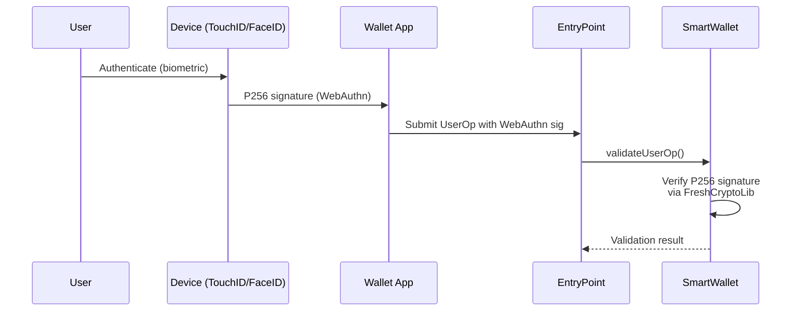
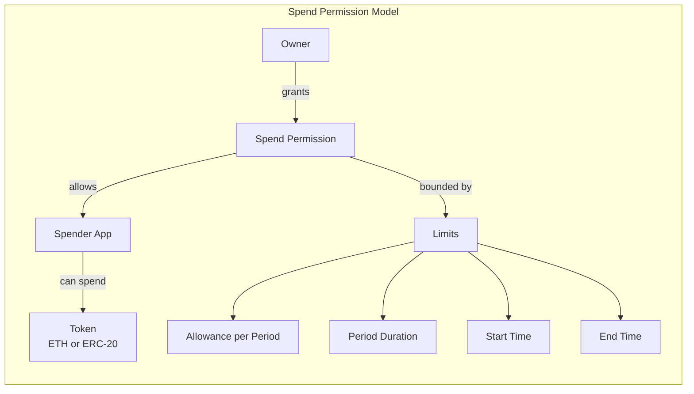

# Coinbase Smart Wallet - Deep Dive

## 1. Architecture Overview

```mermaid
graph TB
    subgraph "Coinbase Smart Wallet Architecture"
        U[User] -->|authenticates via| PK[Passkey / WebAuthn]
        U -->|or signs with| EOA[EOA Signer]

        PK -->|P256 signature| SW[CoinbaseSmartWallet]
        EOA -->|secp256k1 signature| SW

        SW -->|ERC-4337| EP[EntryPoint v0.6]
        EP -->|validates| SW

        subgraph "CoinbaseSmartWallet Contract"
            SW --> OW[Owner Registry<br/>bytes[] owners<br/>max 2^256]
            SW --> EX[execute / executeBatch]
            SW --> VL[validateUserOp]
            SW --> SIG[isValidSignature<br/>ERC-1271]
        end

        subgraph "Owner Types"
            OW --> ADDR[Ethereum Address<br/>32 bytes]
            OW --> PKEY[Passkey Public Key<br/>64 bytes: x,y]
        end

        EP -->|sponsors gas| PM[Coinbase Paymaster<br/>Magic Spend]
    end

    subgraph "Delegated Spending"
        SPM[SpendPermissionManager]
        SPM -->|added as owner| SW
        SPM -->|enforces| SP[Spend Permissions<br/>token, amount, period]
        APP[App / Spender] -->|requests| SPM
    end
```

## 2. Core Components Analysis

### 2.1 CoinbaseSmartWallet Contract

The Coinbase Smart Wallet is a **purpose-built ERC-4337 smart account** that prioritizes simplicity and passkey-first authentication. It is NOT modular (no ERC-7579 or ERC-6900 support).

**Key characteristics:**
- Built on Solady's ERC-4337 implementation
- Influenced by DaimoAccount (pioneered passkey signers on ERC-4337)
- Influenced by Alchemy's LightAccount
- Supports both secp256k1 (EOA) and secp256r1 (passkey/WebAuthn) signers
- Multi-owner by default (up to 2^256 owners)
- Each owner acts independently (no multisig threshold)
- UUPS upgradeable

### 2.2 Owner Model

Owners are stored as `bytes` rather than `address` to support both signer types:

| Owner Type | Encoding | Signature Verification |
|------------|----------|----------------------|
| **Ethereum Address** | 32 bytes (ABI-encoded address) | `ecrecover` / ERC-1271 |
| **Passkey (P256)** | 64 bytes (x, y coordinates) | WebAuthn / FreshCryptoLib |

**Key design decisions:**
- `ownerIndex` (not public key) is passed in signatures to minimize calldata costs on L2s
- Each owner can independently execute transactions
- No threshold or multisig requirements built-in
- Adding/removing owners requires an existing owner's signature

### 2.3 WebAuthn / Passkey Integration

Passkeys are the primary innovation of Coinbase Smart Wallet:



**WebAuthnAuth struct:**
```solidity
struct WebAuthnAuth {
    bytes authenticatorData;
    string clientDataJSON;
    uint256 challengeIndex;  // location of challenge in clientDataJSON
    uint256 typeIndex;       // location of "type" in clientDataJSON
    uint256 r;               // P256 signature component
    uint256 s;               // P256 signature component
}
```

The P256 signature verification is done onchain using `FreshCryptoLib` (or RIP-7212 precompile where available), making passkey authentication fully trustless.

### 2.4 SpendPermissionManager (Delegated Spending)

For delegated execution, Coinbase developed a separate **SpendPermissionManager** singleton:



**Critical limitation:** SpendPermissionManager only supports:
- Spending native ETH
- Spending ERC-20 tokens
- Recurring allowance per time period

**It does NOT support:**
- Arbitrary function calls
- Contract interaction whitelisting
- Function selector restrictions
- Parameter condition enforcement
- DeFi operation delegation

The SpendPermissionManager is added as an **owner** of the wallet, giving it full execution rights, but the contract itself constrains what it will do to only token transfers within the permitted limits.

## 3. Implementing the 5 Core Requirements

### 3.1 Custody Preservation

**Implementation:** Owner passkey/EOA controls the wallet. Only owners can execute arbitrary transactions.

**Rating: Strong.** The multi-owner model with independent signing is clean. Adding an "operator" as a full owner would defeat custody preservation.

### 3.2 Delegated Execution (Operators Execute Whitelisted DeFi Ops)

**Implementation: NOT NATIVELY SUPPORTED.**

The SpendPermissionManager only handles token spending, not arbitrary DeFi operations. To implement delegated DeFi execution, you would need to either:

1. **Add operator as an owner** -- gives full custody (unacceptable)
2. **Build a custom permission manager** -- significant development effort
3. **Wrap in a different account** -- defeats the purpose

**Rating: Poor for our use case.** The wallet was designed for consumer-facing simplicity, not programmable delegation.

### 3.3 Granular Permissions

| Level | Support | Details |
|-------|---------|---------|
| Target contract | No | SpendPermissions only target token contracts |
| Function selector | No | Only transfer/approve |
| Parameter conditions | Partial | Amount limits and time bounds only |
| Time bounds | Yes | Start/end timestamps, recurring periods |
| Call count | No | Only amount-based limits |

**Rating: Very limited.** The permission model is designed for subscription-style token spending, not DeFi operation whitelisting.

### 3.4 Safety Mechanism (Timelock / Cancel)

**No native timelock.** The owner can:
- Remove the SpendPermissionManager as an owner (revokes all spend permissions)
- Individual spend permissions can be revoked

There is no delay mechanism, cooldown period, or propose-then-execute flow.

**Rating: Minimal.** Would require custom development on top.

### 3.5 Gasless UX

**Implementation: Excellent.**

Coinbase provides:
- **Magic Spend:** Coinbase-sponsored gas on Base (primary chain)
- **Paymaster API:** CDP API provides paymaster for Base Sepolia (free) and Base Mainnet
- **Gas sponsorship:** The CDP API automatically sponsors gas on testnets

Coinbase's primary value proposition is zero-friction onboarding with gas abstraction on Base.

**Rating: Excellent on Base. Good on other chains** (requires external paymaster).

## 4. Gas Cost Estimates

| Operation | Coinbase Smart Wallet | Safe | Kernel | SimpleAccount |
|-----------|----------------------|------|--------|---------------|
| **Account creation** | ~300-350K gas | ~350K+ gas | ~257K gas | ~410K gas |
| **Native transfer** | ~80-90K gas | ~95K gas | ~80K gas | ~75K gas |
| **ERC-20 transfer** | ~90-100K gas | ~110K gas | ~90K gas | ~85K gas |

**On L2s (Base):** Gas costs are optimized via calldata compression. The `ownerIndex` optimization (using index instead of full public key in signatures) specifically targets L2 calldata costs.

**Note:** Smart contract wallets use more gas per transaction than EOA wallets. Coinbase recommends using them on L2s where the difference is negligible (~$0.001 difference).

**Deployment cost on L2 (Base):** ~$0.15-0.45 per account. At scale (1M users), this is ~$150K-450K.

## 5. Maturity Assessment

### Audits

| Auditor | Scope | Count |
|---------|-------|-------|
| **Multiple firms** | Smart contracts | 4 separate audits |
| **Cantina** | SpendPermissionManager | Competition audit |
| **Passkey verification** | FreshCryptoLib (P256) | Separately audited |

The contracts are open-source on GitHub with extensive test coverage.

### Adoption

- **Massive distribution:** Integrated into Coinbase Wallet (tens of millions of users)
- **Base ecosystem:** Primary smart wallet for Base chain
- **Developer adoption:** Embedded in Coinbase Developer Platform (CDP)
- **Partners:** Many Base-native dApps integrate via CDP SDK

### Chain Support

| Chain | Status |
|-------|--------|
| **Base** | Primary, full support |
| **Ethereum** | Supported |
| **Optimism** | Supported |
| **Arbitrum** | Supported |
| **Polygon** | Supported |
| **Avalanche** | Supported |
| **BSC** | Supported |
| **Zora** | Supported |

Factory deployed via Safe Singleton Factory -- same address across **248 chains**.

## 6. Pros and Cons for Our Use Case

### Pros

1. **Passkey authentication:** Best-in-class WebAuthn integration; great UX for end users
2. **Massive adoption:** Coinbase distribution guarantees long-term support
3. **Simple architecture:** Easy to understand and audit
4. **Gas efficient:** Optimized for L2s, especially Base
5. **Base ecosystem:** If deploying primarily on Base, strong ecosystem support
6. **4 audits:** Well-reviewed security
7. **Open source:** Fully transparent codebase

### Cons

1. **No modular architecture:** Not ERC-7579 or ERC-6900 compliant; cannot install modules
2. **No delegated DeFi execution:** SpendPermissionManager only handles token spending
3. **No granular permissions:** Cannot whitelist contract + selector + parameters
4. **No timelock/delay mechanism:** No built-in safety mechanism for delegated actions
5. **Not extensible:** Adding new functionality requires upgrading the entire account
6. **Coinbase-centric:** Optimized for Coinbase ecosystem; less suitable for independent deployment
7. **Consumer-focused:** Designed for retail users, not institutional/DeFi-native workflows
8. **No ERC-7579 modules:** Cannot leverage the shared module ecosystem

## 7. Vendor Lock-in Risk

**High.**

- **Contracts:** Purpose-built, not modular. Cannot swap components.
- **Infrastructure:** Heavily tied to Coinbase's paymaster and CDP platform
- **Ecosystem:** Optimized for Base; less infrastructure on other chains
- **SDK:** Coinbase SDK is the primary integration path
- **No module marketplace:** Cannot extend functionality without contract upgrades
- **Mitigation:** Contracts are open-source and self-deployable, but lose Coinbase infrastructure benefits

## 8. Complexity Assessment

| Aspect | Complexity | Notes |
|--------|-----------|-------|
| Account deployment | Low | Factory pattern, CDP SDK |
| Owner management | Low | Add/remove owners |
| Passkey setup | Low | SDK handles WebAuthn flow |
| Permission setup | N/A | Not supported for our use case |
| Delegation | High | Would need entirely custom solution |
| SDK integration | Low | Well-documented CDP SDK |
| Multi-chain deployment | Low | Pre-deployed factory |
| Monitoring | Low | Simple event model |

**Overall complexity for our use case: Very High** (because the core delegation features we need don't exist).

## 9. Key Repositories

- **Smart Wallet contracts:** https://github.com/coinbase/smart-wallet
- **Spend Permissions:** https://github.com/coinbase/spend-permissions
- **Smart Wallet Permissions (deprecated?):** https://github.com/coinbase/smart-wallet-permissions
- **CDP Documentation:** https://docs.cdp.coinbase.com

## 10. Verdict for ManagedAccount

**Not suitable for our use case.**

Coinbase Smart Wallet is an excellent consumer wallet with industry-leading passkey UX, but it fundamentally lacks the programmable delegation features we need. There is no way to:
- Grant an operator limited execution rights for specific DeFi operations
- Enforce target/selector/parameter conditions
- Implement a timelock or delay mechanism

The SpendPermissionManager only handles recurring token allowances (think subscriptions), not arbitrary DeFi operation delegation.

**However**, Coinbase Smart Wallet is worth studying for:
- **Passkey/WebAuthn integration patterns** -- could be used as a signer for our chosen account
- **L2 gas optimization techniques** -- ownerIndex optimization is clever
- **User onboarding UX** -- the "create wallet in seconds" flow is best-in-class

**Recommendation:** Do not use as the account implementation. Consider borrowing the passkey authentication pattern if user-facing key management is a priority, and potentially integrating with Coinbase Wallet as a frontend signer.
