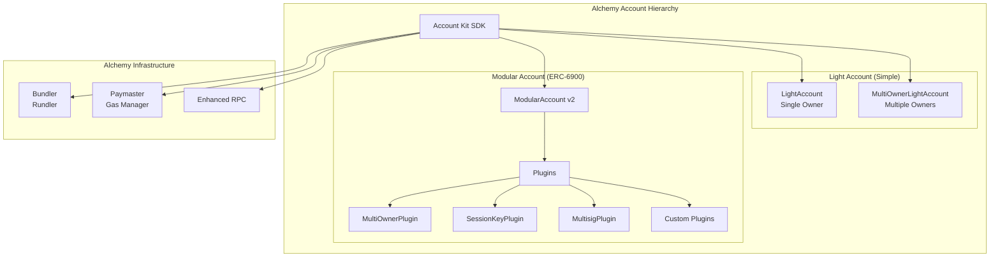
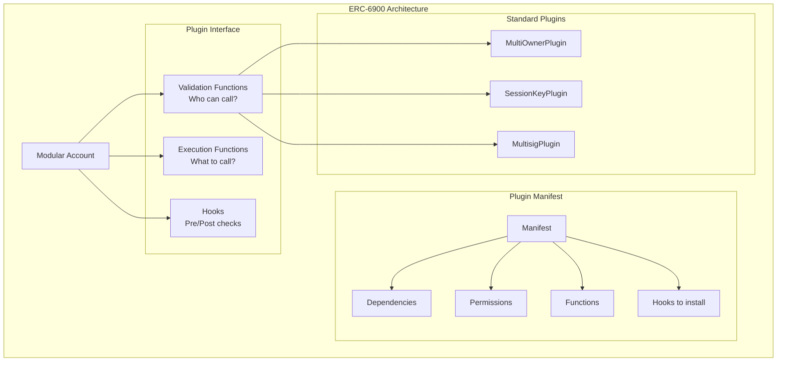

# Alchemy Light Account & ERC-6900 Modular Account - Deep Dive

## 1. Architecture Overview

Alchemy offers **two distinct smart account implementations** that serve different use cases:

1. **Light Account** -- Lightweight, gas-optimized, minimal ERC-4337 account
2. **Modular Account** -- Full-featured ERC-6900 compliant modular account



---

## Part A: Light Account

### 2A. Core Components (Light Account)

From the local `repos/light-account/` codebase:

**LightAccount.sol** -- Single-owner ERC-4337 account:
- Extends `BaseLightAccount` which inherits from `BaseAccount` (ERC-4337)
- Single ECDSA owner stored in namespaced storage
- Supports `execute()`, `executeBatch()` (with and without value arrays)
- UUPS upgradeable
- ERC-1271 signature validation
- Ownership transfer via `transferOwnership()`

**MultiOwnerLightAccount.sol** -- Multi-owner variant:
- Uses `LinkedListSet` for owner management
- `updateOwners(address[] ownersToAdd, address[] ownersToRemove)`
- Any single owner can execute independently
- Same execution interface as LightAccount

**Key observations from code review:**
- Very clean, minimal codebase (~300 lines per contract)
- No module system, no hooks, no plugins
- `onlyAuthorized` modifier restricts execution to owner or EntryPoint
- Uses custom slot storage to avoid clashes during upgrades
- Supports ERC-1271 with both EOA and contract (SCA) owner types

### 3A. Implementing Core Requirements with Light Account

| Requirement | Support | Details |
|-------------|---------|---------|
| Custody preservation | Yes | Owner-only execution via `onlyAuthorized` |
| Delegated execution | **No** | No module/plugin system |
| Granular permissions | **No** | All-or-nothing owner access |
| Timelock/delay | **No** | No hook or module system |
| Gasless UX | Yes | Works with any ERC-4337 paymaster |

**Verdict for Light Account: Not suitable for our use case.** It is intentionally minimal -- a thin wrapper around SimpleAccount with better storage patterns and multi-owner support. No extensibility path for delegated execution.

### 4A. Gas Cost Estimates (Light Account)

| Operation | LightAccount | MultiOwner LA | SimpleAccount |
|-----------|-------------|---------------|---------------|
| **Deployment** | ~250K gas | ~270K gas | ~410K gas |
| **Native transfer** | ~73K gas | ~75K gas | ~75K gas |
| **ERC-20 transfer** | ~83K gas | ~86K gas | ~85K gas |

Light Account is one of the most gas-efficient ERC-4337 accounts available.

### 5A. Maturity (Light Account)

- **Audits:** 2 Quantstamp audits (Jan 2024, Apr 2024) -- found in `repos/light-account/audits/`
- **Versions:** v1.1.0 (EntryPoint v0.6) and v2.0.0 (EntryPoint v0.7)
- **Usage:** Default account in Alchemy Account Kit; widely deployed
- **License:** GPL-3.0 and MIT dual-licensed

---

## Part B: Modular Account (ERC-6900)

### 2B. ERC-6900 Standard Overview

ERC-6900 is a **comprehensive modular account standard** proposed by Alchemy in April 2023. It takes a more opinionated approach than ERC-7579:



### ERC-6900 vs ERC-7579 Comparison

| Aspect | ERC-6900 | ERC-7579 |
|--------|----------|----------|
| **Philosophy** | Comprehensive, opinionated | Minimal, flexible |
| **Module composition** | Developer-defined manifests | User-defined at install time |
| **Dependencies** | Explicit in manifest | No dependency system |
| **Permissions** | Defined per plugin | Not standardized |
| **Module types** | Validation, Execution, Hooks | Validator, Executor, Fallback, Hook |
| **Interoperability** | ERC-6900 accounts only | Cross-implementation |
| **Proponents** | Alchemy | Rhinestone, Biconomy, ZeroDev, OKX |
| **Status** | Draft ERC | Draft ERC (wider adoption) |
| **Analogy** | Android permission system | Unix philosophy |

**Key insight:** ERC-6900 plugins declare their own dependencies and permissions in a "manifest" at development time. ERC-7579 modules are independent; the user decides how they interact at installation time. This means:
- ERC-6900 plugins are more self-documenting and predictable
- ERC-7579 modules are more composable and portable
- ERC-6900 has higher vendor lock-in risk (plugins not portable to ERC-7579 accounts)
- ERC-7579 has higher misconfiguration risk (user must correctly compose modules)

### 2B.2 Modular Account v2 (MAv2)

Alchemy's production implementation of ERC-6900:

**Pre-built Plugins:**

| Plugin | Purpose | Details |
|--------|---------|---------|
| **MultiOwnerPlugin** | Ownership management | Multiple ECDSA/SCA owners, any single owner can execute |
| **SessionKeyPlugin** | Delegated execution | Session keys with enforced expiries, permission scoping |
| **MultisigPlugin** | Threshold signatures | k-of-n multisig validation |

**SessionKeyPlugin capabilities:**
- Time-bounded session keys (validAfter, validUntil)
- Function selector restrictions
- Contract address whitelisting
- Spending limits
- Custom permission checks via callback

### 3B. Implementing Core Requirements with Modular Account

#### 3B.1 Custody Preservation

**Implementation:** Install `MultiOwnerPlugin` with the account owner. Only owner-signed UserOps can:
- Install/uninstall plugins
- Execute arbitrary transactions
- Manage other owners

**Rating: Strong.** Standard ERC-6900 ownership model.

#### 3B.2 Delegated Execution

**Implementation:** Use `SessionKeyPlugin`:
1. Owner creates a session key for the operator
2. Session key is scoped to specific permissions
3. Operator signs UserOps with the session key
4. Plugin validates permissions before execution

```
SessionKey Configuration:
  - signer: operatorAddress
  - validAfter: timestamp
  - validUntil: timestamp
  - permissions: [
      { target: uniswapRouter, selector: 0x..., ... },
      { target: aavePool, selector: 0x..., ... }
    ]
```

**Rating: Good.** The SessionKeyPlugin provides the core delegation functionality, though it may be less flexible than SmartSessions (ERC-7579) for complex parameter conditions.

#### 3B.3 Granular Permissions

| Level | Support | Details |
|-------|---------|---------|
| Target contract | Yes | Session key permissions |
| Function selector | Yes | Session key permissions |
| Parameter conditions | Partial | Via custom permission callbacks |
| Time bounds | Yes | validAfter, validUntil |
| Spending limits | Yes | Built-in spending limit checks |
| Call count | Limited | Not natively, requires custom hook |

**Rating: Good.** Covers most requirements. Complex parameter conditions may require custom plugin development.

#### 3B.4 Safety Mechanism (Timelock / Cancel)

**No native timelock plugin.** Options:
1. Session key expiry provides time-bounded access
2. Owner can uninstall the SessionKeyPlugin at any time
3. Custom plugin could implement propose-then-execute
4. Hook could enforce cooldown periods

**Rating: Moderate.** Similar situation to Nexus -- no off-the-shelf delay mechanism.

#### 3B.5 Gasless UX

**Alchemy infrastructure:**
- **Rundler:** Alchemy's Rust-based ERC-4337 bundler (open-source)
- **Gas Manager:** Paymaster API with sponsorship policies
- **Account Kit SDK:** Handles UserOp construction and submission

**Rating: Excellent.** Alchemy's AA infrastructure is industry-leading.

### 4B. Gas Cost Estimates (Modular Account)

| Operation | MAv2 | Nexus | Safe + 7579 | SimpleAccount |
|-----------|------|-------|-------------|---------------|
| **Deployment** | ~350-400K gas | ~297K gas | ~350K+ gas | ~410K gas |
| **Native transfer** | ~90K gas | ~85K gas | ~95K gas | ~75K gas |
| **ERC-20 transfer** | ~100K gas | ~95K gas | ~110K gas | ~85K gas |
| **Session key op** | ~130-160K gas | ~120-150K gas | ~130-160K gas | N/A |

**Note:** Modular Account has higher base gas costs due to the ERC-6900 plugin dispatch overhead. The manifest-based architecture adds some gas for permission checks.

### 5B. Maturity (Modular Account)

**Audits:**

| Auditor | Date | Findings |
|---------|------|----------|
| **Spearbit** | Early development | Architecture review |
| **Spearbit** | Production | No major vulnerabilities |
| **Quantstamp** | Production | No major vulnerabilities |
| **ChainLight** | MAv2 | Comprehensive review |

**Adoption:**
- Default modular account in Alchemy Account Kit
- Growing adoption among Alchemy customers
- Plugin ecosystem still small (4 plugins listed)

**Chain Support:**
- Ethereum, Polygon, Optimism, Arbitrum, Base
- Alchemy-supported chains

## 6. Pros and Cons for Our Use Case

### Pros (Modular Account)

1. **Session Key Plugin:** Production-ready delegated execution with permission scoping
2. **Alchemy infrastructure:** Best-in-class bundler (Rundler), paymaster, and RPC
3. **Account Kit SDK:** Excellent developer experience with React hooks
4. **Security:** Multiple audits, no major vulnerabilities found
5. **Plugin architecture:** Extensible via custom plugins
6. **Manifest system:** Self-documenting plugin dependencies and permissions
7. **MultisigPlugin:** Built-in threshold signing if needed
8. **ERC-4337 expertise:** Alchemy is deeply embedded in the AA ecosystem

### Cons (Modular Account)

1. **ERC-6900 vs ERC-7579:** ERC-6900 has less industry adoption than ERC-7579
2. **Plugin portability:** ERC-6900 plugins do NOT work on ERC-7579 accounts (and vice versa)
3. **Smaller module ecosystem:** Only 4 plugins available vs 14+ ERC-7579 modules
4. **No timelock plugin:** Same gap as other implementations
5. **Vendor lock-in risk:** Higher than ERC-7579 due to less portability
6. **Alchemy dependency:** Infrastructure and SDK are Alchemy-centric
7. **Gas overhead:** ERC-6900 manifest dispatch adds gas vs simpler architectures
8. **Standard fragmentation:** Betting on ERC-6900 vs the more widely adopted ERC-7579

### Light Account Verdict

Light Account is NOT suitable for our use case but is worth noting as:
- The most gas-efficient ERC-4337 account
- A reference implementation for minimal smart accounts
- A good starting point if building a fully custom solution

## 7. Vendor Lock-in Risk

**Moderate to High.**

- **ERC-6900 standard risk:** If ERC-7579 "wins," plugins may not be portable
- **Alchemy infrastructure:** Bundler and paymaster are Alchemy services (though Rundler is open-source)
- **Plugin ecosystem:** Smaller, Alchemy-centric plugin marketplace
- **SDK dependency:** Account Kit is the primary integration path
- **Mitigation:** Rundler is open-source; contracts are on-chain and self-sufficient
- **Exit strategy:** Would require migrating to a different account type (costly)

**ERC-6900 vs ERC-7579 ecosystem risk:** As of 2025, ERC-7579 has broader adoption (Safe, Biconomy, ZeroDev, OKX, Rhinestone, Etherspot). ERC-6900 is primarily Alchemy. While both standards may coexist, choosing ERC-6900 limits the available module ecosystem.

## 8. Complexity Assessment

| Aspect | Complexity | Notes |
|--------|-----------|-------|
| Account deployment | Low | Account Kit handles everything |
| Owner management | Low | MultiOwnerPlugin |
| Session key setup | Medium | SessionKeyPlugin configuration |
| Custom plugins | High | Must implement ERC-6900 interfaces + manifest |
| Timelock implementation | High | Requires custom plugin |
| SDK integration | Low | Account Kit is well-documented |
| Multi-chain deployment | Medium | Alchemy-supported chains only |
| Plugin development | Medium-High | Manifest system adds complexity |

**Overall complexity: Medium.** Account Kit abstracts most complexity. The main challenge is the limited plugin ecosystem and potential need for custom plugin development.

## 9. Key Repositories

- **Modular Account:** https://github.com/alchemyplatform/modular-account
- **Light Account (local):** `repos/light-account/`
- **Account Kit docs:** https://accountkit.alchemy.com
- **Rundler (bundler):** https://github.com/alchemyplatform/rundler
- **ERC-6900 reference:** https://eips.ethereum.org/EIPS/eip-6900

## 10. Verdict for ManagedAccount

**Viable but not recommended as primary choice.**

Alchemy's Modular Account with ERC-6900 provides the functionality we need (session keys, permission scoping, multi-owner), and Alchemy's infrastructure is best-in-class. However:

1. **ERC-6900 is a riskier standard bet** than ERC-7579 given current ecosystem adoption
2. **Plugin portability** is limited -- we would be locked into the ERC-6900 ecosystem
3. **Module ecosystem** is smaller, requiring more custom development
4. **Alchemy dependency** is higher than with ERC-7579-based solutions

**Recommendation:** Prefer ERC-7579-based solutions (Safe7579 or Nexus) for the broader module ecosystem and lower vendor lock-in. Consider Alchemy's infrastructure (Rundler bundler, Gas Manager paymaster) separately from the account implementation -- they work with any ERC-4337 account.

If the team has a strong preference for Alchemy's developer experience and is comfortable with ERC-6900, Modular Account is a solid production-ready option.
