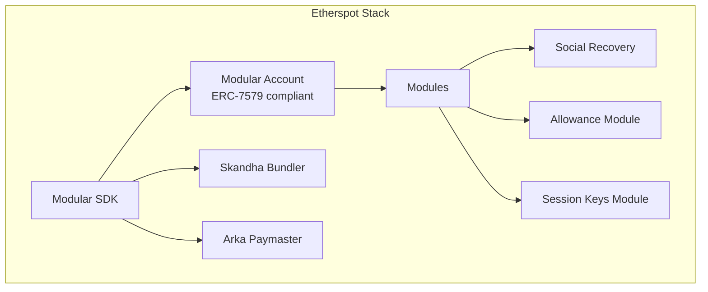
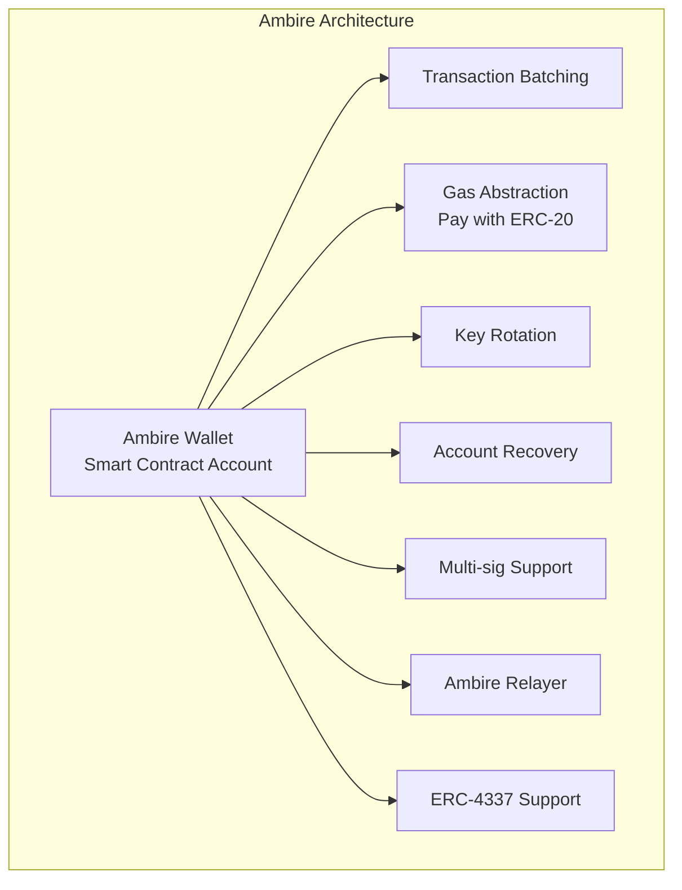
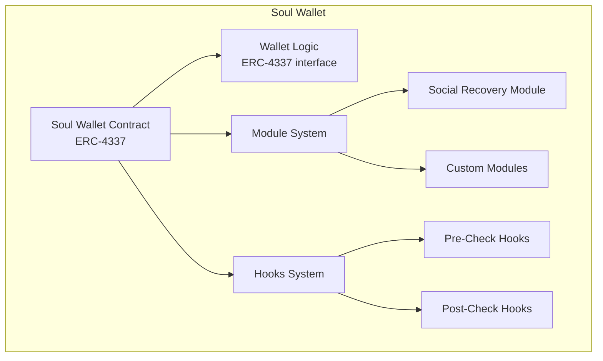
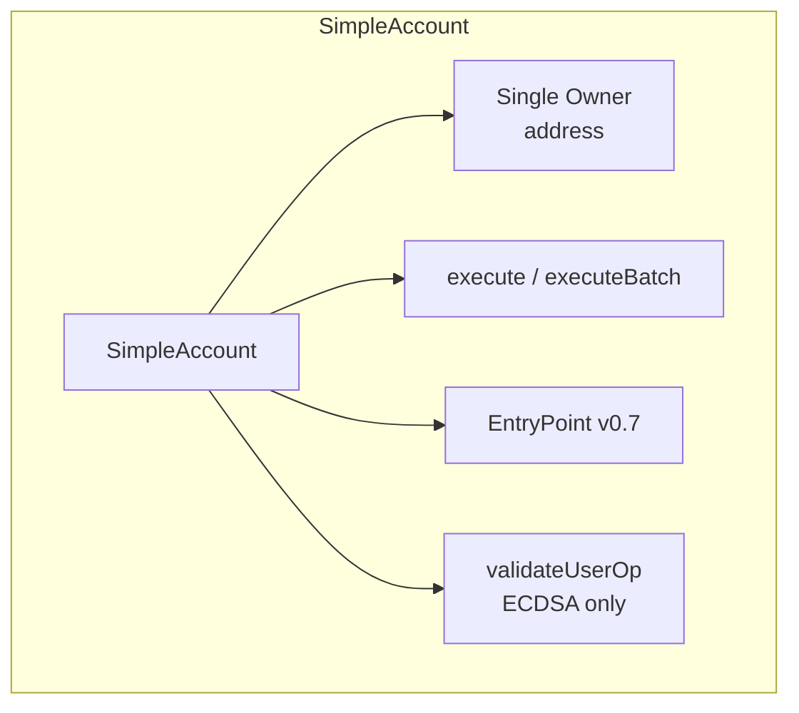

# Other Notable Smart Account Implementations - Survey

## Overview

This document surveys additional smart account implementations beyond the primary candidates (Safe, Kernel, Biconomy Nexus, Coinbase Smart Wallet, Alchemy Modular Account). These are evaluated for relevance to our delegated smart account use case.

---

## 1. Etherspot Prime

### Architecture

### Key Facts

| Aspect | Details |
|--------|---------|
| **Standard** | ERC-4337 + ERC-7579 (recently migrated) |
| **Bundler** | Skandha (TypeScript, open-source) |
| **Paymaster** | Arka |
| **Module system** | ERC-7579 modules (social recovery, session keys, allowances) |
| **Chain support** | Multi-chain (20+ EVM chains) |
| **EntryPoint** | v0.7 and v0.8 support |
| **EIP-7702** | Supported via Skandha |

### Evaluation for Our Use Case

**Session key capabilities:**
- Pre-approved actions for limited time
- Set rules and spending limits
- Standard ERC-7579 module interface

**Allowance module:**
- Predefined token-spend limits per dApp
- Similar to Coinbase's SpendPermissionManager but as an ERC-7579 module

**Pros:**
- ERC-7579 compliant: modules are portable across ecosystems
- Skandha bundler is open-source and well-maintained
- First bundler to support EntryPoint v0.8.0
- Good multi-chain coverage
- Active development team

**Cons:**
- Smaller ecosystem than Safe/Biconomy/Kernel
- Less documentation available
- Unclear audit status for modular accounts
- Lower adoption / TVL
- Session key module may not support granular parameter conditions

**Verdict: Interesting but secondary option.** The ERC-7579 compliance means modules from the broader ecosystem (Rhinestone, SmartSessions) would work with Etherspot accounts. The main value proposition is the Skandha bundler infrastructure, which could be used independently of the account implementation.

---

## 2. Ambire Wallet

### Architecture

### Key Facts

| Aspect | Details |
|--------|---------|
| **Standard** | ERC-4337 (dual relayer + 4337 support) |
| **Architecture** | Custom smart account with privilege system |
| **Key feature** | Hybrid AA (own relayer + ERC-4337) |
| **Gas payments** | ERC-20 token gas payments |
| **EIP-7702** | Ready/supportive |
| **Token** | WALLET governance token |
| **Focus** | Self-custodial consumer wallet |

### Privilege System

Ambire uses a "privileges" model where different signers can have different privilege levels:
- Full access (owner)
- Limited access (specific operations)
- Recovery privileges

The wallet has both its own relayer and ERC-4337 support, providing redundancy.

### Evaluation for Our Use Case

**Transaction batching:** Ambire automatically bundles token approval + transaction, ensuring no leftover approvals. This is a good UX pattern for DeFi operations.

**Pros:**
- Production-tested wallet with real users
- Hybrid relayer/4337 approach provides fallback
- ERC-20 gas payments built-in
- Token approval bundling is smart
- Self-custodial by design

**Cons:**
- Not modular (no ERC-7579 or ERC-6900)
- No standardized session key or delegation mechanism
- Custom privilege system not portable
- Consumer wallet focus, not developer platform
- Smaller ecosystem
- Higher vendor lock-in

**Verdict: Not suitable for our use case.** Ambire is a consumer wallet with a custom privilege system. It lacks the modular architecture and standardized delegation mechanisms we need. The transaction batching patterns are worth studying.

---

## 3. Soul Wallet

### Architecture

### Key Facts

| Aspect | Details |
|--------|---------|
| **Standard** | ERC-4337 |
| **Module system** | Custom (modules + hooks) |
| **Key feature** | Social recovery via modules |
| **Repo** | https://github.com/SoulWallet/soul-wallet-contract |
| **Status** | ETHGlobal hackathon project, evolved to product |
| **Chain support** | Ethereum, L2s |

### Evaluation for Our Use Case

Soul Wallet has an interesting module + hooks architecture that predates ERC-7579:
- **Modules:** Whitelisted contracts that can execute transactions on behalf of the wallet
- **Hooks:** Pre/post execution checks for additional validation
- **Social recovery:** The primary innovation

**Pros:**
- Module system supports delegated execution (whitelisted module contracts)
- Hooks can enforce pre-conditions (similar to ERC-7579 hooks)
- Open-source codebase

**Cons:**
- Non-standard module interface (not ERC-7579 or ERC-6900)
- Small team and community
- Unclear audit status
- No session key implementation
- Low adoption
- Project activity may be declining
- No parameter-level permission enforcement

**Verdict: Not suitable.** The architecture has some interesting ideas (module-based delegated execution, hooks) but the non-standard interface, small ecosystem, and lack of session key support make it impractical for our use case.

---

## 4. SimpleAccount (Reference Implementation)

### Architecture

### Key Facts

| Aspect | Details |
|--------|---------|
| **Standard** | ERC-4337 reference implementation |
| **Repo** | https://github.com/eth-infinitism/account-abstraction |
| **Complexity** | ~150 lines of Solidity |
| **Owner model** | Single EOA owner |
| **Modularity** | None |
| **Purpose** | Reference implementation, not production use |

### What It Is

SimpleAccount is the canonical ERC-4337 reference implementation by the eth-infinitism team (the authors of ERC-4337). It demonstrates the minimum viable smart account:

- Single owner (ECDSA)
- `execute()` and `executeBatch()` functions
- `_validateSignature()` against owner
- UUPS upgradeable
- Receives ETH

### Evaluation for Our Use Case

**Not applicable.** SimpleAccount is a reference implementation with no module system, no delegation, no permissions. Every production account (Light Account, Safe, Kernel, Nexus) is built on top of these patterns.

**Value:** Useful as a baseline for gas comparisons and for understanding the minimal ERC-4337 account interface.

---

## 5. Thirdweb Smart Accounts

### Key Facts

| Aspect | Details |
|--------|---------|
| **Standard** | ERC-4337 + ERC-7579 (recent migration) |
| **Products** | Smart Wallet, Embedded Wallets |
| **Module support** | ERC-7579 modules via thirdweb SDK |
| **Session keys** | Supported |
| **Paymaster** | Thirdweb paymaster (up to $250/month sponsored) |
| **Chain support** | 900+ chains |

### Evaluation

Thirdweb recently migrated to ERC-7579 modular smart accounts. Their SDK supports:
- Session keys with permission scoping
- Transaction batching
- Gas sponsorship
- Social logins (via embedded wallets)

**Pros:**
- Massive chain coverage (900+)
- ERC-7579 compliant (portable modules)
- Good SDK and developer tools
- Built-in gas sponsorship tier

**Cons:**
- Platform play (SDK-centric, not contract-centric)
- Thirdweb dependency for infrastructure
- Session key permission granularity unclear
- Less focus on DeFi-specific delegation patterns

**Verdict: Possible alternative for SDK layer**, not for core account implementation. The ERC-7579 accounts could use the same modules as Nexus/Safe7579, but thirdweb adds its own platform layer.

---

## 6. OKX Wallet (aa-account)

### Key Facts

| Aspect | Details |
|--------|---------|
| **Standard** | ERC-4337 + ERC-7579 |
| **Contribution** | Co-author of ERC-7579 |
| **Focus** | Exchange wallet infrastructure |
| **Chain support** | Multi-chain |

OKX co-authored ERC-7579 and implements it in their wallet infrastructure. Less relevant as an independent smart account since it is primarily for OKX's own ecosystem, but validates the ERC-7579 standard.

---

## 7. PillarX

### Key Facts

| Aspect | Details |
|--------|---------|
| **Standard** | ERC-7579 |
| **Focus** | DeFi-native smart account wallet |
| **Module system** | ERC-7579 modules |

PillarX uses ERC-7579 modular accounts for a DeFi-focused wallet. Worth monitoring but limited documentation and adoption.

---

## Comparative Summary

| Account | Standard | Modularity | Session Keys | Delegation | Timelock | Multi-Chain | Audit Status | Suitability |
|---------|----------|-----------|-------------|------------|----------|-------------|-------------|-------------|
| **Etherspot** | ERC-7579 | Yes | Yes | Basic | No | 20+ chains | Unclear | Secondary option |
| **Ambire** | Custom+4337 | No | No | Privileges | No | Multi-chain | Unknown | Not suitable |
| **Soul Wallet** | Custom+4337 | Custom | No | Module-based | No | Limited | Unknown | Not suitable |
| **SimpleAccount** | ERC-4337 ref | No | No | No | No | Any chain | Reference | Not suitable |
| **Thirdweb** | ERC-7579 | Yes | Yes | Via modules | No | 900+ | Unknown | SDK layer only |
| **OKX** | ERC-7579 | Yes | Yes | Via modules | No | Multi-chain | Internal | Validates 7579 |
| **PillarX** | ERC-7579 | Yes | Unknown | Via modules | No | Limited | Unknown | Monitor |

## Key Takeaways

### 1. ERC-7579 is Winning the Standards War

Of the accounts surveyed, those actively developing have overwhelmingly chosen ERC-7579:
- Etherspot migrated to ERC-7579
- Thirdweb migrated to ERC-7579
- OKX co-authored ERC-7579
- PillarX uses ERC-7579

Only Alchemy champions ERC-6900, while Coinbase and Ambire use custom architectures.

### 2. No Off-the-Shelf Timelock Exists Anywhere

None of the surveyed accounts (nor the primary candidates) offer a production timelock/delay module. This is a consistent gap across the entire AA ecosystem. A custom implementation will be needed regardless of the account chosen.

### 3. Module Ecosystem > Individual Account

The shared ERC-7579 module ecosystem (SmartSessions, Rhinestone core modules) is more important than the specific account implementation. Any ERC-7579 account can use these modules, making the choice between Nexus, Safe7579, Kernel, and Etherspot more about:
- Gas efficiency
- Infrastructure maturity
- Ecosystem integration
- Team familiarity

### 4. Infrastructure is Separable from Accounts

Bundlers (Skandha, Rundler, Alto) and paymasters (Alchemy, Pimlico, Biconomy, Arka) work with any ERC-4337 account. The infrastructure choice is independent of the account choice:
- Can use Alchemy's Rundler with a Nexus account
- Can use Pimlico's Alto with an Alchemy Modular Account
- Can use Etherspot's Skandha with a Safe7579 account

### 5. Recommended Focus

Based on this survey, the primary candidates remain:
1. **Safe + Safe7579 Adapter** -- Maximum maturity, Zodiac Delay Module as bonus
2. **Biconomy Nexus** -- Best native ERC-7579, good gas efficiency
3. **Kernel (ZeroDev)** -- Lightweight, good developer experience
4. **Alchemy Modular Account** -- If ERC-6900 is acceptable

The "other" accounts do not materially change the recommendation. The main insight is the strong industry convergence on ERC-7579 as the modular smart account standard.
