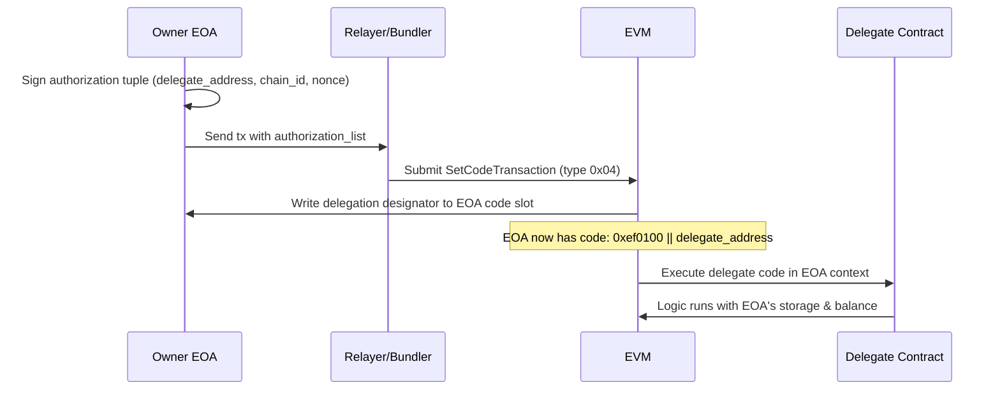
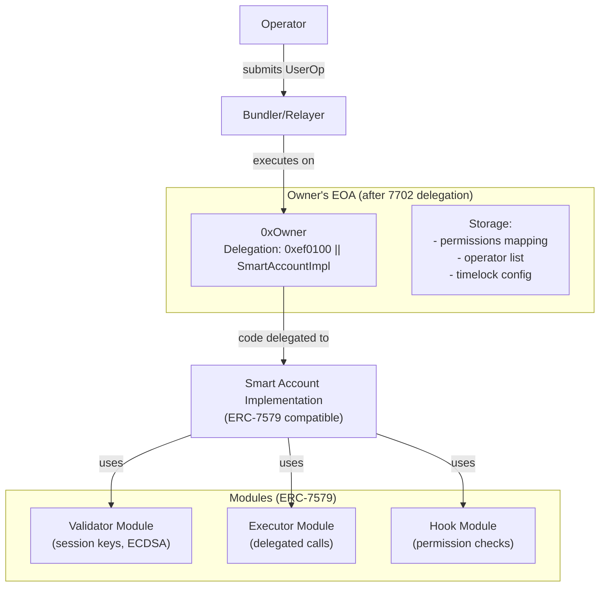
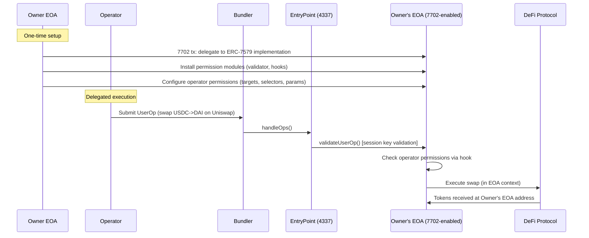
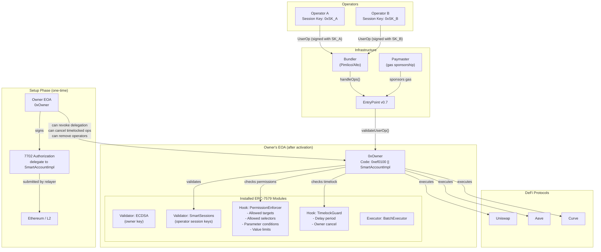

# EIP-7702: A New Architecture Approach for Delegated Smart Accounts

## 1. Overview

EIP-7702 ("Set EOA Account Code") is a protocol-level change included in Ethereum's **Pectra upgrade** (activated on mainnet in May 2025). It introduces a new transaction type (`0x04`) that allows any Externally Owned Account (EOA) to temporarily designate a smart contract as its "implementation," enabling the EOA to execute smart contract logic without deploying a separate contract account.

This fundamentally changes the account abstraction landscape: instead of deploying a new smart account (Safe, Kernel, etc.) and migrating funds, the **owner's existing EOA gains smart account capabilities in-place**.

---

## 2. How EIP-7702 Works Technically

### 2.1 The Authorization Tuple

A new transaction type `0x04` (`SetCodeTransaction`) includes an `authorization_list` containing one or more authorization tuples:

```
authorization_tuple = (chain_id, address, nonce, y_parity, r, s)
```

- **chain_id**: The chain where delegation is valid (0 = valid on any chain)
- **address**: The smart contract whose code will be delegated to
- **nonce**: The EOA's nonce at time of signing (replay protection)
- **signature (y_parity, r, s)**: The EOA owner's ECDSA signature

### 2.2 Delegation Designator

When processed, the EVM stores a **delegation designator** in the EOA's code slot:

```
0xef0100 || delegate_address
```

This 23-byte prefix signals that any call to this EOA should execute the code at `delegate_address` via `DELEGATECALL` semantics (the delegate code runs in the context of the EOA's storage and balance).

### 2.3 Execution Flow



### 2.4 Key Properties

| Property | Detail |
|----------|--------|
| **Persistence** | Delegation persists across transactions until explicitly changed |
| **Revocability** | Owner can revoke by sending a new 7702 tx pointing to `address(0)` |
| **Gas sponsor** | A relayer can submit the tx on behalf of the EOA (sponsorship built-in) |
| **Storage** | The EOA gains persistent storage (the delegate code's storage layout) |
| **Address unchanged** | The EOA keeps its original address |

---

## 3. EIP-7702 for Delegated Account Architecture

### 3.1 Architecture: Owner EOA as Smart Account

Instead of deploying a Safe or Kernel and transferring funds, the owner's EOA **becomes** the smart account:



### 3.2 Delegated Execution Flow



### 3.3 How the 5 Core Requirements Map

| Requirement | EIP-7702 Approach |
|------------|-------------------|
| **Custody preservation** | Owner's EOA IS the account; private key never shared. Delegation designator can be revoked anytime. |
| **Delegated execution** | Operators submit UserOps validated by session key / validator module. Code executes in EOA context. |
| **Granular permissions** | ERC-7579 hook modules enforce target, selector, and parameter constraints. |
| **Timelock / safety** | Hook module can enforce time delays; owner can revoke delegation designator instantly. |
| **Gasless UX** | 4337 paymaster integration works natively since the EOA is now ERC-4337 compatible. |

---

## 4. Combining EIP-7702 with ERC-7579 Modules

### 4.1 How It Works

EIP-7702 is the **activation mechanism** -- it turns an EOA into a smart account. ERC-7579 provides the **modular architecture** -- validators, executors, hooks, fallback handlers.

The pattern:

1. Owner signs a 7702 authorization pointing to an **ERC-7579 compatible account implementation** (e.g., Safe7579, Kernel, Rhinestone-compatible implementation)
2. The EOA now supports the ERC-7579 interface: `installModule()`, `uninstallModule()`, `execute()`, etc.
3. Owner installs modules:
   - **Validator**: Session key manager for operator authentication
   - **Hook**: Permission enforcer (allowed targets, selectors, parameter conditions)
   - **Executor**: Optional, for specialized execution patterns

### 4.2 Available Implementations

| Implementation | 7702 Support | 7579 Support | Status |
|---------------|-------------|-------------|--------|
| **Safe (SafeEIP7702 / SafeLite)** | Yes (dedicated contracts) | Yes (via Safe7579 adapter) | Production |
| **Kernel (ZeroDev)** | Yes | Yes (native) | Production |
| **Rhinestone SDK 2.0** | Yes ("Smart EOA" support) | Yes (native) | Production |
| **Biconomy (AbstractJS)** | Yes | Yes | Production |
| **OpenZeppelin Contracts 5.x** | Yes | Yes | Production |
| **MetaMask Smart Accounts Kit** | Yes (EIP7702DeleGator) | Partial | Production |

### 4.3 Session Keys with 7702

Session keys work identically to how they work with deployed smart accounts:

```
Owner's EOA (7702-enabled)
    └── Validator Module: SmartSessions (Rhinestone)
            ├── Session Key 1: Operator A
            │   ├── Allowed targets: [UniswapRouter, AavePool]
            │   ├── Allowed selectors: [swap(), deposit()]
            │   ├── Max value: 0 ETH
            │   └── Expiry: 30 days
            └── Session Key 2: Operator B
                ├── Allowed targets: [CurvePool]
                ├── Allowed selectors: [exchange()]
                └── Expiry: 7 days
```

---

## 5. Security Implications

### 5.1 New Attack Surfaces

| Risk | Description | Mitigation |
|------|-------------|------------|
| **Phishing delegation** | User tricked into signing authorization to malicious contract | Wallet UI must clearly display delegation target; use well-known implementations |
| **Cross-chain replay** | Authorization with `chain_id=0` valid on all chains | Always use specific chain_id; never sign chain-agnostic authorizations |
| **Front-running setup** | Attacker front-runs the setup call after seeing the authorization | Use implementations like SafeEIP7702 that derive initial config from the EOA address itself |
| **Delegation persistence** | Delegation persists until explicitly changed; user may forget | Wallet UI should clearly show delegation status |
| **Cross-context execution** | External contracts can trigger delegated code via calls to the EOA | Delegate implementation must have proper access controls |
| **Storage collision** | If delegation target is changed, storage layout may conflict | Use standardized storage layouts; avoid switching between incompatible implementations |

### 5.2 Safe's Approach to Front-Running

Safe developed **SafeEIP7702** specifically to address the front-running risk:

- The standard `setup()` function is overridden and **reverts** if called
- Instead, `setupEIP7702()` uses the authorization signature itself to derive the initial owner
- The default owner is automatically set to the EOA address with threshold of 1
- This prevents any third party from front-running the initialization

### 5.3 Revocability

Unlike deployed smart accounts where you can't easily "undo" the deployment, 7702 delegations are **fully revocable**:

```solidity
// To revoke: send a 7702 tx with delegation to address(0)
authorization_list: [{
    chain_id: 1,
    address: 0x0000000000000000000000000000000000000000,
    nonce: current_nonce,
    // ... signature
}]
```

This clears the delegation designator, returning the EOA to its original state.

---

## 6. Gas Comparison

### 6.1 Deployment Costs

| Approach | Deployment Cost | Notes |
|----------|----------------|-------|
| **Safe (proxy)** | ~150,000 gas | Deploy proxy + setup call |
| **Kernel (proxy)** | ~120,000 gas | Deploy proxy + initialize |
| **EIP-7702 activation** | ~25,000 gas | Single tx with authorization tuple |
| **Savings** | **~80-85% reduction** | No contract deployment needed |

### 6.2 Per-Operation Costs

| Operation | ERC-4337 Smart Account | EIP-7702 + 4337 | Native 7702 (no 4337) |
|-----------|----------------------|-----------------|----------------------|
| **Simple transfer** | ~80,000 gas | ~65,000 gas | ~45,000 gas |
| **ERC-20 approval + swap** | ~150,000 gas | ~130,000 gas | ~110,000 gas |
| **Batch (3 calls)** | ~200,000 gas | ~170,000 gas | ~140,000 gas |

The savings come from:
- No cross-contract call overhead for the account itself (code runs in EOA context)
- No proxy DELEGATECALL overhead
- Potential to skip 4337 EntryPoint entirely for native 7702 txs (though this loses paymaster support)

### 6.3 When 4337 is Still Needed

Even with 7702, ERC-4337 is valuable for:
- **Paymaster/gas sponsorship**: Required for gasless UX
- **Bundler infrastructure**: Required for operators who don't hold ETH
- **Signature aggregation**: Efficiency for batch operations
- **Existing infrastructure**: Pimlico, Alchemy, etc. already support 4337

---

## 7. Comparison with Traditional Smart Account Approach

| Dimension | Traditional Smart Account (Safe/Kernel) | EIP-7702 Smart EOA |
|-----------|---------------------------------------|---------------------|
| **Address** | New address; must migrate funds | Keeps original EOA address |
| **Deployment** | ~120-150k gas for proxy deployment | ~25k gas for authorization tx |
| **Fund migration** | Required (unless counterfactual) | Not required |
| **Ecosystem compatibility** | May need ERC-1271 for some dApps | Native EOA compatibility everywhere |
| **Module support** | Full ERC-7579 module ecosystem | Full ERC-7579 (when using compatible impl) |
| **Revocability** | Cannot "un-deploy" a contract | Can revoke delegation to address(0) |
| **Multi-sig** | Native (Safe: n-of-m) | Must be implemented in delegate contract |
| **Recovery** | Social recovery modules available | Same modules available via 7579 |
| **L2 support** | L2s must support CREATE2/deployment | L2s must support EIP-7702 tx type |
| **Audit maturity** | Years of battle-testing | Newer; fewer audits of 7702-specific code |
| **Complexity** | Well-understood patterns | New paradigms; evolving best practices |

---

## 8. Current Implementations and Tooling

### 8.1 Viem (TypeScript)

Viem provides first-class EIP-7702 support:

```typescript
import { createWalletClient, http } from 'viem'
import { mainnet } from 'viem/chains'
import { privateKeyToAccount } from 'viem/accounts'

const account = privateKeyToAccount('0x...')
const client = createWalletClient({ account, chain: mainnet, transport: http() })

// Sign authorization to delegate to a smart account implementation
const authorization = await client.signAuthorization({
  contractAddress: '0xSmartAccountImpl', // ERC-7579 compatible
})

// Send the 7702 transaction
await client.sendTransaction({
  authorizationList: [authorization],
  to: account.address,
  data: '0x...', // setup calldata (install modules, etc.)
})
```

### 8.2 Permissionless.js (Pimlico)

```typescript
import { createSmartAccountClient } from 'permissionless'
import { to7702SmartAccount } from 'permissionless/accounts'

// Create a 7702-enabled smart account from an existing EOA
const account = await to7702SmartAccount({
  client: publicClient,
  owner: eoaAccount,
  implementation: '0xSmartAccountImpl',
})

const smartAccountClient = createSmartAccountClient({
  account,
  bundlerTransport: http('https://api.pimlico.io/v2/...'),
  paymaster: pimlicoPaymaster,
})
```

### 8.3 Safe Integration

```typescript
// SafeEIP7702 - dedicated contract for 7702 delegation
// SafeLite - lightweight alternative
import { Safe7702 } from '@safe-global/safe-7702'

const safe = await Safe7702.init({
  provider,
  signer: eoaOwner,
  // No deployment needed -- uses 7702 delegation
})

// Install ERC-7579 modules via Safe7579 adapter
await safe.installModule({
  type: 'validator',
  address: sessionKeyModuleAddress,
  initData: '0x...',
})
```

### 8.4 MetaMask Smart Accounts Kit

MetaMask provides `EIP7702DeleGator`, which combines 7702 with the ERC-7710 delegation framework:

```typescript
import { MetaMaskSmartAccount } from '@metamask/smart-accounts-kit'

const account = await MetaMaskSmartAccount.create({
  type: 'eip7702',
  signer: eoaSigner,
  // Automatically handles 7702 authorization
})

// Create delegation with caveats
const delegation = account.createDelegation({
  delegate: operatorAddress,
  caveats: [
    { enforcer: 'AllowedTargets', terms: [uniswapRouter] },
    { enforcer: 'AllowedMethods', terms: ['swap(address,uint256)'] },
    { enforcer: 'NativeTokenTransferAmount', terms: [0] },
  ],
})
```

---

## 9. Who Is Building with EIP-7702?

### 9.1 Production / Near-Production

| Project | How they use 7702 | Status |
|---------|-------------------|--------|
| **Safe** | SafeEIP7702 + SafeLite contracts for EOA upgrade | Production (post-Pectra) |
| **MetaMask** | Smart Accounts Kit with EIP7702DeleGator | Production |
| **Rhinestone** | SDK 2.0 "Smart EOA" support | Production |
| **Biconomy** | AbstractJS with 7702 support | Production |
| **ZeroDev** | Kernel + 7702 for EOA activation | Production |
| **Pimlico** | Bundler + permissionless.js 7702 support | Production |
| **Alchemy** | Modular Account + 7702 | Production |
| **Coinbase** | Smart Wallet 7702 support | Production |
| **Privy** | Embedded wallet 7702 integration | Production |
| **Dynamic** | Auth + 7702 smart wallet activation | Production |

### 9.2 Emerging Use Cases

- **Wallet upgrades**: MetaMask, Rabby, and others allow users to "upgrade" their EOA without changing address
- **DeFi automation**: Operators can execute strategies on users' EOAs via session keys
- **Cross-chain**: 7702 enables smart account features on L2s that support the tx type
- **Gasless onboarding**: New users get smart account features on their first EOA

---

## 10. L2 / Multi-Chain Considerations

### 10.1 L2 Support Status

EIP-7702 requires explicit support from each chain (new tx type). As of 2025:

| Chain | 7702 Support | Notes |
|-------|-------------|-------|
| **Ethereum Mainnet** | Yes (Pectra) | Native support |
| **Optimism** | Yes | Included in Pectra-equivalent upgrade |
| **Base** | Yes | Via OP Stack update |
| **Arbitrum** | Yes | Supported |
| **Polygon zkEVM** | Pending | Implementation in progress |
| **zkSync** | Native AA | Different approach; native AA already exists |
| **StarkNet** | N/A | Non-EVM; native AA |

### 10.2 Cross-Chain Delegation Risk

A critical concern: if `chain_id=0` is used in the authorization tuple, the same delegation applies on **every chain**. For a managed account system:

- **Always use specific chain_id** per chain
- **Never allow chain-agnostic authorizations** in production
- Each chain should have independent module configurations

---

## 11. Architecture Diagram: 7702-Based Delegated Account



---

## 12. Feasibility Assessment for Managed Account Use Case

### 12.1 Advantages

1. **No fund migration**: Owner keeps existing EOA address and all existing token balances/approvals
2. **Lower costs**: ~80% cheaper activation vs deploying a new smart account
3. **Full module ecosystem**: Compatible with all ERC-7579 modules (Rhinestone, etc.)
4. **Native revocability**: Owner can instantly revoke smart account features
5. **Simpler UX**: Users don't need to understand "smart accounts" -- their wallet just gains new capabilities
6. **Ecosystem compatibility**: EOA address works everywhere; no ERC-1271 needed for basic interactions

### 12.2 Disadvantages

1. **No native multi-sig**: EOA is still controlled by a single private key (multi-sig must be added via modules)
2. **New attack surface**: Phishing delegation attacks are a real concern
3. **L2 fragmentation**: Not all L2s support 7702 yet
4. **Less battle-tested**: Newer than Safe/Kernel; fewer real-world deployments
5. **Storage layout risk**: Changing delegation targets can cause storage conflicts
6. **Single owner only**: Unlike Safe where n-of-m owners is native, 7702 EOA has one key

### 12.3 Recommendation

EIP-7702 is **highly relevant** for the managed account use case, particularly as a **hybrid approach**:

- Use **7702 + ERC-7579** for single-owner accounts (most common case)
- Fall back to **Safe + ERC-7579** for multi-sig / institutional accounts
- Both share the **same module ecosystem** (validators, hooks, executors)
- The permission system is **identical** regardless of account type

**Maturity Level**: Production-ready for simple use cases; rapidly maturing for complex permission systems. The major wallet infrastructure providers (Pimlico, Alchemy, Biconomy) all support it.

---

## 13. References

- [EIP-7702 Specification (Ethereum Magicians)](https://ethereum-magicians.org/t/eip-7702-set-eoa-account-code/19923)
- [EIP-7702 Overview (eip7702.io)](https://eip7702.io/)
- [Safe and EIP-7702 Documentation](https://docs.safe.global/advanced/eip-7702/overview)
- [Viem EIP-7702 Documentation](https://viem.sh/docs/eip7702)
- [Pimlico ERC-4337 vs EIP-7702 Guide](https://docs.pimlico.io/guides/eip7702/erc4337-vs-eip7702)
- [Biconomy EIP-7702 Guide](https://blog.biconomy.io/a-comprehensive-eip-7702-guide-for-apps/)
- [MetaMask Smart Accounts Kit](https://metamask.io/developer/delegation-toolkit)
- [QuickNode EIP-7702 Implementation Guide](https://www.quicknode.com/guides/ethereum-development/smart-contracts/eip-7702-smart-accounts)
- [Nethermind: EIP-7702 Attack Surfaces](https://www.nethermind.io/blog/eip-7702-attack-surfaces-what-developers-should-know)
- [Halborn: EIP-7702 Security Considerations](https://www.halborn.com/blog/post/eip-7702-security-considerations)
- [7BlockLabs: Session-Based Authentication for EIP-7702](https://www.7blocklabs.com/blog/session-based-authentication-on-ethereum-delegation-patterns-for-eip-7702)
- [Coinbase: Pectra Upgrade Guide](https://www.coinbase.com/blog/the-ultimate-guide-to-ethereums-pectra-upgrade)
- [OpenZeppelin Smart Accounts 5.x](https://docs.openzeppelin.com/contracts/5.x/accounts)
