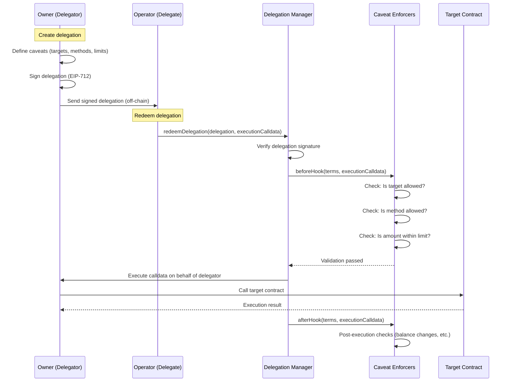
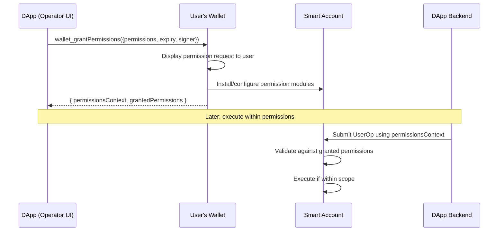
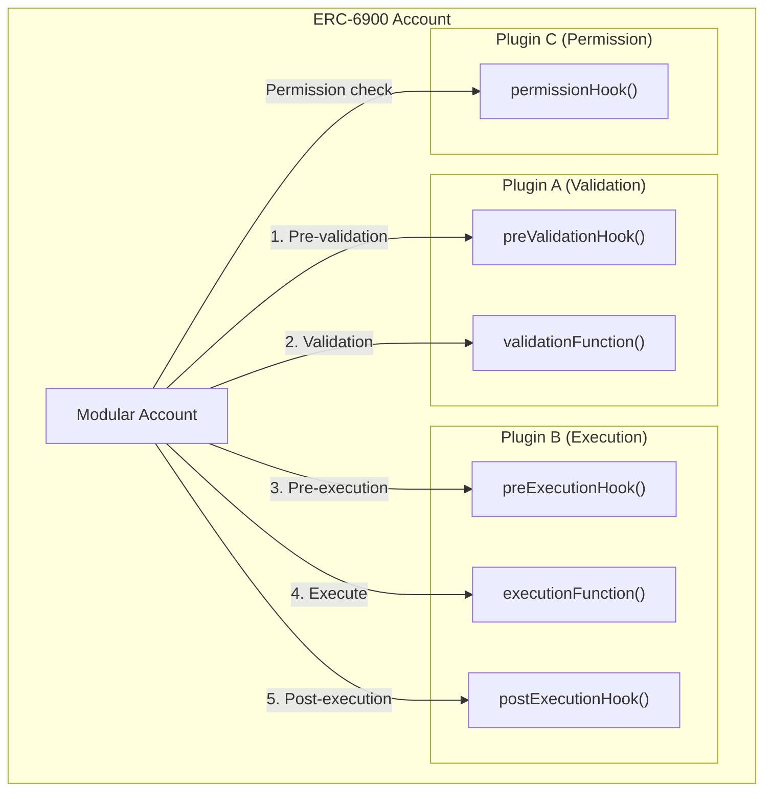
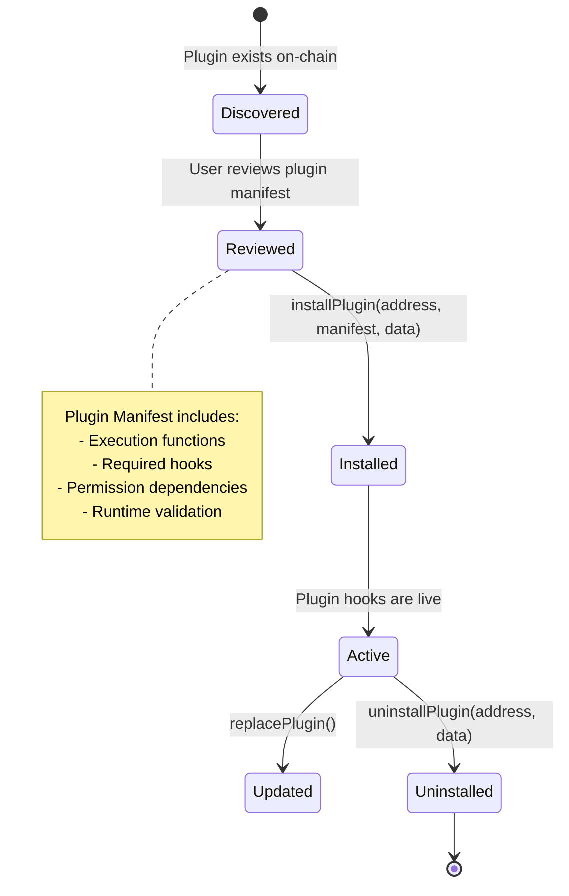
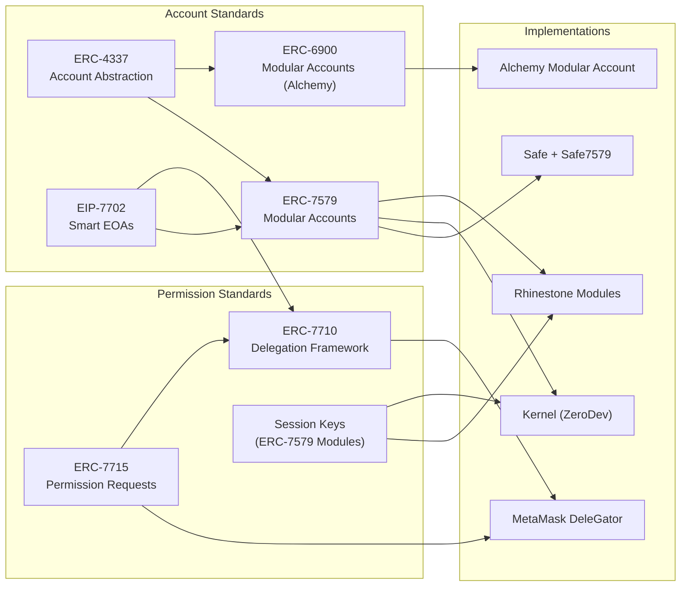

# Emerging Standards: ERC-7710, ERC-7715, and ERC-6900

## 1. ERC-7710: Smart Contract Delegation Framework

### 1.1 Overview

ERC-7710 defines a minimal interface for smart contracts to **delegate capabilities** to other smart contracts, smart contract accounts, or EOAs. It standardizes how on-chain delegation is represented, validated, and enforced.

Unlike session keys (which are typically managed by a validator module within a smart account), ERC-7710 establishes an **external delegation protocol** with its own lifecycle, storage, and enforcement mechanisms.

**Status**: Draft ERC, but with production implementations (MetaMask Delegation Framework).

### 1.2 Core Concepts

#### Delegation Structure

A delegation is a signed data structure:

```solidity
struct Delegation {
    address delegator;      // The account granting authority
    address delegate;       // The account receiving authority
    address authority;      // Parent delegation (for chains) or 0x0 (root)
    Caveat[] caveats;       // Array of restrictions
    uint256 salt;           // Uniqueness
    bytes signature;        // EIP-712 signature from delegator
}

struct Caveat {
    address enforcer;       // Contract that validates this caveat
    bytes terms;            // Encoded parameters for the enforcer
}
```

#### Key Participants

| Role | Description |
|------|-------------|
| **Delegator** | Smart contract account that creates and signs delegations |
| **Delegate** | Account receiving the delegated authority |
| **Delegation Manager** | On-chain contract that validates delegations and orchestrates execution |
| **Caveat Enforcer** | Contract that checks whether a specific restriction is satisfied |

#### On-Chain Representation

Delegations are **off-chain signed objects** that are validated on-chain at redemption time. They do NOT need to be stored on-chain to be valid. This means:

- Storage: IPFS, browser cache, cloud storage, local file
- Validity: Cryptographically verified via EIP-712 signature
- Cost: No gas for creating/signing a delegation
- Privacy: Delegation details not visible until redeemed

### 1.3 Delegation Lifecycle



### 1.4 MetaMask Delegation Toolkit (DeleGator)

MetaMask's implementation is the most mature ERC-7710 framework, including:

#### Components

| Component | Description |
|-----------|-------------|
| **DelegatorCore** | Base contract for delegator accounts (ERC-4337 compatible) |
| **DelegationManager** | Validates delegations and orchestrates execution |
| **HybridDeleGator** | Supports both EOA (ECDSA) and contract (ERC-1271) signatures |
| **MultiSigDeleGator** | Multi-signature delegator account |
| **EIP7702DeleGator** | 7702-compatible delegator for EOAs |
| **Caveat Enforcers** | 30+ built-in enforcement contracts |

#### Built-In Caveat Enforcers

The toolkit provides extensive built-in enforcers:

**Access Control:**
- `AllowedTargets` -- Restrict which contract addresses can be called
- `AllowedMethods` -- Restrict which function selectors can be called
- `AllowedCalldataEnforcer` -- Restrict specific calldata patterns
- `ExactCalldata` / `ExactExecution` -- Require exact calldata match
- `Redeemer` -- Restrict who can redeem the delegation

**Value & Token Limits:**
- `NativeTokenTransferAmount` -- Limit ETH transfer amounts
- `ERC20TransferAmount` -- Limit ERC-20 transfer amounts
- `ERC20PeriodTransfer` -- Periodic spending limits for ERC-20
- `NativeTokenPeriodTransfer` -- Periodic spending limits for ETH
- `NativeBalanceChange` / `ERC20BalanceChange` -- Enforce balance change bounds
- `ERC721Transfer` / `ERC721BalanceChange` -- NFT transfer restrictions
- `ERC1155BalanceChange` -- Multi-token balance restrictions

**Time & Usage:**
- `BlockNumber` -- Block number range constraints
- `LimitedCalls` -- Maximum number of redemptions
- `Nonce` -- Nonce-based ordering

**Streaming:**
- `NativeTokenStreaming` -- Time-based streaming of ETH
- `ERC20Streaming` -- Time-based streaming of ERC-20 tokens

**Advanced:**
- `ArgsEqualityCheck` -- Verify specific argument values
- `OwnershipTransfer` -- Restrict ownership transfer actions
- `Id` -- Unique identifier for delegations
- `Deployed` -- Verify target is a deployed contract

#### Transitive (Chained) Delegation

A unique feature of ERC-7710: delegations can be **chained**:

```
Owner --delegates-to--> Manager --delegates-to--> Operator
  (AllowedTargets:          (LimitedCalls: 10,
   Uniswap, Aave)            Expiry: 7 days)
```

Each link adds additional restrictions. The final executor must satisfy ALL caveats in the chain. This enables hierarchical permission models.

### 1.5 ERC-7710 vs Session Keys Comparison

| Dimension | ERC-7710 (Delegation) | Session Keys (ERC-7579 Validator) |
|-----------|----------------------|----------------------------------|
| **Architecture** | External delegation protocol with its own manager contract | Internal to the smart account's validator module |
| **Storage** | Off-chain signed objects; validated on-chain at redemption | On-chain in smart account storage |
| **Granularity** | Very high (30+ caveat enforcer types) | High (depends on module implementation) |
| **Chaining** | Native transitive delegation support | Not supported natively |
| **Gas cost (creation)** | Free (off-chain signature) | Gas for on-chain session key registration |
| **Gas cost (execution)** | Higher (delegation manager overhead + caveat checks) | Lower (direct module validation) |
| **Composability** | Cross-account; works with any ERC-7710 delegator | Account-specific; tied to the smart account |
| **Revocation** | On-chain revocation via DelegationManager | On-chain via module uninstall/disable |
| **Ecosystem** | MetaMask, growing | Rhinestone, Biconomy, ZeroDev, broad |
| **Audit status** | Audited (Consensys Diligence, 2024) | Varies by module |

### 1.6 Applicability to Managed Account

ERC-7710 is **directly applicable** to the delegated execution use case:

**Strong fit:**
- Rich caveat system maps perfectly to permission requirements
- Off-chain delegation creation = no gas for permission setup
- Transitive delegation enables hierarchical operator models
- MetaMask integration provides wallet-level UX

**Concerns:**
- Higher gas per execution (delegation manager overhead)
- Newer ecosystem; fewer integrations than session keys
- Tied to MetaMask's implementation (de facto standard)
- More complex mental model than session keys

---

## 2. ERC-7715: Grant Permissions from Wallets

### 2.1 Overview

ERC-7715 defines a new JSON-RPC method `wallet_grantPermissions` that allows dApps to **request permissions from a user's wallet**. Instead of the dApp managing session keys or delegations directly, the wallet handles the entire permission lifecycle.

**Status**: Draft ERC, with implementations in MetaMask and experimental support in Viem.

### 2.2 How It Works

#### Permission Request Flow



#### Request Format

```typescript
// DApp requests permissions from the wallet
const response = await wallet.request({
  method: 'wallet_grantPermissions',
  params: [{
    // What signer will use these permissions
    signer: {
      type: 'key',        // or 'account', 'keys'
      data: {
        type: 'secp256k1',
        publicKey: '0x04...'
      }
    },

    // Requested permissions
    permissions: [
      {
        type: 'native-token-transfer',
        data: {
          ticker: 'ETH',
        },
        policies: [
          {
            type: 'token-allowance',
            data: {
              allowance: '0x0de0b6b3a7640000' // 1 ETH
            }
          }
        ]
      },
      {
        type: 'erc20-token-transfer',
        data: {
          address: '0xUSDC...',
        },
        policies: [
          {
            type: 'token-allowance',
            data: {
              allowance: '0x...' // 1000 USDC
            }
          }
        ]
      }
    ],

    // When permissions expire
    expiry: Math.floor(Date.now() / 1000) + 86400 * 30, // 30 days
  }]
})

// Response includes context for later execution
const { permissionsContext, grantedPermissions, expiry } = response
```

#### Response Format

```typescript
{
  // Opaque context the dApp uses when submitting UserOps
  permissionsContext: '0x...',

  // What was actually granted (may differ from request)
  grantedPermissions: [
    {
      type: 'native-token-transfer',
      data: { ticker: 'ETH' },
      policies: [{ type: 'token-allowance', data: { allowance: '0x...' } }]
    }
  ],

  // Actual expiry (wallet may set shorter than requested)
  expiry: 1748000000
}
```

### 2.3 Permission Types and Policies

#### Standard Permission Types

| Permission Type | Description |
|----------------|-------------|
| `native-token-transfer` | Transfer native tokens (ETH) |
| `erc20-token-transfer` | Transfer ERC-20 tokens |
| `contract-call` | Call specific contract functions |
| `sign-message` | Sign messages on behalf of the account |

#### Standard Policies

| Policy Type | Description |
|------------|-------------|
| `token-allowance` | Maximum token amount |
| `gas-limit` | Maximum gas per operation |
| `call-limit` | Maximum number of calls |
| `rate-limit` | Time-based rate limiting |
| `expiry` | Timestamp-based expiration |

### 2.4 Relationship with ERC-7710

ERC-7715 and ERC-7710 are **complementary**:

```
ERC-7715 (Interface Layer)
├── Defines HOW dApps request permissions
├── JSON-RPC method: wallet_grantPermissions
├── Wallet-mediated UX
└── Permission types and policies

ERC-7710 (Execution Layer)
├── Defines HOW delegations are enforced
├── On-chain delegation validation
├── Caveat enforcers
└── Delegation lifecycle

Together:
DApp --[7715]--> Wallet --[creates 7710 delegation]--> Smart Account
                         --[installs session key]----> Smart Account
```

MetaMask's Smart Accounts Kit integrates both: `wallet_grantPermissions` creates ERC-7710 delegations under the hood.

### 2.5 Applicability to Managed Account

ERC-7715 is relevant as the **dApp-facing interface** for requesting operator permissions:

```
Operator Dashboard (dApp)
    │
    ├── wallet_grantPermissions({
    │       permissions: [swap on Uniswap, deposit on Aave],
    │       signer: { type: 'key', data: operatorKey },
    │       expiry: 30 days
    │   })
    │
    ▼
Owner's Wallet (MetaMask, etc.)
    │
    ├── Displays: "Operator X requests permission to..."
    ├── Owner approves
    ├── Wallet creates delegation (7710) or session key (7579)
    │
    ▼
Owner's Smart Account
    └── Operator can now execute within granted permissions
```

**Benefit**: Standardized UX across wallets; owner sees a clear permission request rather than opaque technical details.

**Limitation**: Requires wallet support (currently MetaMask only for full 7710+7715 integration).

---

## 3. ERC-6900: Modular Smart Contract Accounts

### 3.1 Overview

ERC-6900 was proposed by Alchemy in 2023 as a standard for modular smart contract accounts. Like ERC-7579, it defines how modules (called "plugins") attach to smart accounts. However, its approach is significantly more **prescriptive and opinionated**.

**Status**: Draft ERC. Implemented by Alchemy's Modular Account.

### 3.2 Architecture



### 3.3 Module Types (Hooks and Functions)

| Type | ERC-6900 Term | Purpose |
|------|--------------|---------|
| **Validation Function** | `IValidationFunction` | Determines if a UserOp or runtime call is authorized |
| **Pre-Validation Hook** | `IValidationHook` | Runs before validation (gas checks, rate limiting) |
| **Execution Function** | `IExecutionFunction` | Adds new callable functions to the account |
| **Pre-Execution Hook** | `IExecutionHook` (pre) | Runs before execution (permission checks, state snapshots) |
| **Post-Execution Hook** | `IExecutionHook` (post) | Runs after execution (state verification, invariant checks) |

### 3.4 Plugin Lifecycle



#### Plugin Manifest

A unique feature of ERC-6900: every plugin must declare a **manifest** that specifies:

```solidity
struct PluginManifest {
    // Execution functions this plugin adds
    ManifestExecutionFunction[] executionFunctions;

    // Validation functions
    ManifestValidation[] validationFunctions;

    // Pre/post execution hooks
    ManifestExecutionHook[] executionHooks;

    // Dependencies on other plugins
    ManifestExternalCallPermission[] permittedExternalCalls;

    // Permissions this plugin requires
    bool canSpendNativeToken;
    ManifestExternalCallPermission[] permittedExecutionSelectors;
}
```

This manifest is displayed to the user at install time, similar to Android app permissions.

### 3.5 ERC-6900 vs ERC-7579: Detailed Comparison

| Dimension | ERC-6900 | ERC-7579 |
|-----------|----------|----------|
| **Philosophy** | Prescriptive; defines account behavior | Minimal; defines module interface only |
| **Scope** | Account + Modules + Permissions + Hooks | Module interface only |
| **Module types** | Validation, Execution, Hooks (pre/post) | Validator, Executor, Hook, Fallback |
| **Permissions** | Built into standard (plugin manifest) | Out of scope (left to implementer) |
| **Plugin dependencies** | Explicit in manifest | Not standardized |
| **Account behavior** | Prescribed (ownership, execution flow) | Not prescribed |
| **Hook granularity** | Pre-validation, pre-execution, post-execution (separate) | Combined hook interface (pre + post) |
| **Module portability** | 6900-only | Cross-implementation (Safe, Kernel, Biconomy, etc.) |
| **Adoption** | Alchemy Modular Account | Rhinestone, ZeroDev, Biconomy, Safe, OKX, Coinbase |
| **Tooling** | Alchemy AA SDK | ModuleKit (Rhinestone), permissionless.js, AbstractJS |
| **Audit maturity** | Audited (Quantstamp) | Multiple audits across implementations |
| **Proposed by** | Alchemy (2023) | Rhinestone + Biconomy + ZeroDev + OKX (Dec 2023) |

### 3.6 Key Differences in Practice

#### 1. Permission Model

**ERC-6900**: Permissions are first-class. Each plugin declares what it needs (manifest), and the account enforces these declarations. The plugin developer decides how plugins interact.

**ERC-7579**: Permissions are out of scope. Module developers build permission logic into hook modules. The module user decides how modules interact.

#### 2. Hook Execution Order

**ERC-6900**: Clear, prescribed execution order:
```
PreValidationHook → Validation → PreExecutionHook → Execution → PostExecutionHook
```

**ERC-7579**: Hooks are a single interface with `preCheck` and `postCheck`:
```
Hook.preCheck() → Execution → Hook.postCheck()
```

#### 3. Module Installation

**ERC-6900**: `installPlugin(address, manifestHash, pluginInstallData)` -- manifest hash must match on-chain manifest.

**ERC-7579**: `installModule(uint256 moduleTypeId, address module, bytes initData)` -- simpler, no manifest requirement.

### 3.7 Will ERC-6900 and ERC-7579 Converge?

The community is split:

**Arguments for convergence:**
- Both standards solve the same problem
- Ecosystem fragmentation hurts adoption
- Module portability is valuable
- Some cross-pollination already happening

**Arguments against convergence:**
- Fundamentally different philosophies (prescriptive vs minimal)
- ERC-7579 has significantly more adoption
- Alchemy may keep 6900 for competitive differentiation
- The standards serve different audiences (ERC-6900 for enterprise/compliance; ERC-7579 for permissionless innovation)

**Current trajectory**: ERC-7579 is winning on adoption. ZeroDev explicitly chose 7579 over 6900, citing flexibility. Safe, Biconomy, Coinbase, and OKX all adopted 7579. Alchemy is the primary 6900 proponent.

### 3.8 ERC-6900 Applicability to Managed Account

**Potential fit:**
- Plugin manifest system provides clear permission disclosure to users
- Pre/post execution hooks enable rich permission enforcement
- Prescribed execution flow reduces implementation ambiguity

**Concerns:**
- Limited ecosystem (Alchemy only)
- Less module diversity than ERC-7579
- More rigid; harder to innovate around
- Smaller community and tooling ecosystem

**Recommendation**: For the managed account use case, **ERC-7579 is the stronger choice** due to broader ecosystem support, more module options, and flexibility. However, ERC-6900's manifest system is worth studying as a UX pattern for permission disclosure.

---

## 4. Standards Landscape Summary



### Recommendation for Managed Account

| Standard | Relevance | Priority |
|----------|-----------|----------|
| **ERC-4337** | Core infrastructure for UserOps, bundlers, paymasters | Must-have |
| **ERC-7579** | Module system for permissions, validation, execution | Must-have |
| **EIP-7702** | Optional account activation method (alternative to deploying) | Strong option |
| **ERC-7710** | Alternative permission system via delegation | Worth evaluating |
| **ERC-7715** | DApp-facing permission request interface | Nice-to-have |
| **ERC-6900** | Alternative modular standard | Monitor only |

---

## 5. References

### ERC-7710
- [ERC-7710 Specification](https://eips.ethereum.org/EIPS/eip-7710)
- [MetaMask Delegation Framework (GitHub)](https://github.com/MetaMask/delegation-framework)
- [MetaMask Delegation Toolkit Docs](https://docs.metamask.io/delegation-toolkit/concepts/delegation/caveat-enforcers/)
- [MetaMask Smart Accounts Kit](https://metamask.io/developer/delegation-toolkit)
- [Delegation Concepts (docs.gator.metamask.io)](https://docs.gator.metamask.io/concepts/delegation)
- [Consensys Diligence Audit (June 2024)](https://diligence.security/audits/2024/06/metamask-delegator/)
- [Consensys Diligence Audit (August 2024)](https://diligence.security/audits/2024/08/metamask-delegation-framework/)
- [Pimlico: MetaMask Accounts with permissionless.js](https://docs.pimlico.io/guides/how-to/accounts/use-metamask-account)

### ERC-7715
- [ERC-7715 Specification](https://eips.ethereum.org/EIPS/eip-7715)
- [ERC-7715 on EIP.tools](https://eip.tools/eip/7715)
- [Viem: grantPermissions](https://viem.sh/experimental/erc7715/grantPermissions)
- [MetaMask ERC-7715 Documentation](https://docs.metamask.io/smart-accounts-kit/0.13.0/concepts/erc7715/)
- [MetaMask Hacker Guide: ERC-7715 Actions](https://metamask.io/news/hacker-guide-metamask-delegation-toolkit-erc-7715-actions)
- [GabiDev: ERC-7715 Explainer](https://medium.com/@vgabrielmarian21/erc-7715-grant-permissions-from-wallets-88cdc90fefbc)

### ERC-6900
- [ERC-6900 Specification](https://eips.ethereum.org/EIPS/eip-6900)
- [Alchemy: Building a modular future with ERC-6900](https://www.alchemy.com/blog/account-abstraction-erc-6900)
- [Alchemy: Modular Account (GitHub)](https://github.com/alchemyplatform/modular-account)
- [ZeroDev: Why 7579 over 6900](https://docs.zerodev.app/blog/why-7579-over-6900)
- [ZeroDev: Who, When, What - 7579 vs 6900](https://docs.zerodev.app/blog/who-when-what)
- [Quantstamp: Modular Account Audit](https://quantstamp.com/blog/alchemy-modular-account-how-audits-can-help-shape-standards-and-catalyze-mass-adoption)
- [Demystifying ERC-6900](https://medium.com/decipher-media/demystifying-erc-6900-5a52db06dcff)
- [ERC-6900 vs ERC-7579 Comparison](https://medium.com/@gvelosa/erc-6900-vs-erc-7579-the-battle-for-modular-smart-contract-wallets-14e0d5f0e392)
