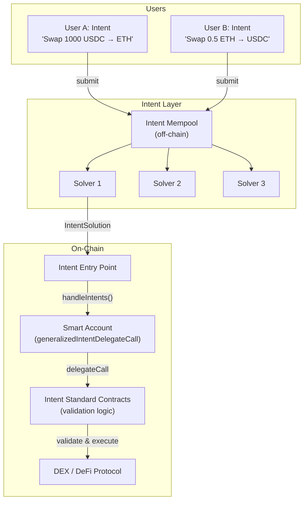
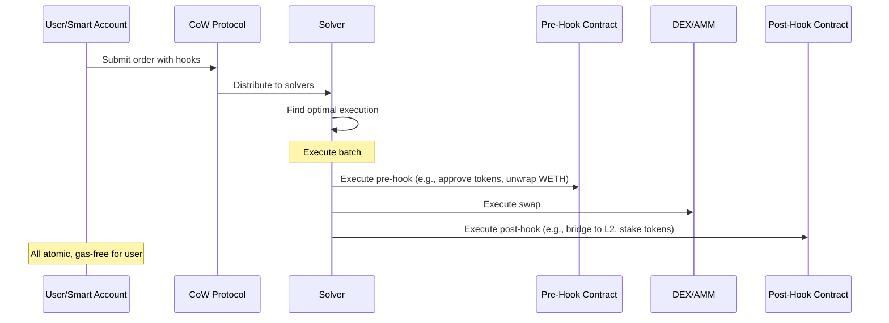
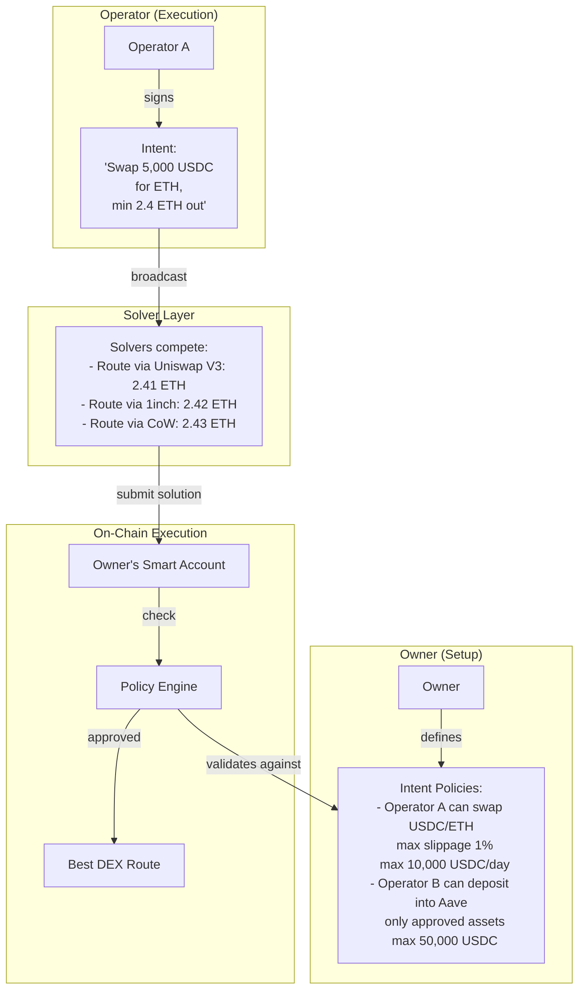
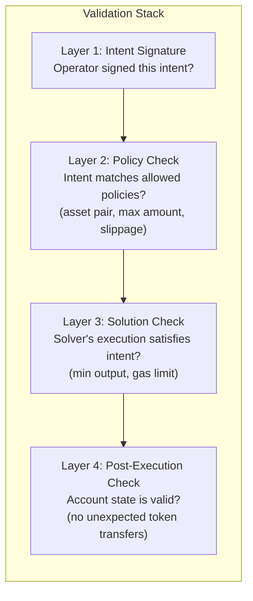
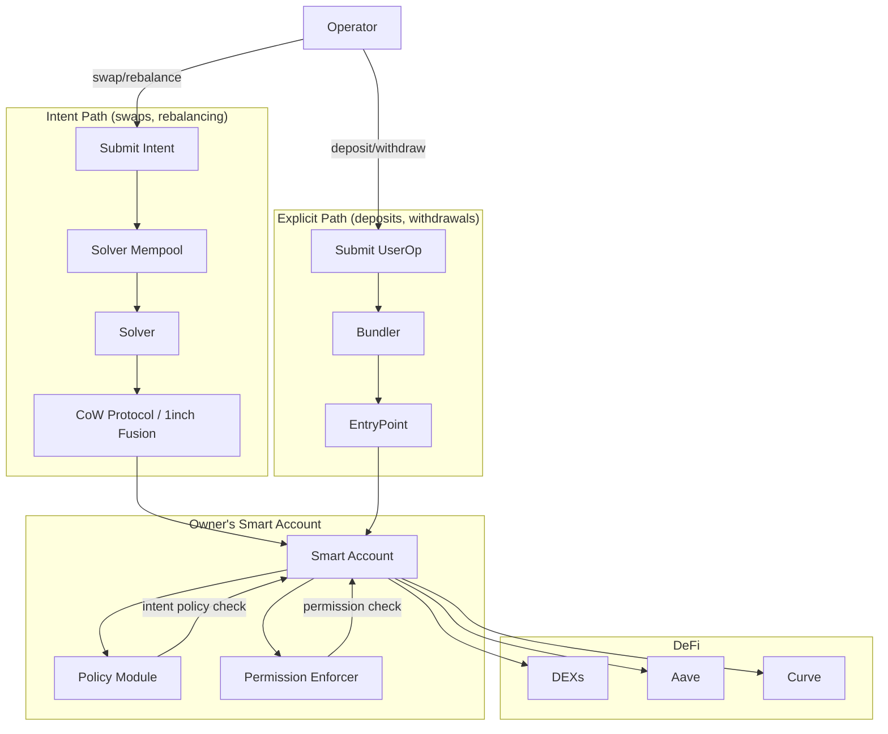
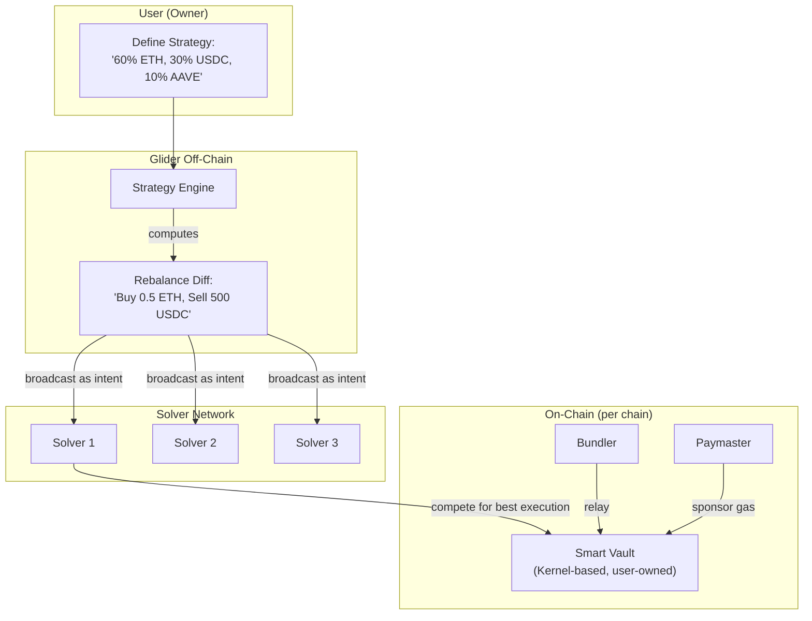

# Intent-Based Architecture for Delegated Execution

## 1. What Are Intents?

An **intent** is a signed message expressing a **desired outcome** rather than a specific execution path. Instead of constructing exact calldata (e.g., "call Uniswap router at 0x... with function swap(...) and these parameters"), the user or operator expresses what they want to achieve (e.g., "swap 1000 USDC for at least 0.5 ETH").

A specialized class of actors called **solvers** compete to find the optimal execution path to fulfill the intent, taking into account:
- Best available liquidity across DEXs
- MEV protection
- Gas optimization
- Cross-chain routing

```
Traditional Transaction:       Intent-Based:
User → Exact Calldata → Chain  User → Desired Outcome → Solver → Optimal Calldata → Chain
```

---

## 2. Intent Frameworks and Standards

### 2.1 ERC-7521: Generalized Intents for Smart Contract Wallets

#### Overview

ERC-7521 is the primary ERC standard for intent-based execution in smart contract wallets. Proposed by the Essential team, it defines:

- A common interface for expressing intents
- An entry point contract for intent validation and execution
- A solver/solution model for intent fulfillment

**Status**: Draft ERC.

#### Architecture



#### How It Works

1. **Intent Expression**: Each intent is a struct containing:
   - `intentStandard`: Address of the standard contract defining validation logic
   - `intentData`: Encoded intent parameters (what the user wants)
   - `signature`: User's signature authorizing the intent

2. **Solver Competition**: Solvers receive intents from a mempool and construct `IntentSolution` objects that combine multiple intents into a single atomic transaction.

3. **On-Chain Execution**: The solver submits to the `handleIntents()` function on a global entry point contract. The entry point:
   - Validates signatures
   - Forwards to intent standard contracts for domain-specific validation
   - Calls `generalizedIntentDelegateCall()` on the wallet
   - Executes the solution

4. **Validation**: Intent standard contracts verify that the solution satisfies all user constraints (minimum output, maximum slippage, etc.)

#### Key Design Decision

ERC-7521 uses an **entry point pattern** (similar to ERC-4337) to separate verification from execution. This means wallets don't need to be updated every time a new intent standard is created.

### 2.2 CoW Protocol (Coincidence of Wants)

#### Overview

CoW Protocol is the most mature intent-based DEX, pioneering the solver/auction model:

| Feature | Detail |
|---------|--------|
| **Model** | Batch auction with solver competition |
| **Intent type** | Trade orders (swap A for B) |
| **Solver incentive** | Dutch auction mechanism |
| **MEV protection** | Orders matched before hitting AMMs |
| **Gasless** | Users sign orders; solvers pay gas |

#### CoW Hooks

CoW Hooks extend the intent model with **pre-swap and post-swap actions**:



**Pre-hooks**: Set up conditions (approvals, permits, unwrapping)
**Post-hooks**: Use output (staking, bridging, LP provision, lending deposit)

The entire sequence executes as a single atomic transaction. Gas is paid by the solver (who is compensated through the auction mechanism).

#### Programmatic Orders (ERC-1271)

CoW Protocol supports **smart contract orders** via ERC-1271:

```solidity
// A smart contract that defines trading logic
contract DCAOrder is IERC1271 {
    function isValidSignature(bytes32 hash, bytes calldata signature)
        external view returns (bytes4)
    {
        // Validate that:
        // - Order is within DCA parameters
        // - Correct time interval has passed
        // - Price is within acceptable range
        return MAGICVALUE;
    }
}
```

This enables **autonomous, conditional trading** -- the contract defines "what" conditions must be met, and solvers execute "when" those conditions are satisfied.

### 2.3 Anoma / Essential

#### Anoma

Anoma is building a full **intent-centric blockchain** with:

- **Anoma Resource Machine (ARM)**: Execution layer using a resource model (not accounts/UTXO)
- **Validity Predicates**: Declarative smart contracts that define valid state transitions
- **Intent gossip network**: P2P network for broadcasting and matching intents
- **Programmable data sovereignty**: Users control what information is shared during solving

**Status**: Early stage; devnet launched January 2025. Not EVM-compatible.

**Relevance**: Anoma represents the theoretical ideal of intent-centric computing but is not directly usable for our EVM-based managed account system. However, its concepts inform architecture design.

#### Essential

Essential is building intent infrastructure **for existing EVM chains**:

- **Asset Based Intent Standard**: Extension of ERC-7521 for major digital asset use cases
- **Domain-Specific Language (DSL)**: For expressing intents in a standardized way
- **Modular intent layer**: Sits on top of existing EVM chains

**Status**: Active development; ERC-7521 is their primary contribution. The framework works with existing EVM chains and wallets.

---

## 3. Intents for Delegated Execution: Architecture

### 3.1 The Concept

Instead of operators submitting exact calldata, they submit **intents** (desired outcomes) that are validated against the owner's **intent policies**:



### 3.2 Intent Policy Model

The owner defines **intent policies** rather than low-level permissions:

| Traditional Permissions | Intent Policies |
|------------------------|----------------|
| AllowedTargets: [0xUniswapRouter] | AllowedAction: "swap" |
| AllowedSelectors: [swap()] | AllowedPairs: [USDC/ETH, USDC/DAI] |
| MaxValue: 10000 USDC | MaxSlippage: 1% |
| ParameterCondition: recipient == owner | MaxDailyVolume: 50,000 USDC |

Intent policies are **higher-level** and **protocol-agnostic**: the owner says "swap USDC for ETH" without specifying which DEX or router to use.

### 3.3 Security Model

How to ensure intents respect permissions:



**Key security properties:**
1. **Operator authorization**: Only authorized operators can submit intents
2. **Policy compliance**: Intents must match owner-defined policies
3. **Solution validity**: Solver's execution must satisfy the intent constraints
4. **State invariants**: Post-execution checks ensure no unexpected state changes
5. **Worst-case bounded**: Even if a solver is malicious, the policy engine limits damage

---

## 4. Relevance to the Managed Account Use Case

### 4.1 Where Intents Excel

| Operation | Why Intents Are Better |
|-----------|----------------------|
| **Swaps** | Optimal routing, MEV protection, gasless execution |
| **Rebalancing** | Express target allocation; solver finds cheapest path |
| **Cross-chain** | Express desired outcome; solver handles bridging |
| **DCA (Dollar Cost Averaging)** | Express schedule + constraints; solver executes |

### 4.2 Where Explicit Calls Are Better

| Operation | Why Explicit Calls Are Better |
|-----------|------------------------------|
| **Deposits to specific vaults** | Exact target and amount known; no routing needed |
| **Withdrawals** | Must go to specific address; no solver optimization |
| **Governance votes** | Exact calldata required |
| **Claiming rewards** | Specific contract interaction |

### 4.3 Hybrid Approach

The most practical architecture combines **intents for complex operations** with **explicit calls for simple operations**:



---

## 5. Implementation Approaches

### 5.1 CoW Protocol Integration

The most immediately practical intent integration:

```typescript
// Operator creates a CoW order on behalf of the smart account
const order = {
  sellToken: USDC_ADDRESS,
  buyToken: WETH_ADDRESS,
  sellAmount: parseUnits('1000', 6),
  buyAmount: parseEther('0.48'),  // min acceptable
  validTo: Math.floor(Date.now() / 1000) + 3600,  // 1 hour
  appData: '0x...',  // metadata
  feeAmount: '0',    // gasless
  kind: 'sell',
  // Pre-hook: approve USDC to CoW settlement
  // Post-hook: deposit WETH to Aave
  hooks: {
    pre: [{ target: USDC, callData: approveCalldata }],
    post: [{ target: AAVE_POOL, callData: depositCalldata }],
  },
}

// Smart account signs order via ERC-1271
// CoW solvers compete to fill it
```

### 5.2 ERC-7521 Integration

For general-purpose intents:

```solidity
// Smart account implements generalizedIntentDelegateCall
contract ManagedAccount {
    function generalizedIntentDelegateCall(bytes calldata intentData)
        external
        returns (bytes memory)
    {
        // 1. Decode intent
        // 2. Check operator authorization
        // 3. Validate against intent policies
        // 4. Execute via delegatecall to intent standard
    }
}
```

### 5.3 Glider-Style Architecture

Glider.fi demonstrates a production intent-based managed account:



Key design decisions from Glider:
- Each user gets their own **smart vault** (no fund commingling)
- Vaults are **Kernel-based** (ZeroDev) with account abstraction
- Solvers compete for best execution
- Gas is abstracted via paymasters
- Cross-chain via multi-vault architecture

---

## 6. Technical Feasibility Assessment

| Aspect | Assessment | Detail |
|--------|-----------|--------|
| **CoW Protocol integration** | Feasible now | Mature protocol; ERC-1271 + hooks supported |
| **ERC-7521 integration** | Experimental | Standard is draft; few production implementations |
| **Custom intent policies** | Feasible | Can build on ERC-7579 hook modules |
| **Solver network** | Use existing | CoW, 1inch Fusion, UniswapX have solver networks |
| **Cross-chain intents** | Emerging | Across Protocol, LI.FI have cross-chain intent support |
| **Full intent-native account** | Premature | Anoma/Essential still early; EVM support limited |

### 6.1 Maturity Levels

```
Production Ready:
├── CoW Protocol (swap intents with hooks)
├── 1inch Fusion (swap intents)
├── UniswapX (swap intents)
└── Across Protocol (cross-chain intents)

Emerging:
├── ERC-7521 (generalized intent standard)
├── Essential (EVM intent infrastructure)
└── LI.FI (cross-chain routing intents)

Research / Early:
├── Anoma (intent-native blockchain)
├── Full intent-based permission systems
└── Arbitrary DeFi operation intents (non-swap)
```

### 6.2 Handling the 5 Core Requirements

| Requirement | Intent Approach | Feasibility |
|------------|----------------|-------------|
| **Custody preservation** | Owner's smart account holds all funds; solvers never have custody | Strong |
| **Delegated execution** | Operators submit intents; solvers execute | Strong |
| **Granular permissions** | Intent policies (higher-level than calldata permissions) | Medium (novel pattern) |
| **Timelock / safety** | Intent expiry + policy engine; harder to timelock an intent vs a tx | Medium |
| **Gasless UX** | Native to CoW model (solvers pay gas) + 4337 paymasters | Strong |

---

## 7. Recommendation

### Short-term (MVP)
- Use **explicit calldata permissions** (ERC-7579 session keys + hooks) for all operations
- Optionally integrate **CoW Protocol** for swap operations (proven, gasless, MEV-protected)

### Medium-term (v2)
- Add **intent-based execution** for swaps and rebalancing alongside explicit calls
- Use **CoW Hooks** for pre/post swap actions (approve + swap + deposit in one atomic tx)
- Monitor **ERC-7521** maturation

### Long-term (v3+)
- Full intent-based policy engine where owners define high-level policies
- Operator intents validated against policies; solvers optimize execution
- Cross-chain intent support via Across/LI.FI integration

---

## 8. References

### ERC-7521
- [ERC-7521 Specification](https://eips.ethereum.org/EIPS/eip-7521)
- [Essential: Introducing ERC-7521](https://blog.essential.builders/introducing-erc-7521-generalized-intents/)
- [Essential: ERC-7521 Spec Revision 1](https://blog.essential.builders/erc-7521-spec-revision-1/)
- [ERC-7521 Discussion (Ethereum Magicians)](https://ethereum-magicians.org/t/erc-7521-generalized-intents-for-smart-contract-wallets/15840/13)

### CoW Protocol
- [CoW Protocol Documentation](https://docs.cow.fi/)
- [CoW Hooks Documentation](https://docs.cow.fi/cow-protocol/concepts/order-types/cow-hooks)
- [CoW Hooks Explainer](https://cow.fi/learn/cow-hooks-you-are-in-control)
- [Programmatic Orders](https://docs.cow.fi/cow-protocol/concepts/order-types/programmatic-orders)
- [ERC-1271 Smart Contract Orders](https://cow.fi/learn/eip-1271-explained)

### Anoma / Essential
- [Anoma: Introduction to Intents](https://anoma.net/blog/an-introduction-to-intents-and-intent-centric-architectures)
- [Anoma Intents Protocol Overview](https://eco.com/support/en/articles/11802990-anoma-intents-protocol-simplifying-blockchain-through-intent-centric-architecture)
- [Anoma Roadmap to Mainnet](https://anoma.net/blog/anomas-roadmap-to-mainnet)
- [Essential: Introducing Essential](https://blog.essential.builders/introducing-essential/)

### Intent Landscape
- [Across Protocol: What Are Crypto Intents?](https://across.to/blog/what-are-crypto-intents)
- [LI.FI: With Intents, It's Solvers All The Way Down](https://li.fi/knowledge-hub/with-intents-its-solvers-all-the-way-down/)
- [MixBytes: Modern DEXes - CoW Protocol](https://mixbytes.io/blog/modern-dex-es-how-they-re-made-cow-protocol)
- [Cointelegraph: Intent-Based Architectures](https://cointelegraph.com/learn/articles/intent-based-architectures-and-applications-in-blockchain)

### Glider.fi
- [Glider Architecture Analysis](https://medium.com/@esedov.cemsid/glider-fi-an-architectural-analysis-of-intent-centric-automated-on-chain-portfolio-management-ad4954f22d7b)
- [ZeroDev Case Study: Glider](https://docs.zerodev.app/blog/zerodev-glider)
