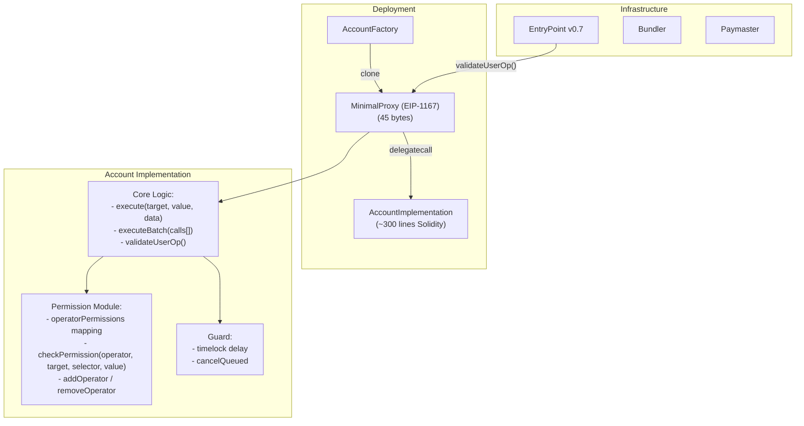
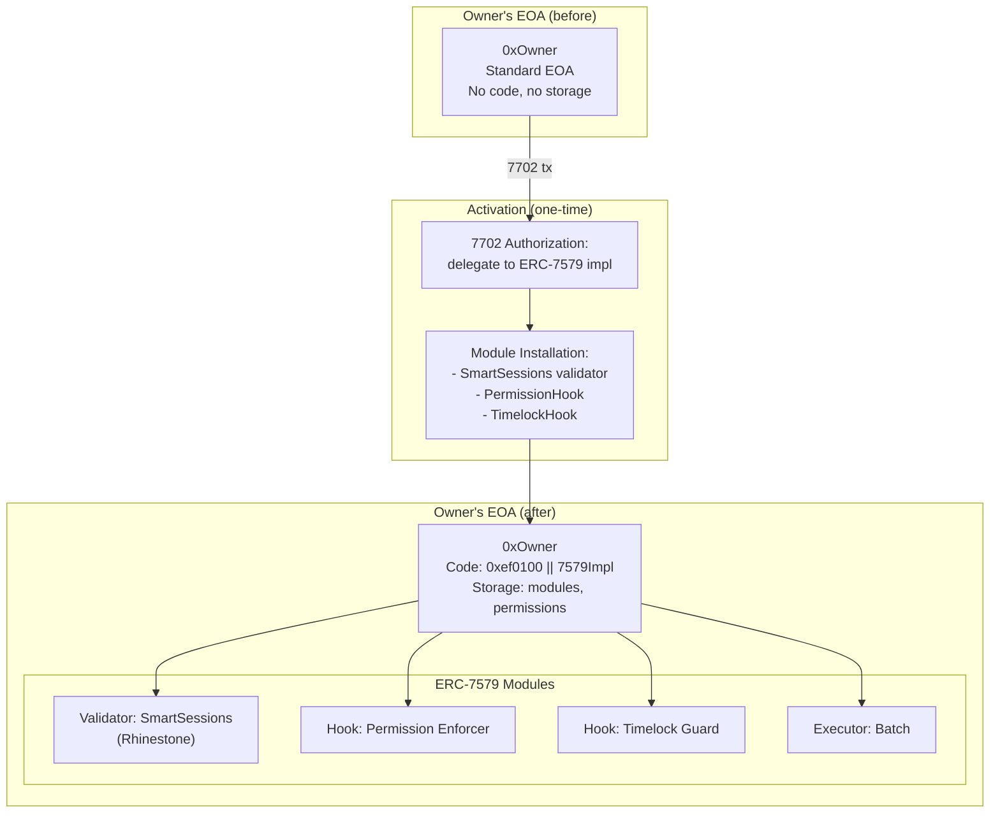
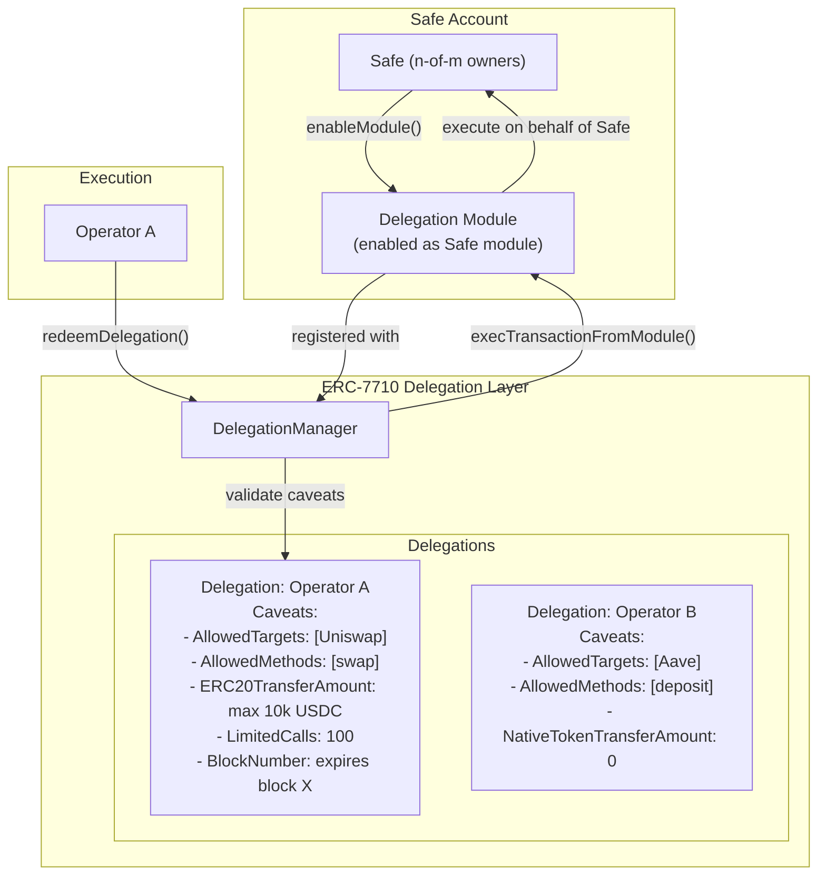
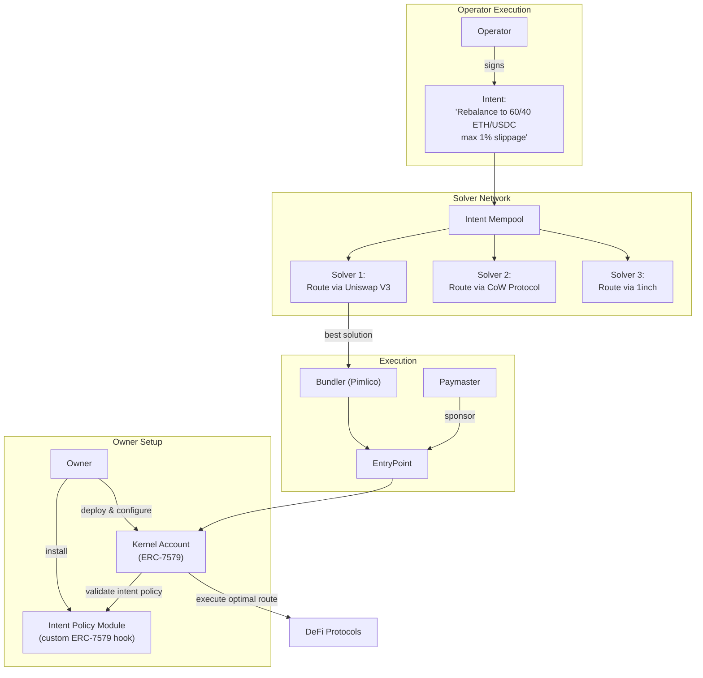
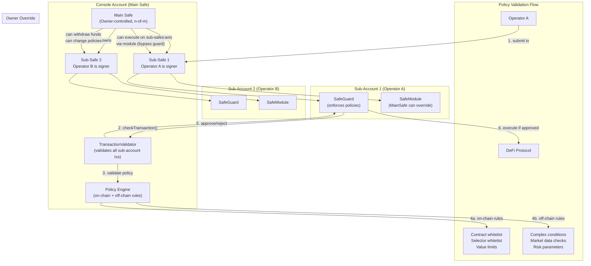
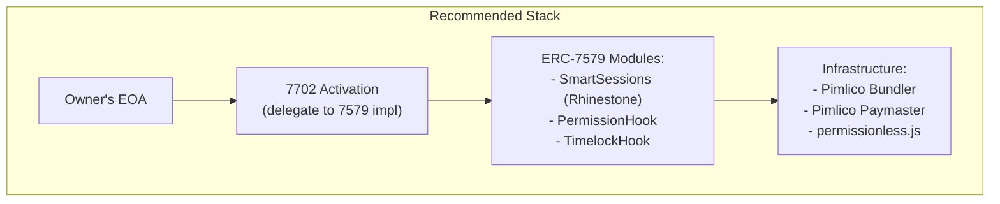
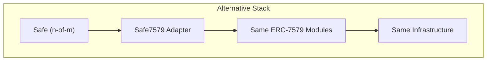

# Custom and Hybrid Approaches for Delegated Smart Accounts

## 1. Minimal Custom Account

### 1.1 Concept

Build a delegated smart account **from scratch** using minimal proxy (EIP-1167) + custom permission module, without relying on Safe, Kernel, or any existing smart account framework.

### 1.2 Architecture



### 1.3 Minimal Code Required

```solidity
// Approximate line counts for a minimal custom account
// ===================================================

// 1. Account Implementation (~200-250 lines)
//    - ERC-4337 IAccount interface (validateUserOp)
//    - execute() / executeBatch()
//    - Owner management (single owner)
//    - ERC-1271 (isValidSignature)
//    - Receive ETH / ERC-721 / ERC-1155

// 2. Permission Module (~150-200 lines)
//    - Operator registry (add/remove)
//    - Permission struct (target, selector, maxValue, paramConditions)
//    - checkPermission() with parameter validation
//    - Events and errors

// 3. Timelock Guard (~100-150 lines)
//    - Queue / execute / cancel pattern
//    - Delay configuration
//    - Owner override (cancel)

// 4. Account Factory (~50-80 lines)
//    - EIP-1167 clone creation
//    - Initialization
//    - Counterfactual address computation

// TOTAL: ~500-700 lines of Solidity
// TOTAL with tests: ~2000-3000 lines (tests + deployment scripts)
```

### 1.4 Example: Minimal Permission Check

```solidity
struct OperatorPermission {
    bool isActive;
    mapping(address => mapping(bytes4 => bool)) allowedCalls; // target => selector => allowed
    mapping(address => uint256) maxValue; // target => max ETH value
    uint256 expiry;
}

function checkPermission(
    address operator,
    address target,
    bytes4 selector,
    uint256 value
) internal view returns (bool) {
    OperatorPermission storage perm = permissions[operator];
    if (!perm.isActive) return false;
    if (block.timestamp > perm.expiry) return false;
    if (!perm.allowedCalls[target][selector]) return false;
    if (value > perm.maxValue[target]) return false;
    return true;
}
```

### 1.5 What You Gain vs Lose

| Dimension | Custom Account | Safe / Kernel |
|-----------|---------------|---------------|
| **Code size** | ~500-700 lines | 2000+ lines (Safe), 1500+ (Kernel) |
| **Deployment cost** | ~80,000 gas (proxy) | ~120-150,000 gas |
| **Per-tx overhead** | Lower (no module routing) | Higher (module dispatch, hooks) |
| **Audit cost** | Full custom audit needed (~$50-100k) | Use existing audited code |
| **Module ecosystem** | None (must build everything) | Rich (Rhinestone, etc.) |
| **Upgradability** | Must implement yourself | Battle-tested patterns |
| **Recovery** | Must implement yourself | Social recovery modules exist |
| **Multi-sig** | Must implement yourself | Native (Safe) or module (Kernel) |
| **ERC-7579 compat** | Must implement interface | Native |
| **Bug risk** | Higher (new, untested code) | Lower (years of battle-testing) |
| **Development time** | 2-4 weeks (contracts) | 1-2 days (integration) |
| **Flexibility** | Total | Constrained by framework |

### 1.6 Assessment

| Criterion | Score (1-5) | Notes |
|-----------|-------------|-------|
| **Feasibility** | 5 | Straightforward to build |
| **Security** | 2 | No battle-testing; requires full audit |
| **Time to market** | 2 | Must build and audit everything |
| **Ecosystem compatibility** | 2 | No module reuse; no wallet integrations |
| **Gas efficiency** | 4 | Minimal overhead |
| **Maintainability** | 3 | Full control but full responsibility |

**Verdict**: Viable as a learning exercise or for very specific requirements that no existing framework supports. **Not recommended** for production unless there is a compelling reason to avoid Safe/Kernel/existing frameworks. The audit cost alone makes this uneconomical compared to building on audited infrastructure.

---

## 2. EIP-7702 + ERC-7579 Hybrid

### 2.1 Concept

Use **EIP-7702** to activate the owner's EOA as a smart account, then install **ERC-7579 modules** for permission management. The EOA gains full smart account capabilities without deploying a new contract or migrating funds.

### 2.2 Architecture



### 2.3 Who Is Building This?

| Team | Implementation | Status |
|------|---------------|--------|
| **Rhinestone** | SDK 2.0 "Smart EOA" -- 7702 activation + full module kit | Production |
| **Safe** | SafeEIP7702 + Safe7579 adapter -- 7702 EOA with Safe modules | Production |
| **ZeroDev** | Kernel + 7702 -- EOA delegates to Kernel implementation | Production |
| **Biconomy** | AbstractJS -- 7702 activation with Nexus account | Production |
| **MetaMask** | EIP7702DeleGator -- 7702 with delegation framework | Production |
| **OpenZeppelin** | Contracts 5.x -- Smart account + 7702 support | Production |
| **Alchemy** | Modular Account + 7702 | Production |

### 2.4 Implementation Example

```typescript
// Using Rhinestone SDK 2.0 for 7702 + 7579
import { createSmartEOA, installModule } from '@rhinestone/sdk'
import { smartSessions } from '@rhinestone/modules'

// 1. Activate EOA as smart account via 7702
const smartEOA = await createSmartEOA({
  owner: eoaSigner,           // existing EOA
  implementation: rhinestone7579Impl,
  chain: mainnet,
})

// 2. Install permission modules
await installModule(smartEOA, {
  module: smartSessions({
    sessions: [
      {
        sessionKey: operatorPublicKey,
        permissions: {
          callPolicies: [
            {
              target: UNISWAP_ROUTER,
              selector: 'swap(address,uint256,uint256)',
              constraints: [
                { index: 2, condition: 'lte', value: parseEther('10') }
              ]
            },
            {
              target: AAVE_POOL,
              selector: 'deposit(address,uint256,address,uint16)',
              constraints: []
            }
          ],
          valueLimit: parseEther('0'),  // No ETH transfers
          expiry: Math.floor(Date.now() / 1000) + 86400 * 30,
        }
      }
    ]
  })
})

// 3. Operator executes (via bundler + paymaster)
const operatorClient = createSmartAccountClient({
  account: smartEOA,
  signer: operatorSessionKey,
  bundlerTransport: http(PIMLICO_URL),
  paymaster: pimlicoPaymaster,
})

await operatorClient.sendTransaction({
  to: UNISWAP_ROUTER,
  data: swapCalldata,
})
```

### 2.5 How the 5 Core Requirements Map

| Requirement | Implementation | Strength |
|------------|---------------|----------|
| **Custody preservation** | EOA private key never shared; 7702 delegation revocable | Strong |
| **Delegated execution** | SmartSessions module with operator session keys | Strong |
| **Granular permissions** | ERC-7579 hooks: target, selector, parameter conditions | Strong |
| **Timelock / safety** | Timelock hook module; owner can revoke 7702 delegation | Strong |
| **Gasless UX** | ERC-4337 paymaster integration | Strong |

### 2.6 Assessment

| Criterion | Score (1-5) | Notes |
|-----------|-------------|-------|
| **Feasibility** | 5 | Multiple production implementations exist today |
| **Security** | 4 | Uses audited modules; 7702 is new but protocol-level |
| **Time to market** | 5 | Integrate existing tools; no custom contracts |
| **Ecosystem compatibility** | 5 | Full ERC-7579 module ecosystem |
| **Gas efficiency** | 5 | 80% cheaper activation; per-op savings |
| **Maintainability** | 4 | Module updates managed by ecosystem |

**Verdict**: **Strongly recommended** for single-owner accounts. This is the most gas-efficient, user-friendly approach and leverages the full ERC-7579 ecosystem. The only limitation is single-key ownership (no native multi-sig).

---

## 3. Safe + DeleGator (ERC-7710)

### 3.1 Concept

Use **Safe** as the smart account (multi-sig capable, battle-tested) and **MetaMask's Delegation Framework (ERC-7710)** for permission management instead of ERC-7579 session keys.

### 3.2 Architecture



### 3.3 How It Would Work

1. **Safe Setup**: Deploy a standard Safe with n-of-m owners
2. **Enable Delegation Module**: Safe owners enable a module that integrates with the DelegationManager
3. **Create Delegations**: Safe owners sign ERC-7710 delegations with caveats for each operator
4. **Operator Execution**: Operators redeem delegations via DelegationManager, which calls `execTransactionFromModule()` on the Safe

### 3.4 Caveat Mapping to Managed Account Requirements

| Managed Account Requirement | ERC-7710 Caveat Enforcer |
|----------------------------|--------------------------|
| Whitelisted target contracts | `AllowedTargets` |
| Whitelisted function selectors | `AllowedMethods` |
| Parameter conditions | `AllowedCalldataEnforcer` + `ArgsEqualityCheck` |
| Recipient must be Safe | Custom enforcer (derive from `ICaveatEnforcer`) |
| Max token amounts | `ERC20TransferAmount` + `NativeTokenTransferAmount` |
| Time-based expiry | `BlockNumber` |
| Usage limits | `LimitedCalls` |
| Spending periods | `ERC20PeriodTransfer` + `NativeTokenPeriodTransfer` |
| Post-execution balance checks | `ERC20BalanceChange` + `NativeBalanceChange` |

### 3.5 Comparison with Safe + ERC-7579

| Dimension | Safe + ERC-7710 | Safe + ERC-7579 |
|-----------|----------------|-----------------|
| **Permission model** | Off-chain signed delegations with caveat enforcers | On-chain session keys with hook modules |
| **Permission creation cost** | Free (off-chain signature) | Gas for installModule() + session key config |
| **Permission revocation** | On-chain revocation via DelegationManager | On-chain module uninstall |
| **Execution gas** | Higher (DelegationManager overhead + caveat checks) | Lower (direct module validation) |
| **Chaining** | Native transitive delegation | Not supported |
| **Caveat richness** | 30+ built-in enforcers | Depends on modules installed |
| **Ecosystem** | MetaMask-centric | Broad (Rhinestone, ZeroDev, etc.) |
| **Wallet integration** | MetaMask native (7715) | Multiple wallets |
| **Audit status** | Consensys Diligence (2024) | Multiple audits across providers |
| **4337 compatibility** | Via DeleGator accounts | Via Safe7579 adapter |
| **Complexity** | Moderate (new paradigm) | Moderate (established patterns) |

### 3.6 Assessment

| Criterion | Score (1-5) | Notes |
|-----------|-------------|-------|
| **Feasibility** | 3 | Possible but no established Safe+7710 integration pattern |
| **Security** | 4 | Both Safe and DeleGator are audited |
| **Time to market** | 3 | Requires custom integration work |
| **Ecosystem compatibility** | 3 | MetaMask-centric; less broad than 7579 |
| **Gas efficiency** | 3 | Higher per-execution cost |
| **Maintainability** | 3 | Depends on MetaMask's continued development |

**Verdict**: An interesting approach that leverages ERC-7710's rich caveat system and off-chain delegation creation. However, the lack of an established Safe+7710 integration pattern and the MetaMask-centric ecosystem make this a **secondary option**. Worth monitoring as the delegation ecosystem matures.

---

## 4. Kernel + Intent Layer

### 4.1 Concept

Use **Kernel (ZeroDev)** as the smart account and add an **intent-based execution layer** on top, similar to how Glider.fi operates. Operators submit intents (desired outcomes) rather than exact calldata, and solvers compete to find optimal execution paths.

### 4.2 Architecture



### 4.3 Glider.fi as Reference Implementation

Glider demonstrates this pattern in production:

| Component | Glider's Choice | Notes |
|-----------|----------------|-------|
| **Smart Account** | Kernel (ZeroDev) | Per-user "smart vaults" on each chain |
| **Account Abstraction** | ERC-4337 via ZeroDev | Bundler + paymaster for gas abstraction |
| **Strategy Expression** | Declarative ("60% ETH, 40% USDC") | Users define desired state, not execution |
| **Execution** | Intent-based with solver competition | Solvers find cheapest rebalance path |
| **Cross-chain** | Multi-vault on multiple chains | Separate vault per chain, orchestrated off-chain |
| **Custody** | User-owned vaults (never commingled) | Each vault owned by the user |

### 4.4 Implementation Sketch

```solidity
// Custom Intent Policy Hook (ERC-7579 Hook Module)
contract IntentPolicyHook is IHook {
    struct IntentPolicy {
        address operator;
        string[] allowedIntentTypes; // "swap", "rebalance", "deposit"
        mapping(address => bool) allowedAssets;
        uint256 maxSlippageBps; // e.g., 100 = 1%
        uint256 maxDailyVolume;
        uint256 dailyVolumeUsed;
        uint256 lastResetTimestamp;
    }

    mapping(address => mapping(address => IntentPolicy)) policies; // account => operator => policy

    function preCheck(
        address msgSender,
        uint256 value,
        bytes calldata msgData
    ) external returns (bytes memory context) {
        // 1. Decode intent from msgData
        // 2. Check operator is authorized for this intent type
        // 3. Verify assets are allowed
        // 4. Check slippage within bounds
        // 5. Check daily volume limit
        // 6. Snapshot pre-execution state for post-check
        return abi.encode(preState);
    }

    function postCheck(bytes calldata context) external {
        // 1. Verify post-execution state matches intent
        // 2. Check no unexpected token transfers
        // 3. Update daily volume counters
    }
}
```

### 4.5 Assessment

| Criterion | Score (1-5) | Notes |
|-----------|-------------|-------|
| **Feasibility** | 4 | Glider proves the concept; requires custom intent policy module |
| **Security** | 3 | Intent validation is novel; needs careful design + audit |
| **Time to market** | 3 | Kernel integration easy; custom intent layer takes work |
| **Ecosystem compatibility** | 4 | Kernel is ERC-7579; leverages existing modules |
| **Gas efficiency** | 4 | Solvers optimize execution; Kernel is lightweight |
| **Maintainability** | 3 | Custom intent infrastructure to maintain |

**Verdict**: A **compelling approach for v2/v3** of the managed account system, particularly for swap/rebalancing operations. The Kernel + ERC-7579 foundation is production-ready today; the intent layer can be added incrementally. CoW Protocol integration provides immediate intent support for swaps.

---

## 5. Account with Embedded Policy Engine (Brahma Console Pattern)

### 5.1 Concept

Following Brahma Console's architecture: use **Safe as the main account**, create **Sub-Safes for operators**, and embed a **policy engine** that validates every transaction against configurable rules.

### 5.2 Architecture



### 5.3 Key Components (Brahma's Approach)

| Component | Role | How It Works |
|-----------|------|-------------|
| **Console Account** | Main Safe owned by the depositor | Full control; can override sub-accounts |
| **Sub-Account** | Separate Safe for each operator | Operator is a signer; Main Safe owns it |
| **SafeGuard** | Transaction guard on Sub-Safe | Calls TransactionValidator before/after every tx |
| **SafeModule** | Module enabled on Sub-Safe | Allows Main Safe to execute directly (bypass operator) |
| **TransactionValidator** | Pre/post tx validation hooks | Checks policy compliance before and after execution |
| **Policy Engine** | On-chain + off-chain rule engine | Validates against configurable policy rules |
| **ConsoleKit** | SDK for building agents/operators | Enables autonomous on-chain execution within policies |

### 5.4 Policy Engine Details

Brahma's policy engine validates at two levels:

**On-chain validation (in SafeGuard):**
```
checkTransaction():
├── Is caller an authorized operator?
├── Is target in whitelist?
├── Is function selector in whitelist?
├── Is value within limits?
├── Are parameters within constraints?
└── Pass/Fail
```

**Post-execution validation (in SafeGuard):**
```
checkAfterExecution():
├── Did token balances change as expected?
├── Were there any unexpected approvals?
├── Did any tokens leave to unauthorized addresses?
└── Pass/Fail (revert if violated)
```

### 5.5 Comparison with Module-Based Approaches

| Dimension | Brahma (Sub-Safe + Guard) | ERC-7579 (Session Keys + Hooks) |
|-----------|--------------------------|--------------------------------|
| **Account structure** | Main Safe + Sub-Safes (multiple contracts) | Single account + modules |
| **Operator isolation** | Full isolation (separate Safe per operator) | Shared account; isolated by session key |
| **Deployment cost** | High (~150k gas per Sub-Safe) | Low (~50k gas per session key) |
| **Permission model** | SafeGuard + TransactionValidator | Validator + Hook modules |
| **Owner override** | Via SafeModule (direct execution) | Via owner key (native to account) |
| **Fund movement** | Funds in Sub-Safes; Main Safe can withdraw | Funds in single account |
| **Complexity** | High (multiple Safes + guards + modules) | Medium (modules on single account) |
| **Existing tooling** | Brahma ConsoleKit | Rhinestone ModuleKit, permissionless.js |
| **Audit status** | Audited (Code4rena, 2023) | Multiple audits |
| **4337 support** | Limited (Safe has 4337 support but sub-safe pattern is custom) | Native |

### 5.6 Adapting for Our Use Case

The Brahma pattern is relevant but heavy. A simplified version:

```
Option A: Full Brahma Pattern
Main Safe → Sub-Safe per operator → SafeGuard validates

Option B: Simplified (recommended)
Single Safe/Kernel → ERC-7579 hook validates → Session key per operator

Option C: Hybrid
Main Safe → SafeGuard for complex policies → ERC-7579 modules for operator sessions
```

### 5.7 Assessment

| Criterion | Score (1-5) | Notes |
|-----------|-------------|-------|
| **Feasibility** | 4 | Brahma proves the pattern in production |
| **Security** | 4 | SafeGuard provides strong enforcement; audited |
| **Time to market** | 3 | Multiple contracts to deploy and configure |
| **Ecosystem compatibility** | 3 | Safe-specific; less portable |
| **Gas efficiency** | 2 | High overhead (multiple Safes, guard checks) |
| **Maintainability** | 3 | Multiple moving parts |

**Verdict**: A **proven production pattern** (Brahma has significant TVL). Best suited for **institutional/DAO use cases** where full operator isolation and comprehensive policy enforcement justify the complexity and gas overhead. For simpler use cases, a single account with ERC-7579 modules is more efficient.

---

## 6. Comprehensive Comparison

### 6.1 Feature Matrix

| Approach | Account Type | Permission System | Delegation | Multi-sig | Gas Cost | Complexity | Maturity |
|----------|-------------|-------------------|------------|-----------|----------|------------|----------|
| **Minimal Custom** | Custom proxy | Custom module | No | No | Low | Low | None (new) |
| **7702 + 7579** | EOA (upgraded) | ERC-7579 modules | 7702 native | No (single key) | Very Low | Medium | New but supported |
| **Safe + DeleGator** | Safe | ERC-7710 caveats | 7710 native | Yes (Safe) | Medium-High | Medium | Moderate |
| **Kernel + Intent** | Kernel | Intent policies | Via intents | No (but possible) | Medium | High | Glider proves it |
| **Safe + Policy Engine** | Safe + Sub-Safes | SafeGuard + policies | Via module | Yes (Safe) | High | High | Brahma proves it |

### 6.2 Handling the 5 Core Requirements

| Requirement | Custom | 7702+7579 | Safe+7710 | Kernel+Intent | Safe+Policy |
|------------|--------|-----------|-----------|---------------|-------------|
| **Custody** | Owner key | EOA key (revocable) | Safe owners | Kernel owner | Safe owners |
| **Delegation** | Custom | Session keys | Delegations | Intent policies | Sub-Safe operators |
| **Permissions** | Custom | Hooks + validators | 30+ caveats | Intent policies + hooks | SafeGuard + validator |
| **Timelock** | Custom | Hook module | BlockNumber caveat | Intent expiry | Guard-based |
| **Gasless** | 4337 | 4337 native | 4337 via DeleGator | 4337 via bundler | Limited 4337 |

### 6.3 Implementation Complexity

```
Simplest                                                    Most Complex
   |                                                             |
   ├── 7702 + 7579 (use existing tools, no custom contracts)    |
   │                                                             |
   ├── Safe + 7579 (established pattern)                         |
   │                                                             |
   ├── Safe + DeleGator (custom integration needed)              |
   │                                                             |
   ├── Kernel + Intent (custom intent policy module)             |
   │                                                             |
   ├── Safe + Policy Engine (multiple Safes + guards)            |
   │                                                             |
   └── Minimal Custom (build everything from scratch)            |
```

### 6.4 Readiness Level

```
Production Ready (use today):
├── EIP-7702 + ERC-7579 (Rhinestone, ZeroDev, Biconomy, Safe)
├── Safe + ERC-7579 (Safe7579 adapter + Rhinestone modules)
├── Kernel + ERC-7579 (ZeroDev native)
└── Safe + Policy Engine (Brahma Console pattern)

Production Ready with Custom Work:
├── Safe + ERC-7710 DeleGator (integration needed)
└── Kernel + Intent Layer (custom intent module needed)

Not Recommended for Production:
└── Minimal Custom Account (unaudited, no ecosystem)
```

---

## 7. Recommended Architecture

### 7.1 Primary Recommendation: EIP-7702 + ERC-7579

For single-owner accounts (the most common case):



**Why:**
- Lowest gas cost (no contract deployment)
- Full ERC-7579 module ecosystem
- Multiple implementations to choose from
- Best UX (no address change, no fund migration)
- Rapidly maturing (all major providers support it)

### 7.2 Secondary: Safe + ERC-7579

For multi-sig / institutional accounts:



**Why:**
- Native multi-sig
- Battle-tested (years in production)
- Same module ecosystem as 7702 approach
- Institutional-grade security

### 7.3 Future Enhancement: Intent Layer

Add as a v2 feature on top of either primary stack:

```
v1: 7702/Safe + 7579 modules (explicit calldata permissions)
v2: + CoW Protocol integration (intent-based swaps)
v3: + Custom intent policies (intent-based DeFi operations)
```

---

## 8. References

### Minimal Custom Account
- [EIP-1167: Minimal Proxy Standard](https://rareskills.io/post/eip-1167-minimal-proxy-standard-with-initialization-clone-pattern)
- [OpenZeppelin Proxy Patterns](https://blog.openzeppelin.com/proxy-patterns)

### EIP-7702 + ERC-7579
- [Rhinestone SDK 2.0](https://github.com/rhinestonewtf)
- [Safe EIP-7702 Docs](https://docs.safe.global/advanced/eip-7702/7702-safe)
- [Biconomy EIP-7702 Guide](https://blog.biconomy.io/a-comprehensive-eip-7702-guide-for-apps/)
- [Dynamic: What 7702 Means](https://www.dynamic.xyz/blog/what-eip-7702-means-for-you)
- [Safe Foundation: EIP-7702 Analysis](https://safefoundation.org/blog/eip-7702-smart-accounts-ethereum-pectra-upgrade)

### Safe + DeleGator
- [MetaMask Delegation Framework](https://github.com/MetaMask/delegation-framework)
- [ERC-7710 Specification](https://eips.ethereum.org/EIPS/eip-7710)
- [DeleGator Documentation](https://docs.gator.metamask.io/concepts/delegation)

### Kernel + Intent
- [Glider Architecture Analysis](https://medium.com/@esedov.cemsid/glider-fi-an-architectural-analysis-of-intent-centric-automated-on-chain-portfolio-management-ad4954f22d7b)
- [ZeroDev + Glider Case Study](https://docs.zerodev.app/blog/zerodev-glider)
- [ZeroDev Documentation](https://docs.zerodev.app/)

### Brahma Console
- [Brahma Sub-Accounts Docs](https://docs.brahma.fi/brahma-accounts/brahma-pro/team-management-and-access-control/sub-accounts)
- [Brahma ConsoleKit (GitHub)](https://github.com/Brahma-fi/console-kit)
- [Code4rena Brahma Audit](https://github.com/code-423n4/2023-10-brahma)
- [Brahma Console Architecture](https://brahma.fi/blog/enhancing-operational-efficiency-for-daos-protocols/copy)
