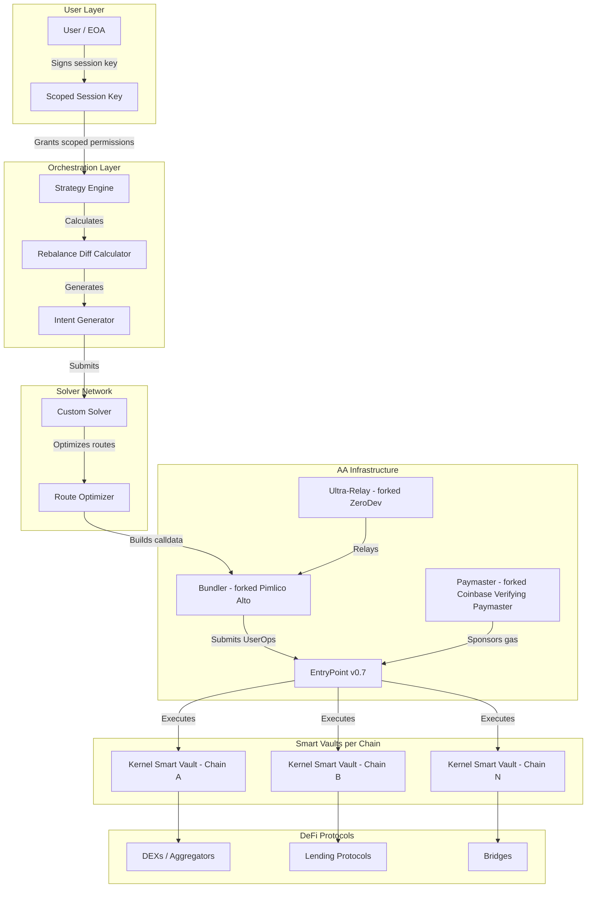
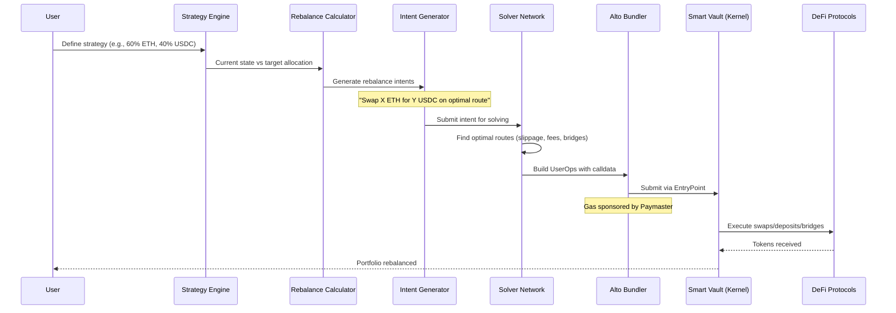

# Glider.fi - Deep Dive Analysis

> **Category**: Automated on-chain portfolio management with delegated execution
> **Smart Account**: ZeroDev Kernel (ERC-7579 modular)
> **Permission Model**: Scoped session keys
> **Execution Model**: Intent-based (strategy -> diff -> intent -> solver -> execution)
> **Funding**: $4M seed led by a16z CSX, with Coinbase Ventures, Uniswap Ventures, GSR (April 2025)
> **Founded**: 2024 by ex-Anchorage Digital, XTX Markets, MIT, 0x team members

---

## Architecture Overview



---

## Core Architecture Analysis

### 1. Smart Vaults (ZeroDev Kernel)

Glider uses ZeroDev's Kernel smart account as the foundation for each user's "smart vault." Key characteristics:

- **Lazy deployment**: Smart vaults are deployed on-demand across supported chains only when needed (not upfront on all chains)
- **Per-user isolation**: Each user gets their own smart vault per chain -- no commingling of funds
- **User-owned**: The user's EOA retains ownership; Glider never holds ownership keys
- **ERC-7579 modular**: Kernel's modular architecture allows Glider to plug in custom validators and executors

### 2. Why Kernel Over Safe

Based on analysis of Glider's architecture choices:

| Factor | Kernel | Safe |
|--------|--------|------|
| **Gas cost (deployment)** | ~200K gas (minimal proxy) | ~500K+ gas (full Safe setup) |
| **Gas cost (UserOp)** | Lower per-operation overhead | Higher due to threshold checks |
| **Native AA** | Built for ERC-4337 from day 1 | Retrofitted via Safe4337Module |
| **Session keys** | Native plugin support via WeightedECDSA + SessionKey validator | Requires separate module (Safe7579 + SmartSession) |
| **Modularity** | ERC-7579 native | ERC-7579 via adapter (Safe7579) |
| **Multi-chain deployment** | Deterministic CREATE2 addresses | Deterministic but heavier |
| **ZeroDev SDK** | Tightly integrated | Third-party integration |
| **Batch operations** | Native batching | Native batching via execTransactionFromModule |

Glider likely chose Kernel because:
1. **Lower gas costs** -- critical when operating across many chains with frequent rebalancing
2. **Native AA integration** -- no adapter layer between the account and ERC-4337
3. **ZeroDev ecosystem** -- bundler, paymaster, and SDK all designed to work together
4. **Session key maturity** -- ZeroDev's session key implementation is production-tested
5. **Startup agility** -- smaller, more focused codebase vs Safe's large ecosystem

### 3. Forked Infrastructure (GitHub Evidence)

Glider maintains forks of critical AA infrastructure on [github.com/glider-fi](https://github.com/glider-fi):

| Repository | Original | Purpose |
|------------|----------|---------|
| `alto` | [pimlicolabs/alto](https://github.com/pimlicolabs/alto) | ERC-4337 bundler (TypeScript, GPL v3.0) |
| `ultra-relay` | [zerodevapp/ultra-relay](https://github.com/zerodevapp) | ZeroDev's relay for gas sponsorship |
| `verifying-paymaster` | [coinbase/verifying-paymaster](https://github.com/coinbase/verifying-paymaster) | ERC-4337 paymaster for gas sponsorship |
| `erpc-railway-deployment` | eRPC | RPC proxy/load balancer deployment template |

**Why fork instead of using hosted services?**
- **Control**: Custom modifications for their specific execution patterns
- **Cost**: Self-hosted bundler avoids per-UserOp fees at scale
- **Reliability**: No dependency on third-party uptime
- **Customization**: Likely modified Alto for their solver integration and intent execution flow
- **eRPC**: Multi-chain RPC aggregation with failover -- critical for cross-chain operations

### 4. Intent-Based Execution Flow



The intent-based model is declarative rather than imperative:
- **User declares WHAT** they want (target allocation)
- **System figures out HOW** (routes, timing, bridges)
- **Solver optimizes** for cost, slippage, and speed
- **Session key scopes** what the system CAN do (only trade listed tokens, never withdraw)

### 5. Session Key Permission Model

Glider's permission model centers on scoped session keys:

```
Session Key Scope:
  - Allowed actions: buy/sell tokens listed in strategy
  - Forbidden actions: withdraw funds, change ownership
  - Allowed targets: whitelisted DEX/bridge contracts
  - Time bounds: valid for strategy duration
  - Value limits: per-transaction and cumulative caps
```

The session key is signed once by the user, then Glider's backend can execute operations within those bounds without further user interaction. This enables:
- **Automated rebalancing** without user signatures per trade
- **Gas-free UX** (paymaster sponsors all operations)
- **Non-custodial** (session key cannot withdraw to arbitrary addresses)

### 6. Cross-Chain Architecture

- Smart vaults deployed lazily on each chain as needed
- Cross-chain rebalancing uses bridge integrations
- Same user address on all chains (CREATE2 deterministic deployment)
- eRPC handles multi-chain RPC routing with failover

---

## How Glider Solves the 5 Core Requirements

| Requirement | Glider's Approach |
|-------------|-------------------|
| **Custody preservation** | User's EOA owns all smart vaults; session keys cannot withdraw |
| **Delegated execution** | Session keys allow Glider backend to execute within scoped permissions |
| **Granular permissions** | Session key validators enforce target contracts, function selectors, token lists |
| **Safety mechanism** | Session key expiry + scoped permissions (no explicit timelock) |
| **Gasless UX** | Forked Coinbase paymaster sponsors all operations |

---

## Strengths

1. **True non-custodial**: Glider never has ownership access; session keys are mathematically constrained
2. **Gas-free UX**: Users never need native tokens on any chain
3. **Intent-based execution**: Declarative approach is more flexible than imperative transaction building
4. **Cross-chain native**: Architecture designed from day 1 for multi-chain portfolios
5. **Production infrastructure**: Self-hosted bundler/paymaster/relay gives full control
6. **Lean smart account**: Kernel's minimal footprint reduces gas costs significantly
7. **Solver optimization**: Custom solver network can find optimal routes across chains

## Weaknesses

1. **No explicit timelock**: Unlike Zodiac Delay Module, no on-chain delay for operations
2. **Centralized solver**: Custom solver is a centralization/liveness risk
3. **Session key revocation**: Revoking a compromised session key requires on-chain transaction
4. **Limited safety mechanisms**: No owner "cancel" ability on pending operations
5. **Kernel lock-in**: Tied to ZeroDev ecosystem; switching smart accounts would be costly
6. **Young ecosystem**: Kernel has fewer audits and battle-testing than Safe
7. **No multi-sig support**: Designed for individual users, not DAOs/teams with threshold signing

---

## Key Lessons for Our Project

### What to Adopt

1. **Session key-scoped permissions** -- The "sign once, execute many" model is the right UX for operators
2. **Self-hosted infrastructure** -- Forking bundler/paymaster gives cost control and reliability at scale
3. **Intent-based execution** -- Declarative approach separates "what" from "how," enabling optimization
4. **Lazy vault deployment** -- Don't deploy on chains until needed; saves gas and complexity
5. **eRPC for multi-chain** -- RPC aggregation with failover is production-critical
6. **CREATE2 deterministic addresses** -- Same address on all chains simplifies UX

### What to Do Differently

1. **Add a timelock/delay mechanism** -- Our spec requires owner cancel capability; Glider lacks this
2. **Use Safe instead of Kernel** -- For institutional/DAO use cases, Safe's multi-sig and audit history matters more than gas savings
3. **Add explicit safety rails** -- On-chain delay with owner cancellation (Zodiac Delay or ERC-7579 equivalent)
4. **Support multi-sig owners** -- Our system needs to support teams, not just individual users
5. **Decentralize execution** -- Avoid single-solver dependency; consider multiple executors
6. **On-chain permission registry** -- More transparent than session keys alone for institutional use cases
7. **Richer parameter conditions** -- Support "recipient must be Safe address" type constraints that session keys alone don't easily express

### Architecture Takeaway

Glider validates that **ZeroDev Kernel + session keys + self-hosted AA infra** is a viable production architecture for delegated DeFi execution. However, for our use case (institutional custody with timelock safety), we need the additional safety mechanisms that Safe + Zodiac/ERC-7579 modules provide. Glider optimizes for consumer UX; we need to optimize for institutional safety.

---

## References

- [Anagram Blog: Glider architecture analysis](https://blog.anagram.xyz/glider/)
- [Glider.fi Blog](https://blog.glider.fi/)
- [Glider GitHub Organization](https://github.com/glider-fi)
- [ZeroDev Session Keys Documentation](https://docs.zerodev.app/smart-wallet/permissions/intro)
- [ZeroDev Kernel Documentation](https://docs.zerodev.app/)
- [Pimlico Alto Bundler](https://github.com/pimlicolabs/alto)
- [Coinbase Verifying Paymaster](https://github.com/coinbase/verifying-paymaster)
- [Glider $4M Funding Announcement](https://www.businesswire.com/news/home/20250415391753/en/Glider-Raises-$4-Million-Strategic-Funding-Round-Led-by-a16z-CSX-to-Transform-Crypto-Portfolio-Management)
