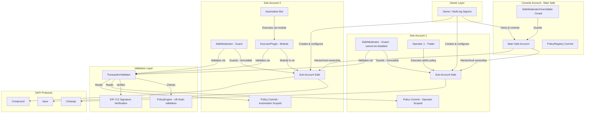
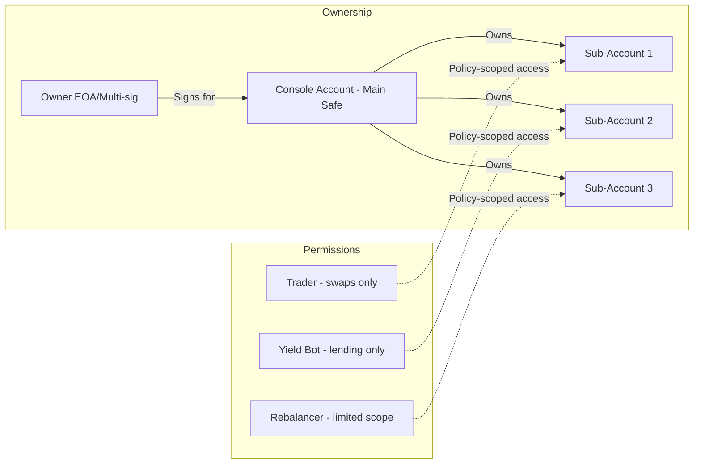
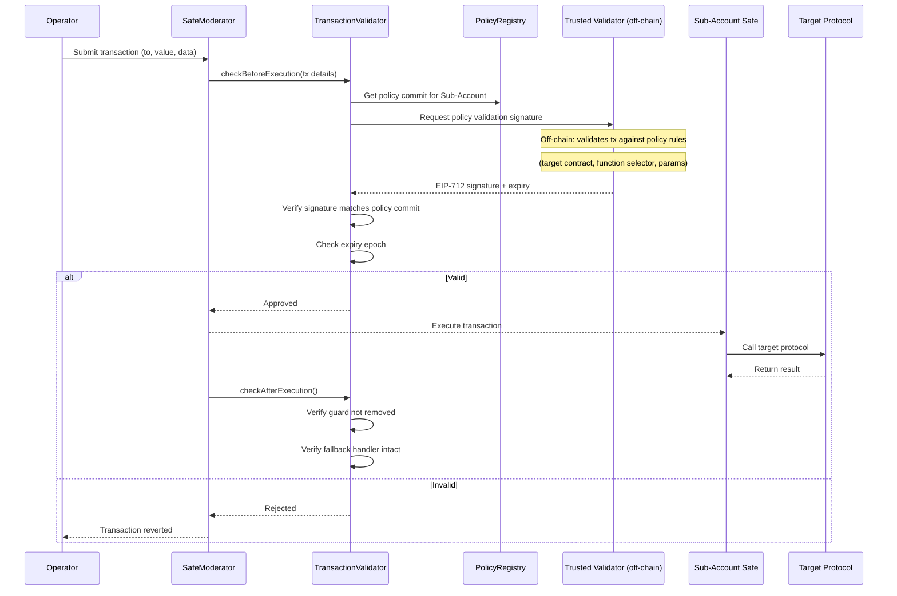

# Brahma.fi Console - Deep Dive Analysis

> **Category**: On-chain execution and custody environment with delegated access control
> **Smart Account**: Gnosis Safe (multi-sig)
> **Permission Model**: Hierarchical Console Account -> Sub-Accounts with on-chain policy guards
> **Execution Model**: Policy-validated transactions via guards and executor plugins
> **Chains**: Ethereum, Arbitrum, Base, BSC (Berachain and Sei deprecated)
> **Stats**: $200M+ secured assets, $1B+ volume processed, 10,000+ accounts
> **Audit**: Code4rena (October 2023, $31,250 pool), Ackee Blockchain

---

## Architecture Overview

---

## Core Architecture Analysis

### 1. Hierarchical Account Model

Brahma implements a two-tier Safe-based hierarchy:

**Console Account (Main Safe)**
- Primary multi-sig wallet controlled by owners
- Holds the bulk of funds
- Can create and manage Sub-Accounts
- Protected by `SafeModeratorOverridable` guard (can be disabled by owners)
- Full custody rights

**Sub-Accounts (Child Safes)**
- Deployed via Safe Factory with Brahma Guard pre-configured
- Each is an independent Safe contract
- Main Safe is the sole on-chain owner of all Sub-Accounts
- Protected by `SafeModerator` guard (cannot be disabled)
- Operators can execute within policy bounds
- Isolated risk environments

### 2. Smart Contract Components

#### SafeModerator (Guard for Sub-Accounts)
- Gnosis Safe Guard attached during Sub-Account deployment
- **Cannot be turned off** by anyone, including the Main Safe owners
- Intercepts every transaction on the Sub-Account
- Calls `TransactionValidator` before and after execution
- Enforces policy compliance on every operation

#### SafeModeratorOverridable (Guard for Console Accounts)
- Similar to SafeModerator but **can be disabled** by Console Account owners
- Used on the Main Safe for less restrictive oversight
- Allows owners to bypass policies when needed (emergency operations)

#### TransactionValidator
- Central validation engine called by both guards and ExecutorPlugin
- Validates:
  1. Executor's signature (EIP-712 compliant)
  2. Executor's validity for the specific account
  3. Policy compliance for the requested operation
- Checks that guards and fallback handlers remain unchanged post-execution
- Prevents guard removal attacks

#### PolicyRegistry
- On-chain registry of policy commitment hashes
- Maps `account address -> policy commit hash`
- Only authorized entities can update policy commits
- Policy commits are hashes of the actual policy rules (policies stored off-chain)
- Enables governance-controlled policy updates

#### ExecutorPlugin (Safe Module)
- Installed as a Safe Module on Sub-Accounts
- Allows designated executors to perform transactions **without owner signatures**
- Validates executor identity, signature, and policy before execution
- Enables automation bots and AI agents to operate within policy bounds
- Key enabler for the ConsoleKit AI agent framework

### 3. Policy Validation Flow

**Key insight**: Policy validation is **hybrid on-chain/off-chain**:
- Policy **commits** (hashes) stored on-chain in PolicyRegistry
- Policy **rules** evaluated off-chain by trusted validator
- Validator produces EIP-712 **signature** proving compliance
- On-chain contracts verify the signature matches the stored commit
- This avoids expensive on-chain policy evaluation while maintaining verifiability

### 4. ConsoleKit -- AI Agent Framework

Brahma evolved from pure delegation to AI agent execution:

- **ConsoleKit** enables developers to build autonomous on-chain agents
- Agents operate within Sub-Account policy bounds
- Pre-execution simulation validates transaction success
- Customizable rules define operating parameters
- Post-execution verification confirms outcomes
- Currently supports agents for Morpho, Tempest, Creator.bid, Swell

This represents the next evolution of delegated execution: from human operators to AI agents, all within the same policy framework.

---

## How Brahma Solves the 5 Core Requirements

| Requirement | Brahma's Approach |
|-------------|-------------------|
| **Custody preservation** | Main Safe owners control all Sub-Accounts; operators cannot withdraw to arbitrary addresses |
| **Delegated execution** | Operators execute on Sub-Accounts via SafeModerator validation; ExecutorPlugin for bots |
| **Granular permissions** | Policy commits scope: target protocols, function selectors, token types, time frames |
| **Safety mechanism** | Guards cannot be disabled on Sub-Accounts; Main Safe can revoke operator access; no explicit timelock |
| **Gasless UX** | Not natively supported; would require additional AA infrastructure |

---

## Strengths

1. **Safe-native**: Built entirely on Gnosis Safe, inheriting its security, audits, and ecosystem
2. **Hierarchical model**: Clean separation between owner funds (Main Safe) and operational funds (Sub-Accounts)
3. **Immutable guards**: SafeModerator on Sub-Accounts cannot be disabled, preventing guard removal attacks
4. **Post-execution checks**: Validates guard integrity after every transaction (prevents subtle attacks)
5. **Battle-tested**: $200M+ secured, Code4rena + Ackee audits
6. **AI agent ready**: ConsoleKit framework extends delegation to autonomous agents
7. **Familiar tooling**: Owners can interact with Sub-Accounts directly via Safe UI
8. **Policy isolation**: Each Sub-Account has independent policy scope

## Weaknesses

1. **Off-chain policy evaluation**: Trusted validator is a centralization point; if validator is down, no operations proceed
2. **No native AA/gasless**: Missing account abstraction support (no bundler/paymaster integration)
3. **Gas overhead**: Two Safes (Main + Sub) per delegation relationship is expensive to deploy
4. **Policy opacity**: Actual policy rules are off-chain; only hashes are on-chain (less transparent)
5. **No timelock**: No delay module or cancellation mechanism for pending operations
6. **Single validator trust**: If the trusted validator's key is compromised, policies can be bypassed
7. **Complex deployment**: Multi-contract setup (Safe + Guard + PolicyRegistry + ExecutorPlugin) is operationally complex

### Code4rena Audit Findings (October 2023)

Four medium-severity vulnerabilities found:
1. **EIP-712 non-compliance**: Type hashes referenced removed struct definitions
2. **Gas refund exploitation**: Operators could manipulate gas parameters to extract funds
3. **Safe v1.4.0 incompatibility**: Missing EIP-165 interface support
4. **Module transaction failures**: Guard interface lacked required return values for Safe 1.5.0

These highlight the complexity of building on top of Safe's guard system across multiple versions.

---

## Key Lessons for Our Project

### What to Adopt

1. **Hierarchical Safe model** -- Console Account -> Sub-Accounts is elegant for owner/operator separation
2. **Immutable guards** -- SafeModerator that cannot be disabled is a strong security property
3. **Post-execution validation** -- Checking guard integrity after execution prevents subtle attack vectors
4. **Policy commit pattern** -- On-chain hash + off-chain evaluation balances cost and flexibility
5. **Sub-Account isolation** -- Each operator gets their own isolated risk environment
6. **ExecutorPlugin pattern** -- Module-based execution for automation is clean and auditable

### What to Do Differently

1. **Add on-chain policy evaluation** -- For critical rules (e.g., "recipient must be the Safe"), on-chain enforcement is safer than off-chain validation alone
2. **Add timelock/delay** -- Our spec requires owner cancellation; Brahma doesn't have this
3. **Integrate AA natively** -- Brahma lacks bundler/paymaster; we should build this in from day 1
4. **Reduce trust assumptions** -- Move policy validation more on-chain to reduce trusted validator dependency
5. **Use ERC-7579 modules** -- Instead of custom guards, use standardized modules for better interoperability
6. **Consider single-Safe approach** -- Two Safes per relationship is expensive; ERC-7579 modules on a single Safe could achieve similar isolation

### Architecture Takeaway

Brahma validates that **Safe + hierarchical Sub-Accounts + policy guards** is a production-proven architecture for delegated DeFi execution. The hybrid on-chain/off-chain policy validation is pragmatic but introduces trust assumptions. For our project, we should adopt the hierarchical model but enhance it with on-chain policy enforcement (via ERC-7579 modules like SmartSession) and add the timelock mechanism our spec requires.

---

## References

- [Brahma Documentation](https://docs.brahma.fi)
- [Brahma Sub-Accounts](https://docs.brahma.fi/brahma-accounts/brahma-pro/team-management-and-access-control/sub-accounts)
- [Brahma Executor Module](https://docs.brahma.fi/features-and-functionalities/automation-and-actions/executor-module)
- [Code4rena Brahma Audit Report](https://code4rena.com/reports/2023-10-brahma)
- [Ackee Blockchain Audit Summary](https://ackee.xyz/blog/brahma-console-v2-audit-summary/)
- [Brahma ConsoleKit](https://brahma.fi/console-kit)
- [Brahma GitHub (ConsoleKit)](https://github.com/Brahma-fi/console-kit)
- [Brahma Security-First Design Blog](https://brahma.fi/blog/security-first-design-of-brahma)
