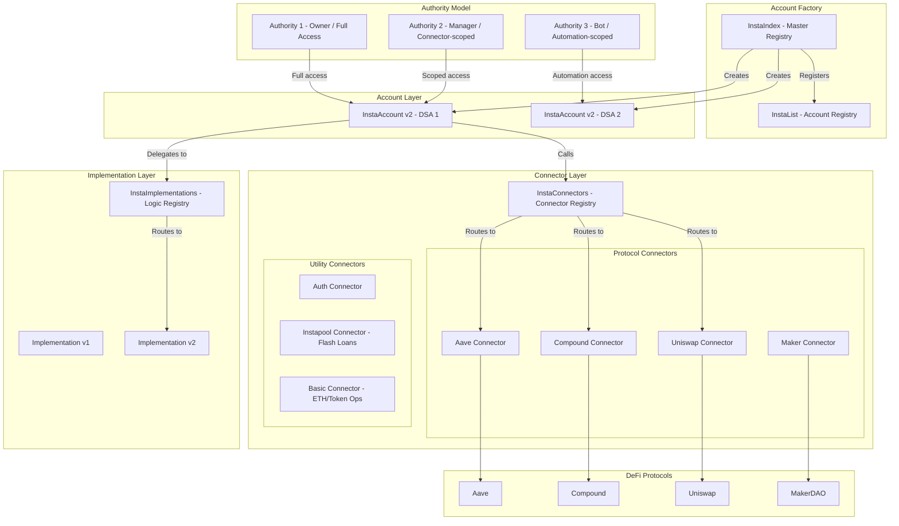
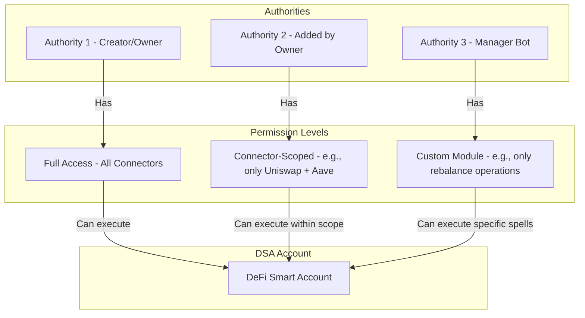

# Instadapp DSA (DeFi Smart Accounts) - Deep Dive Analysis

> **Category**: DeFi aggregation platform with delegated authority model
> **Smart Account**: Custom DSA (DeFi Smart Account) contracts
> **Permission Model**: Authority-based with connector-level granularity
> **Execution Model**: Spell-based (composed connector function sequences)
> **Chains**: Ethereum, Polygon, Arbitrum, Optimism, Avalanche, Fantom, Base
> **TVL**: ~$2B (historically; fluctuates with market)
> **Related Products**: Avocado (smart wallet), Fluid (lending protocol, previously Instadapp Lite)

---

## Architecture Overview



---

## Core Architecture Analysis

### 1. Account System

#### InstaIndex (Master Contract)
- Central registry and factory for the entire DSA ecosystem
- Tracks `AccountModule` creation, `SmartAccount` creation, and master address changes
- Entry point for creating new DSAs via the `build()` function
- Maintains versioning for account implementations

#### InstaAccount (DeFi Smart Account)
- Contract account owned trustlessly by users
- Each EOA can create multiple DSAs
- Uses proxy/implementation pattern for upgradeability
- All assets are held in the DSA contract
- Users can withdraw assets to owners at any time

#### InstaList (Account Registry)
- Tracks all created DSAs and their relationships
- Maps accounts to authorities and vice versa
- Enables discovery and enumeration of user accounts

#### InstaImplementations (Logic Registry)
- Registry of implementation contracts that DSAs delegate to
- Enables upgradeable logic without changing the DSA proxy address
- Allows adding new functionality over time

### 2. Connector Architecture

Connectors are the modular interface between DSAs and DeFi protocols. Four types:

| Type | Purpose | Examples |
|------|---------|----------|
| **Protocol Connectors** | Direct protocol access | Aave deposit/borrow, Compound supply/repay, Uniswap swap |
| **Auth Connectors** | Permission management | Add/remove authorities, set connector-level permissions |
| **Use-case Connectors** | Higher-level operations | Optimized lending rebalance, yield optimization |
| **Instapool Connectors** | Flash loan facility | `flashBorrowAndCast`, `flashPayback` |

Each connector:
- Implements a standardized interface
- Has a unique ID in the connector registry
- Can be enabled/disabled per DSA
- Defines specific functions for protocol interaction
- Returns standardized event data

### 3. Authority Model



**Authority characteristics:**
- The address that creates a DSA becomes its first Authority
- Multiple authorities can be added to one DSA
- Authorities can have **full access** to the account (default)
- Authentication Modules enable **granular permissions**:
  - Guardian: Account recovery
  - Manager: Fund optimization (e.g., rebalance yields, minimize interest)
  - Automation bot: Specific operations (e.g., DCA, stop-loss)
- Permissions can be scoped to specific connector sets

### 4. Spells (Composed Transactions)

Spells are Instadapp's key execution primitive -- a sequence of connector function calls executed atomically:

```
Example: Maker-to-Compound Debt Migration Spell
  1. FlashBorrow(DAI, amount)          -- via Instapool Connector
  2. Payback(DAI, amount)              -- via Maker Connector
  3. Withdraw(ETH, amount)             -- via Maker Connector
  4. Deposit(ETH, amount)              -- via Compound Connector
  5. Borrow(DAI, amount)               -- via Compound Connector
  6. FlashPayback(DAI, amount + fee)   -- via Instapool Connector
```

Spell characteristics:
- Atomic: All steps succeed or all revert
- Cross-protocol: Can span multiple DeFi protocols in one transaction
- Flash-loan enabled: Can borrow, execute, and repay within one transaction
- Composable: Developers can build custom spell sequences
- Gas-efficient: Single transaction for complex multi-step operations

### 5. Flash Loan Integration (InstaFlash / Instapool)

Instadapp's flash loan facility is a key differentiator:

- **Instapool**: Native short-term liquidity pool for asset porting
- **InstaFlash**: Aggregated flash loans from multiple sources (Aave, dYdX, Maker)
- Enables zero-capital operations: debt migrations, liquidation protection, arbitrage
- `flashBorrowAndCast` pattern: borrow -> execute spell -> repay in one tx
- Critical for complex DeFi operations that would otherwise require large capital

### 6. Avocado Smart Wallet

Instadapp's later evolution toward AA-style smart accounts:

- Smart contract wallet deployed at the same address on 10+ chains
- Gas abstraction: All gas paid in USDC (no need for native tokens)
- Account abstraction features: batched transactions, cross-chain execution
- Multisig support added later
- WalletConnect compatible for connecting to any dApp
- Represents Instadapp's shift from DeFi aggregation to general-purpose smart wallet

---

## How Instadapp Solves the 5 Core Requirements

| Requirement | Instadapp's Approach |
|-------------|---------------------|
| **Custody preservation** | DSA is trustlessly owned by creator; authorities can be revoked |
| **Delegated execution** | Authority model with connector-scoped permissions |
| **Granular permissions** | Auth modules scope access to specific connector sets |
| **Safety mechanism** | Guardian role for recovery; but no timelock mechanism |
| **Gasless UX** | Avocado wallet pays gas in USDC; original DSA requires ETH |

---

## Strengths

1. **Battle-tested**: Years of production usage with billions in TVL
2. **Protocol coverage**: Extensive connector library covering all major DeFi protocols
3. **Flash loan composability**: Native flash loans enable powerful zero-capital operations
4. **Spell abstraction**: Complex multi-step operations as single atomic transactions
5. **Multi-chain**: Deployed on 7+ chains
6. **Upgradeability**: Implementation proxy pattern allows adding functionality
7. **Developer ecosystem**: Well-documented connector development framework

## Weaknesses

1. **Coarse-grained permissions**: Default authority has full access; granular permissions require custom auth modules
2. **Custom account standard**: Not ERC-4337 compatible; not Safe-based; limited interoperability
3. **No parameter-level constraints**: Cannot enforce "swap only token X" at the parameter level within a connector
4. **No timelock/delay**: No mechanism for delayed execution or owner cancellation
5. **Centralized connector governance**: New connectors must be approved and registered centrally
6. **No AA integration**: Original DSA lacks bundler/paymaster support (Avocado addresses this partially)
7. **Authority is binary**: An authority either has full access or needs a custom auth module; no native role hierarchy
8. **Connector-based isolation only**: Cannot restrict a specific function within a connector (e.g., allow deposit but not borrow on Aave)

---

## Key Lessons for Our Project

### What to Adopt

1. **Connector/module abstraction** -- Standardized interfaces for DeFi protocol integration reduce complexity
2. **Atomic spell execution** -- Multi-step operations as single atomic transactions are essential for DeFi
3. **Flash loan integration** -- Native flash loan support enables powerful DeFi strategies
4. **Multi-DSA per user** -- Ability to create multiple isolated accounts for different strategies
5. **Upgradeability pattern** -- Implementation proxy allows adding new protocol support without redeployment

### What to Do Differently

1. **Use standard smart accounts** -- ERC-4337 compliant accounts (Safe or Kernel) instead of custom DSA
2. **Finer-grained permissions** -- Function selector + parameter level constraints, not just connector-level
3. **Add timelock mechanism** -- Delay module with owner cancellation for safety
4. **Native AA support** -- Bundler + paymaster from day 1
5. **On-chain permission validation** -- Not just authority checks but actual parameter validation
6. **Role hierarchy** -- Multiple permission levels natively, not just "full access" or "custom module"
7. **ERC-7579 modules instead of connectors** -- Standard module system with better interoperability

### Architecture Takeaway

Instadapp pioneered the "DeFi smart account" concept and proved that **connector-based protocol abstraction + atomic spell execution** is powerful for DeFi operations. However, the authority model is too coarse-grained for our delegation use case, and the custom account standard limits interoperability. The key lesson is the **connector abstraction pattern** (which maps well to ERC-7579 executors) and **flash loan composability** as a first-class feature.

---

## References

- [Instadapp DeFi Smart Accounts Guide](https://guides.instadapp.io/dive-deeper/defi-smart-accounts)
- [DSA Architecture Overview (GitHub Gist)](https://gist.github.com/mingyeow/a9dd6fabb6bf112376c9039fc39640ed)
- [Instadapp Documentation](https://docs.instadapp.io/get-started/setup)
- [Instadapp Authority Guide](https://guides.instadapp.io/managing-assets/authority)
- [Instadapp DSA Connect SDK](https://github.com/Instadapp/dsa-connect)
- [Instadapp Connectors Repository](https://github.com/Instadapp/dsa-connectors)
- [Introducing DeFi Smart Layer (Blog)](https://blog.instadapp.io/introducing-defi-smart-layer/)
- [Avocado Wallet](https://guides.instadapp.io/smart-wallets/avocado-wallet)
- [Instadapp Protocol & Governance](https://blog.instadapp.io/protocol-and-governance/)
- [Mint Ventures: In-depth Research on InstaDApp](https://mint-ventures.medium.com/in-depth-research-instadapp-be-the-gateway-and-cornerstone-of-defi-123efbb2219d)
