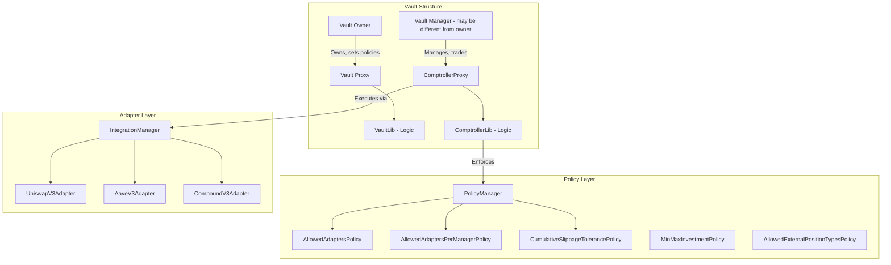
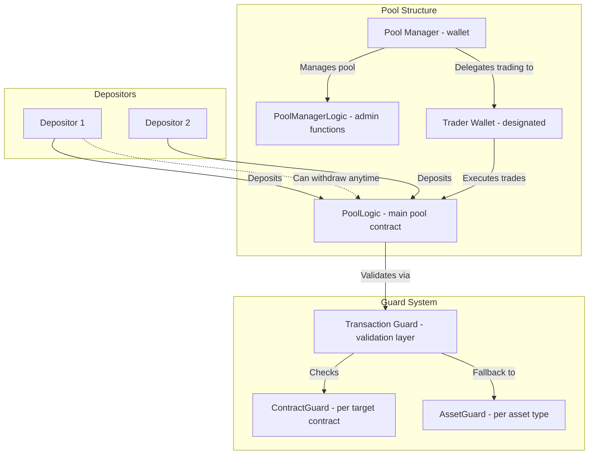
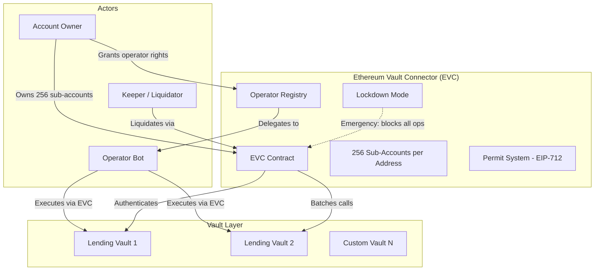
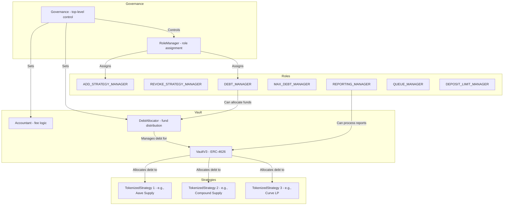

# Other Delegated DeFi Execution Products - Survey

> This document surveys additional products that implement delegated DeFi execution,
> analyzing their architecture choices, permission models, and lessons for our project.

---

## Table of Contents

1. [Enzyme Finance](#1-enzyme-finance)
2. [dHEDGE](#2-dhedge)
3. [Euler V2 (EVC)](#3-euler-v2-evc)
4. [Yearn V3](#4-yearn-v3)
5. [Maple Finance](#5-maple-finance)
6. [Nested.fi](#6-nestedfi)
7. [Definitive.fi](#7-definitivefi)
8. [Cross-Product Comparison](#cross-product-comparison)
9. [Key Takeaways for Our Project](#key-takeaways-for-our-project)

---

## 1. Enzyme Finance

> **Category**: On-chain asset management with vault delegation
> **Architecture**: Custom vault contracts (Onyx Protocol) + PolicyManager
> **TVL**: ~$200M+
> **Chains**: Ethereum, Polygon, Arbitrum
> **Audits**: Multiple (Trail of Bits, PwC, and others)

### Architecture

### How Delegation Works

- **Vault Owner**: Sets up the vault, defines policies, and can assign a separate **Vault Manager**
- **Vault Manager**: Can trade and manage positions but is constrained by on-chain policies
- Enzyme cooperates with **Gnosis Safe** to allow DAOs to delegate trading securely
- **Zodiac modules** can be used for Safe-based vaults for further permission scoping

### Policy System

Enzyme has one of the most comprehensive on-chain policy systems:

| Policy Category | Policies | Purpose |
|----------------|----------|---------|
| **Manager Restrictions** | AllowedAdaptersPolicy | Restrict which protocols the manager can use |
| | AllowedAdaptersPerManagerPolicy | Per-manager protocol restrictions |
| | CumulativeSlippageTolerancePolicy | Limit value loss over a tolerance period (7 days) |
| | AllowedExternalPositionTypesPolicy | Restrict external position types |
| | OnlyRemoveDustExternalPositionPolicy | Prevent removing non-dust positions |
| **Investor Restrictions** | AllowedDepositRecipientsPolicy | Control who can receive shares |
| | MinMaxInvestmentPolicy | Set investment bounds |
| | AllowedSharesTransferRecipientsPolicy | Control share transfers |
| **Redemption Restrictions** | AllowedAssetsForRedemptionPolicy | Control redemption assets |
| | MinAssetBalancesPostRedemptionPolicy | Prevent draining |

Key properties:
- Policies are **on-chain**: fully verifiable and trustless
- Some policies are **non-disableable/non-updatable** once set (strong guarantees for investors)
- PolicyManager hooks: `PostBuyShares`, `PreTransferShares`, `PostCallOnIntegration`, `RedeemSharesForSpecificAssets`
- Cumulative slippage tracking prevents value drain through small incremental losses

### Strengths & Weaknesses

**Strengths:**
- Most mature on-chain policy system in DeFi
- Fully on-chain enforcement (no trusted validator)
- Non-disableable policies give investors strong guarantees
- Adapter-based protocol integration (similar to Instadapp connectors)
- Zodiac integration for Safe-based governance

**Weaknesses:**
- Complex deployment (many contracts per vault)
- Tokenized shares model (not raw asset custody)
- Gas-intensive policy checks
- Custom architecture (not ERC-4337 compatible)
- No AA/gasless support

### Lessons for Our Project

- **Adopt**: On-chain policy enforcement pattern -- CumulativeSlippageTolerancePolicy is brilliant for protecting against value drain
- **Adopt**: Non-disableable policies for critical safety rules
- **Avoid**: Custom vault architecture -- use standard smart accounts instead
- **Adapt**: Adapter-based integration maps to ERC-7579 executor modules

---

## 2. dHEDGE

> **Category**: Delegated asset management with tokenized vaults
> **Architecture**: Custom PoolLogic + PoolManagerLogic + Guard system
> **TVL**: ~$500M+
> **Chains**: Polygon, Optimism, Arbitrum, Base
> **Audits**: Multiple security reviews

### Architecture

### How Delegation Works

- **Pool Manager**: Creates the pool, sets parameters, manages whitelisted assets
- **Trader Wallet**: Designated by the manager for trading access only
  - Only one trader wallet per pool at a time
  - Cannot withdraw depositor funds
  - Trading fees expensed to the trader wallet, not the manager
  - Manager can revoke trader access at any time
- **Depositors**: Full custody -- can withdraw at any time

### Guard System

The guard system validates every transaction:

1. **ContractGuard**: Per-target-contract validation (e.g., specific rules for Uniswap vs Aave)
2. **AssetGuard**: Per-asset-type validation (fallback if no ContractGuard)
3. **Transaction routing**: `PoolLogic` checks `ContractGuard` first, falls back to `AssetGuard`

### Strengths & Weaknesses

**Strengths:**
- Clean manager/trader separation
- Full depositor custody (withdraw anytime)
- Multi-layered guard system
- Supported asset whitelist
- Pool privacy features (limit eligible depositors)

**Weaknesses:**
- Single trader wallet limit per pool
- Custom architecture (not standard smart accounts)
- No parameter-level constraints (only contract/asset level)
- No timelock mechanism
- No AA/gasless support

### Lessons for Our Project

- **Adopt**: Manager/trader wallet separation pattern
- **Adopt**: Multi-layered guard validation (contract-specific then generic fallback)
- **Avoid**: Single trader limit -- we need multiple operators
- **Avoid**: Custom pool contracts -- use standard smart accounts

---

## 3. Euler V2 (EVC)

> **Category**: Modular lending protocol with operator delegation
> **Architecture**: Euler Vault Kit (EVK) + Ethereum Vault Connector (EVC)
> **TVL**: Growing rapidly (launched late 2024)
> **Chains**: Ethereum, Arbitrum, Base, others
> **Audits**: Extensive (multiple firms)

### Architecture

### Operator Delegation Model

Euler V2's EVC introduces one of the most elegant operator delegation systems:

- **Sub-accounts**: Each address gets 256 virtual sub-accounts (derived via XOR on last byte)
- **Operator delegation**: `setAccountOperator()` grants access to specific sub-accounts
- **Bitfield permissions**: `setOperator()` uses 256-bit bitfields for fine-grained sub-account access
- **Full capabilities**: Operators can move funds, borrow, repay, and perform any action
- **Gasless permits**: EIP-712 permits enable off-chain authorization with nonce namespaces

### Safety Mechanisms

- **Lockdown Mode**: Owner activates to restrict ALL operations across all sub-accounts -- only operator/nonce management allowed
- **Permit Disabled Mode**: Blocks all permit-based execution for an address prefix
- **Nonce namespaces**: Multiple independent permit streams prevent replay attacks
- **Sub-account isolation**: Each sub-account has independent collateral/debt positions

### Strengths & Weaknesses

**Strengths:**
- **Elegant sub-account system**: 256 virtual accounts from one address with no deployment cost
- **Bitfield operator permissions**: Extremely gas-efficient delegation
- **Lockdown mode**: Powerful emergency response mechanism
- **EIP-712 permits**: Gasless delegation without AA infrastructure
- **Nonce namespaces**: Support parallel workflows
- **Deeply integrated**: Delegation is protocol-native, not an add-on

**Weaknesses:**
- **Lending-specific**: Only works within Euler vaults, not general-purpose DeFi
- **Operator = full access**: Once granted, operator has full control of the sub-account (no function-level restrictions)
- **No timelock**: No delay between operator action and execution
- **Protocol-bound**: Cannot use for operations outside the Euler ecosystem
- **Trust-based**: Users must fully trust operators (mitigated by lockdown mode)

### Lessons for Our Project

- **Adopt**: Sub-account isolation pattern -- brilliant for segregating risk
- **Adopt**: Lockdown mode as emergency response mechanism
- **Adopt**: EIP-712 permit system with nonce namespaces for gasless delegation
- **Adopt**: Bitfield-based permission delegation for gas efficiency
- **Avoid**: "Operator = full access" model -- we need function-level granularity
- **Adapt**: Sub-account concept could map to Safe modules or session key scopes

---

## 4. Yearn V3

> **Category**: Automated yield vaults with delegated strategy execution
> **Architecture**: ERC-4626 vaults + TokenizedStrategy + RoleManager
> **TVL**: Significant (Yearn ecosystem)
> **Chains**: Ethereum, Polygon, Arbitrum, others

### Architecture

### Role-Based Permission System

Yearn V3 implements a granular role system:

| Role | Capabilities |
|------|-------------|
| `governance` | Top-level control of vault and RoleManager |
| `management` | Day-to-day operations, debt allocation |
| `ADD_STRATEGY_MANAGER` | Add new strategies to vault |
| `REVOKE_STRATEGY_MANAGER` | Remove strategies |
| `FORCE_REVOKE_MANAGER` | Emergency strategy removal |
| `DEBT_MANAGER` | Allocate/deallocate funds between strategies |
| `MAX_DEBT_MANAGER` | Set per-strategy debt ceilings |
| `REPORTING_MANAGER` | Process strategy reports and trigger fee charges |
| `QUEUE_MANAGER` | Manage withdrawal queue ordering |
| `DEPOSIT_LIMIT_MANAGER` | Configure deposit limits |

Key properties:
- Roles are **bitmask-based**: Setting roles fully overrides previous permissions
- `governance` and `management` addresses **must be different** (enforced)
- DebtAllocator respects strategy-level `maxDeposit`/`maxRedeem` limits
- Strategies are ERC-4626 tokenized (composable with other protocols)

### Strengths & Weaknesses

**Strengths:**
- Mature role-based permission system with clear separation of concerns
- ERC-4626 composability
- DebtAllocator automates fund distribution
- Bitmask roles are gas-efficient
- Clear governance/management separation enforced

**Weaknesses:**
- Vault-specific: Cannot delegate arbitrary DeFi operations
- Strategy-level only: No per-transaction permission checks
- No AA/gasless support
- Complex role management for small teams
- Focused on yield, not general DeFi execution

### Lessons for Our Project

- **Adopt**: Role-based bitmask permission system -- clean and gas-efficient
- **Adopt**: Governance/management separation enforcement
- **Adopt**: DebtAllocator pattern for automated fund distribution with caps
- **Avoid**: ERC-4626 tokenized approach (we want raw asset custody, not share tokens)
- **Adapt**: Strategy concept maps to operator-scoped execution within our system

---

## 5. Maple Finance

> **Category**: Institutional DeFi lending with pool delegates
> **Architecture**: Pool + PoolManager + Global Allowlist
> **TVL**: ~$100M+ active loans
> **Chains**: Ethereum, Base, Solana

### How Delegation Works

- **Pool Delegate**: Experienced credit professional who manages a lending pool
  - Must be governance-whitelisted
  - Must provide $100K+ stake cover
  - Vets borrowers, negotiates terms, manages defaults
  - Cannot withdraw depositor funds
  - Uses PoolManager for all administrative actions

- **Global Allowlist**: On-chain bitmap for KYC'd addresses
  - Each wallet has a bitmap entry
  - Pool contracts check allowlist before accepting deposits
  - Reverts if address not on allowlist

- **Custody**: Qualified custody via Zodia Custody for collateral
  - BTC/ETH collateral held in institutional-grade custody
  - Borrowers maintain separate custody relationships

### Strengths & Weaknesses

**Strengths:**
- Institutional-grade: KYC/AML built into protocol
- Stake requirement aligns delegate incentives
- On-chain allowlist is transparent and verifiable
- Qualified custody for collateral

**Weaknesses:**
- Highly specialized (lending only, not general DeFi)
- Centralized governance (delegate whitelisting)
- Not self-custodial (custody outsourced to Zodia)
- No AA support

### Lessons for Our Project

- **Adopt**: Stake/bond requirement concept for operators (skin in the game)
- **Adopt**: On-chain allowlist pattern for access control
- **Avoid**: Centralized custody model -- we want self-custody
- **Note**: Institutional context shows the importance of compliance integration

---

## 6. Nested.fi

> **Category**: Portfolio management via NFT-wrapped positions (copy trading)
> **Architecture**: NestedFactory + Operators + NestedNFT
> **Status**: Active but smaller scale
> **Chains**: Ethereum, Polygon, Avalanche, BNB, Optimism, Arbitrum

### How It Works

- Users create portfolios containing multiple ERC-20 tokens
- Portfolios are wrapped as **NestedNFTs** (ERC-721)
- **Copy trading**: Other users can replicate a portfolio's composition
  - Original creator earns royalties (50/50 split with protocol via FeeSplitter)
- **Operators**: Modular protocol integration via delegatecall
  - Adding operators enables new protocol interactions without redeployment
  - Each operator has its own storage contract
  - Owner controls operator deployment
- **Self-custodial**: Tokens stored in smart contracts controlled by NFT holder

### Lessons for Our Project

- **Note**: NFT-as-portfolio is an interesting UX pattern but adds complexity
- **Adopt**: Operator/module system for extensible protocol integration
- **Avoid**: Copy trading royalty model (not relevant to our use case)
- **Note**: Demonstrates that modular operator design enables extensibility

---

## 7. Definitive.fi

> **Category**: Institutional DeFi execution platform
> **Architecture**: Smart account based
> **Status**: Active, growing institutional adoption

Brief notes from architecture documentation:
- Institutional-focused DeFi execution
- Smart account architecture with delegation capabilities
- Focuses on trade execution quality (TWAP, DCA, limit orders)
- Risk management and compliance features
- Similar problem space to our project but more execution-focused

---

## Cross-Product Comparison

| Product | Account Type | Permission Granularity | Timelock | Gasless | Multi-chain | TVL |
|---------|-------------|----------------------|----------|---------|-------------|-----|
| **Glider** | Kernel (ERC-7579) | Session key scoped | No | Yes (paymaster) | Yes (native) | Early |
| **Brahma** | Safe (multi-sig) | Policy-scoped sub-accounts | No | No | Partial | $200M+ secured |
| **Instadapp** | Custom DSA | Connector-level | No | Partial (Avocado) | Yes | ~$2B |
| **Enzyme** | Custom vault | On-chain policies | No | No | Partial | ~$200M+ |
| **dHEDGE** | Custom pool | Contract/asset guards | No | No | Yes | ~$500M+ |
| **Euler V2** | EVK + EVC | Sub-account + operator | No (lockdown) | Permits | Yes | Growing |
| **Yearn V3** | ERC-4626 vault | Role bitmask | No | No | Yes | Significant |
| **Maple** | Pool + PoolManager | Delegate-level | No | No | Partial | ~$100M+ |
| **Nested** | NestedNFT | NFT ownership | No | No | Yes | Small |

### Permission Model Comparison

| Product | Level of Granularity | On-chain Enforcement | Notes |
|---------|---------------------|---------------------|-------|
| **Glider** | Function + parameter | On-chain (session key validator) | Most granular via ZeroDev plugins |
| **Brahma** | Protocol + function + params | Hybrid (on-chain commit + off-chain validation) | Flexible but trust-dependent |
| **Instadapp** | Connector-level | On-chain (auth module) | Coarse-grained |
| **Enzyme** | Adapter + asset + slippage | Fully on-chain (PolicyManager) | Most mature on-chain policies |
| **dHEDGE** | Contract + asset | On-chain (guards) | Multi-layered validation |
| **Euler V2** | Sub-account level | On-chain (EVC) | All-or-nothing per sub-account |
| **Yearn V3** | Role-based | On-chain (bitmask) | Action-level, not asset-level |
| **Maple** | Delegate-level | On-chain (PoolManager) | Coarse-grained |

### Notable: No Product Has a Timelock

Remarkably, **none** of the surveyed products implement a timelock/delay mechanism for delegated operations. This is a gap we can fill:
- Enzyme has non-disableable policies (strong) but no delay
- Euler has lockdown mode (emergency) but no pre-execution delay
- Brahma has immutable guards but no pending operation queue

Our specification's requirement for a Delay Module with owner cancellation is **differentiated in the market**.

---

## Key Takeaways for Our Project

### 1. Permission Architecture Patterns

Three patterns emerge across the ecosystem:

| Pattern | Used By | Pros | Cons |
|---------|---------|------|------|
| **Session Keys** | Glider, (ZeroDev) | Fine-grained, gas-efficient, time-bounded | Key management complexity, no on-chain visibility |
| **Guard/Policy Contracts** | Brahma, Enzyme, dHEDGE | On-chain enforcement, auditable | Gas-intensive, harder to update |
| **Role-based Bitmasks** | Yearn, Euler (sub-accounts) | Gas-efficient, simple | Coarse-grained, binary access |

**Recommendation**: Combine session keys (for operator execution) with on-chain guard validation (for critical safety rules). This gives the best of both worlds.

### 2. Account Architecture

| Approach | Used By | Pros | Cons |
|----------|---------|------|------|
| **Standard Safe** | Brahma | Battle-tested, multi-sig, ecosystem | Heavy, expensive gas |
| **Standard Kernel** | Glider | Lightweight, native AA | Less multi-sig support, fewer audits |
| **Custom Accounts** | Instadapp, Enzyme, dHEDGE | Protocol-specific optimization | No interoperability, custom audits |
| **Protocol-native** | Euler (EVC) | Deep integration | Protocol-locked |

**Recommendation**: Safe + ERC-7579 (via Safe7579 Adapter) balances security, features, and interoperability.

### 3. Unique Safety Features to Implement

Based on the ecosystem survey, our project should differentiate with:

1. **Timelock/Delay Module** -- No competitor has this for delegated operations
2. **Owner cancellation** -- Unique safety mechanism for pending operations
3. **On-chain parameter validation** -- Go beyond session keys to validate specific parameters
4. **Cumulative slippage tracking** -- Borrow from Enzyme's CumulativeSlippageTolerancePolicy
5. **Emergency lockdown** -- Borrow from Euler's lockdown mode concept
6. **Immutable safety guards** -- Borrow from Brahma's non-removable SafeModerator

### 4. Infrastructure Decisions

| Component | Ecosystem Trend | Recommendation |
|-----------|----------------|----------------|
| **Bundler** | Self-hosted forks (Glider) or hosted API (most) | Start with Pimlico API, plan for self-hosted Alto |
| **Paymaster** | Coinbase verifying paymaster is popular | Fork Coinbase paymaster for custom logic |
| **RPC** | eRPC gaining traction (Glider uses it) | eRPC for multi-chain aggregation |
| **SDK** | permissionless.js + viem dominant | permissionless.js for account interaction |

### 5. What the Market Validates

- Non-custodial delegation IS a proven model (Glider, Brahma, Instadapp all achieve it)
- Session key-based permissions work in production (Glider)
- Safe-based hierarchy works in production (Brahma)
- On-chain policy enforcement works but is gas-intensive (Enzyme)
- Hybrid on-chain/off-chain validation is pragmatic (Brahma)
- Self-hosted AA infrastructure is feasible and cost-effective at scale (Glider)

### 6. Competitive Gap We Can Fill

Our project is uniquely positioned if we combine:
- **Brahma's hierarchical Safe model** (proven custody separation)
- **Glider's session key permissions** (proven granular delegation)
- **Enzyme's on-chain policy enforcement** (proven safety guarantees)
- **Euler's lockdown mode** (proven emergency response)
- **+ Timelock with owner cancellation** (differentiated safety mechanism)
- **+ Native AA with gasless UX** (table stakes for modern DeFi)

This combination does not exist in any current product.

---

## References

### Enzyme Finance
- [Enzyme Documentation](https://docs.enzyme.finance)
- [Enzyme Policies Spec](https://specs.enzyme.finance/topics/policies)
- [Enzyme Architecture Overview](https://docs.enzyme.finance/onyx-protocol/architecture/architecture-overview)

### dHEDGE
- [dHEDGE Documentation](https://docs.dhedge.org)
- [dHEDGE Managers](https://docs.dhedge.org/dhedge-protocol/managers)
- [PoolManagerLogic.sol](https://github.com/dhedge/V2-Public/blob/master/contracts/PoolManagerLogic.sol)
- [PoolLogic.sol](https://github.com/dhedge/V2-Public/blob/master/contracts/PoolLogic.sol)

### Euler V2
- [Euler V2 Documentation](https://docs.euler.finance/introduction/)
- [EVC Overview](https://docs.euler.finance/developers/evc/)
- [EVC Integration Guide](https://docs.euler.finance/developers/evc/integration-guide/)
- [EVC Security Considerations](https://docs.euler.finance/developers/evc/security/)
- [Euler Vault Kit Introduction](https://docs.euler.finance/creator-tools/vaults/evk/introduction/)

### Yearn V3
- [Yearn V3 Overview](https://docs.yearn.fi/developers/v3/overview)
- [V3 Vault Management](https://docs.yearn.fi/developers/v3/vault_management)
- [V3 Technical Spec](https://github.com/yearn/yearn-vaults-v3/blob/master/TECH_SPEC.md)
- [TokenizedStrategy Docs](https://docs.yearn.fi/developers/smart-contracts/V3/TokenizedStrategy)

### Maple Finance
- [Maple Smart Contract Architecture](https://docs.maple.finance/technical-resources/protocol-overview/smart-contract-architecture)
- [Maple Global Permissioning](https://maple.finance/insights/maple-launches-global-permissioning)

### Nested.fi
- [Nested Core Lego (GitHub)](https://github.com/NestedFi/nested-core-lego)
