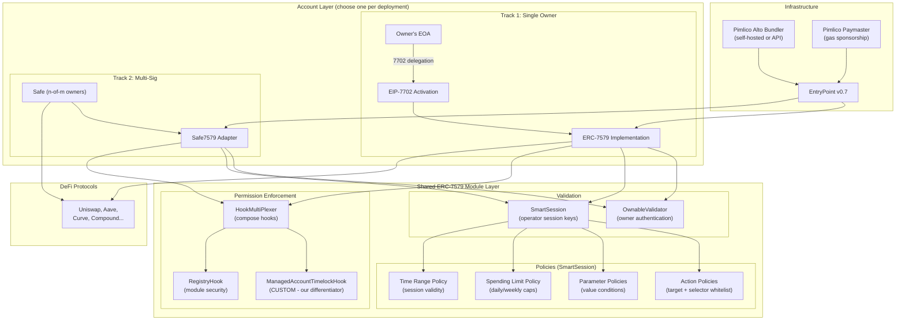

# Delegated Smart Account — State of the Art 2025-2026 Recommendation

> Based on analysis of 8 architectures, 12 repos, 6 existing products, and 5+ emerging standards.
> Date: February 2026

---

## Executive Summary

After exhaustive research, we recommend a **dual-track architecture** built on **ERC-7579** as the common module layer:

| Track | Account | Target Use Case | When |
|-------|---------|----------------|------|
| **Primary** | EIP-7702 + ERC-7579 | Single-owner managed accounts | v1 |
| **Secondary** | Safe + Safe7579 Adapter | Multi-sig / institutional accounts | v1 |
| **Enhancement** | + CoW Protocol intents | Swap/rebalance optimization | v2 |

**Both tracks share the SAME permission modules, timelock hook, and infrastructure.** Build once, deploy on both account types.

---

## 1. Why This Recommendation

### 1.1 The ERC-7579 Convergence

The ecosystem has converged on ERC-7579 as THE modular account standard:

```
ERC-7579 Adopters (2025-2026):
├── Safe (via Safe7579 Adapter)
├── Kernel / ZeroDev (native)
├── Biconomy Nexus (native)
├── OKX Wallet (native)
├── Etherspot (native)
├── Thirdweb (native)
├── Coinbase Smart Wallet (partial)
├── EIP-7702 implementations (Safe, Kernel, Rhinestone, Biconomy)
└── Rhinestone Module Ecosystem (14+ audited modules)
```

Building on ERC-7579 means our permission modules, timelock hook, and policies work on ANY of these accounts. This is the lowest vendor lock-in possible.

### 1.2 The EIP-7702 Game-Changer

EIP-7702 (Pectra upgrade, May 2025) fundamentally changed the landscape:

- **No contract deployment**: Owner's EOA becomes the smart account
- **No fund migration**: Existing balances and approvals preserved
- **80% cheaper activation**: ~25K gas vs ~150-400K for Safe/Kernel deployment
- **Full module support**: Same ERC-7579 modules work on 7702-activated EOAs
- **Universal adoption**: All major providers (Safe, Kernel, Pimlico, Alchemy, MetaMask, Biconomy) support it

For single-owner managed accounts (the most common case), there is no reason to deploy a separate contract.

### 1.3 Safe for Multi-Sig

For institutional / DAO use cases requiring n-of-m ownership:
- Safe remains the gold standard ($100B+ TVL, 5+ years)
- Safe7579 Adapter adds ERC-7579 module compatibility
- Same modules as the 7702 track → no code duplication

### 1.4 Custom Timelock = Competitive Differentiator

**No existing product or module implements a timelock/delay for delegated operations** (except Zodiac Delay, which is Zodiac-specific). This is a gap we must fill with a custom ERC-7579 Hook module. Once built, it becomes a differentiator AND a reusable module for the ecosystem.

---

## 2. Recommended Architecture

### 2.1 Architecture Diagram



### 2.2 Component Selection

| Component | Choice | Rationale |
|-----------|--------|-----------|
| **Account (single-owner)** | EIP-7702 + ERC-7579 impl | Lowest gas, best UX, no deployment |
| **Account (multi-sig)** | Safe + Safe7579 Adapter | Battle-tested, $100B+ TVL |
| **Owner Validator** | OwnableValidator (Rhinestone) | Audited, multi-owner with threshold |
| **Session Key Manager** | SmartSession (Rhinestone/Biconomy) | ERC-7715 compatible, multi-chain |
| **Timelock** | Custom ManagedAccountTimelockHook | **Our custom module** (see below) |
| **Hook Composition** | HookMultiPlexer (Rhinestone) | Combine timelock + registry + custom hooks |
| **Module Security** | RegistryHook + IERC7484 Registry | On-chain module attestation |
| **Bundler** | Pimlico Alto (self-hosted for prod) | Open-source, self-hostable, Glider validated |
| **Paymaster** | Pimlico Verifying Paymaster | Production-proven, ERC-20 gas payment |
| **RPC** | eRPC (multi-chain aggregator) | Failover, load-balancing, Glider validated |
| **SDK** | permissionless.js + @rhinestone/module-sdk | Vendor-neutral, best AA SDK |

### 2.3 Custom Module: ManagedAccountTimelockHook

This is the **key custom development** — an ERC-7579 Hook that provides Zodiac Delay-equivalent functionality:

```solidity
// ManagedAccountTimelockHook — ERC-7579 Hook Module
//
// Features:
// - Configurable cooldown period per account
// - Optional expiration period
// - Owner bypass (instant execution)
// - Owner cancellation of queued transactions
// - Selective timelock (some operations immediate, some delayed)
// - Hash-based queue (not FIFO — allows any-order execution)
// - ERC-7579 compatible (works on Safe7579, Kernel, Nexus, 7702)
//
// NOT included in any existing module ecosystem.
// This becomes our competitive differentiator AND
// a contribution to the ERC-7579 module commons.

interface IManagedAccountTimelockHook {
    // Configuration
    function configure(uint128 cooldown, uint128 expiration, address owner) external;
    function setOperationImmediate(bytes4 selector, bool immediate) external;

    // Queue management
    function cancelExecution(bytes32 execHash) external; // owner only
    function getQueuedExecution(bytes32 execHash) external view returns (uint256 queuedAt);

    // Hook interface (called automatically)
    function preCheck(address msgSender, uint256 msgValue, bytes calldata msgData)
        external returns (bytes memory);
    function postCheck(bytes calldata hookData) external;
}
```

**Development estimate:** ~400-600 lines Solidity + ~200 lines tests. Audit cost: ~$20-40K.

---

## 3. Implementation Roadmap

### Phase 1: Core MVP (6-8 weeks)

| Step | Deliverable | Effort |
|------|------------|--------|
| 1.1 | ManagedAccountTimelockHook (Solidity) | 2 weeks |
| 1.2 | Permission policy contracts (3-5 DeFi protocols) | 2 weeks |
| 1.3 | Account factory (7702 + Safe tracks) | 1 week |
| 1.4 | TypeScript SDK integration (permissionless.js + module-sdk) | 2 weeks |
| 1.5 | Pimlico integration (bundler + paymaster) | 1 week |
| 1.6 | **Sepolia testnet deployment + testing** | 1 week |

**MVP scope:** Single-owner 7702 account, 1 operator with session key, Uniswap swap permission, timelock with owner cancel, Pimlico paymaster for gasless.

### Phase 2: Security & Multi-Sig (4-6 weeks)

| Step | Deliverable | Effort |
|------|------------|--------|
| 2.1 | ManagedAccountTimelockHook audit | 2-3 weeks |
| 2.2 | Safe + Safe7579 multi-sig track | 2 weeks |
| 2.3 | HookMultiPlexer + RegistryHook integration | 1 week |
| 2.4 | Emergency procedures (kill switch, module disable) | 1 week |
| 2.5 | **Mainnet-ready deployment** | 1 week |

### Phase 3: Scale (4-8 weeks)

| Step | Deliverable | Effort |
|------|------------|--------|
| 3.1 | Multi-chain deployment (Arbitrum, Base, Polygon) | 2 weeks |
| 3.2 | Self-hosted Alto bundler (Glider pattern) | 2 weeks |
| 3.3 | Additional DeFi protocol permissions | Ongoing |
| 3.4 | Monitoring + alerting (module events, session tracking) | 2 weeks |
| 3.5 | Admin dashboard (permission management UI) | 2 weeks |

### Phase 4: Intent Layer — v2 (8-12 weeks)

| Step | Deliverable | Effort |
|------|------------|--------|
| 4.1 | CoW Protocol integration (programmatic orders) | 3 weeks |
| 4.2 | Intent policy hook (validates intent outcomes) | 3 weeks |
| 4.3 | Solver integration (route optimization) | 3 weeks |
| 4.4 | Chain abstraction (ERC-7683 via Across) | 3 weeks |

---

## 4. Technology Stack

```
Smart Contracts (Foundry)
├── ManagedAccountTimelockHook.sol        (custom ERC-7579 hook)
├── DeFiPermissionPolicies/              (custom SmartSession policies)
│   ├── UniswapSwapPolicy.sol
│   ├── AaveDepositPolicy.sol
│   ├── CurveExchangePolicy.sol
│   └── ...per-protocol
├── ManagedAccountFactory.sol            (deploys both 7702 and Safe tracks)
└── test/                                (Foundry tests via ModuleKit)

TypeScript SDK
├── permissionless.js                    (AA client, UserOps)
├── @rhinestone/module-sdk               (module installation)
├── viem                                 (EIP-7702 support)
└── Custom wrapper                       (ManagedAccount SDK)

Infrastructure
├── Pimlico Alto (bundler — self-hosted for prod)
├── Pimlico Paymaster (gas sponsorship)
├── eRPC (multi-chain RPC aggregation)
└── PostgreSQL / The Graph (indexing)

Testing
├── Foundry (unit + integration)
├── ModuleKit (ERC-7579 testing utilities)
├── Sepolia testnet (Pimlico free tier)
└── Fork tests (mainnet fork for DeFi integration)
```

---

## 5. Risk Assessment

### Technical Risks

| Risk | Impact | Probability | Mitigation |
|------|--------|-------------|------------|
| SmartSession is BETA | High | Medium | Monitor v1.0 timeline; design abstraction layer for easy swap |
| Custom timelock hook has bugs | Critical | Medium | Extensive testing + formal audit + bug bounty |
| EIP-7702 edge cases on L2s | Medium | Low | Test on each target L2; maintain Safe fallback |
| Module interaction bugs | High | Medium | Integration testing via ModuleKit; staged rollout |
| Paymaster fund depletion | Medium | Low | Monitoring + alerts + auto-topup |

### Business Risks

| Risk | Impact | Probability | Mitigation |
|------|--------|-------------|------------|
| ERC-7579 ecosystem fragmentation | Medium | Low | Standard is already widely adopted |
| Pimlico service disruption | Medium | Low | Self-hosted Alto as fallback |
| Rhinestone stops maintaining modules | Medium | Low | All code open-source; can fork |
| New standard replaces ERC-7579 | Low | Very Low | Unlikely given current adoption momentum |

### Security Risks

| Risk | Impact | Probability | Mitigation |
|------|--------|-------------|------------|
| Permission misconfiguration | Critical | Medium | Policy testing framework + config audits |
| Session key compromise | High | Medium | Short expiry, value limits, instant revocation |
| Module upgrade attack | Critical | Low | RegistryHook + IERC7484 attestation |
| Timelock bypass | Critical | Low | Formal verification of hook logic |

---

## 6. Cost Estimate

### Development Costs

| Phase | Duration | Team Size | Estimated Cost |
|-------|----------|-----------|----------------|
| Phase 1 (MVP) | 6-8 weeks | 2-3 devs | €40-60K |
| Phase 2 (Security) | 4-6 weeks | 2 devs + auditor | €40-70K (incl. audit) |
| Phase 3 (Scale) | 4-8 weeks | 2-3 devs | €30-50K |
| Phase 4 (Intents) | 8-12 weeks | 3-4 devs | €60-100K |
| **Total** | **22-34 weeks** | - | **€170-280K** |

### Infrastructure Costs (Monthly)

| Component | Option A (API) | Option B (Self-hosted) |
|-----------|---------------|----------------------|
| Bundler | €200-500/mo (Pimlico) | €50-100/mo (server) |
| Paymaster | Gas costs + 5% markup | Gas costs only |
| RPC | €100-300/mo (eRPC) | €50-150/mo (nodes) |
| Indexing | €50-200/mo | €30-100/mo |
| **Total** | **€350-1000/mo** | **€130-350/mo** |

---

## 7. Why NOT the Alternatives

### Why not Safe + Zodiac only (Architecture A)?
- Zodiac Roles v2 has the best permissions, BUT no native 4337 integration for operators
- Building a custom 4337 module that routes through Roles is significant work
- Zodiac modules are not portable to other account types
- **Counter-argument:** If you need the most battle-tested solution TODAY and don't need session keys, this is the conservative choice

### Why not Kernel only (Architecture C)?
- Great gas efficiency, but less institutional trust than Safe
- Smaller module ecosystem than Safe + Rhinestone
- Policy/Signer types (5/6) are Kernel-specific extensions
- **Counter-argument:** If gas efficiency and chain abstraction are top priorities, Kernel is strong. Glider validates it.

### Why not Brahma Console pattern (Architecture H)?
- Gas-heavy (2 Safes per delegation)
- Off-chain policy validation adds trust assumptions
- No native AA/gasless
- **Counter-argument:** Proven for institutional use with $200M+ secured. Consider for DAO-focused deployments.

---

## 8. Final Architecture Decision Tree

```
Start
├── Single-owner account?
│   ├── YES → EIP-7702 + ERC-7579 modules
│   └── NO → Multi-sig needed?
│       ├── YES → Safe + Safe7579 Adapter + ERC-7579 modules
│       └── NO → Use 7702 track
│
├── Permission complexity?
│   ├── Simple (target + selector + value limit)
│   │   └── SmartSession with standard policies
│   ├── Medium (parameter conditions, spending limits)
│   │   └── SmartSession + custom policy contracts
│   └── Complex (nested logic, array conditions, auto-replenish)
│       └── Consider Zodiac Roles v2 alongside SmartSession
│
├── Timelock needed?
│   └── YES → Install ManagedAccountTimelockHook
│       ├── Selective (some ops immediate, some delayed)
│       └── Full (all operator ops delayed)
│
├── Multi-chain?
│   ├── Phase 1 → Single chain (Ethereum/Base/Arbitrum)
│   └── Phase 2+ → Multi-chain with ChainDigest sessions
│
└── Intent-based execution?
    ├── Phase 1 → No (explicit calldata permissions)
    └── Phase 2+ → CoW Protocol integration for swaps
```

---

## 9. Conclusion

The state-of-the-art for delegated smart accounts in 2025-2026 is:

1. **ERC-7579 as the universal module layer** — build once, deploy anywhere
2. **EIP-7702 for single-owner accounts** — no deployment, best gas, same modules
3. **Safe for multi-sig** — battle-tested, institutional-grade, 7579-compatible via adapter
4. **SmartSession for operator permissions** — session keys with policy enforcement
5. **Custom timelock hook** — our differentiator, fills a gap no product has solved
6. **Pimlico infrastructure** — bundler + paymaster, self-hostable at scale
7. **Intent layer for v2** — CoW Protocol integration for optimized execution

This architecture gives us:
- Maximum **security** (Safe's track record + audited modules + custom timelock)
- Maximum **flexibility** (same modules on 7702 and Safe accounts)
- Minimum **vendor lock-in** (ERC-7579 standard, open-source everything)
- Best **gas efficiency** (7702 for single-owner, Kernel-competitive costs)
- Clear **upgrade path** (intents, chain abstraction, new modules)

**The missing piece is our ManagedAccountTimelockHook. Once built and audited, our system offers something no competitor has: delegated DeFi execution with on-chain timelock and owner cancellation, in a fully modular, gas-efficient, multi-account-compatible package.**
